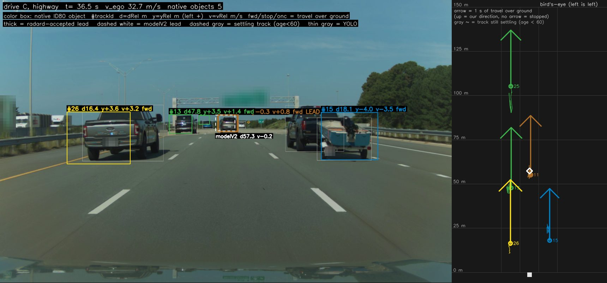
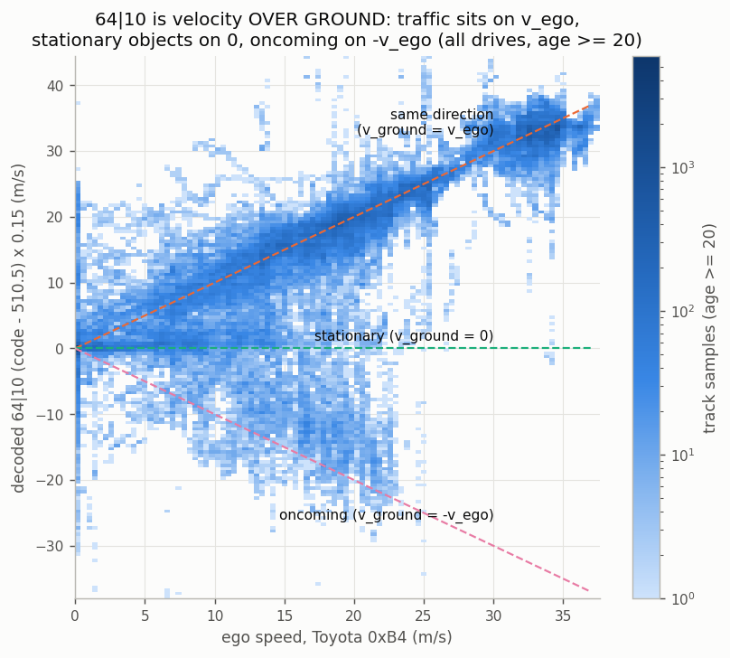
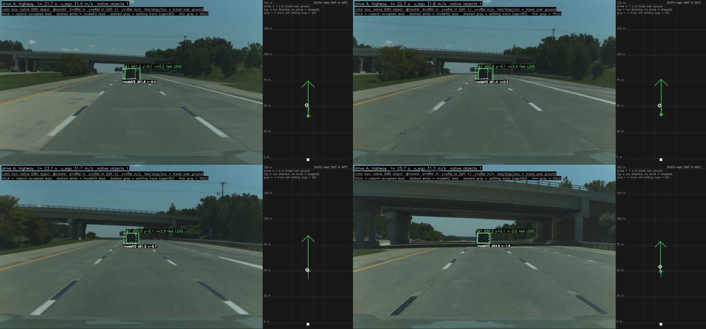
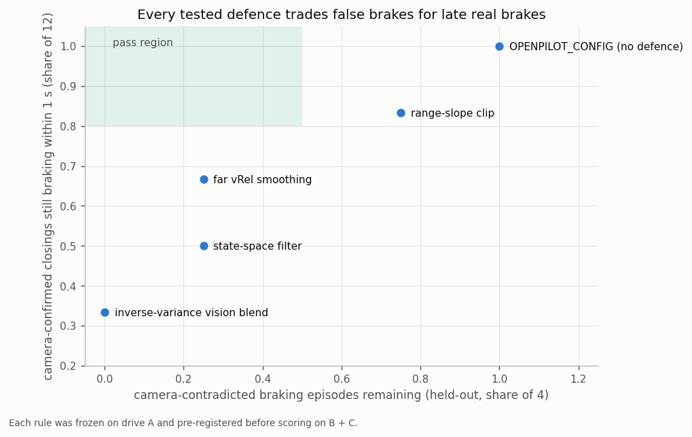

# ARS510 radar for openpilot

This repo decodes the object list from the **Toyota / Continental ARS510** front radar. It also records how well each decoded field has been checked. The aim is a starting point for openpilot developers who want to feed this radar into openpilot and test it.

- **Car:** Toyota RAV4, TSS2 generation (openpilot platforms `TOYOTA_RAV4_TSS2_2022` / `_2023`).
- **Radar:** firmware ID `8821F0R03100`, answering at diagnostic address `0x750` / subaddress `0x0f`. The same ID appears in opendbc's RAV4 TSS2 2023 fingerprints.
- **Other cars:** compatibility is unverified. A matching sensor family or firmware string is a useful lead, not proof of identical messages. [docs/09](docs/09_testing_a_new_drive.md) says what to check.

> **Status: research-grade and not validated for active control.**
>
> The decoder produces openpilot `RadarPoint`s: dRel, yRel, vRel and trackId.
> - Native dRel/yRel fields and slot lifecycle have substantial supporting evidence. Reported passes use exploratory consumer-tolerance thresholds, not demonstrated drive-grade accuracy or complete object recall.
> - `64|10` is the leading ground-velocity interpretation, not a fully solved vRel contract. Decoded excursions produce camera-contradicted braking in offline replay (4 events in 24 highway minutes). Mapping, timing, association, state semantics and tracker behaviour remain competing explanations.
>
> - **The object list leaves out stationary objects while you are moving.** A new object whose over-ground speed is about 0 is deleted after about 0.3 s once ego is above ~2-3 m/s. Objects first seen moving are kept after they stop. So the radar cannot flag a car that was already stopped when it came into view (a stalled or parked car in lane). See [docs/14](docs/14_stationary_objects_and_field_roles.md).
>
> Nothing here has driven a car. Everything was checked offline, by replaying logged drives through openpilot.
>
> **New (2026-09-24):** the radar also publishes its own ACC target at 50 Hz (0x235 / 0x237). When the object list's closing speed and that target disagree by more than 3 m/s, vision sides with the target 86-90% of the time (confirmed on drives not used to find it). It is decoded in the DBC and in `ars510`; using it as a clip is tested but not yet promoted. See [docs/15](docs/15_acc_target_stream_and_health_signals.md).

The finer 0x237 distance code is now exposed for diagnostics: OEM-only consistency supports approximately 0.02 m/count **changes**, but its absolute origin remains unresolved. It is not a replacement dRel or a jitter fix ([evidence and limits](docs/15_acc_target_stream_and_health_signals.md#finer-distance-code-increment-scale-not-absolute-range)).
>
> **To try it in openpilot:** [`openpilot/`](openpilot) installs into current opendbc with a three-file Toyota patch. It detects the radar by FW version, because the object stream starts ~6 s after power-up, after fingerprinting. It has run end to end through openpilot's own card, radard and planner on 92 minutes of logged driving; see [docs/07](docs/07_openpilot_integration.md#end-to-end-replay-of-the-installed-integration-2026-09-24).

**Start with [the evidence review and latest follow-up](docs/13_evidence_review.md).** It corrects two structural errors (the ID85 CRC boundary and slot-index field), explains what the references can and cannot establish, and records newer stopped-target tests that weaken the earlier near-range validation claim.

## Recommended setup (current best, 2026-09-24)

| piece | use | confidence |
|---|---|---|
| [`openpilot/`](openpilot) | `install.py` into opendbc (tested on opendbc master `2801582`, 2026-09-23; ruff-clean under opendbc's config). Detection by radar FW `8821F0R03100`, with 0x80/0x85 on bus 1 as fallback. Radarless (no error) until the first record; `radarUnavailableTemporary` after 0.5 s of silence | integration replayed end to end through openpilot's card → radard → plannerd; never driven |
| `OPENPILOT_CONFIG` (unchanged) | publishes dRel, yRel, vRel and trackId for tracks aged ≥ 60 cycles; re-links IDs across gaps ≤ 3.5 s; never publishes a NaN vRel | the default. No candidate option beat it under the pre-registered rules ([06](docs/06_known_limitations.md)) |
| dRel / yRel | forward distance (1/16 m) / left-positive lateral (1/64 m) | near range checked to ~0.1 m against camera ground contact; far-range scale open; lateral sign validated, scale ±10% |
| vRel | over-ground velocity × 0.149/0.15 − ego speed (0xB4) | scale holds to 80 m against the radar's own ACC target. Known flaw: occasional ~1.5 s drifts, mostly false closings at 40-80 m, about 1-2 radar-only brake requests per hour of driving in replay ([15](docs/15_acc_target_stream_and_health_signals.md)) |
| [`dbc/ars510_radar_bus.dbc`](dbc/ars510_radar_bus.dbc) | raw radar-bus frames, including the radar's own ACC target (0x235 / 0x237) and readiness states (0x101 / 0x197) | ACC target decode confirmed on drives not used to find it. Use it as a reference, not as radar input: it may include Toyota's camera |
| [`dbc/ars510_objects_vbus.dbc`](dbc/ars510_objects_vbus.dbc) | reassembled objects for cabana: named fields, `MOVE_STATE`, `ONCOMING_FLAG`, header `OBJECT_COUNT`; unnamed fields carry their evidence in comments | named fields tested; `UNK_*` are candidates |

Not used by the interface: lateral velocity, the accel-like field, the uncertainty and size candidates, and the ACC
target. The last is off by default (`acc_target_clip_mps`); tested but not promoted.

## What you get

| path | what |
|---|---|
| [`ars510/`](ars510) | Pure-Python decoder with no dependencies: record reassembly, CRC, slot decode, track IDs, and an openpilot-shaped interface (`OPENPILOT_CONFIG`) |
| [`dbc/ars510_radar_bus.dbc`](dbc/ars510_radar_bus.dbc) | Frame-level DBC for every message on the radar bus, with what is known about each |
| [`dbc/ars510_objects_vbus.dbc`](dbc/ars510_objects_vbus.dbc) | DBC for the reassembled object records, published on a virtual bus. Use it with `tools/build_cabana_route.py` to see objects in Cabana |
| [`tools/decode_log.py`](tools/decode_log.py) | rlog/qlog or CAN CSV → one CSV row per published radar point |
| [`tools/build_cabana_route.py`](tools/build_cabana_route.py) | Appends reassembled objects to your rlogs so Cabana can plot them next to the video |
| [`openpilot/`](openpilot) | Installable opendbc integration for current openpilot: Toyota detection and hand-over patch, `RadarInterface`, installer and self-check. Tested by replaying logged drives through openpilot's real card, radard and planner; never driven |
| [`data/sample/`](data/sample) | Two short real CAN captures: radar frames plus wheel speed, times rebased to 0 |
| [`data/analysis/`](data/analysis) | Anonymized analysis dataset (~21 MB): every decoded object sample from 88 minutes over three drives with all raw fields, 89k radar-camera pairs, ground-contact and lateral camera pairs, replay episodes, fault injection results, summary JSONs |
| [`tools/make_analysis_figures.py`](tools/make_analysis_figures.py), [`tools/compute_stats.py`](tools/compute_stats.py) | Rebuild every chart and statistic from that dataset |
| [`tools/openpilot_replay/`](tools/openpilot_replay) | Replay logs through openpilot: `process_replay_ars510.py` runs the installed integration end to end (card → radard → plannerd, stock vs patched); `replay_radard.py` compares interface profiles in radard + planner |
| [`data/reference/slot_bit_map.json`](data/reference/slot_bit_map.json) | Measured field split of every bit of the object slot, the record header and the 0x85 record |
| [`docs/`](docs) | Everything learned, including what failed |

## See it

| | |
|---|---|
|  |  |
| Decoded objects projected onto the road camera (drive C, highway) | The velocity field is over ground: traffic on `v_ego`, parked on 0, oncoming on `-v_ego` |
|  |  |
| The blocker: a settled lead's vRel swings to -6 m/s while it opens (false FCW in replay) | Every defence tried trades false brakes for late real ones |

**[docs/11 Visual tour](docs/11_visual_tour.md)** walks through all 9 route shots and 23 charts, with what to review next. **[docs/12 Statistics](docs/12_statistics.md)** has the numbers.

## Quick start

```bash
pip install -e .[dev]          # or just put the repo on PYTHONPATH; the decoder has no dependencies
pytest                          # includes the two real samples and structural regression checks
pip install -e .[analysis]      # pandas / pyarrow / matplotlib for the dataset and charts
python tools/decode_log.py data/sample/highway_following_30s.csv.gz -o points.csv
```

```python
from ars510 import Ars510NativeRadarInterface, OPENPILOT_CONFIG

radar = Ars510NativeRadarInterface(OPENPILOT_CONFIG)
for t, bus, addr, data in can_frames:            # all buses; bus 1 = radar, bus 0 = car (for 0xB4 speed)
    out = radar.update_frame(t, bus, addr, data)
    if out:                                       # one per radar cycle (~60 ms)
        for p in out["radarData"]["points"]:
            print(p["trackId"], p["dRel"], p["yRel"], p["vRel"])
```

## The decode in one table

The object list arrives on **bus 1, 0x80** as a 742-byte record split over 106 CAN frames. It carries 20 slots of 36 bytes and a CRC32. Each slot is read as one little-endian bit field.

| field | bits | decode | confidence |
|---|---|---|---|
| state | `0\|2` | raw state code; measured/predicted meaning unresolved | structure only |
| slot index | `2\|6` | physical slot index, or 63 in unallocated-form headers | not an object category |
| score-like | `16\|8` | raw byte; not calibrated confidence | semantics unresolved |
| age | `24\|7` | radar cycles; 1 = new, saturates at 126, 0 = slot retiring | structure |
| dRel (forward) | `32\|12` | `(code - 160) / 16` m | scale and zero checked against the camera on 3 drives; zero ±0.7 m on hilly roads |
| yRel (left +) | `44\|12` | `(code - 2048) / 64` m | sign 98–99%; scale ±10% |
| v over ground | `64\|10` | `(code - 510.5) * 0.15` m/s | supported candidate; range history + ego motion constrain scale, standstill constrains zero |
| vRel | — | `v_over_ground - v_ego` | see limitations |
| lateral v | `74\|10` | `(code - 510.5)`, left + | sign confirmed; scale **not pinned** (radar-only estimates 0.097-0.147 m/s per code; 0.15 kept as a placeholder) |
| movement state | `109\|2` | 0 moving away, 2 moving toward, 1/3 not clearly moving | passed a pre-registered test on unseen segments; 1 vs 3 unresolved ([docs/14](docs/14_stationary_objects_and_field_roles.md)) |
| oncoming flag | `14\|1` | 1 = oncoming now or earlier | passed a pre-registered test on unseen segments |
| accel-like | `84\|10` | zero 511, lags velocity by ~1 s | unnamed |
| trackId | slot + age | new ID when a slot's age restarts | no radar identity error found within 60 m |
| unnamed fields | e.g. `20\|3`, `107\|1`, `224\|7`-`264\|5`, `56\|7`, `216\|6`, `272\|5` | raw | candidate lifecycle, uncertainty, existence and size roles, replicated on 3 drives but not pre-registered; see [docs/14](docs/14_stationary_objects_and_field_roles.md) |

The field is **over-ground** velocity, not relative velocity. Use ego speed from Toyota `0xB4` (bus 0) or `carState.vEgo`. [docs/02](docs/02_object_record_0x80.md) has the details and the evidence.

## Read next

1. [docs/01 CAN bus overview](docs/01_can_bus_overview.md): every message on the radar bus.
2. [docs/02 Object record 0x80](docs/02_object_record_0x80.md): layout, fields, and how each was found.
3. [docs/03 Shell record 0x85](docs/03_shell_record_0x85.md) and [docs/04 Support messages](docs/04_support_messages.md): 0x19x, 0x23x and friends.
4. [docs/05 Validation](docs/05_validation.md): methods and scorecard on held-out drives.
5. [docs/06 Known limitations](docs/06_known_limitations.md): vRel excursions, range walks, young tracks, and the defences tried.
6. [docs/07 openpilot integration](docs/07_openpilot_integration.md): radard behaviour, recommended config, thresholds, fault injection.
7. [docs/08 Dead ends](docs/08_dead_ends.md): read this before trying an old idea again.
8. [docs/09 Testing a new drive / contributing](docs/09_testing_a_new_drive.md).
9. [docs/10 Open questions](docs/10_open_questions.md): the experiments most likely to move things forward.
10. [docs/11 Visual tour](docs/11_visual_tour.md): route shots and charts, with a review list.
11. [docs/12 Statistics](docs/12_statistics.md): descriptive statistics of the dataset.
12. [docs/cabana.md](docs/cabana.md): viewing objects in Cabana.
13. [docs/13 Evidence review](docs/13_evidence_review.md): corrections, latest stopped-target results, reproducible wire checks, and next experiments.
14. [docs/14 Stationary objects and field roles](docs/14_stationary_objects_and_field_roles.md): why stationary objects are missing from the list, and likely roles (uncertainty, existence, size, lifecycle) for unnamed slot fields.

## Where the evidence comes from

One owner's RAV4 was logged with openpilot (a FrogPilot build with openpilot longitudinal control and radar unused). The radar CAN was recorded, but no radar data reached control. Drives are named by role, not by route:

| name | use | content |
|---|---|---|
| calibration routes S / L | early field discovery; range zero fit | one short urban route, one long highway route |
| **drive A** | primary development; later follow-ups have their own provenance | ~26 min, mixed highway and city |
| **drive B** | held-out, pre-registered | ~43 min, city, often wet or at night |
| **drive C** | held-out, pre-registered | 24 min, highway (median 22 m/s, stretches at 34 m/s) |

References have different dependencies; they are not all independent of the radar being tested:
- **the road camera:** YOLO boxes, ground contact, box-growth rate;
- **ego odometry:** wheel speed, GPS, gyro;
- **the radar's own range history.**

openpilot's vision model (modelV2) was used only as a secondary comparison. Route IDs, dongle IDs, GPS, dates and full video are not included. A few camera stills from highways and mid-route are, with licence plates and place-name signs blurred.

Camera box-growth velocity uses radar range for its metric scale; range-history tests share radar inputs; some identity repairs use radar continuity. Earlier range-zero discovery used vision. See [05](docs/05_validation.md) and [13](docs/13_evidence_review.md) before interpreting agreement as independent accuracy. B/C are historical holdouts for specific frozen tests, not untouched holdouts for future tuning.

## License

MIT (see [LICENSE](LICENSE)). The DBCs and docs are yours to reuse in opendbc or elsewhere.
