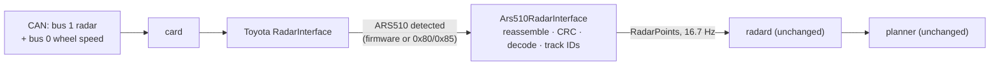

# ARS510 radar for openpilot

Decoder, DBCs and openpilot integration for the **Toyota / Continental ARS510** front radar, the radar in the
**RAV4 TSS2 2022 / 2023** (openpilot `TOYOTA_RAV4_TSS2_2022` / `_2023`, radar firmware `8821F0R03100` at 0x750 / 0x0f).
openpilot currently runs these cars vision-only; this repo turns the radar's object list into openpilot radar tracks.


*Decoded objects projected onto the road camera. Each box is one radar object at its decoded distance and lateral
position, labelled with track ID, distance, lateral offset and relative speed.*

## Status at a glance

| | state |
|---|---|
| **Object list** (0x80): transport, CRC, 20 slots, track IDs | ● decoded |
| **dRel, yRel, velocity over ground** | ● field layout and motion interpretation; ◐ exact physical zero/scales ([06](docs/06_accuracy.md)) |
| **Object attributes**: lane assignment, class, width / length, heading over ground, lateral velocity and acceleration, existence score, uncertainties | ◐ decoded; initial output templates, angle defaults and motion-state resets characterised; physical names/scales and independent heading remain provisional ([03](docs/03_slot_fields.md)) |
| **Radar's ACC target** (0x235 / 0x237, 50 Hz) | ● raw fields, ◐ nominal unit conversions, ◐ sent by the radar (clock fingerprint) ([05](docs/05_acc_target_and_support.md)); the `anchor` profile (default) uses it as a velocity anchor |
| **Target summaries** (0x191-0x194) | ● raw structure; ◐ target-summary interpretation; metric and class calibration required ([05](docs/05_acc_target_and_support.md)) |
| **Event pair** (0x195 / 0x196) | ● raw payloads; ◐ a short-time-to-collision state whose 10-bit code leads the car's deceleration ([05](docs/05_acc_target_and_support.md#0x195--0x196-event-pair)) |
| **Metadata cells** (0x85) | ◐ ten lane / road-boundary curves: offset, heading `48|16` and curvature `64|15` (units bounded), ● prefix copies of the cell flags; ○ the remaining cell fields ([04](docs/04_metadata_record_0x85.md)) |
| **openpilot integration**: current openpilot, StarPilot, sunnypilot | installable; replayed end to end; driven by the owner on FrogPilot and StarPilot ports ([08](docs/08_openpilot_integration.md)) |
| **Main open issue** | velocity excursions: 1-10 s false closings beyond 40 m. The `anchor` profile (default) bounds the lead's speed by the radar's own ACC target and adds `steady`'s guards and smoothing; together they cut hard false braking from 93 to 48 ticks on 20 held-out routes at the same response ([07](docs/07_velocity_excursions.md#how-the-filtering-works-step-by-step)). The opt-in `fused` profile replaces those layers with one filter that weights each reading by the radar's own uncertainty: 30 ticks, without `anchor`'s closing-speed bias ([07](docs/07_velocity_excursions.md#fused-speed-filter-fused-profile)) |

● confirmed · ◐ likely · ○ candidate

## What the radar gives you

| | |
|---|---|
|  |  |
| **Every bit of an object slot**, by role and confidence ([03](docs/03_slot_fields.md)) | **The radar assigns each object to a lane**: ego, left or right, in 1/15 steps |
|  |  |
| **Velocity is over ground**: traffic on v_ego, parked on 0, oncoming on −v_ego | **Class, width and length**: car, large vehicle, pedestrian, two-wheeler |

## How it fits into openpilot


```mermaid
flowchart LR
    CAN["CAN: bus 1 radar<br/>+ bus 0 wheel speed"] --> card --> RI["Toyota RadarInterface"]
    RI -- "ARS510 detected<br/>(firmware or 0x80/0x85)" --> A["Ars510RadarInterface<br/>reassemble · CRC · decode · track IDs"]
    A -- "RadarPoints, 16.7 Hz" --> radard["radard (unchanged)"] --> planner["planner (unchanged)"]
```

In replay against the driver (20 routes, 4.6 h), radar + vision **starts braking 0.15 s earlier** than vision alone
on real slowdowns and reacts to more of them, at the cost of some jitter from velocity excursions
([08](docs/08_openpilot_integration.md#radar--vision-against-vision-only-replay)).

## Install

```bash
cd /data && git clone https://github.com/ds-sebastian/ars510-radar
python /data/ars510-radar/openpilot/install.py /data/openpilot     # openpilot, sunnypilot, StarPilot, ...
```

Then reboot the device. The same command works on any fork: it adds the decoder and appends one hook block to Toyota's
`interface.py`. Details, the self-check and uninstall: [`openpilot/README.md`](openpilot/README.md).

| profile | install | what you get |
|---|---|---|
| **`anchor`** (default) | `install.py /data/openpilot` | `steady` + the radar's own ACC target as a bound on the lead's speed, and its target-range summaries for far cars up to 80 m. Fewest false brakes |
| `fused` | `--profile fused` | one speed filter that weights the object list, the radar's ACC target and its summaries by the radar's own uncertainty, in place of `steady`'s layers and `anchor`'s clips. Fewer false brakes than `anchor` in replay; opt-in until road-tested |
| `steady` | `--profile steady` | guards and smoothing against velocity excursions, without the ACC target |
| `stock` | `--profile stock` | the plain decode, for research and comparison. **Velocity excursions reach the planner unfiltered** |


*The same two excursions through each profile ([07](docs/07_velocity_excursions.md#how-the-filtering-works-step-by-step)
explains every layer with examples and replay evidence).*

## Start here

- **Driving and testing:** install, drive, press the bookmark button when braking feels wrong, and open a
  [drive report](https://github.com/ds-sebastian/ars510-radar/issues/new?template=drive_report.yml). Reports from other
  cars, radar firmware and forks matter most.
- **Understanding the radar:** [01](docs/01_radar_bus.md) → [02](docs/02_object_list.md) → [03](docs/03_slot_fields.md)
  for the decode, [07](docs/07_velocity_excursions.md) for its one big flaw and how each filter handles it.
- **Developing a fix or a new decode:** [09](docs/09_tools_and_data.md#developing-and-testing-a-change) shows how to
  decode the bundled samples, plot an idea, and replay it through openpilot against the driver;
  [10](docs/10_research_directions.md) lists the open problems, the signals that would help most, and what an upstream
  (comma) version still needs.
- Code, docs and research go through pull requests ([CONTRIBUTING.md](CONTRIBUTING.md), [AGENTS.md](AGENTS.md) for AI agents).

## Decode in Python

```bash
pip install -e .[dev]    # the decoder itself has no dependencies
pytest
python tools/decode_log.py data/sample/highway_following_30s.csv.gz -o points.csv
```

```python
from ars510 import ANCHOR_CONFIG, Ars510NativeRadarInterface

radar = Ars510NativeRadarInterface(ANCHOR_CONFIG)
for t, bus, addr, data in can_frames:            # all buses: bus 1 = radar (+ 0x235 ACC target), bus 0 = car (0xB4 speed)
    out = radar.update_frame(t, bus, addr, data)
    if out:                                       # one per radar cycle (60 ms)
        for p in out["radarData"]["points"]:
            print(p["trackId"], p["dRel"], p["yRel"], p["vRel"])
```

## The core decode

The object list arrives on **bus 1, 0x80** as a 742-byte record split over 106 frames: a header, 20 slots of 36 bytes
and a CRC32. Each slot is one little-endian bit field:

| field | bits | decode |
|---|---|---|
| dRel (forward) | `32\|12` | `(code − 160) / 16` m |
| yRel (left +) | `44\|12` | `(code − 2048) / 64` m |
| velocity over ground | `64\|10` | `(code − 510.5) × 0.15` m/s; vRel = this − ego speed |
| age | `24\|7` | radar cycles; a restart is a new track |
| lane weights (right / left / ego) | `148\|4`, `152\|4`, `156\|4` | 0-15, summing to 15 or 16 |
| class | `163\|3` | 1 new, 2 car, 3 large vehicle, 4 pedestrian, 5 provisional (cyclist/person associations; ○), 6 two-wheeler |

The scales and zero points are nominal; [06](docs/06_accuracy.md#encoding-constants-and-motion-geometry) describes
their calibration limits. The driving profiles multiply ground speed by `.149 / .15` before subtracting Toyota
0xB4 ego speed.

The full field list is in [docs/03](docs/03_slot_fields.md).

## Documentation

| doc | contents |
|---|---|
| [01 Radar bus](docs/01_radar_bus.md) | every message on the radar bus, power-up timeline |
| [02 Object list](docs/02_object_list.md) | 0x80 transport, header, track IDs, an object's life, which objects the radar lists |
| [03 Slot fields](docs/03_slot_fields.md) | every bit of an object: kinematics, lifecycle, lane assignment, class and size, uncertainty |
| [04 Metadata record](docs/04_metadata_record_0x85.md) | 0x85: pairing with 0x80, prefix flags, lane / road-boundary curve cells |
| [05 ACC target and support messages](docs/05_acc_target_and_support.md) | 0x235 / 0x237, target summaries, timing, readiness |
| [06 Accuracy](docs/06_accuracy.md) | distance, lateral, velocity and identity against camera and odometry |
| [07 Velocity excursions](docs/07_velocity_excursions.md) | the false-closing issue, and every filter layer explained with examples and evidence |
| [08 openpilot integration](docs/08_openpilot_integration.md) | how it hooks in, profiles, radard behaviour, replay and road results |
| [09 Tools and data](docs/09_tools_and_data.md) | decoding, Cabana, replay, the dataset, testing on your car |
| [10 Research directions](docs/10_research_directions.md) | next steps, the signals that would help most, the path to an upstream interface |

## Repository layout

| path | contents |
|---|---|
| [`ars510/`](ars510) | pure-Python decoder: reassembly, CRC, slot decode, track IDs, openpilot-shaped interface (profiles `ANCHOR_CONFIG`, `STEADY_CONFIG`, `STOCK_CONFIG` / `OPENPILOT_CONFIG`) |
| [`dbc/`](dbc) | `ars510_radar_bus.dbc` (every radar-bus frame) and `ars510_objects_vbus.dbc` (reassembled objects for Cabana) |
| [`openpilot/`](openpilot) | installer, per-fork hook patches, self-check, optional radard patch |
| [`tools/`](tools) | log decoder, Cabana exporter, openpilot replay harness, figure and statistics scripts |
| [`data/`](data) | three real CAN samples, an anonymised analysis dataset (3 drives, 88 min) and summary JSONs |
| [`docs/`](docs) | the documentation above |

## Where the evidence comes from

One owner's 2022 RAV4, logged with openpilot: three reference drives (A development, B city, C highway; 88 minutes)
with camera and odometry references, 399 one-minute segments from 24 drives for field statistics, 20 held-out routes
(4.6 h) for replay against the driver, six fresh drives (1.9 h, drive E is one of them), and closed-loop drives on FrogPilot, StarPilot and sunnypilot. Route IDs, dongle IDs, GPS
and full video are not included.

## License

MIT (see [LICENSE](LICENSE)). The DBCs and docs are yours to reuse in opendbc or elsewhere.
