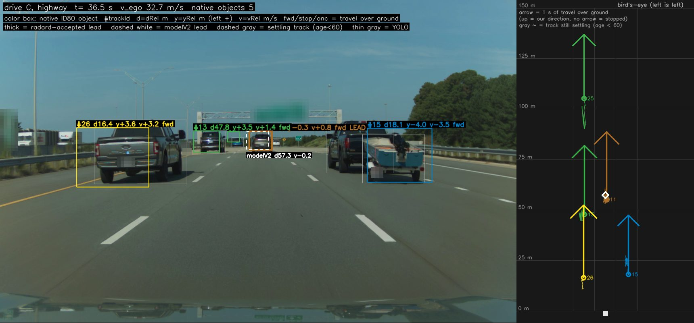
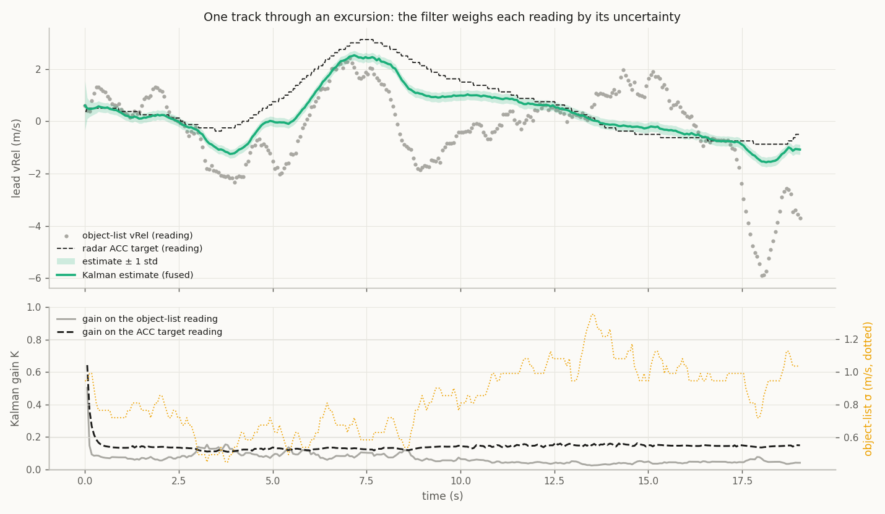
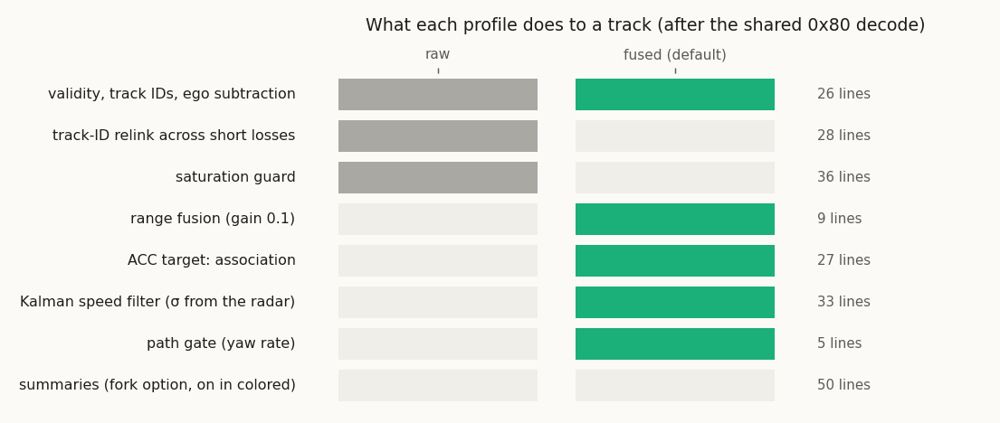
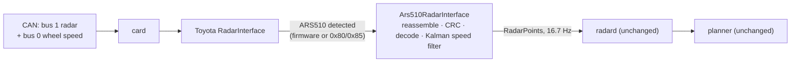

# ARS510 radar for openpilot

openpilot drives the **Toyota RAV4 TSS2 2022 / 2023** (`TOYOTA_RAV4_TSS2_2022` / `_2023`) on camera alone, because the
car's front radar, a **Continental ARS510** (firmware `8821F0R03100` at 0x750 / 0x0f), speaks a format openpilot
cannot read. This repo decodes that radar and plugs it into openpilot and its forks, so radard gets radar leads with
measured distance and speed. It contains the decoder, an installer, the evidence behind every decoded field, and
replay comparisons against vision only.



*Decoded radar objects projected onto the road camera: each box is one object at its decoded distance and lateral
position, with track ID, distance, lateral offset and relative speed.*

## Try it (testers)

You need a RAV4 2022 / 2023 with the ARS510 radar and a comma device running openpilot or a fork with openpilot's
`opendbc_repo` layout (sunnypilot, StarPilot, ...).

```bash
cd /data && git clone https://github.com/ds-sebastian/ars510-radar
python /data/ars510-radar/openpilot/install.py /data/openpilot     # installs the default `fused` profile
sudo reboot                                                          # required: the manager pre-imports the car code
```

1. **Check it took:** `python /data/ars510-radar/openpilot/install.py /data/openpilot --check` should report the hook as
   present and `profile: fused`. On the next drive, leads should be radar-backed (`radarUnavailable` false).
2. **Drive normally.** Press the bookmark (flag) button whenever braking feels wrong, a lead looks stuck, or the car
   brakes late.
3. **Tell us how it went** in a [drive report](https://github.com/ds-sebastian/ars510-radar/issues/new?template=drive_report.yml):
   fork and version, the `--check` output, and the time and description of each flagged moment. Do not post route
   IDs, dongle IDs, VINs, GPS or identifying video; say in the report if you can share logs privately.
4. **Undo or switch at any time:** `install.py /data/openpilot --uninstall` (then reboot) restores the fork exactly;
   `--profile raw` installs the unfiltered decode for comparison. Updating the fork resets `/data/openpilot`, so run
   the installer again after an update.

More on installing, the self-check and troubleshooting: [`openpilot/README.md`](openpilot/README.md).

## What to expect on the road

From replaying 34 recorded drives through openpilot's unchanged radard and planner, judged against what the driver did
([11](docs/11_profiles_compared.md)), with the default `fused` profile compared with vision only:

- **Leads come from the radar** about 87% of the time a lead exists, so the gap to the car ahead is measured, not
  estimated from the camera. Stops end about 1 m closer to the lead than with vision (vision reads the gap short).
- **Braking starts slightly before vision-only would** on average (0.01 s), and the planner is already asking for
  ≥ 1 m/s² before 41% of the driver's brake presses (vision: 40%). On some real slowdowns the radar sees the closing
  first (curves, far leads); on others vision does.
- **Braking that only the radar wanted** happens about 0.22 times per hour (the unfiltered radar: 1.75), always while
  the driver also slowed, never while the driver was on the gas. The requests are as smooth as vision-only.
- **Against what the car should have done** (openpilot's planner on a hindsight lead, 7.65 h of road drives), it
  brakes unnecessarily for 5.4 s against 10.2 s for vision only (34 replay drives: 7.1 s against 31.9 s), and misses
  less braking (7.2 s against 10.3 s; 3.0 s against 10.0 s)
  ([12](docs/12_kalman_filter.md#against-what-the-car-should-have-done)).
- **Known quirk:** far away (beyond about 80 m) without the radar's own ACC target, a jump in a far car's reported
  speed can still cause a short, mild slowdown.

These are replay results on one owner's car. On the road (7.4 h on the owner's car with 2.1.0, and a second driver's
2025 RAV4 Hybrid) the braking matched them: no hard radar-only braking; the two mild slowdowns had far leads beyond
95 m without the radar's ACC target ([08](docs/08_openpilot_integration.md#on-the-road)).

## How the filter works

The radar's object list is accurate in distance, but its speed at range sometimes drifts into a false closing for
1-10 s. The radar reports how uncertain each speed is (`240|7`) and also sends its own, smoother tracker output for the
car its ACC function follows: the ACC target. `fused` runs **one Kalman filter per track** on the lead's speed. Every reading is
weighted by its own uncertainty, so the gain changes each cycle:

```text
predict  v⁻ = v,  P⁻ = P + (1.5 m/s² · Δt)²
update   K = P⁻ / (P⁻ + σ²),  v = v⁻ + K · clamp(z − v⁻, ±3√(P⁻ + σ²)),  P = (1 − K) P⁻
σ:       object list 0.045 m/s × 240|7 · ACC target 0.5 m/s
```



*During an excursion the object list (grey) dives to −6 m/s; each of its readings moves the estimate by about 5%,
each ACC target reading by about 15%, so the estimate (green) stays with the radar's tracker. radard then runs its
usual filter on top.* The car the radar's ACC function follows is also published at the radar's ACC distance, which
agrees with the vision lead and is half as rough as the object-list range. Model, constants, how the trackers are
matched to tracks, what each part is worth and the variants tested: [docs/12](docs/12_kalman_filter.md).

## Profiles

The code comes in two versions that drive identically:
- **Fork build:** the `ars510/` package, installed by default. It is configurable, has the profiles below, and fills
  the extra point fields sunnypilot still uses.
- **openpilot version:** [`upstream/ars510_radar.py`](upstream/ars510_radar.py), one file of 223 lines (183 code) in opendbc style; [docs/10](docs/10_research_directions.md#parts-of-the-openpilot-file) lists what each part costs and buys.
  It is `fused` in one file: a test keeps it equal to `FUSED_CONFIG` point for point. The fork build can still add the
  radar's target summaries and the track-ID relink as options; neither improves the driving
  ([docs/12](docs/12_kalman_filter.md#what-the-summaries-do)).

| profile | install | what it does | use it for |
|---|---|---|---|
| **`fused`** (default) | `install.py /data/openpilot` | one Kalman speed filter per track that weights the object list and the radar's ACC target by the radar's own uncertainty, and keeps cars in the next lane from becoming the lead | everyday driving: fewest false brakes, vision's smoothness |
| `raw` | `--profile raw` | the unfiltered radar decode (not vision only, not stock openpilot) | research and comparison only: speed excursions reach the planner |
| `openpilot` | `--profile openpilot` | the openpilot version: `fused` from the single upstream file; points with `trackId` / `dRel` / `yRel` / `vRel` only | driving exactly what is proposed for openpilot |
| `colored` | `--profile colored` | experimental: `fused` with the object list's slow speed error as its own state | road tests of the main alternative ([docs/12](docs/12_kalman_filter.md#kalman-variants-tested)) |



The earlier tuned profiles (`anchor`, `steady`) were outperformed by `fused` and removed; their names now install
`fused`. How each profile works, each against vision only, pros and cons, assumptions and a comparison with openpilot's
other radar interfaces: [docs/11](docs/11_profiles_compared.md). The filter itself, with replay evidence for every part:
[docs/12](docs/12_kalman_filter.md).

## Status

| | state |
|---|---|
| **Object list** (0x80): transport, CRC, 20 slots, track IDs | ● decoded |
| **Distance, lateral position, speed over ground** | ● field layout and motion; ◐ exact physical zero and scales ([06](docs/06_accuracy.md)) |
| **Object attributes**: lane assignment, class and its confidence, size, heading, lateral speed and acceleration, existence, uncertainties, camera association | ◐ decoded; physical names and scales of some fields provisional ([03](docs/03_slot_fields.md)) |
| **Radar's ACC target** (0x235 / 0x237 / 0x239 / 0x23B, 50 Hz) | ● mapped bit for bit: closing speed 0.125 m/s, relative acceleration 0.125 m/s², distance 0.025 m and lateral 0.01 m per code, class, cycle timestamp; ◐ lateral speed and acceleration, in-path state, width; ◐ sent by the radar itself ([05](docs/05_acc_target_and_support.md)) |
| **Target summaries** (0x190-0x194) | ● 0x192 / 0x194 = position of one internal track, in the object list's encoding; ● 0x190 counts them; ◐ 0x191 / 0x193 carry the class template (car / truck size) ([05](docs/05_acc_target_and_support.md)) |
| **Car-bus target report** (0x366, 5 Hz) | ◐ nominal relative speed 0.5 km/h, distance ≈ 0.8 m, lateral 0.34 m per code; includes reports without an ACC target; high speed codes remain raw ([13](docs/13_car_bus_messages.md)) |
| **Single-object stream** (0x680, 2 Hz) | ◐ one tracked object, mostly stationary roadside objects: range at 1/32 m, lateral position and speed, stationary / oncoming / moving flags ([05](docs/05_acc_target_and_support.md)) |
| **Event pair** (0x195 / 0x196) | ● raw payloads; ◐ a short-time-to-collision state ([05](docs/05_acc_target_and_support.md#0x195--0x196-event-pair)) |
| **Metadata cells** (0x85) | ◐ ten lane / road-boundary curves; ○ remaining cell fields ([04](docs/04_metadata_record_0x85.md)) |
| **openpilot integration** | installable on openpilot, sunnypilot and StarPilot; replayed end to end; driven by the owner on FrogPilot, StarPilot and sunnypilot ([08](docs/08_openpilot_integration.md)) |

● confirmed · ◐ likely · ○ candidate

## Known limitations

- **One car so far.** Everything was measured on one RAV4 2022 with radar firmware `8821F0R03100`. Firmware
  `8821F0R01100` is in openpilot's fingerprints but unconfirmed; the installer then relies on seeing the radar's
  messages on bus 1.
- **Far-range speed excursions.** The radar's object list sometimes reports a far car closing several m/s faster than
  it is, for 1-10 s ([07](docs/07_velocity_excursions.md)). The Kalman filter handles this by leaning on the
  radar's own trackers, but its ACC target covers only about 57% of radar-lead time (5% beyond 80 m) and the summaries
  are used up to 80 m, so the farthest leads rely on the object list alone.
- **Range and speed disagree slightly.** The object list's range changes 10-20% more than its speed integrates to, so
  range is smoothed but not part of the speed filter ([10](docs/10_research_directions.md#for-a-better-ride)). Beyond
  50 m it also reads 5-8% short of the radar's own ACC distance ([06](docs/06_accuracy.md#distance)).
- **openpilot longitudinal needs no CAN filter.** openpilot's radar-disable request silences only the radar's
  car-bus messages; the object list, ACC target and summaries on bus 1 keep arriving at full rate (an unfiltered
  `8821F0R03100` car through 26 min of alpha long, [01](docs/01_radar_bus.md#openpilots-radar-disable)). Other
  firmware is unchecked.
- **Not upstream.** This is a community integration installed on top of openpilot; comma has not reviewed it.

## How it fits into openpilot


```mermaid
flowchart LR
    CAN["CAN: bus 1 radar<br/>+ bus 0 wheel speed"] --> card --> RI["Toyota RadarInterface"]
    RI -- "ARS510 detected<br/>(firmware or 0x80/0x85)" --> A["Ars510RadarInterface<br/>reassemble · CRC · decode · Kalman speed filter"]
    A -- "RadarPoints, 16.7 Hz" --> radard["radard (unchanged)"] --> planner["planner (unchanged)"]
```

The installer adds the decoder package and appends one hook block to the end of Toyota's `interface.py`. Nothing else in
the fork changes: card, radard and the planner run as shipped.

## Decode in Python

```bash
pip install -e .[dev]    # the decoder itself has no dependencies
pytest
python tools/decode_log.py data/sample/highway_following_30s.csv.gz -o points.csv
```

```python
from ars510 import FUSED_CONFIG, Ars510NativeRadarInterface

radar = Ars510NativeRadarInterface(FUSED_CONFIG)
for t, bus, addr, data in can_frames:            # all buses: bus 1 = radar (incl. 0x235 ACC target), bus 0 = car (0xB4 speed)
    out = radar.update_frame(t, bus, addr, data)
    if out:                                       # one per radar cycle (60 ms)
        for p in out["radarData"]["points"]:
            print(p["trackId"], p["dRel"], p["yRel"], p["vRel"])
```

## The core decode

The object list arrives on **bus 1, 0x80** as a 742-byte record split over 106 CAN frames: a header, 20 slots of 36
bytes and a CRC32. Each slot is one little-endian bit field:

| field | bits | decode |
|---|---|---|
| dRel (forward) | `32\|12` | `(code − 160) / 16` m |
| yRel (left +) | `44\|12` | `(code − 2048) × 0.015` m |
| speed over ground | `64\|10` | `(code − 510.5) × 0.15` m/s; vRel = this − ego speed |
| age | `24\|7` | radar cycles; a restart is a new track |
| speed uncertainty | `240\|7` | about 0.045 m/s per count (calibrated against the radar's ACC target) |
| lane weights (right / left / ego) | `148\|4`, `152\|4`, `156\|4` | 0-15, summing to 15 or 16 |
| class | `163\|3` | 1 new, 2 car, 3 large vehicle, 4 pedestrian, 5 provisional, 6 two-wheeler |

Scales and zero points are nominal ([06](docs/06_accuracy.md#encoding-constants-and-motion-geometry)). The driving
profiles multiply ground speed by `0.149 / 0.15` before subtracting Toyota 0xB4 ego speed. Every field:
[docs/03](docs/03_slot_fields.md).

## Documentation

New here? [00 Start here](docs/00_start_here.md) walks from CAN frames to openpilot's planner in pictures, with the key
numbers and a glossary.

| doc | contents |
|---|---|
| [00 Start here](docs/00_start_here.md) | the parser in pictures: nine steps, the numbers that matter, how to read the evidence, glossary |
| [01 Radar bus](docs/01_radar_bus.md) | every message on the radar bus, power-up timeline |
| [02 Object list](docs/02_object_list.md) | 0x80 transport, header, track IDs, an object's life, which objects the radar lists |
| [03 Slot fields](docs/03_slot_fields.md) | every bit of an object: kinematics, lifecycle, lane assignment, class and size, uncertainty |
| [04 Metadata record](docs/04_metadata_record_0x85.md) | 0x85: pairing with 0x80, prefix flags, lane / road-boundary curve cells |
| [05 ACC target and support messages](docs/05_acc_target_and_support.md) | 0x235 / 0x237, target summaries, timing, readiness |
| [06 Accuracy](docs/06_accuracy.md) | distance, lateral, speed and identity against camera and odometry |
| [07 Velocity excursions](docs/07_velocity_excursions.md) | the far-range false-closing issue: what it looks like, how often, what the radar reports about it |
| [08 openpilot integration](docs/08_openpilot_integration.md) | how it hooks in, profiles, what radard does, replay and road results, on-car checks |
| [09 Tools and data](docs/09_tools_and_data.md) | decoding logs, Cabana, replaying drives through openpilot, the dataset, testing on your car |
| [10 Research directions](docs/10_research_directions.md) | open problems, the signals that would help most, the path to an upstream interface |
| [11 Profiles compared](docs/11_profiles_compared.md) | each profile against vision only, driving pros and cons, assumptions, other openpilot radar interfaces |
| [12 Kalman speed filter](docs/12_kalman_filter.md) | the default filter: model, gains, constants and their sources, what each part is worth, variants tested |
| [13 Car-bus messages](docs/13_car_bus_messages.md) | the radar's nine Toyota driving-support messages on bus 0 (ACC command, PCS / AEB, lead distance), CAN filter versus radar disable, what happens to AEB |

## Repository layout

| path | contents |
|---|---|
| [`ars510/`](ars510) | pure-Python decoder: reassembly, CRC, slot decode, track IDs, the openpilot-shaped interface and its profiles (`FUSED_CONFIG`, `BASE_CONFIG` for `raw`) |
| [`openpilot/`](openpilot) | installer, the RadarInterface wrapper, the on-PC self-check, an optional radard patch |
| [`upstream/`](upstream) | the single-file upstream candidate (`ars510_radar.py`), tested against the corresponding fork configuration on bundled CAN samples |
| [`dbc/`](dbc) | DBCs for inspecting the radar in Cabana (parsing does not use them) |
| [`tools/`](tools) | log decoder, Cabana exporter, openpilot replay harness, figure and statistics scripts |
| [`data/`](data) | three CAN samples, an anonymised analysis dataset (3 drives, 88 min) and the summary JSONs behind every number in the docs |
| [`docs/`](docs) | the documentation above |
| [`tests/`](tests) | decoder, interface, profile and installer tests (`pytest`) |

## Where the evidence comes from

One owner's 2022 RAV4, logged with openpilot: three reference drives (A development, B city, C highway; 88 minutes)
with camera and odometry references; 399 one-minute segments from 24 drives for field statistics; 34 drives replayed
through openpilot against the driver (20 held-out routes, 4.6 h with the driver controlling speed); six later drives
(1.9 h) held back for fresh checks; and closed-loop drives on FrogPilot, StarPilot and sunnypilot. Route IDs, dongle IDs, GPS
and full video are not included.

## Contributing

Drive reports, code, docs and research results are all welcome, through pull requests: see
[CONTRIBUTING.md](CONTRIBUTING.md) (and [AGENTS.md](AGENTS.md) for AI coding agents). Good first contributions: a drive
report from another car or radar firmware, a CAN excerpt of an interesting moment, or one of the open problems in
[docs/10](docs/10_research_directions.md).

## License

MIT (see [LICENSE](LICENSE)). The DBCs and docs are yours to reuse in opendbc or elsewhere.
