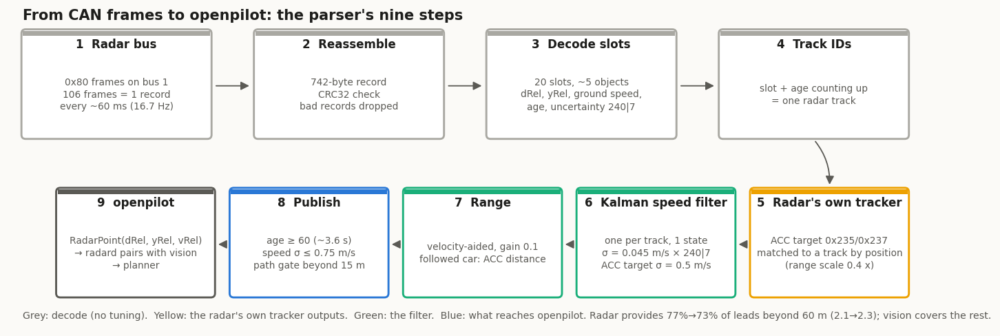
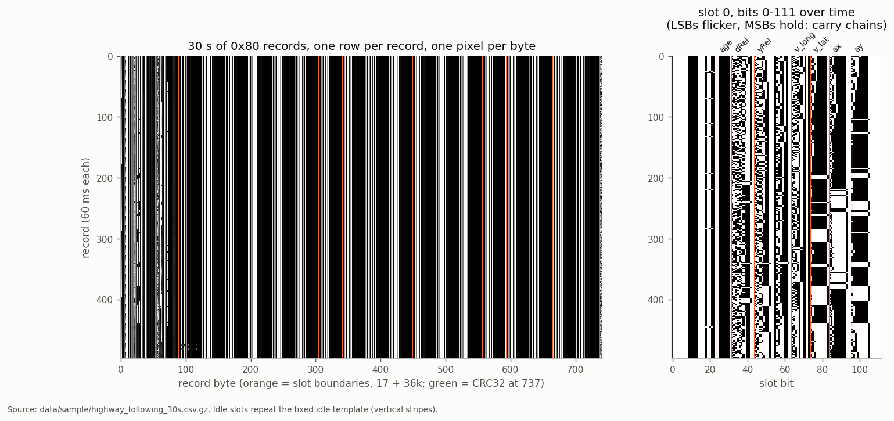
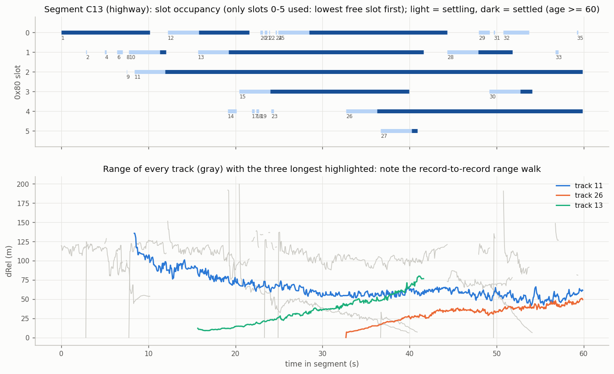
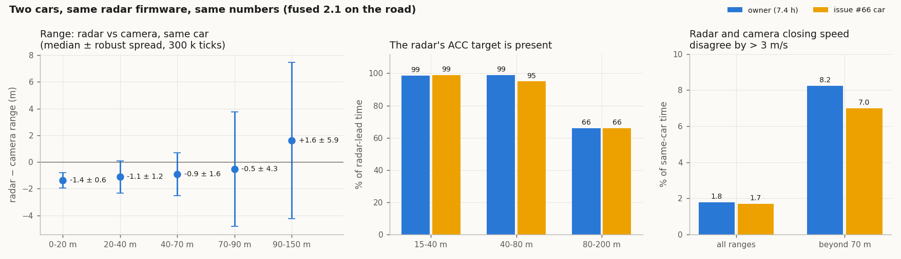
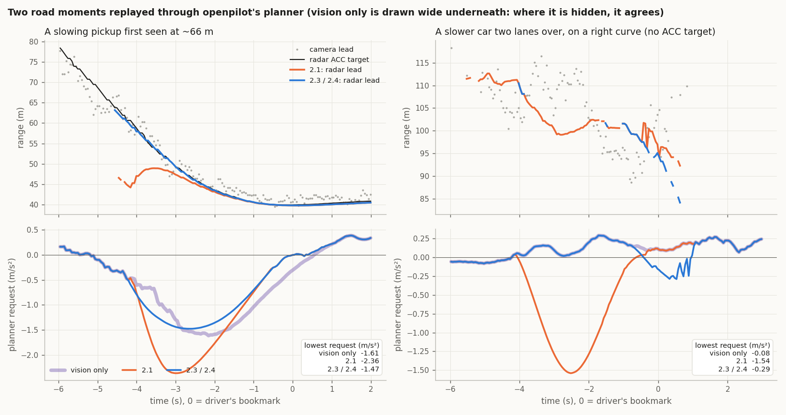
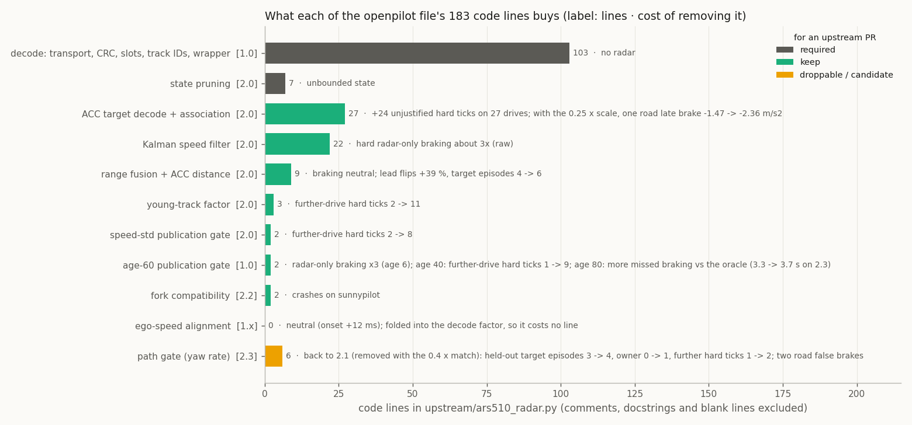

# 00. Start here: the parser in pictures

A guided tour from the radar's CAN frames to openpilot's planner, one figure per step, with the key numbers and a link to
the topic doc that has the detail. Read this first; docs 01-13 are the reference. Terms in **bold** are in the
[glossary](#glossary).

## 1. What the radar sends

The ARS510 sends its object list on the private radar bus (bus 1) as one 742-byte **record** every ~60 ms
(16.7 Hz), split over 106 CAN frames on 0x80 and closed by a CRC32. A DBC cannot describe it, so the parser reassembles
it. Each record has 20 **slots**; on a highway about 5 hold objects.

*30 s of records, one row per record, one pixel per byte: occupied slots change every row, idle slots repeat a template.*
More: [02 Object list](02_object_list.md), [01 Radar bus](01_radar_bus.md).

## 2. Objects and tracks

Each slot holds one object: distance (**dRel**), lateral position (**yRel**), speed over ground, an age counter and the
radar's own speed **uncertainty** code `240|7`. The radar keeps an object in its slot while the age counts up, so slot
+ age gives a **track**. New tracks are held back for 60 records (~3.6 s) until their range and speed settle.

*One highway minute: which slots are occupied (light = settling, dark = published) and every track's range.*
More: [02](02_object_list.md#an-objects-life), [03 Slot fields](03_slot_fields.md).

## 3. How good is each measurement?

Distance and lateral position are good; speed is the problem. On the owner's 2.1 drives (300,000 radar-lead ticks
matched to the camera's lead) the radar reads 0.5-1.4 m shorter than the camera up to 90 m, with a spread that grows
from 0.6 m to 4-6 m at range.

*Left: radar minus camera range for the same car (median ± robust spread). Middle and right: the owner's car and a
second driver's 2025 RAV4 Hybrid ([issue #66](https://github.com/ds-sebastian/ars510-radar/issues/66)) give the same
numbers.* More: [06 Accuracy](06_accuracy.md).

The object list's speed has **excursions**: for 1-10 s a far car seems to close fast while its range does not change.
84-88 % are false closings. They are rare close in (~0.1 per 1,000 records below 20 m) and common far out (130 per 1,000
at 60-80 m). The radar's uncertainty code grows with them, which is what the filter uses.

*vRel drifts to −12 m/s over ~9 s while the range stays at 85-110 m and vision holds steady.* More:
[07 Velocity excursions](07_velocity_excursions.md).

## 4. The radar's own trackers

Besides the object list, the radar publishes the car its own ACC function follows, the **ACC target**
(0x235 / 0x237), with a smooth 0.025 m distance and a speed. Its speed is much steadier than the object list's. The
parser matches it to a track by position. That track then gets the ACC speed as an extra reading and the ACC distance
as its range. The ACC target is present for 99 % of the lead time up to 80 m and 66 % beyond.

More: [05 ACC target](05_acc_target_and_support.md), [12](12_kalman_filter.md#matching-the-radars-trackers-to-tracks).

## 5. The Kalman speed filter

One small Kalman filter per track estimates the car's speed over ground. Each reading is weighted by its own
uncertainty: the object list by 0.045 m/s × `240|7`, the ACC target by 0.5 m/s. A reading the radar itself calls
uncertain moves the estimate only a little, so excursions are absorbed while real slowdowns, which the ACC target
confirms, come through.

*During an excursion the object list (grey) dives to −6 m/s; each reading moves the estimate by about 5 %.*
More: [12 Kalman speed filter](12_kalman_filter.md).

## 6. Choosing which tracks openpilot sees

openpilot's radard pairs the camera's lead with the radar track nearest in range and has no lateral gate, so a car in
the next lane can become the lead. Beyond 15 m, a track more than 2.5 m from the path the car is driving (predicted
from yaw rate and speed) is withheld; closer in, cars moving into the lane stay visible. The track the ACC target
follows is never withheld.

What that changes on the road, replayed through openpilot's planner:

*Left: a pickup first detected at 66 m read 15-20 m short in the object list; 2.3 matches it to the ACC target and
asks for −1.47 m/s² instead of −2.36 (vision −1.61). Right: on a curve, radard paired the camera's lead with a car a lane
over whose radar speed read a false −7 m/s, while the real lead, slowing to turn off, closed at about −3 m/s; 2.1 asked
for −1.54 m/s², 2.3 for −0.29 (vision −0.08).* More: [12](12_kalman_filter.md#path-gate).

## 7. What each part is worth

Every part was removed on its own and in combination, then replayed on 34 drives. Every hard brake was judged
against the radar's raw range, the camera and the driver. A part stays only if removing it adds unjustified braking or
destabilises the lead.

The single-file openpilot version carries the same parts; this is what each of its lines buys and which ones an
upstream PR would drop first:

More: [12](12_kalman_filter.md#what-each-part-is-worth), [10](10_research_directions.md#parts-of-the-openpilot-file).

## 8. The result against vision only

Vision only is not the truth either. Against openpilot's own planner fed a hindsight lead (the radar's ACC target and
smoothed range, checked with the camera), the default brakes unnecessarily half as long as vision only and misses no
more:

More: [11 Profiles compared](11_profiles_compared.md), [08](08_openpilot_integration.md#on-the-road), [12](12_kalman_filter.md#against-what-the-car-should-have-done).

## By the numbers

| | value | source |
|---|---|---|
| object list | 16.7 Hz, 20 slots, ~5 objects on a highway | [02](02_object_list.md) |
| radar − camera range, 20-70 m (same car) | −1.1 / −0.9 m median, spread 1.2-1.6 m | `road_v21.json` |
| ACC target present (lead 15-40 / 40-80 / 80-200 m) | 99 / 99 / 66 % | `road_v21.json` |
| leads from the radar when a lead exists | about 87 % | [11](11_profiles_compared.md) |
| braking only the radar asked for, per hour (34 drives) | `raw` 1.75, `fused` 0.22 | `profiles_vs_vision.json` |
| hard radar-only braking ticks, 20 held-out drives | `raw` 93, `fused` 30 (27 of 32 hard ticks judged real) | `hard_braking_review.json` |
| braking onset against vision only | −0.01 s (95 % CI −0.07 … +0.04) | `profiles_vs_vision.json` |
| driver brakes already anticipated at ≤ −1 m/s² | `fused` 41.3 %, vision 40.1 % | `profiles_vs_vision.json` |
| owner road drives with 2.1 (5.8 moving h, replayed) | 0 hard radar-only episodes; braking starts 0.4-1.0 s before vision | `road_v21.json` |
| unnecessary / missed braking against a hindsight oracle | road drives (7.65 h): `fused` 5.4 / 13.8 s, vision 10.6 / 16.9 s; 34 replay drives (6.72 h): `fused` 7.2 / 3.6 s, vision 32.6 / 11.0 s | `oracle_reference.json` |
| openpilot file | 184 code lines | `openpilot_file_parts.json` |

## How to read the evidence

- **Replay, not simulation.** Recorded drives run through openpilot's own card → radard → planner, once with vision
  only and once with the radar ([09](09_tools_and_data.md)). The car's motion stays as recorded (open loop), so a
  replay shows what openpilot would have *asked for*.
- **The 34 drives.** 20 held-out drives, 4 further drives and the owner's sunnypilot drives. Limits for a change are
  written down before it is replayed, and a change is not tuned on the drive that motivated it.
- **Judging a brake.** A radar-only brake is checked against what does not depend on the radar's speed: its raw
  range, the camera, and whether the driver slowed too ([12](12_kalman_filter.md#what-each-part-is-worth)).
- **Confidence marks.** ● confirmed, ◐ likely, ○ candidate, used throughout the topic docs.

## Glossary

| term | meaning |
|---|---|
| **record** | one complete object-list message: 742 bytes over 106 CAN frames on 0x80, ~16.7 per second |
| **slot** | one of the record's 20 fixed places for an object |
| **track** | one object followed over time (slot + age counting up); openpilot's `trackId` |
| **dRel / yRel / vRel** | distance ahead, lateral position (left positive), relative speed (negative = closing) |
| **uncertainty `240\|7`** | the radar's own speed-error code per object; the filter weights the speed by it |
| **excursion** | a 1-10 s stretch where the object list's speed is wrong, mostly a false closing on a far car |
| **ACC target** | the car the radar's own ACC function follows (0x235 / 0x237): smooth distance and speed |
| **summaries** | the radar's selected-target ranges (0x192 / 0x194), a second tracker output; tested, off by default |
| **radard** | openpilot's process that turns radar points and the camera's lead into the lead the planner follows |
| **hard radar-only tick** | a 20 Hz tick where the radar planner asks for ≤ −2 m/s² while vision only asks for ≥ −0.5 |
| **target episode** | the radar planner asks for ≤ −1 m/s² while vision only asks for ≥ −0.3, for ≥ 0.3 s while moving |
| **onset** | when braking starts with the radar compared with vision only (negative = earlier) |
| **anticipation** | share of driver brake presses the planner was already braking for at ≤ −1 m/s² |
| **`fused` / `openpilot` / `raw`** | the default fork profile / the single-file upstream version / the unfiltered decode |

Figures: `tools/make_guide_figures.py` (guide_*.png), `tools/make_fused_figures.py`, `tools/make_analysis_figures.py`.
