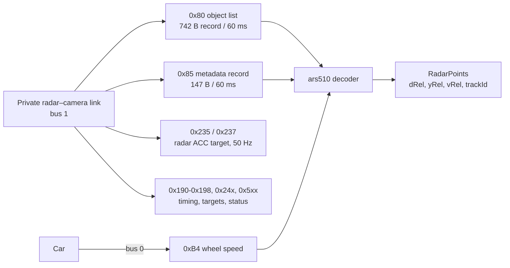

# 01. The radar bus

The ARS510 uses a private radar–camera CAN link, which the comma harness exposes as **bus 1** (`src == 1` in openpilot logs).
Ego speed comes from the car bus (bus 0, Toyota `SPEED` 0xB4). The radar runs a **60 ms cycle (16.7 Hz)**.

Stock opendbc parses TSS2 radar tracks at 0x180-0x19F with `toyota_tss2_adas.dbc`. That layout belongs to a
different radar: on the ARS510 the object list is the segmented record on 0x80, and 0x191-0x194 carry paired
target-summary codes requiring independent target association and calibration.

## Message map

| addr | DLC | rate | content | doc |
|---|---|---|---|---|
| **0x80** | 8 | 106 frames / 60 ms | **object list**: 742-byte record, 20 object slots × 36 bytes + CRC32 | [02](02_object_list.md), [03](03_slot_fields.md) |
| 0x81 | 8 | 16.7 Hz | record-cycle marker `30 00 …` after each 0x80 record start | |
| **0x85** | 8 | 21 frames / 60 ms | metadata record: 147 bytes, ten 12-byte cells (lane / road-boundary curves: offset, heading, curvature) + CRC32 | [04](04_metadata_record_0x85.md) |
| 0x86 | 8 | 16.7 Hz | record-cycle marker for 0x85 | |
| 0x100-0x103 | 7/6/3/2 | 10 Hz | startup state: 0x101 goes 0x1D → 0x11 when the radar is running | [05](05_acc_target_and_support.md#startup-and-readiness) |
| 0x180 | 5 | 16.7 Hz | constant `CF C0 00 00 00` | |
| 0x190 | 7 | 16.7 Hz | cycle header: µs timestamp and a mod-16 cycle counter | [05](05_acc_target_and_support.md#0x190-cycle-header) |
| 0x191 / 0x193 | 8 | 16.7 Hz | selected-target companions: score, age, track code, descriptors | [05](05_acc_target_and_support.md#0x191-0x194-selected-target-summaries) |
| 0x192 / 0x194 | 4 | 16.7 Hz | target summaries: two raw 13-bit codes, first range-like | [05](05_acc_target_and_support.md#0x191-0x194-selected-target-summaries) |
| 0x195 / 0x196 | 8 | 16.7 Hz | paired event frames; exact idle payloads in 99.67% of recorded frames | [05](05_acc_target_and_support.md#0x195--0x196-event-pair) |
| 0x197 / 0x198 | 2 / 1 | 16.7 Hz | 0x197 bit 8 = radar running; 0x198 constant `10` | |
| 0x202 | 5 | 16.7 Hz | counter + check byte | |
| 0x210 | 7 | 5 Hz | copy of Toyota road-sign-assist data | |
| **0x235 / 0x237** | 8 | 50 Hz | **radar ACC target** (sent by the radar): closing speed, relative acceleration, distance, lateral | [05](05_acc_target_and_support.md#the-radars-acc-target-0x235--0x237) |
| 0x239 / 0x23B / 0x23D | 8/3/8 | 50 Hz | companions of the 0x235 family (0x23D all zero); 0x23B = slow 8-bit value + counter + CRC-8 | [05](05_acc_target_and_support.md#other-frames) |
| 0x240-0x245, 0x248 | 8 | 16.7 Hz | context frames with a rolling phase 1-7; 0x240/0x244 carry changing payloads on some drives | [05](05_acc_target_and_support.md#0x240-0x248-context-frames) |
| 0x24D / 0x24F | 7 / 1 | 1 Hz / 33 Hz | state frame; 0x24F bit 6 = radar running | |
| 0x500 / 0x501 / 0x502 | 6/7/8 | slow | unit-specific constants (redacted in the DBC), status nibble, two slowly drifting codes | |
| 0x680 | 8 | 2 Hz | status nibbles | |

Every frame above is in [`dbc/ars510_radar_bus.dbc`](../dbc/ars510_radar_bus.dbc) with a one-line comment per signal.

## Power-up

| time after the first CAN frame | event |
|---|---|
| 0.2 s | 0x235 / 0x237 (ACC target frames) start |
| ≤ 0.9 s | 0x191 target summaries start |
| ~4 s | openpilot's fingerprinting is done and it starts transmitting |
| **5.83-5.92 s** | **0x80 / 0x85 object records start** (11 of 11 cold starts) |

- The object list starts after openpilot's fingerprinting has finished, so the openpilot integration detects the
  radar by its firmware version (`8821F0R03100` at 0x750 / 0x0f), with
  0x80 / 0x85 on bus 1 as a fallback ([08](08_openpilot_integration.md)).
- 0x101 switches 0x1D → 0x11 and 0x197 bit 8 sets 70 ms later: a direct "radar running" signal.
- Several addresses send an all-ones or all-zeros first frame (for example 0x100 `FFFF…`, 0x192 `0FFF0FFF`).
- Early object records contain placeholder tracks, some at exactly 0 m; the age gate removes them.

## Ego speed

The object velocities are **over ground**, so the consumer subtracts ego speed. Toyota 0xB4 reads about 1.5% below
GPS and wheel speed; `BASE_CONFIG` subtracts 0xB4 speed and applies `vground_scale = 0.149 / 0.15` to match
([06](06_accuracy.md#velocity)).
