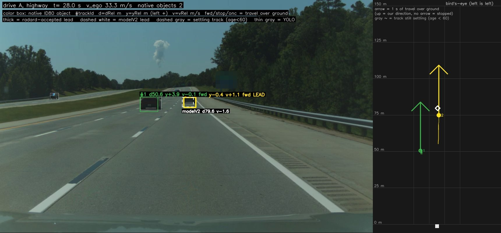
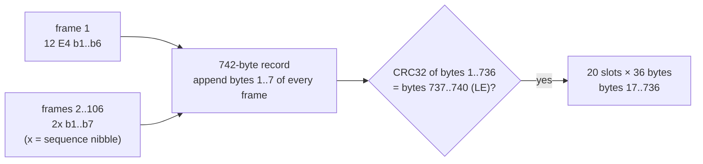
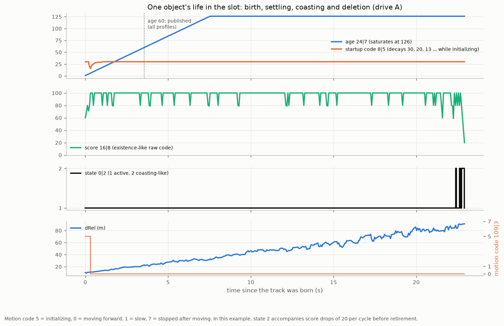
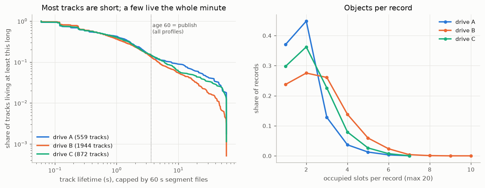
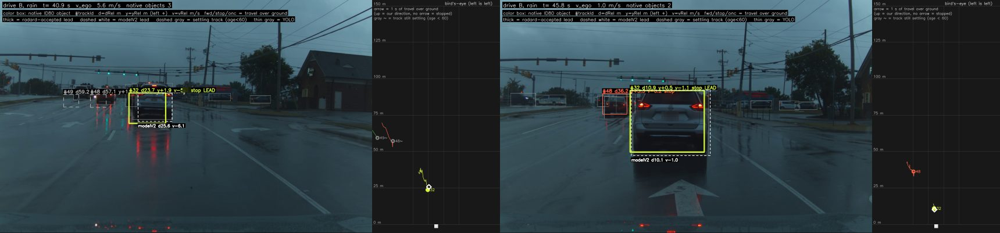
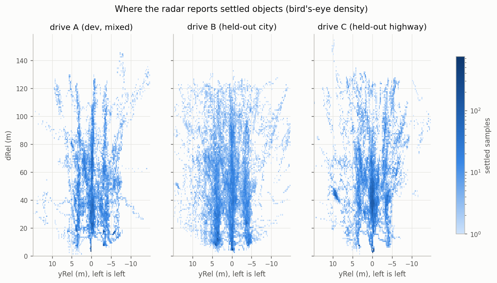
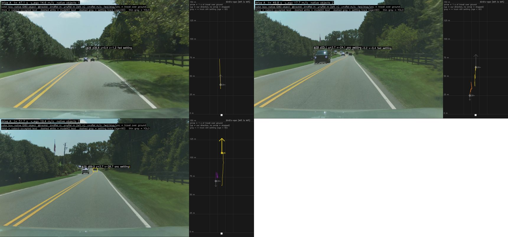
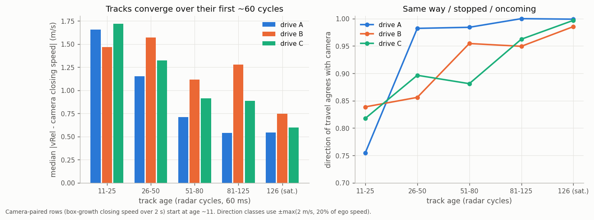

# 02. The object list (0x80)

The radar sends its object list once per 60 ms cycle as one **742-byte record** split over **106 frames** on
bus 1, address 0x80. It holds a 16-byte header, **20 object slots** of 36 bytes, and a CRC32.

## Reading the camera overlays



The route shots in these docs project decoded objects onto the road camera using only the log's own calibration and
openpilot's camera intrinsics. Coloured box = one 0x80 object (1.8 × 1.5 m at its dRel / yRel); label = `#trackId`,
dRel, yRel, vRel and direction over ground (`fwd` / `stop` / `onc`); **thick** outline = the lead radard accepts;
dashed white = the vision lead; dashed gray = a track still settling (age < 60). Right: bird's-eye view, each arrow
1 s of travel over ground.

## Transport



- **First frame:** bytes 0-1 are `12 E4`, an ISO-TP first frame of length 0x2E4.
- **Following frames:** byte 0 is `2x`, where x is a sequence nibble that wraps every 16 frames.
- **Reassembly:** append bytes 1..7 of every frame, the first included, until 106 frames have arrived. Record byte 0 is `E4`.
- **CRC:** `zlib.crc32(record[1:737])`, stored little-endian at `record[737:741]`. Zero failures on every logged drive.
- `ars510/transport.py` does this in about 60 lines. A DBC cannot: the sequence nibble wraps, so a single frame does
  not say which part of the record it carries.


*Left: 30 s of records, one row per record, one pixel per byte. Unused slots repeat the idle template (vertical
stripes); the CRC columns look like noise, as they should. Right: one slot's bits over time: low bits flicker, high
bits hold. Those carry chains mark the field boundaries.*

| record bytes | content |
|---|---|
| 0 | `E4` (length low byte) |
| 1-16 | header |
| 17-736 | 20 object slots × 36 bytes |
| 737-740 | CRC32, little-endian |
| 741 | trailing byte |

An unoccupied slot holds exactly this idle template:

```
FCE00000A0F07F00FFFDF71FFFA100F807000F0008000000000000000000000000000000
```

## Header

| field | read as | meaning |
|---|---|---|
| clock code | record bytes 1-4, little-endian | equals the 0x85 fine clock `// 100` in the same cycle |
| record counter | `int.from_bytes(record[5:7], "little") >> 1` | equals the 0x85 counter in the same cycle |
| timing offset (candidate) | header bits 104-114 | its change follows the record's arrival-time offset at about 1 ms per count |
| allocation count | `record[14] >> 3` | number of allocated slots (slots whose index field equals their position, retiring slots included) |

Pairing 0x80 and 0x85 by clock and counter is exact. Pairing by arrival time picks the neighbouring cycle about a
third of the time, so use the counters.

## Slots and track IDs

Each slot is one object. The radar fills the **lowest free slot first**: in 88 minutes it never used more than 10 of
the 20 slots, and 94-99% of samples sit in slots 0-4. An object keeps its slot for its whole life, and the slot's
**age** field (`24|7`) counts its radar cycles.

The decoder builds `trackId` from **slot + continuous age run** (`ars510/tracks.py`):
- age restarts (usually through 0) → new ID;
- a slot quiet for more than 0.3 s → new ID;
- a new occupant of a reused slot always gets a new ID, and no ID is ever live in two slots.

`OPENPILOT_CONFIG` also re-links an ID when the radar re-initialises a car it lost for up to 3.5 s near its predicted
position, so radard's per-track filter is not reset.


*One highway minute: slot occupancy (light = settling, dark = published) and every track's range.*

## An object's life



A slot's life, as the fields show it ([03](03_slot_fields.md) has every field):

1. **Birth.** Age 1, motion code 5 (initializing), class 1 (not yet classified). The startup code `8|5` counts down
   30, 30, 30, 30, 20, 13, 9, 6, 4, 2, 1, 1, 0 while the motion code stays 5.
2. **Settling.** Range and velocity converge over the first ~60 cycles (3.6 s). `OPENPILOT_CONFIG` publishes from age 60.
3. **Tracked.** Age saturates at 126. State `0|2` is 1 (measured). The score `16|8` sits at 100 and dips while
   measurements are weak.
4. **Coasting.** State 2 (predicted): the score drops by exactly 20 (occasionally 1) per cycle.
5. **Deletion.** If measurements return, the object goes back to state 1 and the score recovers. Otherwise the slot
   is freed when the score reaches about 20: age goes to 0 for one cycle with the previous geometry, then the slot
   returns to the idle template.



## What the radar lists

The object list is built for ACC: it lists **moving objects** and objects it saw moving.

- Every new object is decided at about **age 5 (0.3 s)**. A new object whose over-ground speed is below about
  0.2-0.4 m/s is deleted then, once ego is faster than about 2-3 m/s.
- **Objects first seen moving keep their track after they stop.** Stopped leads in a queue are tracked through the stop.
- Slow movers (0.7-3 m/s: pedestrians, cyclists, creeping cars) are kept at every ego speed.
- While ego is stopped, the radar also lists never-moving objects.

| ego speed | new object < 0.2 m/s kept | 0.2-0.4 m/s kept | ≥ 0.8 m/s kept |
|---|---|---|---|
| ≤ 2 m/s | 41-56% | 58-71% | 60-100% |
| 2-5 m/s | 34% | 67% | 57-100% |
| 5-10 m/s | 12% | 46% | 71-88% |
| > 10 m/s | 6-7% | 27-30% | 47-100% |

*Share of 4,051 new tracks surviving the age-5 decision
([summary](../data/analysis/summaries/stationary_listing_rule.json)).*



*A stopped queue in the rain: the lead at 10.9 m was seen moving and is tracked through the stop, reading `stop`
with vRel ≈ −v_ego.*

**For openpilot:** radar backs up vision on leads it watched slow down and stop. A vehicle that was already stopped
when it came into view (a stalled car, the tail of a queue that stopped out of range) comes from vision alone.



## Young tracks

Tracks younger than about 50-60 cycles carry unconverged range and velocity:
- median |vRel − camera| by age: 2.6 / 2.2 / 1.3 / 1.0 / 0.8 m/s for ages 1-10 / 11-25 / 26-50 / 51-80 / 81-125;
- about 31% of age-1 samples are placeholders at exactly 0 m;
- a newborn track can start tens of metres off (one read 38 m for a car at about 100 m and walked out over 3 s).



*A newborn track (gray, dashed) reads 38 m for cars about 100 m ahead and walks out to 107 m over ~3 s.*



Hence `min_publish_age = 60` in `OPENPILOT_CONFIG`. Radard falls back to vision for a new car's first ~3.6 s.

## Worked example

```python
from ars510.objects import decode_native_slot

o = decode_native_slot(3, record[17 + 36 * 3 : 17 + 36 * 4])   # slot 3
o.d_rel, o.y_rel, o.v_long_ground, o.age, o.movement_code, o.raw_weights148
vrel = o.v_long_ground - v_ego                                # v_ego from 0xB4 (x 0.149/0.15) or carState.vEgo
```
