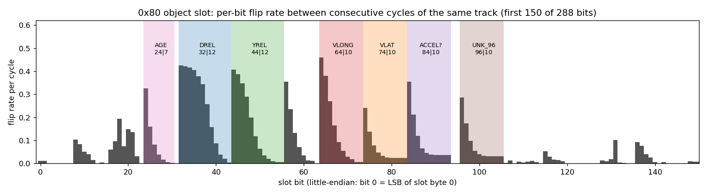

# 02. The object record on 0x80

## Transport

The radar sends its object list once per 60 ms cycle as one 742-byte record, split over **106 frames** on bus 1 address 0x80.

- **First frame:** bytes 0–1 are `12 E4`. That is an ISO-TP first frame, with length 0x2E4 = 740 bytes after the length byte.
- **Consecutive frames:** byte 0 is `2x`, where x is a sequence nibble that wraps every 16 frames.
- **Reassembly:** append bytes 1..7 of every frame, the first frame included, until 106 frames have arrived. That gives 742 bytes, and record byte 0 is `E4`.
- **CRC:** `zlib.crc32(record[1:737])`, stored little-endian at `record[737:741]`. Full replays of the logged drives gave zero CRC failures.
- **Why a DBC can't do this:** the sequence nibble wraps, so a single frame can't tell you which part of the record it carries. `ars510/transport.py` does the reassembly in 60 lines.
- **Marker:** a fixed `30 00 …` frame on 0x81 follows each record start within 20 ms.

| record bytes | content |
|---|---|
| 0 | `E4` (length low byte) |
| 1–16 | record header (see below) |
| 17–736 | 20 object slots × 36 bytes |
| 737–740 | CRC32, little-endian |
| 741 | trailing byte |

An unoccupied slot holds exactly this 36-byte idle template:

```
FCE00000A0F07F00FFFDF71FFFA100F807000F0008000000000000000000000000000000
```

## Slot bit numbering

Each 36-byte slot is **one little-endian bit field**: bit 0 is the LSB of slot byte 0, bit 8 is the LSB of byte 1, and so on. A field `start|len` is `(int.from_bytes(slot, "little") >> start) & ((1 << len) - 1)`. In a DBC that is Intel `start|len@1+` on the slot bytes.

Almost every earlier attempt read these bits in the wrong frame: byte-aligned, big-endian, or across byte boundaries. Those reads produced "fields" that only worked through heavy calibration ([08](08_dead_ends.md)).

## Decoded fields

| field | bits | decode | notes |
|---|---|---|---|
| **AGE** | `24\|7` | cycles | 1 at birth, +1 per cycle, saturates at **126**; 0 = the slot is retiring and its position fields still hold the previous occupant |
| **DREL** | `32\|12` | `(code − 160) × 1/16` m | forward distance from the radar; additive offset is −10 m, code 160 decodes to 0 m |
| **YREL** | `44\|12` | `(code − 2048) × 1/64` m | lateral, **left positive**, offset binary; \|code − 2048\| ≥ 2000 is a sentinel |
| **VLONG** | `64\|10` | `(code − 510.5) × 0.15` m/s | longitudinal velocity **over ground** |
| VLAT | `74\|10` | `(code − 510.5) × 0.15` m/s (placeholder) | lateral velocity over ground, left positive (sign confirmed). Scale **not pinned**: radar-only estimates from its own lateral position change are 0.147 / 0.131 / 0.135 on A / B / C but 0.097 on new mid-route data, and the pre-registered test was unverified ([14](14_stationary_objects_and_field_roles.md)) |
| MOVE_STATE | `109\|2` | enum | 0 moving away, 2 moving toward (oncoming), 1 / 3 not clearly moving. Passed a pre-registered test on 12 unseen segments ([14](14_stationary_objects_and_field_roles.md)) |
| ONCOMING_FLAG | `14\|1` | flag | oncoming now or earlier in the track's life. Passed a pre-registered test on 12 unseen segments |
| ACCEL? | `84\|10` | `code − 511` | acceleration-like; radar-only scale about 0.04 m/s² per code on most data but drive-dependent (0.03–0.11), **lags** velocity by ~0.5 s |
| UNK_96 | `96\|10` | raw | carry chain centred near 511; no relation to anything tested |

`vRel = VLONG − v_ego`, which is what openpilot's RadarPoint wants.



### How the boundaries were found (teacher-free)

Compare consecutive cycles of the same slot while its age keeps counting (same object). For a numeric field:
- the LSB flips most often;
- the flip rate falls toward the MSB;
- a higher bit almost never flips unless the bit below it does (a **carry chain**).

The plot above shows these chains. They cleanly delimit `24|7`, `32|12`, `44|12`, `64|10`, `74|10`, `84|10` and `96|10`.

The 12-bit and 10-bit fields cluster around 2048 and 512, which marks them as offset binary. A two's-complement read turns every small move across zero into a full-scale jump. `data/reference/slot_bit_map.json` has the automatic split of all 288 bits, including dozens of small candidate fields.

### How the scales were found

Scales come from physics first, then independent checks.

**Range, 1/16 m**
- For objects with |vRel| > 8 m/s, closing rate over relative speed gives 15.93 and 16.01 codes/m on the two calibration routes.
- Stationary objects on a held-out drive give 15.97 codes/m (CI 15.0–17.2). They were selected by the radar's own velocity field reading about 0, so this shares the tracker with the thing it checks. The radar mostly reports moving objects, so other drives had too few.
- Camera ground contact (tire line on a flat road, using only the log's liveCalibration and openpilot intrinsics) at 5–25 m gives slope 1.001, 0.992 and 0.993 on drives A, B and C.

**Range zero, code 160**
- This was the one constant originally fitted to vision: −9.87 and −10.59 m on the two calibration routes, rounded to 160 = −10.000 m.
- Camera ground contact, which uses no model output, puts the zero within 0.2 m on drives A and C.
- On hilly city drive B it reads +0.72 m. A 0.25° camera-pitch error, within calibration uncertainty, explains that. Carry the zero as **±0.7 m** until a non-camera check exists.
- The radar's origin agrees with openpilot's `RADAR_TO_CAMERA = 1.52 m` convention: camera ground distance minus (radar distance + 1.52) ≈ 0.

**Velocity, 0.15 m/s per code, over ground**
- With ego stopped, objects pile up at codes 510 and 511, so the zero is ≈ 510.5.
- At highway speed, objects that keep pace with ego sit at `v_ego / 0.15`, not at 0. So the field is over-ground, not relative.
- The scale check is **camera/model-free**, but uses radar range plus GPS ego speed: regressing the code on the radar's own 8 s range slope plus GPS ego speed gives 0.1504, 0.1487 and 0.1530 on drives A, B and C. Every 90% CI contains 0.15. Shared radar errors mean this is not independent velocity truth.
- No simple power-of-two bit-assignment fault was detected: steps of 16, 32 or 64 codes are no more frequent than their neighbours (for example 27 vs 33), and 84–90% of steps are ≤ 2 codes. This does not exclude state-dependent interpretation, timing or association errors.

**Lateral, left positive, 1/64 m**
- A yaw-rate sweep of stationary geometry gives the sign and a scale of about 1/60–1/64.
- Cartesian, not angular: codes per metre are constant across range, and ego-lane objects stay within 0.1 m of centre from 15 to 130 m on straight road.
- Scale is only pinned to about **±10%**:
  - adjacent-lane peaks, assuming 3.66 m lanes, give 63.9, 67.3 and 62.8 codes/m;
  - camera outer box edges give 68.9, 69.7 and 72.8.
- Sign agrees with the camera on 99.3%, 98.3% and 97.9% of off-centre targets.

### Standstill zero detail

Weighted standstill zero: 510.49 (A), 510.40 (B), 510.20 (C). A "zero code 511 with truncating encode" model would predict equal 510 and 511 counts. The observed ratio is 1.1–1.6, so that tidy explanation is not clean. The zero is uncertain by about 0.2 code (0.03 m/s), which is negligible.

### Velocity scale and the 0.149 question

Against Toyota 0xB4, steady following reads **0.149** m/s per code, not 0.150. An **ego-reference** effect is a supported explanation, not an established OEM calibration rule:
- 0xB4 reads about 1.5% below GPS and wheel speed (GPS is 1.015 × 0xB4, `carState.vEgo` is 1.014 × 0xB4);
- the radar-only regression above lands on 0.150 with GPS ego.

`OPENPILOT_CONFIG` subtracts 0xB4 speed and applies the empirical `vground_scale = 0.149/0.15`. If evaluating a different ego-speed reference, start from the raw 1.0 scale and revalidate timing and bias; do not silently carry over the correction. The hypotheses can't be separated beyond about 0.3 m/s at highway speed with these tests.

## Track IDs from the lifecycle

An object keeps its slot while tracked: 98.3–98.9% of consecutive same-slot cycles continue with age +1 or stay at 126. So trackId = (slot, continuous run of increasing age), in `ars510/tracks.py`:

- a restart (age drops, usually through 0) means a new ID;
- a slot quiet for more than 0.3 s means a new ID;
- a new occupant of a reused slot always gets a new ID, and **no ID is ever live in two slots**.

Slot allocation: the radar fills the **lowest free slot** first. Over 88 minutes across three drives it never occupied more than 10 of the 20 slots, and 94–99% of samples sit in slots 0–4 ([12](12_statistics.md)).

Measured on held-out drives:
- zero duplicate IDs;
- long tracks (≥ 300 cycles, ~18 s) stay on one camera-tracked vehicle with median purity 0.98 (city) and 1.00 (highway);
- on visual review, every remaining city "impurity" within 60 m was a camera-side tracker switch, not a radar identity error;
- about 10 tracks per drive run a full minute.

The radar does sometimes drop an object and **re-initialise** it under a new slot or age run, typically after an occlusion. The interface's optional re-link ([07](07_openpilot_integration.md)) restores the old ID when the new track starts where the lost one predicts.

## Young tracks are unconverged

Tracks younger than about 50–60 cycles (3–3.6 s) carry wrong range and velocity:
- median vRel error by age is 2.6 / 2.2 / 1.3 / 1.0 / 0.8 m/s for ages 1–10 / 11–25 / 26–50 / 51–80 / 81–125;
- stopped cars on young tracks read as moving (92% of camera-stopped rows at age 2–40 read moving);
- one track read 38 m for a car about 100 m ahead and walked to 107 m over ~3 s;
- about 31% of age-1 samples are placeholders at exactly 0 m.

The direction of travel (same way, stopped, oncoming) agrees with the camera on 99.8% of settled-track rows, against 88% for ages 2–40. Hence `min_publish_age = 60` in `OPENPILOT_CONFIG`.

## Record header (bytes 1–16) and other slot bits

The automatic split (`slot_bit_map.json`) finds several small fields in each slot besides the named ones. Some characterised candidates:

| bits | behaviour |
|---|---|
| `0\|2` | raw state (observed 0/1/2); measured/predicted meaning unproved |
| `2\|6` | physical slot index or 63 for unallocated-form headers, **not object class or reference point**. Verified again on all 18,220 slots in the bundled samples; lane correlations are allocation confounding |
| `16\|8` | score-like byte, observed 10–100 on allocated slots in the structural audit; not calibrated confidence. State-2 score decay is real, but state 1 / score 100 can coexist with large geometry jumps |
| `8\|6` | ramps with age and saturates at 62 |
| `224\|7`, `240\|7` | scale with range (r ≈ 0.8); `240\|7` is weakly uncertainty-like (ρ 0.15–0.2 with velocity error after range control) but does not single out excursions |
| `232\|7`, `248\|7` | scale with \|yRel\| (lateral-uncertainty-like) |
| `256\|5` / `264\|5` | rise / fall with track age at fixed range (rho +0.86-0.90 / -0.61 to -0.68 on three drives); existence-like / uncertainty-like; `264\|5` rises and `256\|5` drops before deletion |
| `20\|3` | 6 on 88-92% of settled rows; counts down about 5 -> 3 -> 2 -> 1 in the last records before deletion (missed-detection countdown candidate) |
| `107\|1` | about 0.02 in settled life, 0.5-0.66 just before deletion (coasting-flag candidate) |
| `56\|7`, `216\|6`, `272\|5` | per-track medians follow camera vehicle height (partial rho 0.41-0.71 at fixed range) and truck/bus class; size / class / RCS candidates |

Candidate roles are from three-drive replication with an ARS408-style template as the hypothesis source; see [14](14_stationary_objects_and_field_roles.md). None has pinned units.

The 17-byte prefix has a 15-bit field at bit 17 that correlates with ego speed (r = −0.74) and a few mux-like nibbles. No tested field has established a transferable excursion guard. Correlation is not proof of a speed field or of absent quality information. Later conditional-quality tests and their limits are in [13](13_evidence_review.md).

## Worked example

Slot bytes → fields:

```python
from ars510.objects import decode_native_slot
o = decode_native_slot(3, slot36)       # 36 bytes from record[17+36*3 : 17+36*4]
o.d_rel, o.y_rel, o.v_long_ground, o.age
vrel = o.v_long_ground - v_ego          # m/s; v_ego from 0xB4 (x 0.149/0.15) or carState.vEgo
```
