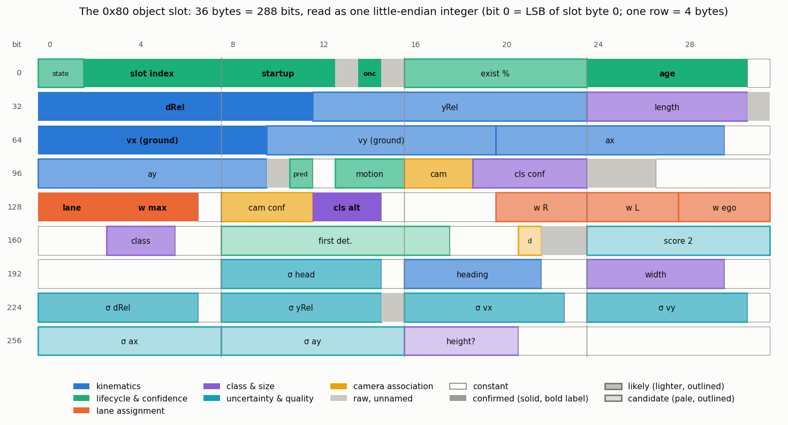
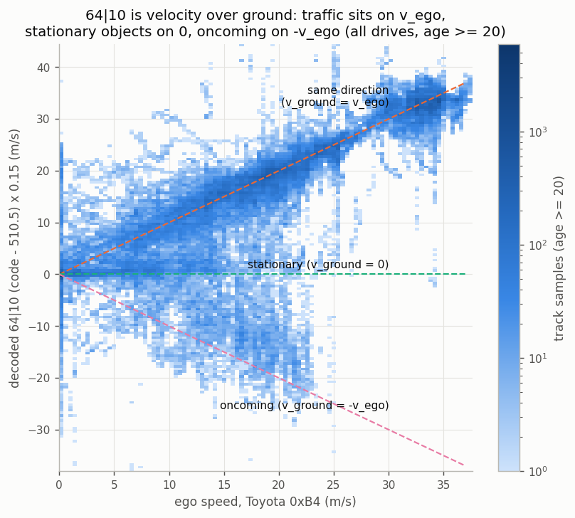
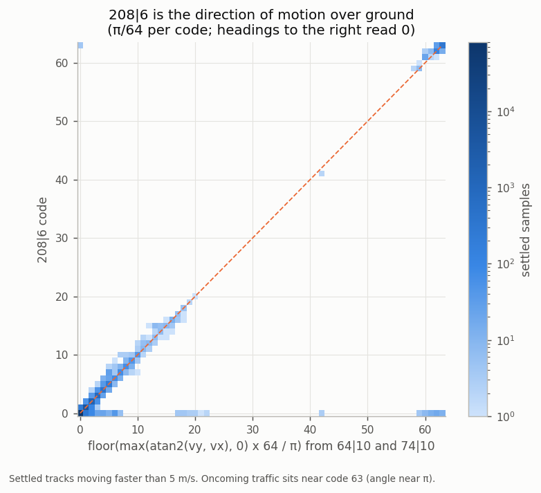
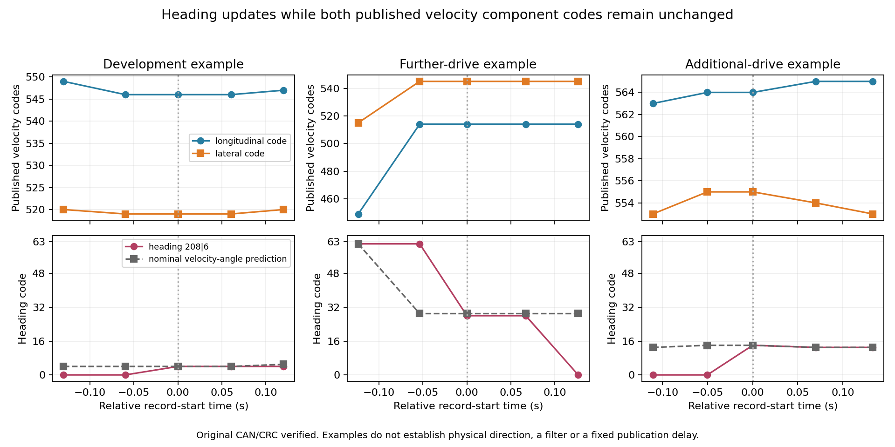
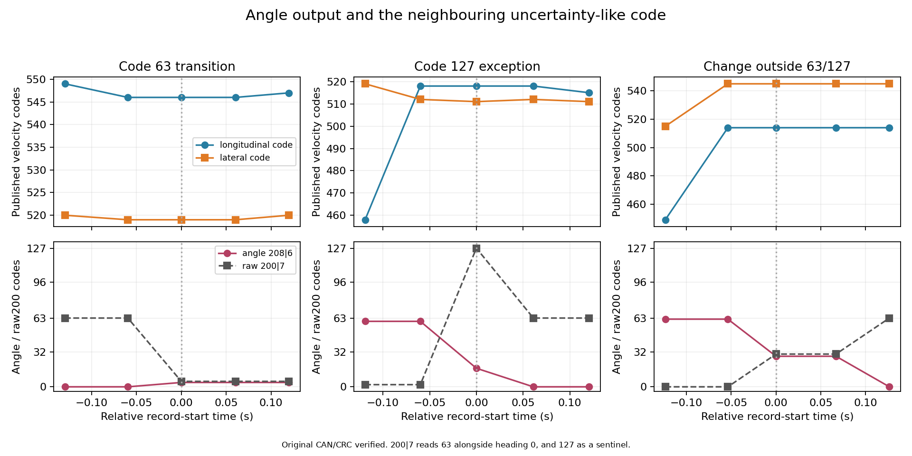
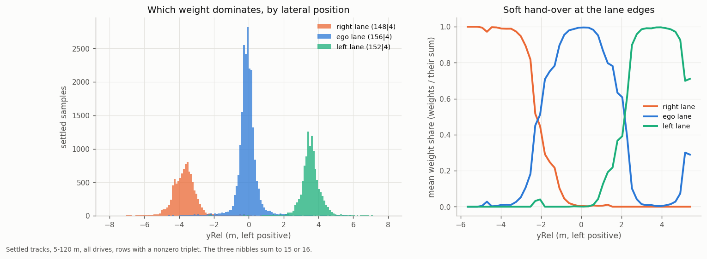
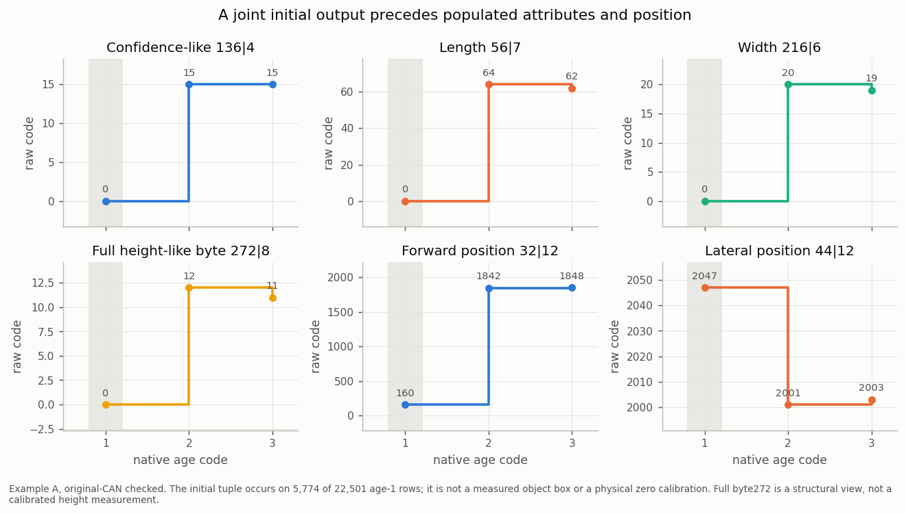
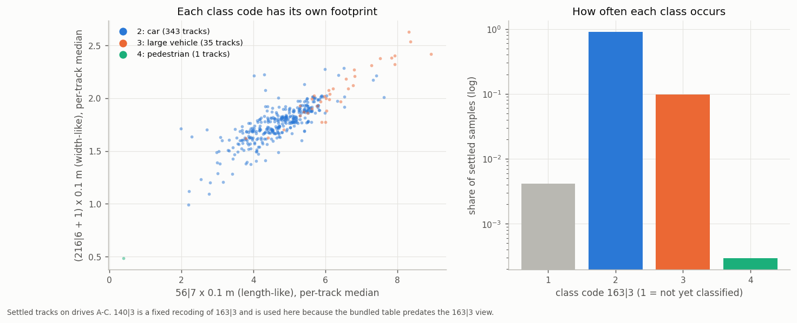
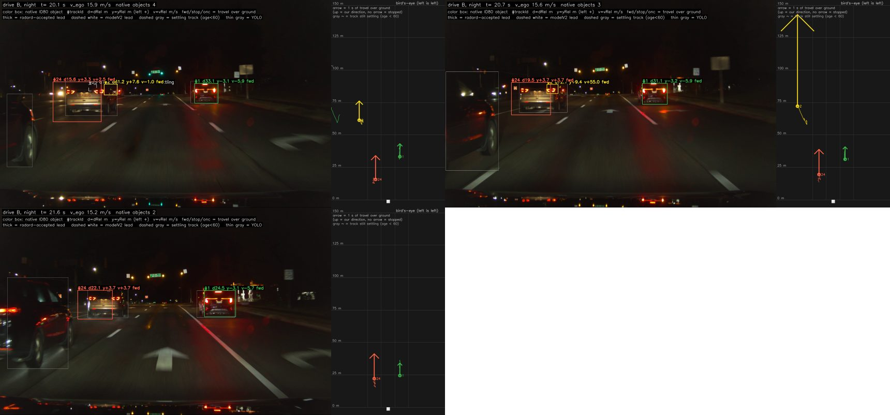

# 03. Slot fields: what every bit of an object means



Each 36-byte slot is **one little-endian bit field**: bit 0 is the LSB of slot byte 0, bit 8 the LSB of byte 1, and so
on. A field `start|len` is

```python
(int.from_bytes(slot, "little") >> start) & ((1 << len) - 1)
```

In a DBC that is Intel `start|len@1+` on the slot bytes. Most numeric fields are **offset binary** (zero near
the middle of the code range).

**Confidence:** ● confirmed (exact rule or replicated on held-out drives) · ◐ likely (consistent structure and
physics, scale or name still being pinned) · ○ candidate (a leading interpretation with supporting patterns).

The layout matches Continental's generic ARS object list (kinematics with standard deviations, class and dimensions,
lifecycle and maintenance state, existence probability). That template guided the naming; every decision below comes
from this radar's own data.

## Kinematics

| bits | field | decode | conf. |
|---|---|---|---|
| `32\|12` | **dRel**, forward distance from the radar | `(code − 160) / 16` m | ● field/scale; ◐ physical zero |
| `44\|12` | **yRel**, lateral, left positive | `(code − 2048) / 64` m; \|code − 2048\| ≥ 2000 is a sentinel | ● sign, ◐ scale (±10%) |
| `64\|10` | **vx over ground** | nominal `(code − 510.5) × 0.15` m/s; vRel = vx − v_ego | ● ground-speed interpretation; ◐ exact zero/scale |
| `74\|10` | **vy over ground**, left positive | `(code − 510.5) × ~0.147` m/s | ◐ |
| `84\|10` | **ax over ground**, filtered | `(code − 511) × ~0.04` m/s²; follows vx by 0.5-1 s | ◐ |
| `96\|10` | **ay over ground**, filtered | `(code − 511) × 0.05` m/s²; follows the kinematic value by ~0.5 s | ◐ |
| `208\|6` | **coarse heading over ground**, left positive, clipped at 0 | observed code × approximately π/64 rad; closely follows the clipped velocity angle | ◐ meaning / exact scale |

- **The velocity is over ground**, not relative: traffic sits on the ego-speed diagonal, parked objects on 0 and
  oncoming traffic on −v_ego.

  

- **Lateral motion and acceleration live in the radar's rotating frame.** With yaw rate ω (left positive):
  `vy = dy/dt + ω·x` and `ay = dvy/dt + ω·vx`. With that correction, `74|10` fits 0.142-0.145 m/s per code on
  three drive groups, and 0.147 (±3%) against the gyro in turns on all 700 segments. `96|10` tracks lateral
  acceleration at r = 0.92 / 0.88 / 0.90 (development / confirmation /
  further drives), 0.84 / 0.78 / 0.83 after removing ego's own lateral acceleration.
- **The heading output closely follows the clipped velocity angle.** It matches
  `floor(max(atan2(vy, vx), 0) × 64 / π)` on 98.2% of settled moving samples (99.6% within one code),
  with the best agreement at zero lag. Rightward headings read 0 and oncoming motion reads near 63.
  The output can also change while both transmitted velocity codes stay unchanged, so the formula is an
  empirical comparison. Its exact inputs, precision, state updates and filtering remain provisional. Counts:
  [`heading_component_bins.json`](../data/analysis/summaries/heading_component_bins.json),
  [`velocity_heading.json`](../data/analysis/summaries/velocity_heading.json).

  A conditional ego-path comparison supports the approximate angular scale: the output correlates at
  r = 0.89-0.93 with the road direction where ego later passes the target's reported position. This uses
  native radar position to select the future path point and assumes the target follows that path; target
  identity and direction are not independently measured. On rows where the output differs from the
  component formula, neither comparison establishes a separate or directly derived heading state.
  Three checked allocation edges keep both component codes fixed while the heading changes, including
  two with ordinary neighbouring `200|7` codes. These are observed code updates, not three independently
  verified physical turns. Structural examples and the reference's distinguishing criteria:
  [`heading_interpretation.json`](../data/analysis/summaries/heading_interpretation.json).
  Reference assumptions and results:
  [`decode_references.json`](../data/analysis/summaries/decode_references.json).

  The neighbouring `200|7` code helps distinguish output states: raw63 pairs with angle0 on all 393,268
  observed rows. Raw127 usually pairs with zero too, but has 14 nonzero-angle exceptions among 35,871 rows,
  including one mature moving sample. Preserve the full seven bits. Among the current-bin discrepancies,
  98,485 of 100,838 occur at63/127; 2,353 remain at other codes. These are conditional code associations,
  not a universal invalidity flag, calibrated angular uncertainty or a filter decode. Zero angle can also
  represent clipped rightward motion. Definitions and examples:
  [`heading_default_state.json`](../data/analysis/summaries/heading_default_state.json).

  

  

  

Scales and accuracy are in [06](06_accuracy.md).

## Lifecycle and confidence

| bits | field | decode | conf. |
|---|---|---|---|
| `0\|2` | **state** | 1 update-like, 2 prediction-like (coasting candidate); 0 rare. Measurement availability and accuracy are unproved | ◐ |
| `2\|6` | **slot index** | 0-19 = this slot's position; 63 = unallocated | ● |
| `8\|5` | **startup code** | `min(30, floor(31 × (2/3)^max(age − 4, 0)))` while the motion code is 5 | ● |
| `13\|1` | flag next to the startup code | set on almost every sample; toggles independently of `8\|5` | raw |
| `14\|1` | **oncoming-like state** | 0/1; can persist after slowing and reset before a native allocation ends | ● structure, ◐ meaning |
| `16\|8` | **existence probability** | % (10-100); `20\|3` is its coded class; `NativeObject.existence_pct`, point metadata `existence_pct` | ◐ |
| `24\|7` | **age** | radar cycles: 1 at birth, saturates at 126, 0 = slot retiring | ● |
| `107\|1` | **predicted (not measured)** | set on 45% of a track's last five records vs 2.6% elsewhere; never set during tested velocity excursions; `NativeObject.predicted`, published as `measured = False` | ◐ |
| `109\|3` | **motion code** | see table below | ◐ |

**Score `16|8`.** Commonly sits at 100 on settled tracks and can decline in either state. In state 2 it steps
down by **exactly 20 or 1 per cycle** (every one of 18,804 mature state-2 updates), and the slot is freed near 20.
When the score is at most 40, the step is 20 and `107|1` is clear, the allocation is removed on the next record 82-86%
of the time. The upper three bits of this byte (`20|3`) read 6 → 5 → 3 → 2 → 1 during that countdown.
Returning to state 1 does not guarantee score restoration. The byte behaves as an **existence probability in percent**:
`20|3` is a coded class of it with edges at 25, 50, 75, 90 and 99 % (class 6 = above 99 %), the coding Continental
radars use for their existence probability, and the Tesla Model 3's Continental radar sends the same quantity as
`ProbExist` ([`continental_field_map.json`](../data/analysis/summaries/continental_field_map.json)). It reaches 100 % at
about age 21 (p90 30), long before range and velocity converge, so it does not replace the age-60 publication gate.

**Predicted records `107|1`.** Set on 45% of the last five records of a track's life against 2.6% elsewhere, with lower
range noise while set (median 0.19 vs 0.41 m from the track's own trend) and lower existence: the record is a
prediction, like the Tesla radar's `Meas = 0`. Velocity excursions are **not** predicted records: none of 144 tested
excursions had it set, so a measured flag alone does not remove them.

**Startup code `8|5`** matches its formula on 134,217 / 134,217 birth samples across 24 drives: ages 1-4 read 30, then
20, 13, 9, 6, 4, 2, 1, 1, 0. Once the motion code leaves 5 the field takes other, mature values.

**Motion code `109|3`** (the historical 2-bit `109|2` view drops bit 111):

| code | behaviour | reading |
|---|---|---|
| 0 | positive longitudinal ground velocity | moving forward |
| 1 | slow | slow or standing |
| 2 | negative longitudinal ground velocity | oncoming |
| 3 | lateral velocity < −0.15 m/s on all mature samples | moving right (crossing) |
| 4 | lateral velocity > +0.15 m/s on 600 / 602 mature samples | moving left (crossing) |
| 5 | every age-1 to age-3 sample | initializing |
| 7 | slow after sustained motion | stopped after moving |

Bit 14 is an **oncoming-like motion state**. It stays set after an oncoming object slows, and it can also clear
while the same allocation continues (6,618 updates, 119 of them with both velocity codes unchanged), often together
with an angle-state change. Counts are in [`heading_default_state.json`](../data/analysis/summaries/heading_default_state.json).

## Lane assignment

| bits | field | decode | conf. |
|---|---|---|---|
| `128\|3` | **lane state** | 3 ego lane, 2 right lane, 4 left lane; 1 / 5 / 7 = no lane weights | ● structure, ◐ names |
| `148\|4` | **right-lane weight** | 0-15 | ◐ |
| `152\|4` | **left-lane weight** | 0-15 | ◐ |
| `156\|4` | **ego-lane weight** | 0-15 | ◐ |

The three weights **sum to 15 or 16** whenever any is nonzero (191,151 of 191,153 samples): a lane-assignment
probability in 1/15 steps. The lane state matches the dominant weight on 99.6% of samples and is exactly zero-weight
for codes 1 / 5 / 7.



The dominant weight sits one lane width apart: median yRel −3.8 m (right), 0 m (ego), +3.7 m (left). At the lane
edges, weight moves smoothly from one lane to the next. The ego-lane weight is the radar's own **in-path** estimate,
which openpilot's radard does not have (radard has no lateral gate; [08](08_openpilot_integration.md)).

The decoder exposes the triplet as `NativeObject.raw_weights148` (right, left, ego order as on the wire) and the state
as `raw_weight_state128`.

## Class and size

| bits | field | decode | conf. |
|---|---|---|---|
| `163\|3` | **class** | 1 not yet classified, 2 car, 3 large vehicle, 4 pedestrian, 5 provisional (cyclist/person associations), 6 two-wheeler | ◐; 5 ○ |
| `140\|3` | class, second encoding | 0, 5, 7, 1, 3, 4 ↔ class 1, 2, 3, 4, 5, 6 (exact on 1,253,081 rows) | ● |
| `136\|4` | class confidence | 0-15; 15 on nearly all pedestrians and two-wheelers | ○ |
| `216\|6` | **width** | `(code + 1) × 0.1` m | ◐ |
| `56\|7` | **length** | `code × 0.1` m | ◐ |
| `272\|5` | height-like size code | larger for large vehicles | ○ |

**About a quarter of new objects start with an initialization template.** On 5,774 of 22,501 age-1 outputs,
the confidence `136|4`, length `56|7`, width `216|6` and full byte `272|8` are all zero, and they are zero together
on every one of 1,253,081 occupied rows (700 segments). These rows always have motion code 5, class 1, state 1,
range code 160 (0 m) and lateral code 2047: the position is a placeholder, while the velocity codes already vary.
All four attributes are nonzero from age 2. The decoder marks template rows `geometry_valid = False`, so no
interface profile publishes a phantom object at 0 m. Counts are in
[`initial_attribute_zeros.json`](../data/analysis/summaries/initial_attribute_zeros.json).



The class code and the two size fields describe one consistent object box (mature tracks, 399 one-minute segments):

| class | share of rows | median speed | width | length |
|---|---|---|---|---|
| 1 not yet classified | 15% (median age 5) | 2.6 m/s | — | — |
| 2 car | 75% | 9.2 m/s | 1.8 m | 4.9 m |
| 3 large vehicle | 9% | 4.9 m/s | 2.0 m | 5.7 m |
| 4 pedestrian | 1% | 0.7 m/s | 0.5 m | 0.4 m |
| 6 two-wheeler | rare | 9.4 m/s | 0.7 m | 1.7 m |

Width also matches camera-measured vehicle width to about 0.05-0.07 m in the per-track median. Video review shows
class 4 on people at crossings and fuel pumps and class 6 on motorcycles.

**Class 5 has candidate cyclist and person associations.** Four reviewed lifecycles across three drives align
with visible cyclists, including two that reach mature age. Two runs on another drive nominally follow visible
walkers, including one with 31 mature rows. The camera review covers 21 episodes across 11 drives from a
45-episode inventory, with ambiguous parked-vehicle, road and traffic-furniture scenes also represented.
The radar's own kinematics point the same way: class-5 objects measure 1.2 × 0.7 m (between pedestrians at
0.5 × 0.6 m and two-wheelers at 1.6 × 0.7 m) and move at 2.0 m/s median, from walking pace up to 6 m/s: the size of
a bicycle at walking-to-cycling speed. All 968 class-5 samples read 15 in `136|4`, and their height-like `272|5`
code spans 4-11. Counts are in [`class5_video_review.json`](../data/analysis/summaries/class5_video_review.json) and
[`decode_references.json`](../data/analysis/summaries/decode_references.json).



## Uncertainty and quality

| bits | field | behaviour | conf. |
|---|---|---|---|
| `224\|7` | σ dRel | grows with range, shrinks with track age, rises before deletion | ◐ |
| `232\|7` | σ yRel | grows with \|yRel\|, shrinks with age | ◐ |
| `240\|7` | longitudinal velocity error scale (≈ 0.045 m/s per count against the ACC target) | grows with range, shrinks with age; higher when vRel disagrees with the camera (AUC 0.70 at 30-60 m) and during velocity excursions | ◐ |
| `248\|7` | σ vy | grows with \|yRel\|, shrinks with age | ◐ |
| `200\|7` | angular uncertainty-like code | co-varies with velocity uncertainty candidates; raw63 pairs with angle0, raw127 has exceptions; metric units provisional | ○ |
| `256\|8` | existence-like | rises with age at fixed range (ρ +0.86 to +0.90), drops before deletion | ○ |
| `264\|8` | measurement state | settled values depend on range (4 ≈ 10 m, 3 ≈ 12 m, 1 ≈ 30 m, 2 ≈ 47 m): a near/far-scan mode | ○ |
| `184\|8` | secondary score | 59-100 on allocated slots | ○ |

Against each track's own errors on two drives (all tracks, within range bins), `224|7` and `240|7` follow longitudinal
errors (range residual, velocity against the radar's ACC target, acceleration) and `232|7` and `248|7` lateral ones
(Spearman ≈ 0.4 with the lateral residual against ≤ 0.13 for the longitudinal pair): an alternating
distance-long, distance-lat, velocity-long, velocity-lat order like Continental's object-quality fields. They flag
velocity excursions well below 40 m (AUC 0.95-0.97) but not at 40-60 m (0.41-0.49) or beyond (0.55-0.68), where
excursions matter ([`continental_field_map.json`](../data/analysis/summaries/continental_field_map.json)).

`240|7` is exposed as `NativeObject.vel_unc_code`. Against the radar's own ACC target, the RMS of native vRel minus ACC speed
is 0.04-0.05 m/s per count over codes 14-75 on the 700-segment corpus and on 114 fresh segments, and a Gaussian σ = 0.045 × code
reproduces the share of far-range excursions ([07](07_velocity_excursions.md#excursions-are-the-expected-low-snr-velocity-error),
[summary](../data/analysis/summaries/excursion_sigma_scale.json)); the ACC reference error (about 0.6 m/s) is inside that RMS. On selected 40–80 m windows, a through-origin fit of
**native-minus-ECC RMS disagreement** against mean code gives 0.049 m/s/count and R² 0.81 across ten code deciles
(◐ association; [optical comparison](07_velocity_excursions.md#compared-with-an-optical-reference)).
This includes both estimators' errors, their covariance and squared bias; it does not isolate radar sigma or
measurement variance. The exploratory transfer fit is 0.054 with R² 0.66; those transfer statistics and the
reported bootstrap are outside the independent arithmetic check. Physical units and within-target calibration
remain provisional ([summary](../data/analysis/summaries/video_truth.json)).

A saturated velocity (`64|10` = 1023, about +77 m/s over ground) always comes with `240|7` = 127 and is withheld
by both profiles. It appears in short runs on mature tracks at 34–97 m and often decays through 1022, 1014,
1006 over subsequent records. `STEADY_CONFIG` also withholds record-to-record jumps above 8 m/s
([07](07_velocity_excursions.md#how-the-filtering-works-step-by-step)).



*Night, drive B: track #2 (a car about 61 m ahead in the left lane) jumps to 72 m and +55 to +61 m/s relative
(76 m/s over ground, code 1023) in its last second before the radar drops it.*

`8|6` is a candidate motion-context code (○). Its reported AUC is 0.92 / 0.90 for range-kinematics
stationary/moving labels, but precision as a stationary flag is only 4–6%. Those labels do not independently
establish physical stationarity or a graded-confidence enum. The raw code is unsuitable as a zero-speed rule
([summary](../data/analysis/summaries/video_truth.json)).

## Raw and constant bits

- **Raw, unnamed:** 13, 15, 63, 106, `112|3`, `115|8`, `131|4`, `166|2`, `168|10` (only codes 0, 768, 832, 1023),
  181, 182, 183, `192|8`, 239, `277|11`. Bits 15 and 239 are mostly active near track birth.
- **Constant in the captured data:** 31, `94|2`, 108, `123|5`, 135, `143|5`, `160|3`, `178|3`, 207, `214|2`,
  `222|2`, 231, 247, 255.

The full per-bit statistics of the original survey are in
[`data/reference/slot_bit_map.json`](../data/reference/slot_bit_map.json); the Cabana DBC
([`dbc/ars510_objects_vbus.dbc`](../dbc/ars510_objects_vbus.dbc)) carries these readings as signal comments.
