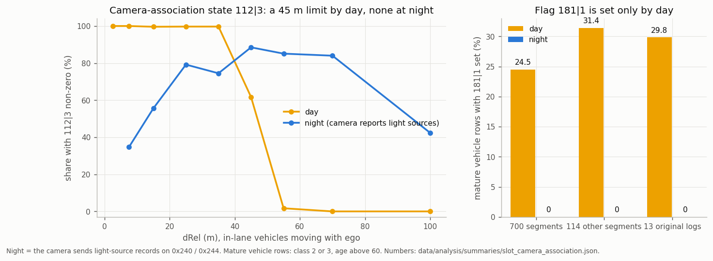

# 03. Slot fields: what every bit of an object means


Each 36-byte slot is **one little-endian bit field**: bit 0 is the LSB of slot byte 0, bit 8 the LSB of byte 1, and so
on. A field `start|len` is

```python
(int.from_bytes(slot, "little") >> start) & ((1 << len) - 1)
```

In a DBC that is Intel `start|len@1+` on the slot bytes. Most numeric fields are **offset binary** (zero near
the middle of the code range).

**Confidence:** ● confirmed (exact rule or replicated on held-out drives) · ◐ likely (consistent structure and
physics, scale or name still being pinned) · ○ candidate (a leading interpretation with supporting patterns).

The layout matches Continental's generic ARS object list (kinematics with standard deviations, class and dimensions,
lifecycle and maintenance state, existence probability). That template guided the naming; every decision below comes
from this radar's own data.

## Kinematics

| bits | field | decode | conf. |
|---|---|---|---|
| `32\|12` | **dRel**, forward distance from the radar | `(code − 160) / 16` m | ● field/scale; ◐ physical zero |
| `44\|12` | **yRel**, lateral, left positive | `(code − 2048) × 0.015` m; \|code − 2048\| ≥ 2000 is a sentinel | ● sign, ◐ scale ([06](06_accuracy.md#lateral-position)) |
| `64\|10` | **vx over ground** | nominal `(code − 510.5) × 0.15` m/s; vRel = vx − v_ego | ● ground-speed interpretation; ◐ exact zero/scale |
| `74\|10` | **vy over ground**, left positive | `(code − 510.5) × ~0.147` m/s | ◐ |
| `84\|10` | **ax over ground**, filtered | `(code − 511) × ~0.04` m/s²; follows vx by 0.5-1 s | ◐ |
| `96\|10` | **ay over ground**, filtered | `(code − 511) × 0.05` m/s²; follows the kinematic value by ~0.5 s | ◐ |
| `208\|6` | **coarse heading over ground**, left positive, clipped at 0 | observed code × approximately π/64 rad; closely follows the clipped velocity angle | ◐ meaning / exact scale |

- **The velocity is over ground**, not relative: traffic sits on the ego-speed diagonal, parked objects on 0 and
  oncoming traffic on −v_ego.

  

- **Lateral motion and acceleration live in the radar's rotating frame.** With yaw rate ω (left positive):
  `vy = dy/dt + ω·x` and `ay = dvy/dt + ω·vx`. With that correction, `74|10` fits 0.142-0.145 m/s per code on
  three drive groups, and 0.147 (±3%) against the gyro in turns on all 700 segments. `96|10` tracks lateral
  acceleration at r = 0.92 / 0.88 / 0.90 (development / confirmation /
  further drives), 0.84 / 0.78 / 0.83 after removing ego's own lateral acceleration.
- **The heading output closely follows the clipped velocity angle.** It matches
  `floor(max(atan2(vy, vx), 0) × 64 / π)` on 98.2% of settled moving samples (99.6% within one code),
  with the best agreement at zero lag. Rightward headings read 0 and oncoming motion reads near 63.
  The output can also change while both transmitted velocity codes stay unchanged, so the formula is an
  empirical comparison. Its exact inputs, precision, state updates and filtering remain provisional. Counts:
  [`heading_component_bins.json`](../data/analysis/summaries/heading_component_bins.json),
  [`velocity_heading.json`](../data/analysis/summaries/velocity_heading.json).

  Against the road direction where ego later passes the target's position the output correlates at r = 0.89-0.93
  (assumes the target follows that path). The heading can change while both velocity codes stay fixed (three checked
  cases), so it is not purely derived from them
  ([`heading_interpretation.json`](../data/analysis/summaries/heading_interpretation.json)).
  Reference assumptions and results:
  [`decode_references.json`](../data/analysis/summaries/decode_references.json).

  `200|7` helps tell output states apart: code 63 always pairs with heading 0 (393,268 rows); 127 almost always
  (14 exceptions in 35,871). Heading 0 can also be clipped rightward motion, so keep all seven bits
  ([`heading_default_state.json`](../data/analysis/summaries/heading_default_state.json)).

  

  

  

Scales and accuracy are in [06](06_accuracy.md).

## Lifecycle and confidence

| bits | field | decode | conf. |
|---|---|---|---|
| `0\|2` | **state** | 1 update-like, 2 prediction-like (coasting candidate); 0 rare. Measurement availability and accuracy are unproved | ◐ |
| `2\|6` | **slot index** | 0-19 = this slot's position; 63 = unallocated | ● |
| `8\|5` | **startup code** | `min(30, floor(31 × (2/3)^max(age − 4, 0)))` while the motion code is 5 | ● |
| `13\|1` | flag next to the startup code | set on almost every sample; toggles independently of `8\|5` | raw |
| `14\|1` | **oncoming-like state** | 0/1; can persist after slowing and reset before a native allocation ends | ● structure, ◐ meaning |
| `16\|8` | **existence probability** | % (10-100); `20\|3` is its coded class; `NativeObject.existence_pct`, point metadata `existence_pct` | ◐ |
| `24\|7` | **age** | radar cycles: 1 at birth, saturates at 126, 0 = slot retiring | ● |
| `107\|1` | **predicted (not measured)** | set on 45% of a track's last five records vs 2.6% elsewhere; never set during tested velocity excursions; `NativeObject.predicted`, published as `measured = False` | ◐ |
| `109\|3` | **motion code** | see table below | ◐ |

**Score `16|8`.** Commonly sits at 100 on settled tracks and can decline in either state. In state 2 it steps
down by **exactly 20 or 1 per cycle** (every one of 18,804 mature state-2 updates), and the slot is freed near 20.
When the score is at most 40, the step is 20 and `107|1` is clear, the allocation is removed on the next record 82-86%
of the time. The upper three bits of this byte (`20|3`) read 6 → 5 → 3 → 2 → 1 during that countdown.
Returning to state 1 does not guarantee score restoration. The byte behaves as an **existence probability in percent**:
`20|3` is a coded class of it with edges at 25, 50, 75, 90 and 99 % (class 6 = above 99 %), the coding Continental
radars use for their existence probability, and the Tesla Model 3's Continental radar sends the same quantity as
`ProbExist` ([`continental_field_map.json`](../data/analysis/summaries/continental_field_map.json)). It reaches 100 % at
about age 21 (p90 30), long before range and velocity converge, so it does not replace the age-60 publication gate.

**Predicted records `107|1`.** Set on 45% of the last five records of a track's life against 2.6% elsewhere, with lower
range noise while set (median 0.19 vs 0.41 m from the track's own trend) and lower existence: the record is a
prediction, like the Tesla radar's `Meas = 0`. Velocity excursions are **not** predicted records: none of 144 tested
excursions had it set, so a measured flag alone does not remove them.

**Startup code `8|5`** matches its formula on 134,217 / 134,217 birth samples across 24 drives: ages 1-4 read 30, then
20, 13, 9, 6, 4, 2, 1, 1, 0. Once the motion code leaves 5 the field takes other, mature values.

**Motion code `109|3`** (the historical 2-bit `109|2` view drops bit 111):

| code | behaviour | reading |
|---|---|---|
| 0 | positive longitudinal ground velocity | moving forward |
| 1 | slow | slow or standing |
| 2 | negative longitudinal ground velocity | oncoming |
| 3 | lateral velocity < −0.15 m/s on all mature samples | moving right (crossing) |
| 4 | lateral velocity > +0.15 m/s on 600 / 602 mature samples | moving left (crossing) |
| 5 | every age-1 to age-3 sample | initializing |
| 7 | slow after sustained motion | stopped after moving |

Bit 14 is an **oncoming-like motion state**. It stays set after an oncoming object slows, and it can also clear
while the same allocation continues (6,618 updates, 119 of them with both velocity codes unchanged), often together
with an angle-state change. Counts are in [`heading_default_state.json`](../data/analysis/summaries/heading_default_state.json).

## Lane assignment

| bits | field | decode | conf. |
|---|---|---|---|
| `128\|3` | **lane state** | 3 ego lane, 2 right lane, 4 left lane; 1 / 5 / 7 = no lane weights | ● structure, ◐ names |
| `148\|4` | **right-lane weight** | 0-15 | ◐ |
| `152\|4` | **left-lane weight** | 0-15 | ◐ |
| `156\|4` | **ego-lane weight** | 0-15 | ◐ |
| `131\|4` | dominant lane weight | the largest of the three weights or one less (99.7 % of samples) | ● derived |

The three weights **sum to 15 or 16** whenever any is nonzero (191,151 of 191,153 samples): a lane-assignment
probability in 1/15 steps. The lane state matches the dominant weight on 99.6% of samples and is exactly zero-weight
for codes 1 / 5 / 7.


The dominant weight sits one lane width apart: median yRel −3.7 m (right), −0.1 m (ego), +3.5 m (left). At the lane
edges, weight moves smoothly from one lane to the next. The ego-lane weight is the radar's own **in-path** estimate,
which openpilot's radard does not have (radard has no lateral gate; [08](08_openpilot_integration.md)).

The decoder exposes the triplet as `NativeObject.raw_weights148` (right, left, ego order as on the wire) and the state
as `raw_weight_state128`.

## Camera association

| bits | field | behaviour | conf. |
|---|---|---|---|
| `112\|3` | **camera-association state** | 0 = radar only; 1 (rarely 2-4) while the camera has the vehicle | ◐ |
| `136\|4` | association confidence | 15 without association; restarts at 3-9 when `112\|3` becomes non-zero and climbs to 14 | ◐ |
| `181\|1` | daylight-only flag | set on a quarter of mature vehicle rows by day, never at night | ○ |



Two slot fields follow what the camera can see, although no camera object frame is visible on this bus (the lane curves in
0x85 reach the radar the same unseen way):

- **By day** `112|3` is non-zero on 99.7 % of in-lane vehicles at 5-40 m, on 62 % at 40-50 m and on 0.7 % at 50-80 m:
  a sharp range limit near 45 m, independent of ego speed. It is non-zero on 98 % within ±6° of boresight and falls off
  beyond ±20°, stays 0 for pedestrians, two-wheelers and class 5, and is set on only 5-21 % of oncoming vehicles.
- **At night**, when the camera switches to light-source records ([05](05_acc_target_and_support.md#0x240-0x248-context-frames)),
  the range limit disappears: non-zero on 69 % at 5-40 m and on 85 % at 50-80 m (67 % and 99.6 % on a second set of drives).
- The position does not step when the state changes (median lateral change 0.03 m, as on any other record), so it is not a
  reference-point code.
- `181|1` is set on 24.5 % of mature vehicle rows by day and on 2 of 59,988 at night (31.4 % and 0 of 12,136 on the second
  set; 29.8 % and 0 of 8,188 decoded from original logs). It occurs only for cars and large vehicles and more often at
  long range (22 % at 10-40 m, 43 % at 80-120 m).

Numbers: [`slot_camera_association.json`](../data/analysis/summaries/slot_camera_association.json).

## Class and size

| bits | field | decode | conf. |
|---|---|---|---|
| `163\|3` | **class** | 1 not yet classified, 2 car, 3 large vehicle, 4 pedestrian, 5 provisional (cyclist/person associations), 6 two-wheeler | ◐; 5 ○ |
| `140\|3` | class, second encoding | 0, 5, 7, 1, 3, 4 ↔ class 1, 2, 3, 4, 5, 6 (exact on 1,253,081 rows) | ● |
| `115\|5` | **class confidence** | `code × 5` %: 0 while not yet classified, 4-20 otherwise | ◐ |
| `216\|6` | **width** | `(code + 1) × 0.1` m | ◐ |
| `56\|7` | **length** | `code × 0.1` m | ◐ |
| `272\|5` | height-like size code | larger for large vehicles | ○ |

**Class confidence `115|5`.** The only values are 0 and 4-20, so 20 is 100 %. It is 0 on 83 % of unclassified rows and
never on a car, starts near 55 % for a new car and settles at 80-90 % (median 16-18 from age 25), and moves by exactly one
step per cycle on 95-96 % of its changes. The class follows it: when a large vehicle is re-classified as a car, the value
has fallen to 5 (25 %) on the record before and restarts at 15 (106 switches; 4-5 before and 14-15 after on the middle
80 %). A newly classified car typically starts at 15, a large vehicle at 12. The decoder exposes it as
`NativeObject.class_confidence_pct`; the three bits above it (`120|3`) are non-zero on 0.2 % of rows
([`slot_camera_association.json`](../data/analysis/summaries/slot_camera_association.json)).

**About a quarter of new objects start with an initialization template.** On 5,774 of 22,501 age-1 outputs,
the association confidence `136|4`, length `56|7`, width `216|6` and full byte `272|8` are all zero, and they are zero together
on every one of 1,253,081 occupied rows (700 segments). These rows always have motion code 5, class 1, state 1,
range code 160 (0 m) and lateral code 2047: the position is a placeholder, while the velocity codes already vary.
All four attributes are nonzero from age 2. The decoder marks template rows `geometry_valid = False`, so no
interface profile publishes a phantom object at 0 m. Counts are in
[`initial_attribute_zeros.json`](../data/analysis/summaries/initial_attribute_zeros.json).


The class code and the two size fields describe one consistent object box (mature tracks, 399 one-minute segments):

| class | share of rows | median speed | width | length |
|---|---|---|---|---|
| 1 not yet classified | 15% (median age 5) | 2.6 m/s | — | — |
| 2 car | 75% | 9.2 m/s | 1.8 m | 4.9 m |
| 3 large vehicle | 9% | 4.9 m/s | 2.0 m | 5.7 m |
| 4 pedestrian | 1% | 0.7 m/s | 0.5 m | 0.4 m |
| 6 two-wheeler | rare | 9.4 m/s | 0.7 m | 1.7 m |

Width also matches camera-measured vehicle width to about 0.05-0.07 m in the per-track median. Video review shows
class 4 on people at crossings and fuel pumps and class 6 on motorcycles.

**Class 5 has candidate cyclist and person associations.** Four reviewed lifecycles across three drives align
with visible cyclists, including two that reach mature age. Two runs on another drive nominally follow visible
walkers, including one with 31 mature rows. The camera review covers 21 episodes across 11 drives from a
45-episode inventory, with ambiguous parked-vehicle, road and traffic-furniture scenes also represented.
The radar's own kinematics point the same way: class-5 objects measure 1.2 × 0.7 m (between pedestrians at
0.5 × 0.6 m and two-wheelers at 1.6 × 0.7 m) and move at 2.0 m/s median, from walking pace up to 6 m/s: the size of
a bicycle at walking-to-cycling speed. No class-5 sample has a camera association (`136|4` = 15 on all 968), and their
height-like `272|5` code spans 4-11. Counts are in [`class5_video_review.json`](../data/analysis/summaries/class5_video_review.json) and
[`decode_references.json`](../data/analysis/summaries/decode_references.json).


## Pass-through: every decoded object field in `NativeObject`

`decode_native_slot` returns each field below as a raw code or in its nominal unit, so a consumer can use them without re-decoding.
Confidence is that of the field's own row in this doc.

| output | `NativeObject` attribute | bits |
|---|---|---|
| distance, lateral position | `d_rel`, `y_rel` | `32\|12`, `44\|12` |
| speed over ground (relative speed = minus ego speed) | `v_long_ground`, `vel_code` | `64\|10` |
| lateral speed | `v_lat_ground`, `v_lat_code` | `74\|10` |
| acceleration (filtered, ground-like, no calibrated unit) | `accel_like_code` | `84\|10` |
| tracked / measured | `age`, `predicted` (Meas = 0), `movement_code` | `24\|7`, `107\|1`, `109\|3` |
| existence probability | `existence_pct` | `16\|8` |
| obstacle probability (candidate, unnamed) | `secondary_score_pct` | `184\|8` |
| class, class confidence | `object_class`, `class_confidence_pct` | `163\|3`, `115\|5` |
| size | `length_m`, `width_m`, `height_code` (not a height) | `56\|7`, `216\|6`, `272\|5` |
| uncertainty codes | `range_unc_code`, `lateral_unc_code`, `vel_unc_code`, `vlat_unc_code`, `accel_unc_code`, `lateral_accel_unc_code`, `orientation_unc_code` | `224\|7`, `232\|7`, `240\|7`, `248\|7`, `256\|8`, `264\|8`, `200\|7` |

The radar has no per-object relative-speed (Doppler) field and no status message on the bus; the ACC target's own relative speed, acceleration
and lateral speed are in [05](05_acc_target_and_support.md). `UNCERTAINTY_PER_COUNT` holds the fitted scales of the next section.

## Uncertainty and quality

| bits | field | behaviour | conf. |
|---|---|---|---|
| `224\|7` | σ dRel (≈ 0.23 m per count, below 40 m) | grows with range, shrinks with track age, rises before deletion | ◐ |
| `232\|7` | σ yRel (≈ 0.10 m per count) | grows with \|yRel\|, shrinks with age | ◐ |
| `240\|7` | longitudinal velocity error scale (≈ 0.045 m/s per count against the ACC target at codes 15-35) | grows with range, shrinks with age; higher when vRel disagrees with the camera (AUC 0.70 at 30-60 m) and during velocity excursions | ◐ |
| `248\|7` | σ vy (≈ 0.4 m/s per count, provisional) | grows with \|yRel\|, shrinks with age | ◐ |
| `200\|7` | orientation uncertainty | ≈ 3.1 × `248\|7` / speed (m/s) on movers (interquartile 2.5-3.8); 63 for stopped objects, 127 sentinel | ◐ |
| `256\|8` | σ ax candidate | the only code that follows the frame scatter of ax (Spearman 0.15, others ≤ 0.03); grows with range and with age | ○ |
| `264\|8` | σ ay candidate | follows the frame scatter of ay (0.29) and vy; shrinks with age (11 at age 5-10, 2 from age 40) | ○ |
| `184\|8` | secondary score | percent: 100 on 98 % of rows, 60-99 on young tracks | ○ |
| `168\|10` | first-detection pattern | all ones or all zeros; a per-track pattern of k cycles on in every 5, locked to the track's age; k follows the range where the track was first seen | ○ |

- **Which error each sigma follows** (two drives, within range bins): `224|7` and `240|7` follow longitudinal errors
  (range, speed against the ACC target, acceleration), `232|7` and `248|7` lateral ones (Spearman ≈ 0.4): the
  Continental order distance-long, distance-lat, velocity-long, velocity-lat
  ([`continental_field_map.json`](../data/analysis/summaries/continental_field_map.json)). `256|8` and `264|8` continue
  the same alternation for the two accelerations and `200|7` is the orientation term, which completes that list
  ([`slot_camera_association.json`](../data/analysis/summaries/slot_camera_association.json)).
- **`240|7` as a speed standard deviation** (`NativeObject.vel_unc_code`): RMS of native vRel minus the ACC target's
  speed is 0.04-0.05 m/s per count at codes 15-35 (700-segment corpus and fresh drives), and σ = 0.045 × code
  reproduces the share of far-range excursions ([07](07_velocity_excursions.md#far-range-excursions-match-the-reported-velocity-error-scale),
  [summary](../data/analysis/summaries/excursion_sigma_scale.json)). The `fused` profile uses it this way.
- **Units against the ACC target** (65 k mature object / ACC pairs on 483 segments; fit sd² = floor² + (k · code)²;
  [summary](../data/analysis/summaries/uncertainty_code_units.json)): `240|7` 0.043 m/s per count, `232|7` 0.10 m (the same at every
  range), `224|7` 0.23 m below 40 m (beyond, a 4-8 m error floor the code does not grade dominates), `248|7` 0.37 m/s. Relative units: the
  reference is the radar's own estimate.
- **Axis check without a reference:** each code grows with the record-to-record jitter of its own quantity (`232|7` yRel, `248|7` and
  `264|8` lateral speed, `256|8` the `84|10` acceleration, `240|7` speed below 25 m). Jitter is about a fifth of the error per count, so the
  codes describe slowly varying tracker error, not frame noise.
- **It is a width, not a flag:** it separates excursion records below 40 m (AUC 0.95-0.97) but weakly beyond
  (0.41-0.68), where excursions happen.
- **Optical check:** against the camera reference (40-80 m) the disagreement grows at 0.049 m/s per count (R² 0.81
  over code deciles); that mixes both estimators' errors, so physical units remain provisional
  ([summary](../data/analysis/summaries/video_truth.json)).

**`168|10`** is 1023 or 0 (768 and 832 on 0.4 % of rows). A track keeps one pattern for life: on in k of every 5 cycles, with the
phase tied to its age (the value equals the one 5 cycles earlier on 97.9 % of rows of mixed tracks). Tracks first seen
beyond 70 m are on in 98 % of cycles, those first seen at 40-70 m in 86 % and those first seen inside 40 m in 34-46 %, so the
field records how the track was first detected (the far scan sets it) rather than its present state
([`slot_camera_association.json`](../data/analysis/summaries/slot_camera_association.json)).

A saturated velocity (`64|10` = 1023, about +77 m/s over ground) always comes with `240|7` = 127. It appears in
short runs on mature tracks at 34–97 m and often decays through 1022, 1014, 1006 over subsequent records. `raw`
withholds it; in `fused` the speed filter's robust update absorbs it
([07](12_kalman_filter.md)).


*Night, drive B: track #2 (a car about 61 m ahead in the left lane) jumps to 72 m and +55 to +61 m/s relative
(76 m/s over ground, code 1023) in its last second before the radar drops it.*

`8|6` is a candidate motion-context code (○). Its reported AUC is 0.92 / 0.90 for range-kinematics
stationary/moving labels, but precision as a stationary flag is only 4–6%. Those labels do not independently
establish physical stationarity or a graded-confidence enum. The raw code is unsuitable as a zero-speed rule
([summary](../data/analysis/summaries/video_truth.json)).

## Raw and constant bits

- **Raw, unnamed:** 13, 15, 63, 106, `120|3`, 182, 183, 239. Bits 15 and 239 are mostly active near track birth.
- **Constant in the captured data:** 31, `94|2`, 108, `123|5`, 135, `143|5`, `160|3`, `166|2`, `178|3`, `192|8`, 207,
  `214|2`, `222|2`, 231, 247, 255, `277|11` (zero on all but a handful of rows).

The full per-bit statistics of the original survey are in
[`data/reference/slot_bit_map.json`](../data/reference/slot_bit_map.json); the Cabana DBC
([`dbc/ars510_objects_vbus.dbc`](../dbc/ars510_objects_vbus.dbc)) carries these readings as signal comments.
