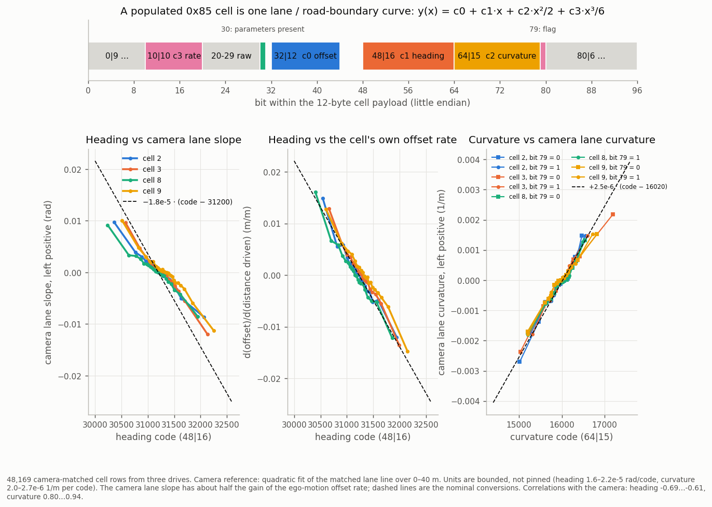
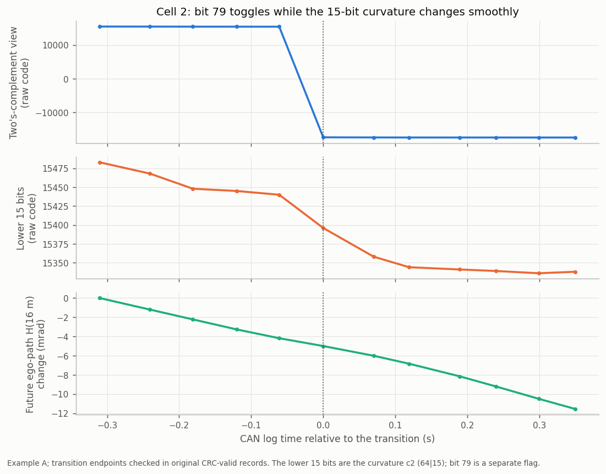

# 04. The metadata record (0x85)

0x85 carries a second segmented record at the radar cycle rate. The first frame starts `10 90`; keeping bytes 1..7 of
each of 21 frames gives **147 bytes**. A fixed marker follows on 0x86.

## Layout

| bytes (Python slice) | content | conf. |
|---|---|---|
| `[0:1]` | `90`, transport length-low byte | ● |
| `[1:21]` | prefix: fine clock (bytes 1-4, LE), counter (bytes 5-6 >> 1), other raw bytes | ● clock and counter |
| `[21:141]` | **ten 12-byte cells**: lane / road-boundary curves (offset, heading, curvature) | ◐ |
| `[141:145]` | CRC-32/ISO-HDLC, little-endian, over `[1:141]` | ● |
| `[145:147]` | trailer, zero | ● |

```python
crc_ok = int.from_bytes(record[141:145], "little") == zlib.crc32(record[1:141])
```

911 / 911 bundled records and 6,967 / 6,967 records across seven full logs pass. `python tools/check_structure.py`
reproduces the check on the bundled samples. `ars510/shell85.py` returns the prefix and the ten raw cells.

## Pairing with the object list

The 0x85 prefix and the 0x80 header share a clock and a record counter:

```python
counter80 = int.from_bytes(record80[5:7], "little") >> 1
counter85 = int.from_bytes(record85[5:7], "little") >> 1
same_cycle = counter80 == counter85 and int.from_bytes(record80[1:5], "little") == int.from_bytes(record85[1:5], "little") // 100
```

This matches 446,371 record pairs across 28 drives, over 99.96% of 0x80 records. Nearest arrival time picks the
neighbouring cycle about a third of the time, so pair by counter.

## Prefix bytes

Bytes `[1:21]` of the record hold more than the clock and counter. Counts are over 677,754 records paired with 0x80 by counter and clock.

| record byte(s) | content | conf. |
|---|---|---|
| 1-4, 5-6 | fine clock and counter (above) | ● |
| 7 (low 4 bits), 15 (bits 6-7) | uniform 4-bit and 2-bit counters | ○ |
| 16 (low 5 bits) | count-like quantity, 2-20 above a fixed `0x20`: correlates with ego speed (non-monotone: mean 3.7 at standstill, 10.4 at 14-22 m/s, 7.5 above 30 m/s), with the number of populated cells (ρ .58) and with 0x80 header byte 13 | ○ |
| 17.2-3, 17.4-5, 17.7, 18.1, 18.3, 18.4, 18.6-7, 19.1-3, 19.4-7 | **inverted copies of the cell "parameters present" flag** of cells 3, 4, 5, 2, 1, 0: the bit is 1 exactly when bit 30 of that cell is 0, 2-4 bits per cell. Cells 6-9 have no copy; the other bits of bytes 17-19 are constant 1. `shell85.prefix_flags_consistent` checks it | ● |
| 9, 11, 13, 14 | zero in 99.1 % of records; sporadic event bytes otherwise | raw |

Bits agree on all 677,754 records for cells 0, 2, 3, 4 and 5 and on all but 238 for cell 1 (a default block with a nonzero `32|12`);
a fresh 114-segment set and 13,934 records decoded independently from original logs agree the same way
([`id85_lane_curve_cells.json`](../data/analysis/summaries/id85_lane_curve_cells.json)).

## Cells

Each cell holds a default block `84 03 F4 01` at payload bytes 6-9 when empty. **Cell bit 30** says whether the
cell holds parameters:

```python
parameters_present = bool(cell.payload[3] & 0x40)   # also ShellCell.parameters_present
```

It equals `payload[6:10] != b"\x84\x03\xf4\x01"` in all 4,466,850 tested cells. The cells change every record
while ego moves, also when the object list is empty.

### Lane / road-boundary curves



A populated cell is one boundary curve, `y(x) = c0 + c1·x + c2·x²/2 + c3·x³/6` in the radar frame, left positive. Bit numbers are little endian inside the
12-byte payload (`ShellCell.offset_code`, `.heading_code`, `.curvature_code`, `.rate_code`, `.curve_flag`):

| bits | field | nominal conversion | conf. |
|---|---|---|---|
| `32\|12` | **c0 offset** at the radar | `(code − 2000) × 0.01` m | ◐ (scale ±10 %, as for object yRel) |
| `48\|16` | **c1 heading**, left-positive tangent | `−1.8e-5 × (code − 31200)` rad per code, zero 31.1-31.3 k per cell | ◐ sign, zero; unit bounded 1.6-2.2e-5 |
| `64\|15` | **c2 curvature**, left positive | `+2.5e-6 × (code − 16020)` 1/m per code | ◐ sign, zero; unit bounded 2.0-2.7e-6 |
| `10\|10` | **c3 curvature rate** d(κ)/ds, offset binary | `+4e-6 × (code − 500)` 1/m² per code | ◐ sign, zero; unit order of magnitude |
| `79\|1` | flag; identical in cells 2 and 3 on every row | set on 79-80 % of cells 2/3 and 43-44 % of 8/9, never in 0, 1, 4-7 | ○ |
| `30\|1` | parameters present | above | ● |

Unpopulated cells hold the defaults 900 at `48|16` and 500 at `64|15`; the conversions apply to populated cells only.

**Heading.** Three references independent of the radar's own objects agree on sign and zero:
* the ego-motion offset rate, `d(c0)/d(distance driven)` from consecutive records and carState speed, falls linearly with the code: binned correlation −0.985…−0.993 and slope −1.63…−1.80e-5 rad/code in cells 2, 3, 8 and 9;
* the camera lane line's fitted slope correlates −0.61…−0.69 with the code and crosses zero at 31,167-31,322; its gain is about half the ego-motion one (shrinkage of the model's lane lines is a likely cause), so the unit rests on the ego-motion reference;
* the radar's own ego-lane assignment (slot `128|3` = 3) for objects at 45-90 m is predicted from the cell-2 / cell-3 curves with AUC .9967 on the offsets alone and .9992 once the heading term is added; the AUC is a plateau at 1.3-2.0e-5 rad/code and falls to .9937 at 4e-5.

**Curvature.** Taking bit 79 out of the old 16-bit word is what makes it a clean quantity: the correlation with the camera lane curvature is +0.94 (cell 2/3, bit 79 clear) and +0.80…+0.91 otherwise, with a zero at 16,010-16,037; the best-correlated cells give 2.1-2.3e-6 (regressing the reference on the code) up to 2.4-2.8e-6 (inverting the regression of the code on the reference) 1/m per code.
Against the gyro curvature (yaw rate / speed) it is ρ 0.70 versus 0.45 for the whole word. The ego-lane assignment is predicted as well from offset and heading alone as with an `x²/2` term, so the radar's lane state appears to use offset and heading.



*A cell-2 high-bit transition checked against original CRC-valid records: the signed-view jump is bit 79 toggling while the lower 15 bits change by a few codes. Counts, limits and the relative-time example:
[`id85_direction_code_structure.json`](../data/analysis/summaries/id85_direction_code_structure.json).*

Replication: 114 further segments (binned heading correlation −0.93…−0.99 in every cell with enough samples, slopes −1.25…−1.85e-5; curvature +0.93…+0.99, slopes +1.9…+2.3e-6 on cells 2/3/8/9) and an independent decode of 14 original logs with this package
([`id85_lane_curve_cells.json`](../data/analysis/summaries/id85_lane_curve_cells.json), table [`lane_cells.parquet`](../data/analysis/lane_cells.parquet)).

**Curvature rate.** `10|10` (the field near 500 on straight roads) tracks the rate of change of the cell's own curvature per metre driven: binned correlation +0.97…+0.99 in cells 2, 3, 8 and 9 (+0.92…+0.97 elsewhere), zero 497-501, 3.5-5.6e-6 1/m² per code in the lane cells; replicated on the fresh drives.

**Which curve is which.** Against the camera's four lane lines (rows where all four have probability above 0.5), cells 0 and 1 follow the **left outer** line (median error 0.17 / 0.14 m), cells 2 and 8 the **left ego** line (0.04 m), cells 3 and 9 the **right ego** line (0.10 m) and cell 4 the **right outer** line (0.41 m); cells 6 and 7 follow the left outer line only 61-76 % of the time. Cells 8 / 9 hold a second estimate of the ego pair
(offset correlation 0.98 / 0.99 with 2 / 3) and share the fields `20|4`, `24|4`, `28|1` and `44|4` on every row; cells 2 and 3 share bit 79. The camera-quality-like fields (`24|4` low bits = 1 and bit 27 set, `20|4` ≈ 5, `28|1` = 0, `44|4` = 2) go with a camera lane probability ≥ 0.99.
Against openpilot's lane model the median offset error is 3-10 cm:

| drive group | cell 2 | cell 3 | cell 8 | cell 9 |
|---|---|---|---|---|
| A | 0.036 m | 0.096 m | 0.036 m | 0.095 m |
| B | 0.033 m | 0.070 m | 0.030 m | 0.067 m |
| C | 0.031 m | 0.065 m | 0.030 m | 0.063 m |

*24,878 CRC-valid records from 25 segments, speed ≥ 5 m/s, lane probability ≥ 0.8, cells with parameters present
([summary](../data/analysis/summaries/id85_lane_lateral_candidates.json)).*

Each cell follows a nearby boundary, and that boundary can change: during a lane change or at a turn pocket a cell
can keep describing the old or a different boundary for a while, and single-cycle spikes of a few metres occur.
Treat a cell as "a nearby boundary" whose identity can change. Cells 6 and 7 are candidates for road-edge curves (they follow openpilot's road-edge estimate within a drive).

The remaining cell fields (`0|9`, `20|4`, `24|4`, `44|4`, `80|6`) are raw. `0|9` behaves like a distance (it falls about 4.1-4.4 codes per metre driven in monotone runs of cells 8 and 9); `80|6` is confidence-like (0-50; cells 1 and 4 take only 0, 15 and 50).

**For in-path decisions, use the yaw-rate path.** To decide whether an object 30-100 m ahead is in the ego lane,
the car's own curvature, y(x) = (yaw rate / v) · x² / 2 with the yaw rate from Toyota 0x24, is scored against the path
the car later drove:
- it classifies 92.6% of objects correctly, against 84.5% for a straight |yRel| window;
- missed in-lane objects drop from 26% to 11%, and at 60-100 m accuracy rises from 82% to 88%;
- adding the raw signed-word view leaves accuracy at 92.5%.

Numbers: `in_path_prediction` in [`decode_references.json`](../data/analysis/summaries/decode_references.json).
