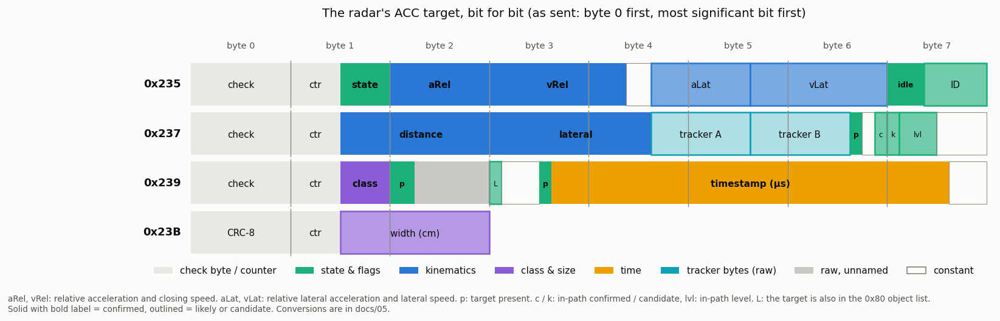

# 05. The radar's ACC target and support messages

Besides the object list, the radar sends its own ACC target, target summaries, timing and status on the private radar–camera link.
Bit numbers for the big-endian frames below treat the 8-byte frame as one big-endian integer (bit 0 = LSB of byte 7),
matching [`dbc/ars510_radar_bus.dbc`](../dbc/ars510_radar_bus.dbc) and `ars510.support`.

## The radar's ACC target (0x235 / 0x237)

At **50 Hz** (content updated every 60 ms radar cycle), this stream reports the one target the radar's own ACC logic follows.
The two frames are mapped bit for bit: field boundaries come from the carry structure of 2 M frames, and while idle
every numeric field sits at its zero code (100, 1024, 100, 1024, 2000, 0).



| field | conversion | conf. | DBC signal |
|---|---|---|---|
| closing speed | 0x235 bits 29-39: `(code − 1024) × 0.125` m/s, negative = closing | ● | `A235_ACC_TARGET_VREL` |
| relative acceleration | 0x235 byte 2: `(code − 100) × 0.125` m/s², positive = opening | ● | `A235_ACC_TARGET_AREL` |
| distance | 0x237 bits 39-51: `code × 0.025` m | ● | `A237_ACC_TARGET_DISTANCE_CODE` |
| lateral position | 0x237 bits 27-38 (12 bits): `(code − 2000) × 0.01` m, left positive | ● layout, ◐ unit | `A237_ACC_TARGET_LAT` |
| lateral speed | 0x235 bits 8-18: `(code − 1024) × 0.0125` m/s, left positive | ◐ | `A235_ACC_TARGET_VLAT` |
| target identity | 0x235 bits 0-4: constant while the radar follows one target | ◐ | `A235_TARGET_ID5` |
| in-path state | 0x237 bit 8 confirmed, bit 7 candidate, bits 4-6 level 5 / 4 / 3 / 2 | ◐ | `A237_IN_PATH_*` |
| relative lateral acceleration | 0x235 bits 19-26: `(code − 100) × 0.125` m/s² (nominal unit), left positive | ◐ | `A235_ACC_TARGET_ALAT` |
| tracker bytes | 0x237 bits 19-26 and 11-18: rise while the target accelerates or brakes | ○ | `A237_TRACKER_A8`, `_B8` |
| target present | 0x235 byte-1 low nibble = 5 (1 = idle, bytes 2-7 `64 80 0B 24 00 FF`); 0x237 bit 10 | ● | `A235_STATUS_MUX4` |

`support.parse_acc_target(data235, data237)` returns all of them as one `AccTarget`; the single-field helpers
(`parse_acc_target_vrel`, `_arel`, `_position`, `_range_code`) read the same bits.

- **Lateral position.** The twelfth bit is the real least-significant bit: it flips more often than the eleventh, its
  carries stay inside the field, and against the 0x192 lateral of the same target the residual is half a code with it and a
  full code with it inverted. One summary (or object-list) lateral code is exactly 1.500 of these codes (344 k rows,
  correlation 0.9999), which ties the two lateral units together ([06](06_accuracy.md#lateral-position)).
- **Lateral speed.** Over two-second windows the lateral position changes by 1.21 codes per code-second of this field
  (correlation 0.97 on a 114-segment set; 1.03-1.24 on the larger, noisier 700-segment set), so one code is about
  1.2 cm/s; 0.0125 m/s is the nominal value.
- **Relative lateral acceleration.** Same width and zero code as the longitudinal field. It mirrors ego's own lateral
  acceleration (−8.2 codes per m/s² of yaw rate × speed: about −1.0 at 0.125 m/s² per code) and adds 3.8 codes per m/s of
  the target's lateral speed. The two terms explain 76 % of its variance and 89 % in curves; it lags the gyro.
- **In-path state.** Confirmed on 94 % of target frames. Otherwise the target is a candidate at level 4, 3 or 2; the level
  moves to the neighbouring value only, and the median lateral offset grows from 0.3 m (level 5) to 0.7, 1.6 and 2.2 m.
- **Tracker bytes.** The first sits at 35-36 on a steady target, 44-50 while the target accelerates harder than about
  1.2 m/s² and a median of 48-74 while it brakes (harder braking, higher value); the second is about 86 for a stopped
  target, 128-135 for a steady mover, and climbs
  toward 240 within half a second of a maneuver. They follow the target's own acceleration (also when the relative speed
  is still zero because ego brakes with it) and are explained to 78-88 % by the target's kinematics: the tracker's
  maneuver terms.

### Units of the ACC target

| check | result |
|---|---|
| stopped lead vehicles (true closing speed = ego speed), 97 tracks on 26 drives | closing speed = 1.03 × ego at 0.125 m/s per code; same on 16 held-out tracks |
| fine distance against the 0x680 object range on the same car, 1,872 frames | 0.02500 m per code, +0.01 m, median residual 0.02 m |
| closure inside the frames, 2,905 two-second windows | 5.03 distance codes per speed-code-second |
| closing speed against the slope of the fine distance, 1,862 windows | 0.99 (IQR 0.97-1.00); 0.99 on held-out drives |
| relative acceleration against the change of the closing speed, 222 k two-second windows | 0.997 speed codes per code-second (1.002 on other drives): 0.125 m/s² per code |
| lateral code against the 0x192 lateral code of the same target, 344 k rows | 1.500 (other drives 1.499-1.502) |

- **Relative acceleration** follows the derivative of the closing speed about 0.1-0.2 s behind it.
- The **object-list** relative speed (`64|10` minus ego) is 0.87 of the same distance slope (IQR 0.77-0.96, every
  drive 0.78-0.94): on a moving car it reads about 13% smaller in magnitude than the ACC target does.

Numbers: [`acc_summary_units.json`](../data/analysis/summaries/acc_summary_units.json), [`acc_target_frames.json`](../data/analysis/summaries/acc_target_frames.json).

### A second velocity estimate from the radar itself

The ACC target is matched to an object by position (its 0.025 m distance and 0.01 m lateral against the track's `dRel`
and `yRel`). When the object list's vRel and the ACC target's closing speed
differ by more than 3 m/s, **the vision lead sides with the ACC target 86-90% of the time** (discovery 90%, n = 715;
confirmation 86%, n = 421, route-bootstrap 79-99%). In the bundled drive-E sample the object's vRel falls to −5.9 m/s
while the ACC target stays at −0.75 to −0.9 m/s ([12](12_kalman_filter.md#the-model)).

**Who sends it: the radar** (◐) ([summary](../data/analysis/summaries/acc_sender_clock.json)):

- It starts 0.2 s after power-up, while openpilot first transmits at about 4 s ([01](01_radar_bus.md#power-up)), and
  stays with cruise disengaged.
- Every ECU's periodic messages carry its own crystal error. On four drives the radar link splits into two clocks:
  - **radar:** 0x100/0x103, 0x190-0x196, 0x198, 0x202, 0x24F, 0x680, and **0x235/0x237**, which keep a fixed phase to
    the radar's 0x190 like its own 0x191 and change content every 60 ms radar cycle;
  - **camera:** 0x101/0x102, 0x180, 0x197, 0x210, 0x240-0x248, 0x24D, 0x500/0x501, drifting 16-57 ms per 30 min against
    the radar.
- The camera feeds the radar lane-like data, so camera input to the radar's target choice is possible. Treat it as the
  radar's own filtered ACC target, associated with an object-list track by position.


*Phase of each message against the radar's 0x190, per minute of one drive. Logger timestamps come in ~10 ms USB batches, so camera drift appears as 10 ms steps.*

**How good it is:**

- During disagreements it stays smooth and consistent with the track's range while the object-list velocity drifts
  (closer to the range slope in 76% of 51 episodes; median error 1.2 vs 3.3 m/s).
- It carries information beyond the object list: the object list's own fields and their recent history explain about
  41-47 % of its disagreement with the ACC target
  ([07](07_velocity_excursions.md#far-range-excursions-match-the-reported-velocity-error-scale)). The `fused` profile
  therefore feeds the ACC target in as a speed measurement ([12](12_kalman_filter.md#the-model)).
- Against the [optical reference](07_velocity_excursions.md#compared-with-an-optical-reference) its error scale is
  about 0.31 / 0.54 m/s at 10-40 / 40-70 m, against 0.55 / 1.07 for the object list (error scales against that
  reference). It is present in 38% of the optical-reference windows at 40-130 m and 11% of those beyond 80 m
  ([summary](../data/analysis/summaries/video_truth.json)).

### Class, width and timestamp (0x239 / 0x23B)

Two companion frames at the same 50 Hz describe the same target (`support.parse_0x239`, `parse_0x23b`):

| frame | bits | field | conf. |
|---|---|---|---|
| 0x239 | byte 1 low nibble | **target class**: 1 car, 2 truck; 0, 4, 5, 6 other; 7 no target | ● 1 / 2, ○ others |
| 0x239 | bit 39 | the target also has an object in the 0x80 list | ◐ |
| 0x239 | bit 35 | target present | ● |
| 0x239 | bits 3-34 | **microsecond timestamp** of the radar cycle the target data belong to (the 0x190 clock) | ● |
| 0x23B | byte 1 low nibble + byte 2 (12 bits) | **target width in cm** | ◐ |

- **Class.** Class 1 goes with the car template of the target summaries below and class 2 with the truck template in every
  matched frame (329,612 of 329,612; 18,974 of 18,974 on other drives). Classes 0 and 6 appear while ego is stopped
  behind something within a few metres (6 with a car-sized width, 0 with a width of 10-50 cm); classes 4 and 5 carry a
  120 cm width and sit 1-1.5 m off the path.
- **Width.** Zero exactly while there is no target. The car class reads 140-220 cm (median 171, clipped at 140), the truck
  class 200-280 cm (exactly 200 on 97 % of its frames); cars read about 175 cm inside 30 m and 165 cm at 90 m.
- **Object-list flag.** Set on 88-95 % of target frames when the object list holds one to four objects and on 0.2 % when
  it is empty; 99 % when an object-list track sits at the target's position.
- **Timestamp.** Equal to the 0x190 timestamp in 73 % of frames and within one cycle in 99.8 % (the 50 Hz frames can
  arrive before or after the cycle header). It says which radar cycle a 0x235 / 0x237 update belongs to.

## 0x191-0x194: selected-target summaries

Two target-summary pairs: 0x191 with 0x192, and 0x193 with 0x194. Each pair describes one target of the radar's
internal tracker: 0x191 / 0x193 its lifecycle and class, 0x192 / 0x194 its position.

**0x191 / 0x193** (8 bytes, sentinel `FE FE FE FC FC FF FE FF`):

| bits (LE) | field |
|---|---|
| `1\|7` | score: 91-100 active, 127 none |
| `9\|7` | target age in cycles, saturates at 126 |
| `26\|6` | pair-local target code; can move between pairs; every value 0-63 occurs in active frames |
| `17\|7` | 100 while a target is present |
| `34\|6`, `49\|7`, `56\|8` | **class template** in 0.1 m: width, a height-like size and length. 18:15:45 for cars, 22:23:120 for trucks |
| `43\|5` | counter that grows with target age and saturates at 30 (about 20 at age 10-20) |

The template is the target's class: when the ACC target is this summary target, 0x239 reports class 1 with 18:15:45 and
class 2 with 22:23:120 in every frame, and the object list's own class for a class-2 target is "large vehicle" on 92 % of
20,394 matched frames. Most active frames use 18:15:45 or 22:23:120 (607,999 of 608,186); the remaining 187 frames contain
28 further tuples such as 25:15:20.
`support.parse_0x191` returns score, age, code, the template in metres and the counter.
[Aggregate evidence](../data/analysis/summaries/selected_target_descriptors.json),
[`acc_target_frames.json`](../data/analysis/summaries/acc_target_frames.json).

**0x192 / 0x194** (4 bytes, sentinel `00 FF 00 FF`):

| bytes | field |
|---|---|
| 0-1 | big-endian 13-bit **distance**: `(code − 160) / 16` m, the object list's encoding (●; 0.0625 m per code, −10 m against the 0x680 object range, median residual 0.05-0.07 m over 9-148 m) |
| 2-3 | big-endian 13-bit **lateral position**: `(code − 2048) × 0.015` m, left positive, the object list's encoding (● layout, ◐ unit; median residual 0.01 m) |

Each summary is therefore the position of one target of the radar's internal tracker. Keep all 13 bits of the second
word (it crosses 4096 continuously).

**They come from the radar's smooth internal tracker.** The speed from a 1 s slope of the 0x192 range matches the radar's
ACC speed when both describe the same car (correlation 0.98, median difference 0.18 m/s). During object-list velocity
excursions it stays with the ACC speed in every tested cycle (490 of 490 for 0x192, 98 of 98 for 0x194), and against
a camera optical reference it is closer than the object list out to about 80 m (false closings > 2.5 m/s at 60-80 m:
14.9 % → about 10 %; closer in 97 % of object-list false closings). Unlike the ACC target, the summaries often describe
far cars: present without an ACC target at a median 60 m, half of them beyond 60 m
([`summary_tracks.json`](../data/analysis/summaries/summary_tracks.json)). They carry position only, so a speed comes
from the range slope and lags by about half a second.

`parse_0x192()` returns the raw codes plus `Target192.d_rel` and `Target192.y_rel` in metres (0x194 has the same
layout). It returns `None` for a short payload or the exact whole-frame sentinel. The fork build can attach each summary
to the object-list track at its position (range within 15 %, lateral within 1 m) and use its range slope as a speed
measurement up to 80 m: an option, off in `fused` and on in `colored`
([12](12_kalman_filter.md#what-the-summaries-do)).

## 0x190: cycle header

- Byte 0 = count << 2 | 2: the **number of target summaries** in this cycle (0, 1 or 2). It equals the number of
  non-sentinel 0x191 / 0x193 frames in 681,864 of 681,864 cycles; with one summary it is always the 0x191 / 0x192 pair.
- Bytes 2-5: big-endian **microsecond timestamp** (`support.parse_0x190`).
- Byte 6 high nibble: **cycle counter** mod 16, +3 per cycle on more than 99.996% of cycles. Use it to detect dropped
  cycles.

## 0x195 / 0x196: event pair

Exact idle payloads account for **99.67% of recorded frames** in a 700-segment census (1,365,236 frames; 169 groups
of non-idle paired frames, including initialization). 0x195 bits 18-27 (MSB-first) form one 10-bit code:

```python
q10 = ((payload[2] & 0x3f) << 4) | (payload[3] >> 4)   # 510 when idle
```

In 59 of 60 changes where the low seven bits move by more than 64 codes, the high bits move by one in the opposite
direction: a carry, so the ten bits are one field. Non-idle codes span 391–558. Code 510 also occurs in 1,202 of 2,215
non-idle samples, so recognise idle frames by the whole payload. The DBC keeps the remaining sub-fields as raw codes.

**The event pair behaves like a short-time-to-collision state (◐).** Across 700 segments, compared with matched moving moments:

| | non-idle 0x195 frames | matched moving moments |
|---|---|---|
| closing in-path lead with time-to-collision < 4 s | **41%** | 0.8% |
| in-path lead distance, median | 18 m | 36 m |
| brake pedal pressed | 67% | 18% |
| accelerator pressed | 12% | 51% |

85% of event frames occur with both the stock cruise and openpilot longitudinal control off. `q10` leads the car's
own deceleration by 0.5-1 s (r = 0.39-0.56 on three drive partitions, about 0.004-0.008 m/s² per code). The reading:
a pre-collision / brake-assist deceleration quantity (◐). Counts and relative-time example: `data/analysis/summaries/event_pair_carries.json`.


## 0x240-0x248: context frames

0x240, 0x241, 0x244 and 0x245 are sent by the camera and share a **rolling phase 1-7** in byte 0 bits 5-7 (0 at startup).
By day their bodies hold a default payload (`00 10 01 00 10 01 00`). **At night 0x240 and 0x244 carry light-source
records**: they leave the default in every drive that starts after dark and in none that ends before dusk (71 of 698
one-minute segments; 35 of 114 on a second set, ramping in over three minutes at dusk). Each frame holds two records of
{type nibble, 3 flag bits, 13-bit signed value, 8-bit value}; the two records of 0x244 share the 8-bit value. One record
kind sweeps from small to large values while its byte falls from 255, as an approaching light does. 0x248 byte 2 is 1 by day and 0, 2 or 3 at night and carries startup and event bits with the same phase.

The night mode matters for the object list: two slot fields change with it ([03](03_slot_fields.md#camera-association)).

## Startup and readiness

| signal | booting | running |
|---|---|---|
| 0x101 byte 0 | `0x1D` | `0x11` |
| 0x197 bit 8 | 0 | 1 (60 ms after 0x101 switches) |
| 0x24F bit 6 | 0 | 1 |

All three switch once and stay, so they are a direct "radar running" signal and a radar-reboot detector. 0x101 and
0x197 are sent by the camera and follow the first 0x80 record by 0.14 s and 0.20 s on 27 of 27 cold starts (spread
7 and 14 ms): they behave as the camera's acknowledgement of the object list (◐).

## 0x680: single-object stream

Every 0.5 s the radar reports **one object from its function-level tracker**, likely the same smooth tracker that feeds
the ACC target (◐). `support.parse_0x680` decodes it (big-endian fields, MSB-first start | length):

| field | reading | conf. |
|---|---|---|
| `0\|8` | selector: 0 / 1 mostly stationary objects, 3 mostly same-direction vehicles | ◐ |
| `8\|13` | longitudinal distance, 1/32 m per code (0-256 m) | ● |
| `21\|11` signed | lateral position, 0.015 m per code (the object list's unit), left positive | ◐ |
| `32\|10` − 512 | speed over ground, 0.15 m/s per code | ◐ |
| `42\|6` | **motion flags**: bit 0 stationary, bit 1 oncoming, bit 3 seen moving (1 = stationary object, 8 = moving vehicle, 9 = stopped vehicle) | ◐ |
| `48\|8` − 128 | lateral speed over ground, about 0.13-0.18 m/s per code (0.15 nominal) | ◐ |

- **Distance scale:** stationary objects close at ego speed with 31.9 codes per metre (672 segments; 32.0 on 84
  held-out segments).
- **Speed:** on 1,872 frames of the 672-segment corpus where 0x680 and the ACC target are on the same vehicle, the two
  speeds differ by 0.21 m/s (median absolute). When the object list is more than 2 m/s away from the ACC target, 0x680 stays within 1 m/s of
  the ACC target in 50 of 51 frames.
- **Motion flags:** bit 0 is set on 99 % of objects slower than 0.5 m/s over ground and on 1 % of moving ones; bit 1 on
  98 % of objects approaching faster than 3 m/s and on 1 % of the others; bit 3 on 86 % of same-direction movers and on
  10 % of stationary objects, the stopped vehicles (on other drives the three shares are 98 %, 97 % and 72 %).
  `Object680.stationary`, `.oncoming` and `.seen_moving` expose them.
- **Lateral speed:** the code is 0 on stationary objects even while ego turns, so it is over ground like `74|10` of the
  object list.
- **Which vehicles it reports:** of its moving-vehicle frames (13 % of frames while driving), 30 % are the ACC target,
  28 % a summary target and 42 % another vehicle of the radar's internal tracker (median range 105 m, mostly outside the
  ego lane). On the ACC target its speed equals the ACC speed (median difference 0.09 m/s on the 2,004 frames of the
  vehicle-witness set).
- **A witness for far tracks:** against it, the object-list track at the same position reads more than 2.5 m/s too closing
  on 1 % of frames below 40 m, 5 % at 40-60 m, 17-19 % at 60-110 m and 44 % at 110-170 m, and its range is a median 3 m
  short at 60-110 m and 14 m short at 110-170 m ([06](06_accuracy.md#distance), [07](07_velocity_excursions.md)). The
  fixes are sparse (about one a minute on tracks that have neither the ACC target nor a summary).
- **Content while driving:** a stationary roadside object in 83% of frames (typically 8 m to the side), a
  same-direction vehicle in 13%, an oncoming one in 3%. While driving the 0x80 object list drops most new stationary objects
  ([02](02_object_list.md#what-the-radar-lists)); 0x680 reports them, one at a time.
- **Idle** payload `00 00 08 00 80 00 80 0A` appears in 0.12% of frames above 5 m/s and never for longer than 1.0 s
  in 7.8 h, so a long idle run while driving is a candidate "radar sees nothing" indicator
  ([10](10_research_directions.md)).

Numbers: [`object_stream_0x680.json`](../data/analysis/summaries/object_stream_0x680.json).

## Other frames

- **0x202:** counter in byte 1 high nibble (+1 per frame); byte 0 is a fixed function of the counter (map in the DBC): a CRC-8 with
  polynomial 0x1D and the counter nibble processed first fits all 16 payloads (the fit identifies the counter dependence; the other
  bytes are constant).
- **0x23B (50 Hz, 3 bytes, in received order):** byte 0 = **CRC-8** (polynomial 0x1D, MSB first, init 0, xor 0x59) over the
  bit stream [counter 4 bits][0000][low nibble][byte 2]; byte 1 = rolling counter in the high nibble; the low nibble and
  byte 2 are the ACC target width ([above](#class-width-and-timestamp-0x239--0x23b)). 3,615 of 3,616 distinct payloads over
  2.05 M frames pass, and 30,056 of 30,058 frames on fresh drives (the exceptions are the startup frame `00 0f ff`).
- **0x240 / 0x244 / 0x248:** camera-sent context frames ([above](#0x240-0x248-context-frames)).
- **0x210:** copy of Toyota road-sign-assist data (speed-sign presence, `RSA1.SPDVAL1`, `RSA3.TSRMSW`).
- **0x500 / 0x502:** unit-specific constants (redacted in the shared DBC; compare yours) and two slowly drifting codes
  in 0x502 (temperature-like behaviour).
- **0x501:** status nibble.
- **0x180, 0x198, 0x23D:** constants.
