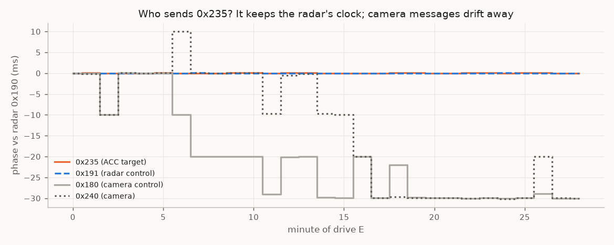
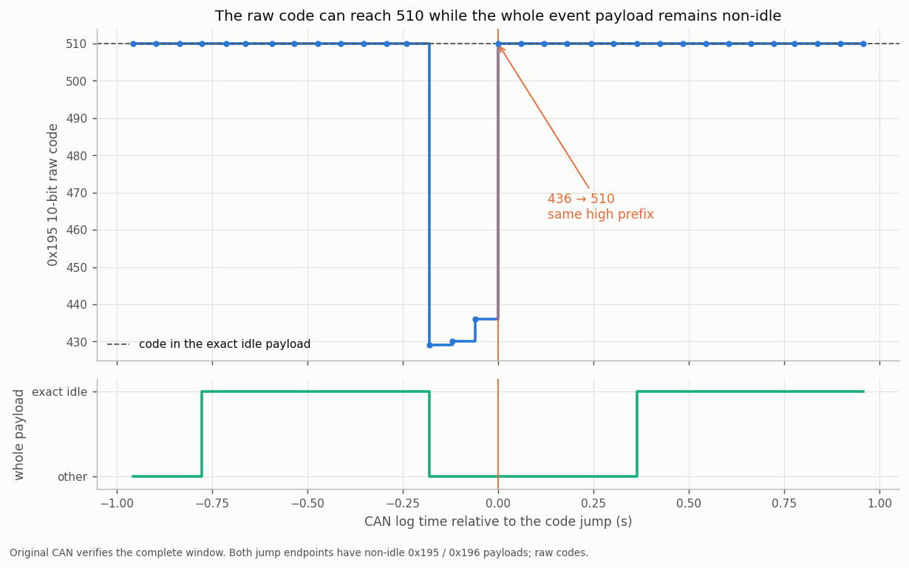

# 05. The radar's ACC target and support messages

Besides the object list, the radar sends its own ACC target, target summaries, timing and status on the private radar–camera link.
Bit numbers for the big-endian frames below treat the 8-byte frame as one big-endian integer (bit 0 = LSB of byte 7),
matching [`dbc/ars510_radar_bus.dbc`](../dbc/ars510_radar_bus.dbc) and `ars510.support`.

## The radar's ACC target (0x235 / 0x237)

At **50 Hz** (content updated every 60 ms radar cycle), this stream reports the one target the radar's own ACC logic follows:

The raw field domains and closing/opening direction are retained (●). The conversions below are nominal
reverse-engineered calibrations (◐), supported by conditional comparisons with native objects and vision and by
internal consistency. Absolute physical units require an independent metric reference or a matching interface
definition. See [unit conventions](../data/analysis/summaries/acc_unit_conventions.json).

| field | retained conversion | DBC signal / parser |
|---|---|---|
| closing speed | 0x235 bits 29-39: `(code − 1024) × 0.1` m/s, negative = closing | `A235_ACC_TARGET_VREL`, `parse_acc_target_vrel` |
| relative acceleration | 0x235 byte 2: `(code − 100) × 0.1` m/s², positive = opening | `A235_ACC_TARGET_AREL`, `parse_acc_target_arel` |
| lateral position | 0x237 bits 28-38: `code × 0.01667 − 16.70` m, left positive | `A237_ACC_TARGET_LAT` |
| distance, coarse | 0x237 bits 47-51: `code × 5.26 + 9.6` m | `A237_ACC_TARGET_DIST_COARSE` |
| distance, fine | 0x237 bits 39-51: 0.02 m per code for changes | `A237_ACC_TARGET_DISTANCE_CODE`, `parse_acc_target_range_code` |
| target present | 0x235 byte-1 low nibble ≠ 1 (1 = idle, bytes 2-7 `64 80 0B 24 00 FF`) | `A235_STATUS_MUX4` |

How these conventions compare:
- **Closing speed** correlates with the matched object's vRel at r = 0.78 / 0.82 (discovery / confirmation drives)
  and has median difference 0.00 m/s against openpilot's vision lead under the retained conversion. These are
  conditional reference comparisons.
- **Relative acceleration** gives the same binned curve against the derivative of the closing speed on discovery,
  confirmation and further drives (r 0.57 / 0.62 / 0.83; slope ≈ 1 at 0.1 m/s² per code), about 0.1-0.2 s behind it.
- **Fine distance:** using the assumed velocity scale of 0.1 m/s per code, two-second integral closure gives a
  confirmation median of 0.0198 m per range code on 565 windows. This establishes the relative range/velocity
  normalization: multiplying both scales by the same factor preserves closure. The parser retains 0.02 m per code
  for changes; a physical range origin and absolute scale require independent calibration.
- **Lateral** correlates with the matched object at r = 0.97.

The acceleration comparison also differentiates velocity under the retained 0.1 conversion. It supports the
relative normalization and filtered acceleration interpretation; it shares the velocity scale assumption.

### A second velocity estimate from the radar itself

The ACC target is matched to an object by position. When the object list's vRel and the ACC target's closing speed
differ by more than 3 m/s, **the vision lead sides with the ACC target 86-90% of the time** (discovery 90%, n = 715;
confirmation 86%, n = 421, route-bootstrap 79-99%). Through the drive-A false closing ([07](07_velocity_excursions.md)),
the object's vRel swung to −6 m/s while the ACC target stayed at +1.3 m/s.

The stream starts 0.2 s after power-up, before openpilot transmits, tracks the lead and remains present with cruise
disengaged. It is not openpilot's: openpilot never transmits on the radar bus (the logs hold no bus-1 transmissions
at all) and never sends 0x235 / 0x237 on any bus, and the stream runs on the radar's clock, not on the clock of
openpilot's 100 Hz loop. **The radar sends it** (◐): every periodic task inherits its ECU's crystal error, and on four drives the
link's messages split into two clocks. The radar clock carries 0x100/0x103, 0x190-0x198, 0x202, 0x24F and 0x680;
the camera clock, shared with the camera's own car-side messages, carries 0x101/0x102, 0x180, 0x197, 0x210,
0x240-0x248, 0x24D and 0x500/0x501. 0x235/0x237 keep a fixed phase to the radar's 0x190 exactly like the radar's
own 0x191, while camera messages drift about 15 ms per 30 min against it, and their content changes every third
frame (the 60 ms radar cycle) ([summary](../data/analysis/summaries/acc_sender_clock.json)). The camera feeds the radar
lane-like data, so camera input to the radar's target choice is possible; treat the stream as the radar's own
filtered ACC target with conditional association to an object-list track.



*Phase of each message against the radar's 0x190, per minute of one drive. Logger timestamps come in ~10 ms USB batches, so camera drift appears as 10 ms steps.*

During disagreements this ACC velocity stays smooth and consistent with the track's range while the object-list
velocity drifts (closer to the range slope in 76% of 51 episodes; median error 1.2 vs 3.3 m/s). A Kalman filter of
the object-list velocity weighted by the uncertainty codes does not reproduce it, so the radar's ACC tracker uses
information the object list does not expose. [08](08_openpilot_integration.md) uses it as a cross-check.

The selected matched-window [optical comparison](07_velocity_excursions.md#compared-with-an-optical-reference)
favours ACC velocity. A four-estimator error decomposition reports ACC scales of 0.31 / 0.54 m/s at
10–40 / 40–70 m, versus 0.55 / 1.07 for the native object list. These are conditional model outputs:
error covariance, physical identity and reference accuracy must be bounded before treating them as sensor
precision or inverse-variance weights. The reported ACC/vision error correlation is about 0.5; this does not
identify the producing ECU or establish independence from looming. ACC is present in 38% of the selected
40–130 m windows and 11% beyond 80 m ([summary](../data/analysis/summaries/video_truth.json)).

Its availability differs from the current native list. Across 13 discovery drives, **58,553 active 235/237 pairs**
coincide with a fresh valid native record whose header and all slots report zero objects; **204 reporting spans
last at least 1 s**. Most are close to the coarse-range floor and at low ego speed. Separate listing or coasting
can explain this; continued reporting alone does not establish a new physical target or camera-independent
motion. [Availability evidence and definitions](../data/analysis/summaries/acc_target_availability.json).

**Coverage** is the limit: the target is present on 57% of radar-lead moments, and on 5% beyond 80 m, where velocity
excursions concentrate. The interface offers it as an option (`acc_target_clip_mps`, off by default); see
[07](07_velocity_excursions.md#how-the-filtering-works-step-by-step) for its measured effect.

## 0x191-0x194: selected-target summaries

Two target-summary pairs: 0x191 with 0x192, and 0x193 with 0x194. Their age and code fields describe a pair-local
lifecycle; association with a physical target or a published 0x80 object requires an independent witness.

**0x191 / 0x193** (8 bytes, sentinel `FE FE FE FC FC FF FE FF`):

| bits (LE) | field |
|---|---|
| `1\|7` | score: 91-100 active, 127 none |
| `9\|7` | target age in cycles, saturates at 126 |
| `26\|6` | pair-local target code; can move between pairs; every value 0-63 occurs in active frames |
| `34\|6`, `49\|7`, `56\|8` | descriptor tuple, usually stable; active bounds 18-30, {15,23}, 20-120 |
| `43\|5` | dynamic code 8-30, generally grows with target age |

Across 700 segments, the descriptor tuple changes on 35 consecutive-cycle transitions in five coded runs, while
code and age remain coherent. Most active frames use 18:15:45 or 22:23:120 (607,999 of 608,186); the remaining
187 frames contain 28 further tuples. Treat these as raw descriptors until independent class and dimension
measurements establish their meaning. Code continuity describes a coded run; physical target identity needs an
independent association.
[Aggregate evidence](../data/analysis/summaries/selected_target_descriptors.json).

**0x192 / 0x194** (4 bytes, sentinel `00 FF 00 FF`):

| bytes | field |
|---|---|
| 0-1 | big-endian 13-bit **range** of a target from the radar's internal tracker (◐ ~0.054 m/code on 0x192, ~0.046 on 0x194, scaled to the ACC speed; offsets −5.1 / −12.5 m) |
| 2-3 | full big-endian 13-bit raw summary; preserve bit 12 |

The second word crosses 4096 continuously in retained captures: 4091→4109 and 4083→4098. Preserving all 13 bits
keeps changes of +18 and +15; a 12-bit fold would introduce artificial jumps of −4078 and −4081. These summary
codes provide diagnostics; physical calibration and reliable target association are required before metric output.
[Raw boundary evidence](../data/analysis/summaries/selected_target_descriptors.json).

**They come from the radar's good internal tracker.** The speed from a 1 s slope of the 0x192 range matches the radar's
ACC speed when both describe the same car (correlation 0.90, median difference 0.16 m/s). During object-list velocity
excursions it stays with the ACC speed in every tested cycle (397 of 397 for 0x192, 21 of 21 for 0x194), and against
a camera optical reference it is closer than the object list out to about 80 m (false closings > 2.5 m/s at 60-80 m:
14.9 % → 6.5 %; closer in 97 % of object-list false closings). Unlike the ACC target, the summaries often describe
far cars: present without an ACC target at a median 53 m, 46 % beyond 60 m
([`summary_tracks.json`](../data/analysis/summaries/summary_tracks.json)). They carry range only (no speed field), so
speed needs a slope and lags by about half a second.

`parse_0x192()` returns `Target192.range_code13` and `Target192.field1_code13`, both raw integers (0x194 has the same
layout). It returns `None` for a short payload or the exact whole-frame sentinel. The `fused` profile uses
them as a speed measurement ([07](07_velocity_excursions.md#fused-speed-filter-fused-profile)), the `anchor` profile as a
velocity bound ([07](07_velocity_excursions.md#summary-anchor-in-anchor-up-to-80-m)).

## 0x190: cycle header

- Bytes 2-5: big-endian **microsecond timestamp**.
- Byte 6 high nibble: **cycle counter** mod 16, +3 per cycle on more than 99.996% of cycles. Use it to detect dropped
  cycles.

## 0x195 / 0x196: event pair

Exact idle payloads account for **99.67% of recorded frames** in a 700-segment census: 1,365,236 frames across
34 route groups, with 169 segment-local groups of non-idle paired frames, including initialization. 0x195
bits 18-27 (MSB-first) provide a contiguous 10-bit raw view:

```python
q10 = ((payload[2] & 0x3f) << 4) | (payload[3] >> 4)   # 510 when idle
```

Of 60 changes where the historical seven-bit part moves by more than 64 codes, 59 have the opposite unit change
in the high prefix. One larger step goes **436 → 510** within the same prefix. This supports using the adjacent
bits together while keeping abrupt steps and state changes distinct from ordinary carries. The matched non-idle
codes span 391–558. Use this 10-bit view for raw diagnostics; field boundaries and physical units need independent
validation.

Code **510 also occurs in 1,202 of 2,215 non-idle, uniquely paired, non-initialization samples**; use the whole
payload to recognise idle bodies. The DBC retains the remaining sub-fields as raw codes.

**The event pair is a short-time-to-collision state.** Across 700 segments, compared with matched moving moments:

| | non-idle 0x195 frames | matched moving moments |
|---|---|---|
| closing in-path lead with time-to-collision < 4 s | **41%** | 0.8% |
| in-path lead distance, median | 18 m | 36 m |
| brake pedal pressed | 67% | 18% |
| accelerator pressed | 12% | 51% |

85% of event frames occur with both the stock cruise and openpilot longitudinal control off. `q10` leads the car's
own deceleration by 0.5-1 s (r = 0.39-0.56 on three drive partitions, about 0.004-0.008 m/s² per code). The reading:
a pre-collision / brake-assist deceleration quantity (◐). Counts and relative-time example: `data/analysis/summaries/event_pair_carries.json`.



## 0x240-0x248: context frames

0x240, 0x241, 0x244 and 0x245 share a **rolling phase 1-7** in byte 0 bits 5-7 (0 at startup). On most drives their
bodies hold a default payload; on some drives 0x240 and 0x244 carry changing payloads, always in the same body class
at the same moments, and 0x244 bytes 4 and 7 are always equal. 0x248 carries startup and event bits with the same
phase. Toyota's camera ECU uses the same address family, so these are likely camera-side context forwarded on the
radar link.

## Startup and readiness

| signal | booting | running |
|---|---|---|
| 0x101 byte 0 | `0x1D` | `0x11` |
| 0x197 bit 8 | 0 | 1 (70 ms after 0x101 switches) |
| 0x24F bit 6 | 0 | 1 |

All three switch once and stay, so they are a direct "radar running" signal and a radar-reboot detector.

## Other frames

- **0x202:** counter in byte 1 high nibble (+1 per frame); byte 0 is a fixed function of the counter (map in the DBC): a CRC-8 with
  polynomial 0x1D and the counter nibble processed first fits all 16 payloads (the other bytes are constant, so only the counter
  dependence is identified).
- **0x23B (50 Hz, 3 bytes, in received order):** byte 0 = **CRC-8** (polynomial 0x1D, MSB first, init 0, xor 0x59) over the
  bit stream [counter 4 bits][0000][low nibble][value 8 bits]; byte 1 = rolling counter in the high nibble (low nibble 0; 1 or
  15 on 74 of 2 M frames); byte 2 = slow 8-bit value (about 171 ± 6 when nonzero; zero on 42 % of frames; meaning
  unreferenced). 3,615 of 3,616 distinct payloads over 2.05 M frames pass, and 30,056 of 30,058 frames on fresh drives (the
  exceptions are the startup frame `00 0f ff`); `support.parse_0x23b` implements it.
- **0x210:** copy of Toyota road-sign-assist data (speed-sign presence, `RSA1.SPDVAL1`, `RSA3.TSRMSW`).
- **0x500 / 0x502:** unit-specific constants (redacted in the shared DBC; compare yours) and two slowly drifting codes
  in 0x502 (temperature-like behaviour).
- **0x680, 0x501:** status nibbles.
- **0x180, 0x198, 0x23D:** constants.
