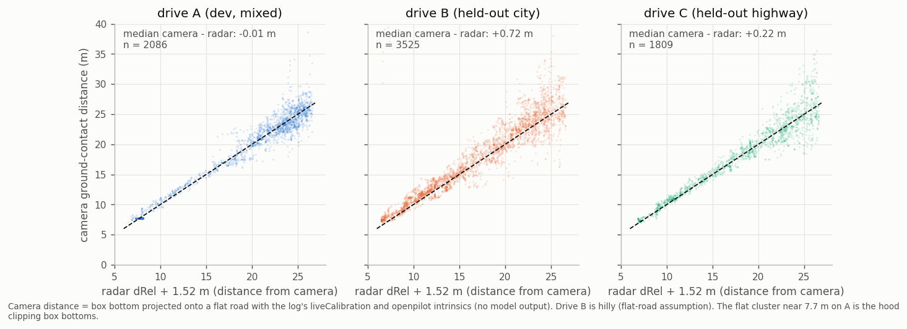
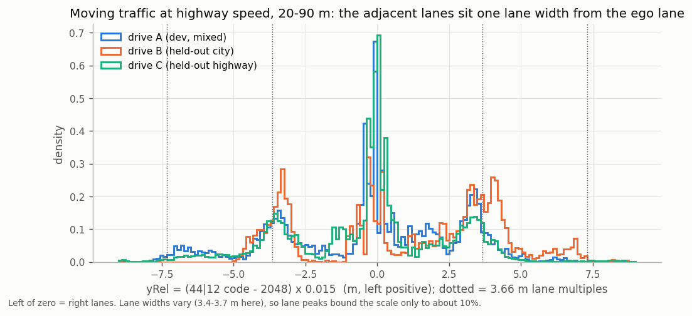
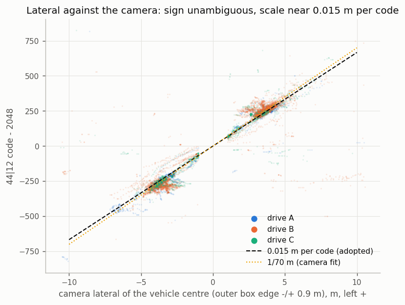
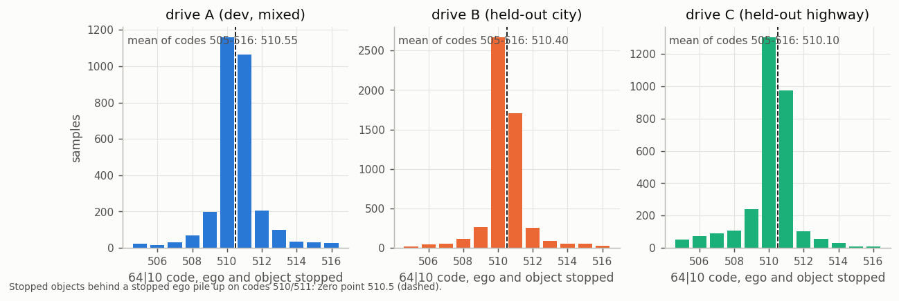
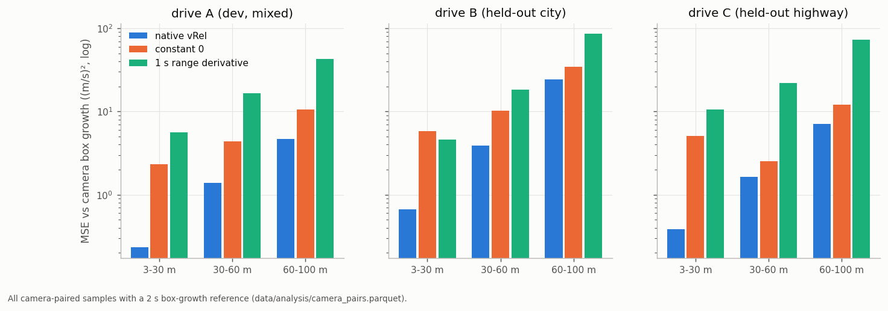
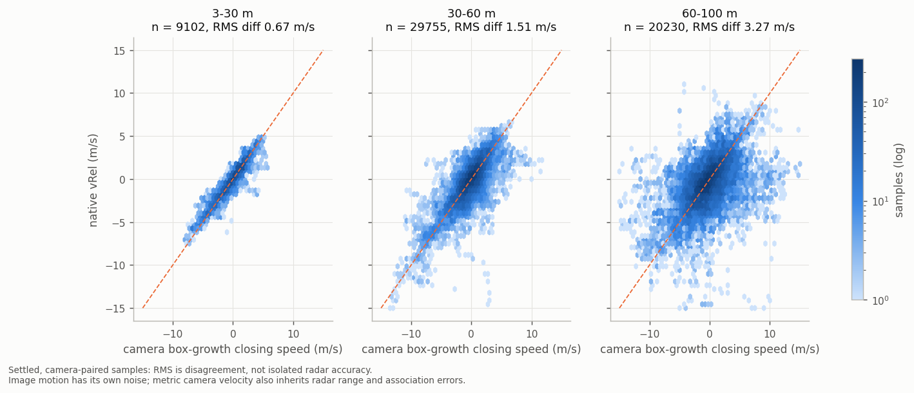
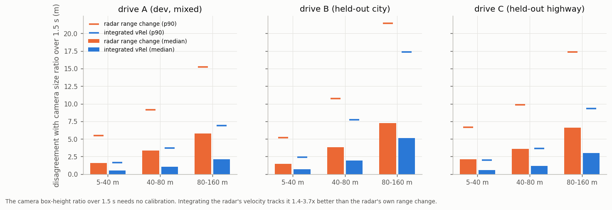
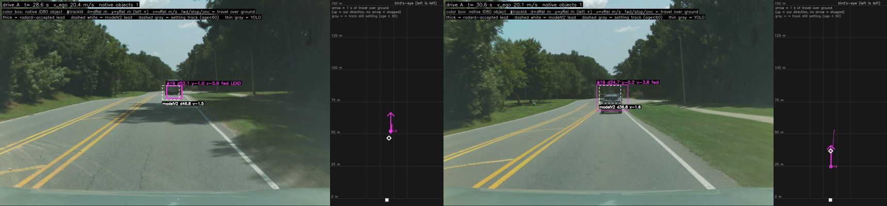

# 06. Accuracy: how well the object fields match the world

Three drives carry the accuracy measurements: **A** (development, 26 min mixed), **B** (held out, 43 min city, often
wet or at night, hilly) and **C** (held out, 24 min highway). The references each measure something different:

| reference | what it gives |
|---|---|
| camera ground contact | absolute distance at 5-25 m: YOLO box bottom projected on a flat road with the log's calibration |
| camera box growth | closing speed from image expansion over 2 s, `−(dRel + 1.52) · d ln(h)/dt` (metric scale from radar range) |
| camera size ratio | scale-free range change: the box-height ratio over 1.5 s equals the inverse range ratio |
| ego odometry | wheel speed, GPS, gyro: velocity scale, and exact vRel of stopped targets (−v_ego) |
| openpilot's vision model | lateral side, far-range distance, lead speed |

## At a glance

| quantity | result |
|---|---|
| **dRel** scale and zero, 5-25 m | slope 1.001 / 0.992 / 0.993 against camera ground contact; zero within 0.2 m on flat roads |
| **dRel** far range | median residual 3.7 m at 60-100 m and 5.1 m at 100-150 m against camera/model consensus |
| **dRel** record to record | walks by about 3% of range (see range walks below) |
| **yRel** side | correct on 97.9-99.3% of off-centre targets against the camera, 99.3% against the vision model |
| **yRel** scale | 1/64 m per code, ±10% (lane peaks 62.8-67.3 codes/m, camera 69-73) |
| **velocity** zero and scale | nominal zero 510.5; fitted scales 0.150 / 0.149 / 0.153 m/s per code from native range slope with GPS ego speed; exact calibration remains bounded |
| **vRel** vs camera | far better than zero or range differencing at every range (table below) |
| **vRel**, stopped targets 5-30 m | RMS 0.54 m/s on settled tracks |
| **trackId** | no ID ever in two slots; 77 of 87 camera-checked tracks within 60 m keep one camera identity ≥ 95% of their life |

## Distance

- **Scale 1/16 m.** Closing rate over relative speed gives 15.93 / 16.01 codes per metre on two calibration routes;
  camera ground contact gives slope 0.99-1.00 on all three drives.
- **Nominal zero at code 160.** The formula is `code / 16 − 10 m`: code 160 decodes to zero. The offset was
  originally fitted against a vision reference. Camera ground contact is consistent within 0.2 m on A and C;
  hilly drive B reads +0.7 m, consistent with a 0.25° camera-pitch error. That comparison assumes openpilot's
  `RADAR_TO_CAMERA = 1.52 m`; a tape-measured gap is needed to pin the physical zero and origin.
- **Far range** (drive A, camera box scale averaged with the vision model where they agree): median absolute residual
  3.7 m at 60-100 m (distance ratio 1.017) and 5.1 m at 100-150 m (ratio 0.979).

## Lateral

- **Left positive, Cartesian.** Codes per metre stay constant across range, and ego-lane objects stay within 0.1 m of
  centre from 15 to 130 m on straight road.
- **Scale 1/64 m, ±10%.** Adjacent-lane peaks at highway speed give 63.9 / 67.3 / 62.8 codes per metre for 3.66 m
  lanes; camera outer box edges give 68.9 / 69.7 / 72.8. A surveyed offset would pin it.

## Velocity

- **Over ground.** See [03](03_slot_fields.md#kinematics).
- **Nominal zero 510.5.** While ego is stopped, the dominant object-code peak is at 510 and 511. Weighted means
  of the four most frequent codes are 510.486 / 510.400 / 510.198. The collection selects host speed below
  0.05 m/s and object age at least 10; it includes moving targets and does not independently select stationary
  reflectors. The peak supports a zero near 510–511. Exact factory zero, bin centring and rounding remain
  provisional; an integer-zero/floor encoding is one possible explanation for the half-code.

  

- **Nominal scale 0.15 m/s per code.** Fitting velocity against native 8 s forward-range slope plus GPS ego speed,
  with a free intercept and a track bootstrap, gives:

  | drive | scale, m/s per code | 90% interval |
  |---|---:|---|
  | A | .15037 | [.1484, .1518] |
  | B | .14869 | [.1463, .1514] |
  | C | .15304 | [.1508, .1550] |

  A and B contain .15, C does not. These are consistency fits at the 1/16 m range scale, not a factory calibration
  (a range-scale or ego-speed error moves them too). Against the ACC target's speed the slope is 0.99 / 1.02 at
  40-80 m.
- **Ego reference.** Toyota 0xB4 reads about 1.5% below GPS and wheel speed in the measured comparisons. Steady
  following against 0xB4 fits .149 m/s per code. The integration profiles use `vground_scale = .149 / .15`, a
  **0.667%** reduction of decoded ground velocity, then subtract 0xB4 ego speed. This empirical alignment is
  separate from the nominal wire scale and does not exactly invert the measured ego-speed discrepancy.
  The best alignment between radar velocity and ego speed is +0.05-0.1 s.

- **Against the camera** (closing speed from box growth over 2 s, all camera-paired samples):

  | drive | band | native vRel | constant 0 | 1 s range derivative |
  |---|---|---|---|---|
  | A | 3-30 / 30-60 / 60-100 m | **0.23** / **1.38** / **4.65** | 2.34 / 4.40 / 10.6 | 5.6 / 16.5 / 42.6 |
  | B | same | **0.66** / **3.90** / **24.3** | 5.79 / 10.2 / 34.2 | 4.6 / 18.2 / 85.7 |
  | C | same | **0.38** / **1.63** / **7.13** | 5.09 / 2.51 / 12.0 | 10.5 / 22.1 / 72.9 |

  *Mean squared difference, (m/s)².*

  

  

- **Random error, by range.** A three-cornered-hat split of radar, camera and range-slope disagreements gives the
  radar's velocity scatter as 0.35-0.56 m/s at 3-30 m, 1.0-1.4 m/s at 30-60 m and 1.6-2.9 m/s at 60-100 m
  (A / B / C: 0.35 / 1.02 / 1.60, 0.56 / 1.44 / 2.90, 0.56 / 1.14 / 1.73). The error is correlated over about
  1-3 s and has heavy tails: these are the velocity excursions of [07](07_velocity_excursions.md).
- **Stopped targets.** Against targets that video and odometry show stopped at 5-30 m, settled tracks read vRel with
  RMS 0.54 m/s (B and C).
- **Timing.** On decelerating leads the radar's speed leads the camera's by 0.2-0.4 s.

### Encoding constants and motion geometry

- **Fixed-point steps:** `16 = 2⁴` and `64 = 2⁶` give 0.0625 m (range) and 0.015625 m (lateral); `2048 = 2¹¹` centres
  the lateral code. The 160-code range bias gives a span of −10 to 245.9 m. The 0.15 m/s velocity step (0.54 km/h)
  has no established derivation from the waveform. Wire steps are not measurement accuracy.
- **Frame:** velocity is over ground in the radar's rotating Cartesian axes ([03](03_slot_fields.md#kinematics)), a
  processed object output, not raw Doppler. Lateral: `vy = dy/dt + ω·x`; in an ideal planar frame
  `vx = dx/dt + v_ego − ω·y`. The radar's internal algorithm and elevation handling are unknown.
- **Optical consistency** ([07](07_velocity_excursions.md#compared-with-an-optical-reference), 791 near windows,
  nominal 0.15 and carState ego speed): relative scale +0.3% (Theil-Sen) to −2.1% (OLS), interval −5.2% to +2.0%.
  Physical calibration to 1% is not established ([summary](../data/analysis/summaries/video_truth.json)).
- **Size of the constants' effect:** zero 510.5 → 512 shifts every speed by −0.225 m/s; 0.15 → 0.149 changes 30 m/s
  by −0.2 m/s; a 3.4% road slope changes 30 m/s by ~0.017 m/s. None of these produces multi-m/s excursions
  ([`encoding_calibration.json`](../data/analysis/summaries/encoding_calibration.json)).

## Range walks

Settled-track range jumps by metres from record to record at 40 m and beyond: about 3% of range, decorrelating within
about 5 cycles. Over 1.5 s, integrating the radar's own velocity tracks the camera's scale-free size ratio **2-4×
better** than the radar's range change does:

| drive | 5-40 m | 40-80 m | 80-160 m |
|---|---|---|---|
| A | 1.6 vs **0.5** m | 3.3 vs **1.0** m | 5.8 vs **2.1** m |
| B | 1.5 vs **0.7** m | 3.8 vs **1.9** m | 7.3 vs **5.1** m |
| C | 2.1 vs **0.6** m | 3.6 vs **1.2** m | 6.6 vs **3.0** m |

*Median disagreement, range change vs integrated vRel.*

*A real closing: the radar lead reads 24.7 m against the vision model's 36.8 m while the camera box grows only 16%.
The radar's velocity was right; its range walked. radard's 25% distance gate rejects the radar lead here.*

So velocity is the radar's strong channel and range its noisy one. Velocity-aided range (`range_fusion_gain = 0.1`)
halves the walks ([08](08_openpilot_integration.md#profiles)). Differentiating range to get velocity is 4-10× worse
than the native velocity field.

## Track identity

- **Within the radar:** a track ID is never live in two slots, and 98.3-98.9% of consecutive same-slot cycles continue
  the same age run.
- **Against the camera** (within 60 m, tracks with a long camera chain): the radar track keeps one camera identity for
  at least 95% of its life on A 21 / 21, B 28 / 36 and C 28 / 30 tracks.
- **Re-link:** `BASE_CONFIG` re-links a track the radar re-initialises within 3.5 s near its predicted position,
  so radard keeps its filter state across short losses.
