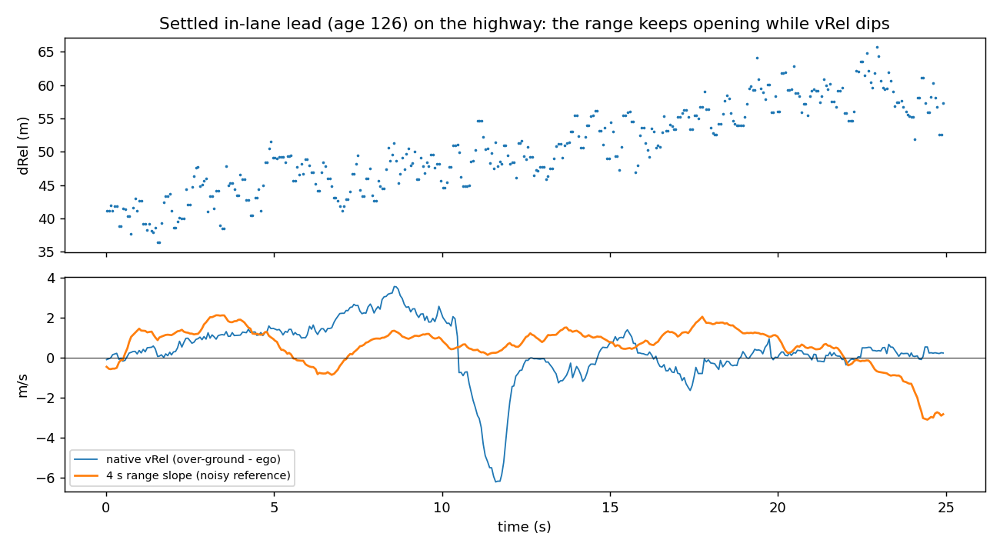

# 06. Known limitations, and the defences that were tried

## 1. vRel excursions (the blocker)

A settled track (age 126, the lead for tens of seconds) sometimes has an over-ground velocity that swings by 3–8 m/s for about 1 s, then returns. The camera and the radar's own range disagree with it: the lead is not braking.

That capture is `data/sample/highway_vrel_excursion_25s.csv.gz`, so you can reproduce it:
- the ego car is steady at 31 m/s;
- the lead is at ~48 m and slowly opening;
- the over-ground speed falls 33.5 → 25.0 m/s and recovers over about 1.2 s.

Replayed through unmodified radard and the long planner, this one excursion produced **a forward-collision warning and −3.5 m/s²**. Its velocity check accepts agreement within 10 m/s **or ground speed above 3 m/s**, so this is not a strict velocity-error safeguard.

What is known about them:
- **No established guard.** The tested fields did not yield a transferable excursion detector. This does not exhaust conditional flags, correct cross-stream associations or uncertainty encodings. The accel-like field `84|10` typically lags.
- **Evidence against a simple bit/scale mistake, not proof of sensor fault.**
  - The old range-selected stationary subset gave 0.4–0.6 m/s RMS; the newer video-selected test is less favourable ([13](13_evidence_review.md)).
  - Its scale comes from the radar's own range.
  - Step statistics did not reveal a simple power-of-two boundary mistake.
  - Decoding the raw bits by hand reproduces the values.
- **Frequency.** On highway drive C, forced-engaged replay gave 18 camera-paired, radar-led braking episodes in 24 min:
  - 7 were confirmed by the camera;
  - 9 overstated a roughly steady lead;
  - **4 braked while the camera showed the lead opening**, and in 3 of those the radar's own range also opened.

  That is about **10 contradicted episodes per forced highway hour**. City drive B had none in 42 forced minutes.
- **Error model** (state-space fit on radar data only): excursions of about 1 m/s SD that grow with range, with a 1–3 s correlation time.
- **Range cannot arbitrate quickly.** The radar's range walks 3–5 m at 50 m with a ~1 s correlation, and excursions last 1–3 s. So confirming or refuting a velocity change from radar range takes about as long as the excursion itself.

## 2. Range walks

Settled-track range jumps by metres from record to record at 40 m and beyond:
- the median absolute deviation (MAD) of range is about 3% of range;
- errors decorrelate within about 5 cycles;
- they have no bit structure.

Over 1.5 s, range change misses the camera's scale-free size change by:

| drive | 5–40 m | 40–80 m | 80–160 m | integrated vRel instead (40–80 m) |
|---|---|---|---|---|
| A | 1.5 m | 3.2 m | 5.6 m | 1.0 m |
| B | 1.3 m | 3.7 m | — | 1.7 m |
| C | 1.9 m | 3.5 m | — | 1.1 m |

Values are medians; p90 at 40–80 m is about 9 m. One extreme case: range fell 49 → 25 m in 1.5 s while the camera and native vRel agreed on about −5 m/s. radard's 25% distance gate rejected it, which is correct behaviour.

For openpilot this matters less than vRel: radard's Kalman filter and the planner lean on velocity. Still, **never differentiate dRel to get velocity**. A 1 s range derivative is 4–10× worse than the native velocity field.

## 3. Young tracks

See [02](02_object_record_0x80.md#young-tracks-are-unconverged). Hold tracks until age ≥ 60, which `OPENPILOT_CONFIG` does. The cost is a ~3.6 s delay before a newly seen car can become the radar lead. radard falls back to vision in the meantime.

## 4. Things the radar doesn't report

- **Stationary objects while ego moves.** A new object with over-ground speed near 0 is deleted at about age 5 (0.3 s) once ego is above about 2-3 m/s. A street lined with parked cars gives an empty object list. Objects first seen moving are kept after they stop. A vehicle that was already stopped when it came into view is therefore not reported. See [14](14_stationary_objects_and_field_roles.md).

- Cars about 4 m ahead while ego is stopped are sometimes not in the list at all. radard then uses vision.
- Objects are dropped during occlusions and not always re-acquired; about 1 in 3 camera-confirmed occlusions loses the ID.
- Lateral velocity (`74|10`) and the accel-like field are not trustworthy enough to publish. `yvRel` and `aRel` stay NaN.

## Defences tried against vRel excursions

Every candidate was **pre-registered**: rule and pass criteria fixed on drive A, then scored once on B and C. Passing required:
- (a) cutting camera-contradicted braking by ≥ 50%;
- (b) keeping ≥ 80% of camera-confirmed real closings braking within ±1 s;
- (c) not delaying the two drive-A early-warning events (E3, E4) by more than 0.5 s.

| defence | where | contradicted episodes (held-out) | confirmed closings kept | verdict |
|---|---|---|---|---|
| Consistency gate: native vs own range slope (1.5 / 3 s) | radar-only | did not remove the drive-A FCW | — | fail |
| **Range-slope clip** (`vrel_range_clip_window_s=4`, ±3.5 m/s) | radar-only | 4 → 3 | 10/12 | fail (a) |
| Slot quality fields as a flag | radar-only | no field discriminates | — | fail |
| `84\|10` as a leading indicator | radar-only | it lags by ~1 s | — | fail |
| **Range-dependent vRel smoothing** (`vrel_smooth_far_tau_s=1`) | radar-only | 4 → 1 | 8/12 | fail (b, c): true braking ~0.5 s later |
| **State-space filter** (AR(1) excursion + range walk, maximum-likelihood fit) | radar-only | 4 → 1 | 6/12 | fail (b, c) |
| **Inverse-variance blend with the vision lead** | radar + vision | 4 → 0 | 4/12 | fail (b): throws away the early warnings that make radar worth having |

**The tested families have a trade-off, not an impossibility proof.** These radar-only filters and vision blends suppress or delay real closings along with excursions. A better interpretation of state, timing, identity or another linked measurement has not been ruled out. Historical defence exports were segment-local; preserve that limitation when comparing them with newer continuous replay.

Ideas **not yet tried** that might break the trade-off ([10](10_open_questions.md)):
- A faster second witness. Candidates: the camera's own expansion rate (box growth, d ln h / dt) as an on-device feature, or the vision model's lead acceleration or probability *trend* rather than its level.
- Asymmetric gating: accept radar-led braking only if vision's lead distance trend is not clearly opening.
- Two-car ground truth to learn what excursions look like, if they have any signature.

## Re-test of interface-only options against the driver (pre-registered, 2026-09-24)

The defences above were judged on 12 camera-classified events. This re-test uses the driver as the yardstick instead:
- brake presses, speed-ups and overrides;
- 20 held-out routes, 4.56 hours with the driver in control of speed;
- only changes inside the radar interface; openpilot, radard and the planner are untouched.

Numbers: [`interface_filters_preregistered.json`](../data/analysis/summaries/interface_filters_preregistered.json)
(research-workspace run, provenance-labelled).

**Where the jitter comes from.** 92% of radar → vision lead switches in radard (738 of 799 on the development
drives) happen with the radar point still published. The lead flips because the radar and vision distances diverge
beyond radard's gate of max(25% d, 5 m): median gap +11.7 m at the switch, and both sides move.

| profile (on top of `OPENPILOT_CONFIG`) | lead switches per hour | extra error vs driver over vision-only (m/s²) | reaction vs vision | reacts to driver brakes (≥ 1 m/s²) | radar-only brakes the driver overrode with gas |
|---|---|---|---|---|---|
| baseline | 541 | +0.0116 | 0.15 s earlier | 44.3% | 0.88/h |
| K1 `range_fusion_gain=0.1` | **391 (−28%)** | +0.0116 | 0.15 s earlier | **45.5%** | 0.66/h |
| K2 range-slope clip (4 s, ±3.5 m/s) | 545 | +0.0114 | 0.07 s earlier | 43.7% | 0.88/h |
| K3 `vrel_smooth_far_tau_s=1.0` | 541 | **+0.0092** | 0.09 s earlier | 43.7% | 0.66/h |
| K4 = K1 + K3 | **391** | +0.0095 | 0.08 s earlier | 44.3% | **0.44/h** |

| K5 confidence-weighted smoothing (`vrel_smooth_unc_tau_s=1.0`, from field `240\|7`) | 541 | +0.0111 | **0.14 s earlier** | 44.3% | 0.88/h |
| K6 = K5 + K1 | **391** | +0.0113 | 0.12 s earlier | 44.9% | 0.66/h |

(Vision-only reacts to 40.1% of the driver's brake presses.)

A third follow-up used the radar's own ACC target stream, a confirmed second witness for velocity (see
[15](15_acc_target_stream_and_health_signals.md)):
- K7 clips the matched lead's vRel to 0x235 ± 1 m/s; K8 adds range fusion.
- Over all 20 routes they cut radar-only brake requests from 1.97 to 1.53 per hour.
- On the confirmation routes they reacted 0.13-0.16 s later, so nothing was promoted.

K5 and K6 were a separate pre-registration, after the uncertainty candidate `240|7` turned out to track velocity error
([14](14_stationary_objects_and_field_roles.md)).
- K5 smooths only tracks the radar itself marks as uncertain. It keeps nearly all of radar's timing advantage (0.14 s
  vs 0.15 s), but removes only a little of the excess error (−0.0005 m/s², significant).
- Compared with K3's uniform smoothing, K5 reacts 0.06 s sooner and removes less of the excess.
- So the confidence field moves along the same trade-off rather than breaking it. Nothing was promoted.
  Numbers: [`uncertainty_weighting_preregistered.json`](../data/analysis/summaries/uncertainty_weighting_preregistered.json).

**Pre-registered outcome: nothing is promoted and `OPENPILOT_CONFIG` stays as it was.**
- The rule required the candidate to match vision-only on moment-to-moment agreement. None did.
- K1 removes over a quarter of the lead flip-flopping at no measured cost, but that did not change the primary
  error measure. The follow-up below shows why: the switching is a symptom, not the cause.
- K3 and K4 cut about 20% of that excess, and give up about half of radar's timing advantage in return.
- K1 or K4 are reasonable opt-in choices for anyone who wants a steadier lead.

**Follow-up: the jitter is value excursions, not switching or flicker (2026-09-25).** Numbers:
[`jitter_source_and_interface_limit.json`](../data/analysis/summaries/jitter_source_and_interface_limit.json)
(research-workspace run, provenance-labelled). Jitter here is roughness of openpilot's requested acceleration above
~1 Hz, compared with vision-only on the same moments (held-out routes, route-bootstrap CIs).
- In steady radar-lead following, radar+vision is only slightly rougher than vision-only (+0.0055 m/s² RMS).
- Around lead switches (20% of the time) it is much rougher (+0.031), about 70% of the extra roughness.
- A diagnostic change to radard (not proposed), which keeps the previous radar track inside a wider gate, cut
  switches by 80% (541 → 108 per hour) but left the roughness almost unchanged (+0.0116 → +0.0108). The rough
  moments are those where the radar's values disagree with vision by seconds-scale amounts; radard switches
  because of them.
- Those values are not flicker: native velocity steps are uncorrelated from record to record (autocorrelation −0.01).
  Native range cannot anchor velocity either: it jumps by metres (0.9 m per radard cycle beyond what vRel explains).
- A pre-registered retune (`range_fusion_gain=0.02`, alone and with `vrel_smooth_far_tau_s=1.0`) looked good on the
  development drives and did not transfer to the held-out routes: no improvement.
- Other interface-only screens found no way out of the smoothing-versus-timing trade-off: a velocity filter aided by
  the accel field `84|10`, a range-anchored velocity-bias filter, backlash on velocity, a `240|7` confidence gate,
  range-proportional smoothing, a range scale correction, and withholding the ACC-target object while 0x235
  disagrees by more than 2-3 m/s.

So, within the DBC and the interface, the radar can be made steadier, but openpilot's output jitter barely follows.
Removing the excursions needs a witness for the lead's velocity that the radar-side signals do not provide.

Real-drive evidence, the full trade-off chart, a corrected roughness comparison (range fusion 0.1 plus far smoothing closes about half of the extra roughness, confirmed on fresh drives) and radard-level ideas: [16](16_the_jitter_problem.md).

**What other openpilot radar ports do.** The in-tree interfaces (Toyota, Tesla's Continental ARS4-B, Hyundai,
Ford Delphi MRR, GM, Honda, Chrysler) do not smooth vRel. They:
- gate validity: status or tracked flags, valid counters;
- keep track IDs clean;
- in Ford's case, cluster raw detections into one point per object.

radard's per-track Kalman filter does the smoothing. That makes clean track identity the main lever an interface
has: a Chrysler parsing bug that mixed stationary objects into a track "ruin[ed] the kalman speed"
([opendbc#1165](https://github.com/commaai/opendbc/issues/1165)). Fixes to lead flip-flopping found elsewhere change
radard's matching ([example](https://github.com/xiaoxx970/openpilot/issues/7)), which this project avoids.

## Other opt-in candidates in the interface

`range_fusion_gain=0.1`: velocity-aided range, which predicts dRel with vRel and corrects toward the measurement.
- It halves 1.5 s range walks (e.g. 3.65 → 2.55 m at 40–80 m on B) with no long-span drift.
- It is not promoted: a pre-registered ratio test failed beyond 80 m on drive B.
- It barely changes openpilot's output, because vRel drives the planner.
