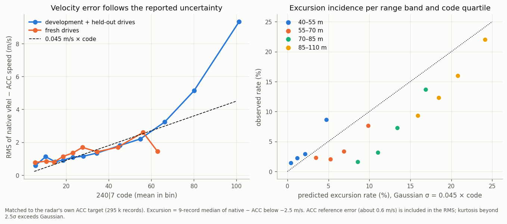
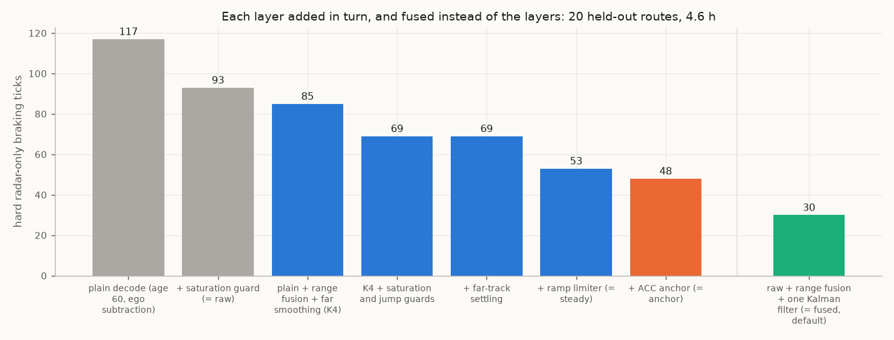
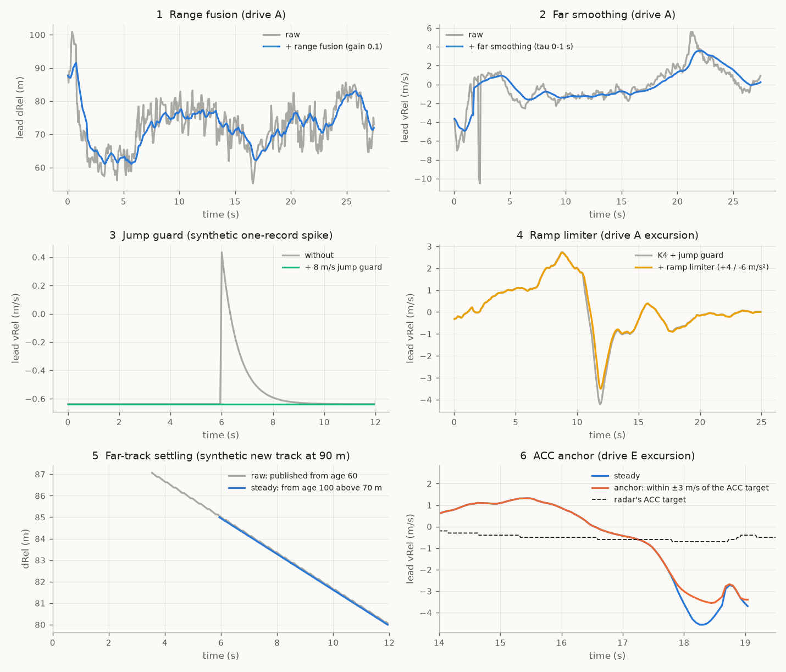
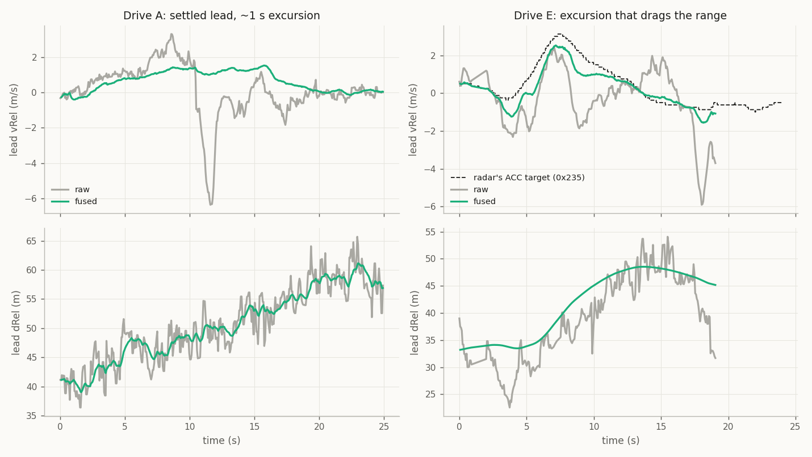

# 07. Velocity excursions (the jitter and false-closing issue)

The radar's velocity is its best channel ([06](06_accuracy.md)). It has one systematic flaw: on a settled track, the
velocity sometimes **drifts for 1-10 s while the track's range does not follow**. Most drifts are **false closings
beyond 40 m**. In openpilot this shows up as extra jitter in the longitudinal plan and, rarely, as a braking request
that vision would not make.

## What an excursion looks like

*Bundled sample `data/sample/highway_vrel_excursion_25s.csv.gz`: ego steady at 31 m/s, lead at ~48 m slowly
opening. The lead's over-ground speed falls 33.5 → 25.0 m/s and recovers within about 1.2 s. Replayed through
openpilot's radard and planner, this produced a forward-collision warning and −3.5 m/s².*

*The same event on the road camera over 4 s: the settled lead (#1, age 126) stays at 48-50 m and its box does not
grow, while its vRel swings from +2.4 to about −6 m/s and back.*

*A long false closing on a real drive at about 85 km/h: the track's vRel drifts to −12 m/s over about 9 s (implying
~50 m of closing) while its range stays at 85-110 m and vision holds steady.*

The shape, from labelled episodes where native vRel disagrees with both the radar's own ACC target and the vision lead:

- **Mostly false closings:** 84-88% of episodes.
- **A smooth drift:** the gap to the ACC target ramps from about −1 to −3.4 m/s over ~1.5 s and decays over ~2 s.
  Record-to-record steps stay small (1.7% exceed 2 m/s) and do not reverse (step autocorrelation −0.01).
- **Strongly range-dependent:** about 0.1 per 1,000 records below 20 m, 4 at 20-40 m and 130 at 60-80 m; incidence
  reaches about 18% of track time at 100 m. Higher above 30 m/s ego speed.
- **The reported motion state moves together:** the acceleration-like field `84|10` follows the velocity drift while
  state 1 persists. State 1 is update-like; it does not certify fresh or accurate measurements. These are object-list
  outputs, so their coupling leaves the cause open: measurement bias, target/scatterer association, internal tracking
  and frame interpretation are candidates (○).
- **The radar's range does not follow**, but range walks by metres over the same seconds, so range alone confirms or
  refutes a drift only after 2-4 s at 60-100 m.

Suppressing downstream radar/vision lead switches leaves excess roughness in the tested replays. Native slot/age
continuity establishes a transmitted allocation, while physical target or scattering-point continuity requires
independent correspondence. The observed outputs do not locate the bias upstream of the tracker
([`excursion_mechanism_scope.json`](../data/analysis/summaries/excursion_mechanism_scope.json)).

### What the radar's waveform allows

The published ARS510 data sheet (Winner and Waldschmidt, *Automotive Radar*, 2026, Table 15.3) gives a chirp-sequence
waveform of 256 ramps at 104 µs, a **19 m/s single-cycle unambiguous radial-velocity span** resolved over two cycles,
0.074 m/s resolution and 0.15 m/s separability (the step of `64|10`), and three modulation bandwidths chosen by ego
speed (range resolution 0.4 / 0.7 / 0.98 m). These are generic product values (○ for this firmware).

Excursion offsets sit well inside that span: median −4.0 m/s against vision, growing with range from about −3.1 m/s
below 40 m to −4.8 m/s at 80-100 m. Unwrapping the published velocity by ±19 m/s changes 57 of 900 labelled samples
and leaves the rest unchanged, so an excursion is **not a full-span Doppler wrap of the published velocity** (◐). It
builds up over 1-2 s rather than jumping, which fits low-SNR measurements at range; wrong-branch measurements that the
tracker only partly absorbs remain possible ([`waveform_source.json`](../data/analysis/summaries/waveform_source.json)).

## How often, on real drives

Four closed-loop drives with the radar feeding openpilot's radard (1.05 h, 0.31 h following a radar lead):
- radard's radar lead and the vision lead disagree on relative speed by ≥ 2 m/s for ≥ 1 s **58 times** (about once
  every 20 s of radar-lead driving): 1% of radar-lead time at 0-20 m, 20% at 40-60 m, 49% beyond 80 m;
- when the radar says "closing faster", the track's own range sides with **vision** in 22 of 33 episodes;
- when the radar says "closing slower", range sides with the **radar** in 16 of 25 (vision lagging).

*Two false closings and two real closings the radar saw first. In the first second they look the same.*

### Far-range excursions match the reported velocity error scale

Against the radar's own ACC target, the native velocity error is proportional to the tracker's reported velocity
uncertainty `240|7` ([03](03_slot_fields.md#kinematics)): RMS of native vRel minus ACC speed is 0.04-0.05 m/s per
count over codes of about 15-35 (about 0.8 m/s at code 15, 1.4 m/s at code 30) on the corpus and on the fresh drives.
Above about 40 the error grows more slowly than in proportion (0.033 m/s per count at 48, 0.021 at 60 on the fresh
drives, thin samples), so the proportional form is a mid-code description. Codes
grow with range, so far tracks carry a 1-3 m/s error scale. A Gaussian error with σ = 0.045 × code (and a −0.3 m/s mean
offset) predicts the share of far (40-110 m) records inside a smoothed excursion (9-record median below −2.5 m/s):
5.1 % observed against 6.4 % predicted on the development and held-out drives, 6.9 % against 5.5 % on the fresh
drives, with the right ordering across range bands and code quartiles. The error is low-pass (corner about 0.3 Hz),
which is why a 1-3σ deviation lasts 1-10 s instead of flickering per frame. So the size and frequency of far-range
excursions are consistent with the tail of a noisy velocity estimate whose scale the radar reports itself; they are
not explained by range leakage, neighbouring objects, clutter, ego compensation, association or lifecycle flags. The
radar's own ACC tracker follows the same object without these errors, so better information exists inside the radar.
`240|7` tells how large far errors can be, not when one happens: within a range band it separates excursion records
from normal ones only below 40 m (AUC 0.95-0.97), not at 40-60 m (0.41-0.49) or beyond (0.55-0.68)
([`continental_field_map.json`](../data/analysis/summaries/continental_field_map.json)).
Caveats: the 0.045 is a fitted Gaussian-equivalent, not a decoded unit: the robust (MAD) core is about 0.027 m/s per count
over codes 12-70 and heavy tails (kurtosis 1.3-8) lift the RMS to 0.04-0.05. The ACC target has its own error (about 0.6 m/s).
The −0.3 m/s mean offset is not a zero-point or ego-scale error of the decode: it is about −0.1 m/s below 20 m, −0.4 m/s at
40-60 m and −0.6 m/s at 80-110 m, has no ego-speed slope and differs between drives (std 0.3 m/s). Of 13.6 k candidate signals (every slot, header and
0x85 bit window, every aux CAN address, ego and livePose signals), only the object's own state explains it, scored out of sample
across drives: the filtered acceleration `84|10` (R² 0.11, roughly 3 s × acceleration around zero; the ACC target's own acceleration
explains nothing), the measurement state `264|8` (mean native-minus-ACC −0.75 m/s in state 1 against −0.24 in state 2) and the
object width `216|6` (−0.6 m/s at codes 14-16, +0.1 at 20-21). Ego signals, livePose and aux frames stay below R² 0.006, and shifting the ego or ACC clock by ±0.4 s changes the error by < 0.01 m/s. Taken together the object's own state fields (acceleration, lifecycle, `240|7`, measurement state, width, flags) and the track's 3 s history predict about 41 % (47 % with the history) of the velocity error variance on 114 held-out drives (54 % out of fold on the development corpus); no single field carries it. A predictor that only shrinks `vRel` toward typical closing speeds scores almost as well (36 %) but pulls genuine fast closings up by about 0.5 m/s, the state-based one by 0.1-0.3 m/s. This is a reference-relative result against the ACC target, not a tested correction Why the ACC tracker is better is unexplained
([summary](../data/analysis/summaries/excursion_sigma_scale.json)).

## Compared with an optical reference

ECC affine registration measures the lead rear's image scale change over 0.5–1 s. The exploratory metric
reference is `−(native range + 1.52 m) × d ln(scale)/dt`. It avoids native velocity but shares native range
and target association. Image-fit repeatability and selected parked-target residuals do not establish
physical accuracy: crop, body motion, correspondence, timing and shared camera errors remain relevant.
The corpus covers 83 segments, dominated by four drives, with few far windows.

In the five reported 10–130 m bins (**2,657 two-second windows**), native velocity is more closing than ECC
by over 2.5 m/s in 0.2 / 2.2 / 10.6 / 15.0 / 20.9% of windows. The opposite disagreement occurs in
0 / 0.2 / 0.6 / 2.2 / 1.4%. These are conditional disagreement labels, not independently verified false
closings. The bin counts and residual medians are in
[`video_truth.json`](../data/analysis/summaries/video_truth.json).

A camera-veto prototype uses an offline precomputed optical feed with a different conversion: endpoint
range + 3.6 m, whereas the comparison labels use window-median range + 1.52 m. These are source conventions,
not independently measured mounting offsets; agreement with the labels does not validate the feed equation.
On 2,606 selected windows, the clean feed reduces closing disagreement from 6.8% to 6.4%; 1 of 265 labelled
onsets exceeds the 150 ms timing-equivalent threshold. These window outcomes reproduce with feeds restricted
to their originating route. Pooling all drives by boot-relative timestamp permits cross-drive matches; fixing
that scope changes individual velocities but none of these closing-disagreement decisions.

In a route-scoped comparison across four previously used development chains (93 segments), adding the camera
veto to R0, a research profile with range fusion, far smoothing and a ramp limiter, changes 2,201 of
110,332 planner ticks. Hard ticks remain 86; hard-episode counts, lead switches, response lag and anticipation
remain identical. The small route-level roughness difference has an interval spanning zero. Seven of eight
frozen gates pass, but the required strict
nuisance-reduction gate does not. This comparison establishes no driving improvement. Its scope, aggregate
scores and gates are in [`camera_route_scoped_planner.json`](../data/analysis/summaries/camera_route_scoped_planner.json).
The 436 corrected queries in a separate interface benchmark are distinct from changed planner ticks.

Perturbed-feed results retain pooled-feed scope. A shuffled-velocity variant has 7 timing-equivalent exceedances:
it permutes velocity pairs
within each segment while preserving timestamps, positions and confidence values, rather than measuring a
physical wrong-target association rate. The 0.1–0.4 s timestamp-shift variants move the measurement endpoint;
they do not validate delayed delivery with the original endpoint. Measurement and availability times must stay
separate for a latency test. All window timing metrics use velocity-change/deceleration equivalents, not
physical onset timestamps. Settings were tuned and evaluated on prior-used drives, so these results remain
exploratory. Recorded planner scores and their scope are in the linked summary.
The prototype is outside shipped profiles; independent physical labels and prospective validation remain
necessary before interpreting its optical agreement as a driving improvement.

## What openpilot does with it

- radard's per-track Kalman filter smooths **vRel only** and passes a drift straight into `vLeadK` and `aLeadK`
  (−3 to −5 m/s² during a drift).
- The 25% distance gate keeps the drifting track matched to the vision lead (at 110 m the gate is about 28 m wide).
- The planner projects `aLeadK` forward with a 1.5 s decay.

*20 held-out routes, 4.56 h: in steady radar-lead following, radar+vision is only +0.005 m/s² RMS rougher than
vision-only; around the moments where radar and vision disagree (20% of the time) it is +0.032 rougher, about 70% of
the extra roughness.*

## How the filtering works, step by step

The radar's object list is already a tracker output, so these layers do not "denoise measurements"; each one targets
a specific, measured failure of the published track before radard sees it. They run per track, in this order, inside
`Ars510NativeRadarInterface._payload` ([`ars510/interface.py`](../ars510/interface.py)). The three install profiles
are cumulative: `stock` (steps 0-1), `steady` (0-3, 5-6) and `anchor` (0-3, 5-7); step 4 is an option that is off.

*Hard radar-only braking requests (the planner asks for ≤ −2 m/s² while the same drive replayed vision-only asks for
no more than −0.5) on 20 held-out routes, adding one layer at a time
([`layer_ablation.json`](../data/analysis/summaries/layer_ablation.json)). Far-track settling's gain shows on the
further and owner drives instead.*

*One example per layer, decoded from the bundled samples by
[`tools/make_profile_figures.py`](../tools/make_profile_figures.py); panels 3 and 5 are synthetic because the samples
contain no such event. Panel 6 is the excursion that motivated the anchor: the radar's own ACC target (dashed) stays
near −0.6 m/s while the object-list velocity falls to −5.8.*

### 0. The plain decode (every profile)

- **Rule:** publish a track from age 60 (~3.6 s), subtract ego speed from 0xB4 (scaled by .149/.15 to match that
  sensor), drop a point when no fresh ego speed exists, keep a track's ID across short losses (≤ 3.5 s, one-to-one
  position match).
- **Why:** young tracks have unconverged range and velocity ([02](02_object_list.md), `age_convergence.png`: stopped
  cars read as moving, one lead read 38 m while ~100 m away for ~3 s). radard's per-track Kalman filter never
  recovers from one NaN, so a point without ego speed is withheld rather than published.

### 1. Saturation guard (every profile)

- **Problem:** the velocity code 1023 (and 0) is an invalid sentinel, not a speed; it decays back over ~6 records.
- **Rule:** withhold a mature track while its code is 1023/0 and until velocity is back within 5 m/s of the last good
  value (or 1 s passes); the track continues under a new ID so radard restarts its filter.
- **Evidence:** 9 sentinel events in the census, always with `240|7` = 127. Without it one sentinel reaches the
  planner as a −3.5 m/s² request; on the plain decode it takes held-out hard ticks from 117 to 93.

### 2. Range fusion (`steady`, `anchor`)

- **Problem:** published range walks by metres over 1-2 s at 60-100 m (3% of range per frame), so radard's lead
  distance jitters and the lead-match gate flickers.
- **Rule:** predict dRel with the track's own vRel, then move 10% of the way to the measurement each cycle (a fixed
  alpha filter with a velocity-aided prediction).
- **Evidence:** halves 1.5 s range walks against integrated velocity (`range_walk_vs_integrated_vrel.png`). With far
  smoothing (K4) it removes about half of radar's extra plan roughness (−0.0053 m/s² [−0.0099, −0.0022] on held-out
  routes, −0.0081 [−0.0155, −0.0015] on fresh ones) and cuts gas-overridden radar-only brakes 0.66 → 0.44 per hour.
- **Cost:** about 0.07 s of radar's ~0.15 s head start (together with far smoothing).

### 3. Far smoothing (`steady`, `anchor`)

- **Problem:** excursions are rare close in and common far out: about 0.1 per 1,000 records below 20 m, 4 at 20-40 m,
  130 at 60-80 m, reaching 18% of track time at 100 m.
- **Rule:** exponential smoothing of vRel with a time constant that is 0 s below 30 m, rising linearly to 1 s at 60 m
  and beyond. Close leads, where reaction time matters most, pass unsmoothed.
- **Evidence:** alone it removes about 29% of the extra roughness for 0.06 s; as part of K4 see step 2.

*Extra plan roughness removed against radar head start given up, per option, on 20 held-out routes: range fusion and
far smoothing together (K4) keep most of the head start.*

### 4. Velocity-jump guard (option, off)

- **Problem:** occasionally one record jumps by many m/s and comes straight back (196 jumps > 5 m/s in the census).
- **Rule:** a mature track's record more than 8 m/s from its last accepted over-ground velocity is withheld; a new level
  that persists for 1 s is accepted as real and the track continues under a new ID.
- **Evidence:** added to K4 together with the saturation guard, it cut held-out hard ticks 85 → 69 and halved
  gas-overridden brakes again (0.44 → 0.22 per hour), with lag, anticipation and switches unchanged; 17 of 20 routes
  are identical. Once the ramp limiter and far settling are present it adds nothing: `anchor` with and without it is
  identical in every scored measure on the 34 replay drives (hard ticks 48 / 48, owner 0 / 0, response, anticipation,
  misses) and on the fresh drives, so it is no longer part of any profile (`vjump_thresh_mps=8` turns it back on).
- **State contract:** a withheld record still updates the native lifecycle but skips the ramp, smoother, range fusion
  and relink history, so recovery can change later vRel/dRel and the published ID.

### 5. Far-track settling (`steady`, `anchor`)

- **Problem:** a new track that first appears beyond 70 m is often still converging at age 60; when it is picked up as
  the lead, its unconverged speed brakes the car. Young far tracks disagree with an optical reference about 1.5× more
  than mature ones.
- **Rule:** a track whose first publication would be above 70 m waits until age 100 (~6 s). Once published it stays
  eligible at any range.
- **Evidence:** further drives 10 → 3 hard ticks, owner far pickups 2 → 1 ([`far_settling.json`](../data/analysis/summaries/far_settling.json));
  removing it (with the jump guard) from the full profile raises further-drive hard ticks 1 → 9 and adds an owner
  episode. Mean held-out lag +0.003 s; individual responses can be later (one by 0.25 s).

### 6. Ramp limiter (`steady`, `anchor`)

- **Problem:** many excursions build up in steps too small for the jump guard: the over-ground speed ramps at about
  +23 m/s², then the decaying tail reads to radard as a braking lead. No vehicle changes its speed over ground that
  fast, while real closings change *relative* speed through ego speed.
- **Rule:** a mature track's over-ground velocity may move **away** from its own 3 s average by at most +4 m/s² up and
  −6 m/s² down; moves **back toward** the average pass unchanged, so a false dip recovers at once.
- **Evidence:** held-out hard ticks 69 → 53 (−23%), further drives 3 → 1; radar-only episodes, gas-overridden brakes,
  anticipation and switches unchanged; mean lag +0.002 s. Of 182 driver brake events (52 hard) none loses its early
  reaction; two mild ones respond 0.10-0.12 s later, still before the driver
  ([`ramp_limiter.json`](../data/analysis/summaries/ramp_limiter.json)).
- **Why ±4 / −6:** the limits are well above real over-ground acceleration (99.9% of optical-reference one-second
  steps of an optical reference are within +4 / −6 m/s²; a proxy, not a physical bound) and asymmetric because real braking is harder than real acceleration.

### 7. ACC anchor (`anchor`)

- **Problem:** the layers above slow an excursion down; they cannot tell it apart from a real closing. The radar
  itself can: its own ACC target (0x235 / 0x237, [05](05_acc_target_and_support.md)) stays smooth and consistent with
  range during excursions (closer to the track's range trend in 76% of 51 disagreement episodes; median error 1.2 vs
  3.3 m/s) and still follows real decelerations.
- **Rule:** match the ACC target to one object-list track by position (lateral within 0.5 m weighs most; the target's
  coarse distance is good to only about ±10 m, so the range tolerance is 12 m; tracks from age 20). Keep that
  association while the track and a continuous target persist, even if the track's range slides; re-match when the
  target jumps (a cut-in) or disappears. The matched track's vRel is clipped to the target's closing speed ± 3 m/s
  before range fusion. Other tracks are untouched.
- **Same object, better estimate:** in 653 disagreement cycles on eight drives, no other object-list track was near
  the radar's ACC target, so the ACC target and the drifting track are the same car; the radar simply keeps a better
  speed estimate for it than it publishes in the object list
  ([`acc_target_choice.json`](../data/analysis/summaries/acc_target_choice.json)).
- **Why sticky:** excursions often drag the track's range along (drive E: 46 → 33 m and −0.6 → −5.8 m/s, while the ACC
  target stayed at 46 m and −0.7 m/s). A per-cycle position match drops the cross-check exactly then; on the fresh
  drives the plain clip changed nothing (7 → 7 hard ticks).
- **Why ±3 m/s:** wider than the normal disagreement (95% of associated samples within 1.6 m/s), narrow enough to
  remove most of an excursion's 3-6 m/s.
- **Evidence:** held-out hard ticks 53 → 48, owner 16 → 0, fresh drives 7 → 0, further 1 → 1; mean braking onset
  unchanged (+0.6 ms over 167 events). One mild driver event (−0.84 m/s²) now gets −0.84 instead of −1.21 m/s²
  ([`acc_anchor.json`](../data/analysis/summaries/acc_anchor.json)).
- **Limits:** the target covers about 57% of radar-lead time and 5% beyond 80 m; only vRel is anchored, so the
  track's range can still slide; the radar may use camera input to choose its target.

*The three profiles on both bundled excursions: `stock` passes the drop, `steady` softens it, `anchor` also bounds it
by the radar's own ACC target when that target describes the track.*

### What removing a layer does

From the full profile, on the 34-drive replay suite ([`layer_ablation.json`](../data/analysis/summaries/layer_ablation.json)):

| removed | effect |
|---|---|
| everything (`stock` instead of `steady`) | held-out hard ticks 53 → 93, target episodes 11 → 19, lead switches 1,781 → 2,468; braking onset 0.04 s earlier |
| ramp limiter | held-out hard ticks 53 → 69 |
| far settling and jump guard | further drives 1 → 9 hard ticks; one owner episode more |
| jump guard alone | no scored change on 34 drives or the fresh drives: removed from the profiles |
| far smoothing (from `anchor`) | held-out hard ticks 48 → 45 but further drives 1 → 9, target episodes 9 → 11, four driver brakes answered > 0.15 s later; fresh drives brake harder in two recorded windows: kept |
| far-track settling (from `anchor`) | held-out unchanged (48), further drives 1 → 9, one more target episode on held-out and owner drives, onset 17 ms later: kept |
| ACC anchor (`steady` instead of `anchor`) | held-out 48 → 53, owner 0 → 16, fresh 0 → 7 |
| far smoothing, with the summary anchor on | held-out 48 → 45 but further drives 1 → 3, target episodes 9 → 11; the same two fresh windows brake harder: kept |
| far-track settling, with the summary anchor on | further drives 1 → 9, as without summaries: kept |

### Summary anchor (in `anchor`, up to 80 m)

`summary_clip_mps` does for far cars what the ACC anchor does for the ACC target: the radar's selected-target range
summaries (0x192 / 0x194, [05](05_acc_target_and_support.md#0x191-0x194-selected-target-summaries)) come from its internal
tracker, so their range slope avoids the excursions. A summary attaches to an object-list track when range (within
15 %) and speed (within 1.5 m/s) agree unambiguously, stays attached while both persist, and that track's vRel is
held within ± `summary_clip_mps` of the summary speed. On the eight fresh/owner drives the ACC anchor covers 55 % of
in-lane points beyond 60 m and the summaries add 24 % (79 % together). In replay (`summary_clip_mps=3`) it changes 1 %
of points, mostly beyond 60 m, and leaves every planner score of `anchor` unchanged on the 34 replay drives and the
fresh drives: physically better far speeds that these drives' planners rarely act on.

Against the optical reference (906 windows beyond 40 m matched to a summary) the summary speed is closer to the camera
at 40-60 m (median error 0.35 vs 0.56 m/s for the object list) and 60-80 m (0.75 vs 0.99; false closings 6.5 % vs
14.9 %), and in 97 % of the windows where the object list shows a false closing. Beyond 80 m it is not better (1.18 vs
0.98 m/s, 61 windows), so `anchor` uses it with `summary_clip_mps=3` and `summary_max_range_m=80`. It does not replace
far smoothing or far-track settling (table above): the cases those layers protect are mostly young or far tracks
without an attached summary ([`summary_tracks.json`](../data/analysis/summaries/summary_tracks.json)).

### Range anchor (option, off)

`acc_range_clip_m` clips the ACC-associated track's object-list range to a distance propagated with the radar ACC
target's fine-range changes (0x237, consistent with its own speed to 1%), with the offset following the object-list
range over `acc_range_tau_s`. On the 34 replay drives (with `acc_range_clip_m=2`) held-out hard ticks go 48 → 45 and
lead switches drop 4%, but one more driver brake is answered more than 0.15 s late, one fresh-drive window brakes harder,
and distances move by up to 12 m where the fine range and the object list disagree on scale (10-20% over long
approaches). It stays off until that scale is understood ([`acc_fields.json`](../data/analysis/summaries/acc_fields.json)).

### Other approaches tested

Measured the same way; none is in a profile.

| approach | result |
|---|---|
| vision speed fused into the matched track ([radard patch](../openpilot/radard_vision_fusion.patch)) | driver-agreement error −0.0043 [−0.0068, −0.0018], twice K4's; small on fresh drives; needs a radard change |
| the ACC target's speed *replacing* the track's vRel | hard ticks 53 → 57 and +0.145 s mean response: the ACC value lags real closings |
| velocity smoothing weighted by the `240\|7` uncertainty code | responds 62 ms earlier but 153 vs 85 hard ticks on development drives |
| camera-looming veto (offline optical feed) | no planner benefit over range fusion + far smoothing + ramp limiter |

## Fresh jump-guard simplification comparison

S4/A retains every frozen STEADY setting except `vjump_thresh_mps=0`, disabling the 8 m/s jump guard.
A comparison preregistered before comparative outcomes used eight fresh ordinary-drive routes (114 segments,
six moving and two parked), continuous native state per route and unchanged sunnypilot RadarD/planner consumers.
Vision-only, STEADY and S4 produced 48 planner runs under model-publication and captured-plan-publication schedules,
with 779,076 ticks across all groups. In **each schedule**, hard command-disagreement ticks stay **7 → 7** and
radar-only episodes **6 → 6**. Response timing and anticipation agree across 19 source-selected driver events
(three hard); response minima differ by at most 0.223 / 0.271 m/s², within the hard-event 0.3 limit. All 83 frozen
recorded-command windows retain identical minima. Human-controlled lead switches fall 212 → 211 / 209 → 208.
These are command/driver witnesses, not independently labelled false braking
([summary and gates](../data/analysis/summaries/fresh_s4_replay.json)).

Both schedules meet the preregistered non-increase overlay, including every route's count gates; strict count
improvement is false. This overlay is separate from the historical full 19-gate suite and establishes eligibility
for further study, not profile promotion. Independent checks cover source selections, complete output groups and
1,398 scoring calculations. Native outputs differ in 406 batches, so equal aggregate counts do not mean identical
behavior. Physical scene/velocity labels, the recorded device's historical profile identity, private map memory and
actual receive times remain unavailable. The same comparison for `anchor` on all 34 replay drives is equal in every scored
measure, and the jump guard is now off in both profiles ([`layer_ablation.json`](../data/analysis/summaries/layer_ablation.json)).

## Sunnypilot profile comparison

◐ **Fixed owner replay scope.** Native profile points run through sunnypilot's original RadarD and longitudinal
planner with complete recorded settings. All 72 segments and 84,659 model ticks run under each of two fixed
publication schedules: current model publication and the captured plan publication naming that model.

| drive | STEADY episodes | OPENPILOT episodes | STEADY + ACC clip episodes |
|---|---:|---:|---:|
| D1 | 5 | 8 | 4 |
| D2 | 0 | 2 | 0 |
| D3 (recorded radar disabled) | 0 | 0 | 0 |

These episode counts hold under both schedules. An episode means at least 0.3 s of requested acceleration
≤ −1 m/s² while the same-fork vision-only replay requests ≥ −0.3 m/s², with ego speed > 1 m/s. In D2's fixed window,
STEADY and the clip request a minimum about −0.99 m/s², versus −2.07 with OPENPILOT. The clip passes all six
owner subgates per schedule: pooled hard ticks, each drive's episode count and two fixed-window minima each
at least the corresponding STEADY minimum minus 0.05 m/s². This is a one-sided lower bound. It leaves four D1
episodes and that drive's fixed-window minimum unchanged; it is off by default.

All startup rows, two missing plans and 145 captured map-active ticks remain in the comparison. D3's commands
stay exactly vision-only. Independent checks cover all 677,272 planner ticks and 24 gate decisions. CAN-event
receipt approximation, captured radar cadence, latest-track availability and planner publication cutoffs remain
prospective assumptions; empty unrecorded map memory leaves replay map activity zero. These prior-used drives
support a conditional option comparison; physical velocity, real-closing response, the full 19 gates and fresh-drive
validation remain separate. Numbers: [`sunnypilot_profile_comparison.json`](../data/analysis/summaries/sunnypilot_profile_comparison.json).

## Radar-internal signals that move with an excursion

| signal | behaviour during an excursion |
|---|---|
| `240\|7` velocity-error scale | higher; native-minus-ACC RMS ≈ 0.045 m/s/count ([above](#far-range-excursions-match-the-reported-velocity-error-scale)); conditional native-minus-ECC RMS slope ≈ 0.05 m/s/count at 40–80 m, with physical sigma unresolved ([03](03_slot_fields.md#kinematics)); AUC 0.65 / 0.85 on discovery / confirmation labels |
| `264` measurement state | more near-scan state 1 at ranges where far scan should also see the object; states 4-8 rise 3-6 s later |
| 0x235 ACC target | disagrees with the object's vRel (when present) |
| lane state `128\|3` | changes more often, also on real closings |

Each of these moves with excursions; none alone separates them from real closings within the first second. Combining
them, and the ideas in [10](10_research_directions.md), is where the remaining gap is.
