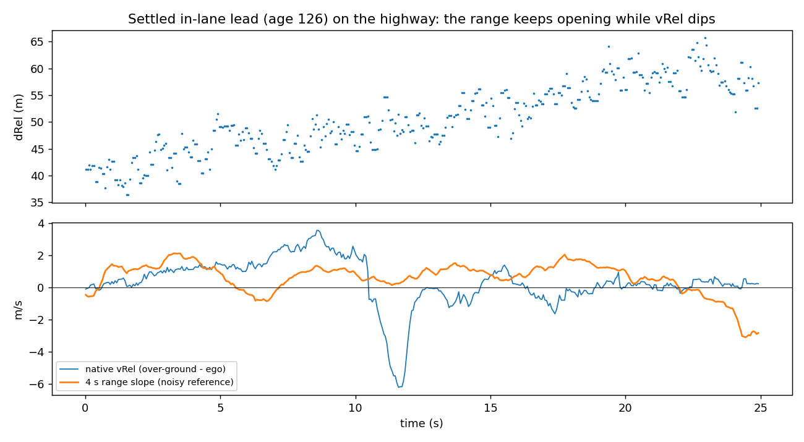
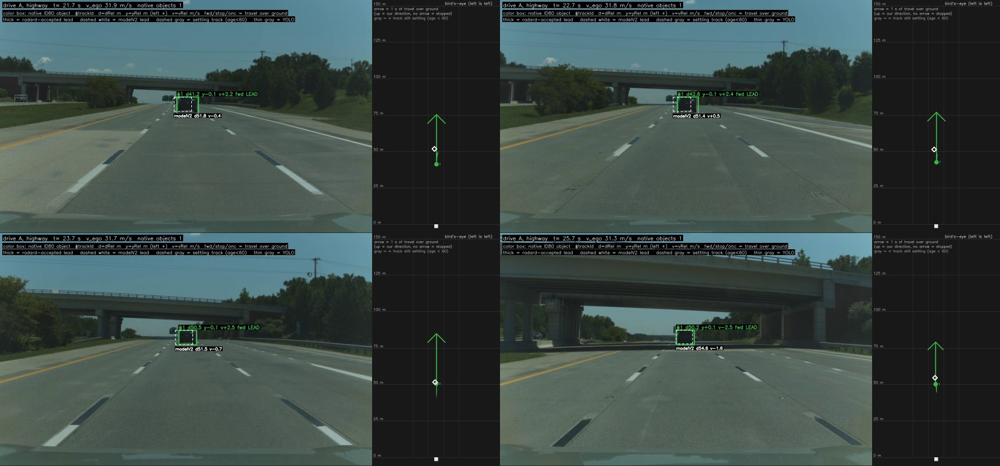
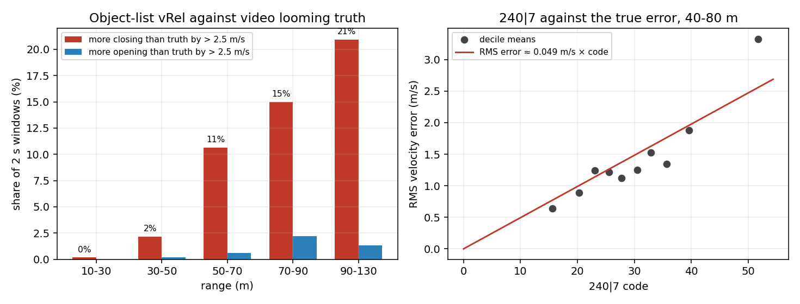
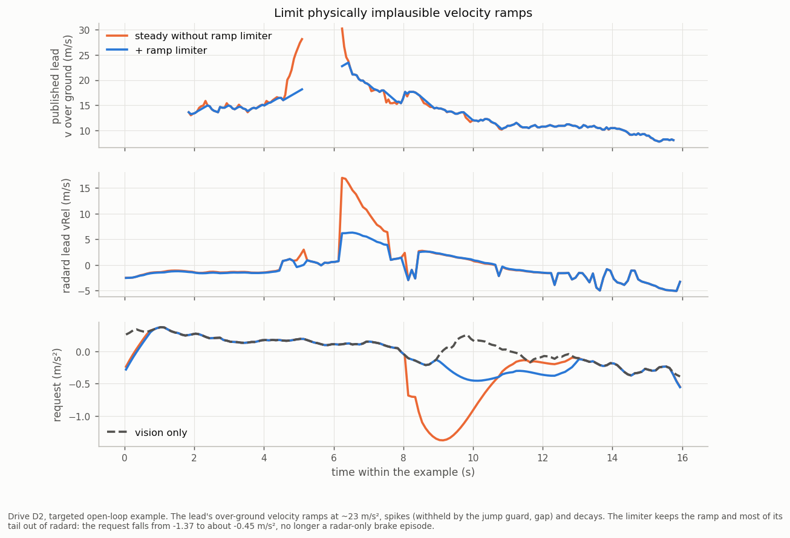
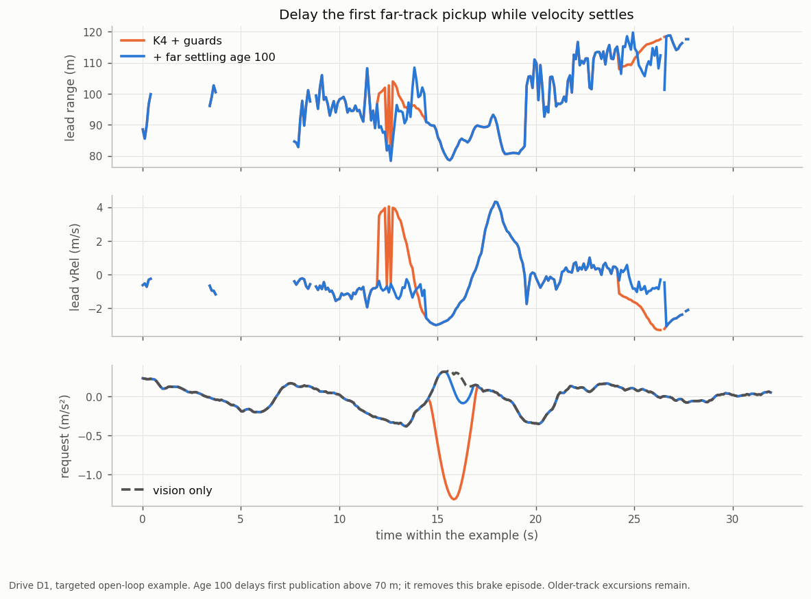

# 07. Velocity excursions (the jitter and false-closing issue)

The radar's velocity is its best channel ([06](06_accuracy.md)). It has one systematic flaw: on a settled track, the
velocity sometimes **drifts for 1-10 s while the track's range does not follow**. Most drifts are **false closings
beyond 40 m**. In openpilot this shows up as extra jitter in the longitudinal plan and, rarely, as a braking request
that vision would not make.

## What an excursion looks like

*Bundled sample `data/sample/highway_vrel_excursion_25s.csv.gz`: ego steady at 31 m/s, lead at ~48 m slowly
opening. The lead's over-ground speed falls 33.5 → 25.0 m/s and recovers within about 1.2 s. Replayed through
openpilot's radard and planner, this produced a forward-collision warning and −3.5 m/s².*

*The same event on the road camera over 4 s: the settled lead (#1, age 126) stays at 48-50 m and its box does not
grow, while its vRel swings from +2.4 to about −6 m/s and back.*

*A long false closing on a real drive at about 85 km/h: the track's vRel drifts to −12 m/s over about 9 s (implying
~50 m of closing) while its range stays at 85-110 m and vision holds steady.*

The shape, from labelled episodes where native vRel disagrees with both the OEM ACC target witness and the vision lead:

- **Mostly false closings:** 84-88% of episodes.
- **A smooth drift:** the gap to the ACC target ramps from about −1 to −3.4 m/s over ~1.5 s and decays over ~2 s.
  Record-to-record steps stay small (1.7% exceed 2 m/s) and do not reverse (step autocorrelation −0.01).
- **Strongly range-dependent:** about 0.1 per 1,000 records below 20 m, 4 at 20-40 m and 130 at 60-80 m; incidence
  reaches about 18% of track time at 100 m. Higher above 30 m/s ego speed.
- **The reported motion state moves together:** the acceleration-like field `84|10` follows the velocity drift while
  state 1 persists. State 1 is update-like; it does not certify fresh or accurate measurements. These are object-list
  outputs, so their coupling leaves the cause open: measurement bias, target/scatterer association, internal tracking
  and frame interpretation are candidates (○).
- **The radar's range does not follow**, but range walks by metres over the same seconds, so range alone confirms or
  refutes a drift only after 2-4 s at 60-100 m.

Suppressing downstream radar/vision lead switches leaves excess roughness in the tested replays. Native slot/age
continuity establishes a transmitted allocation, while physical target or scattering-point continuity requires
independent correspondence. The observed outputs do not locate the bias upstream of the tracker
([`excursion_mechanism_scope.json`](../data/analysis/summaries/excursion_mechanism_scope.json)).

### What the radar's waveform allows

The published ARS510 data sheet (Winner and Waldschmidt, *Automotive Radar*, 2026, Table 15.3) gives a chirp-sequence
waveform of 256 ramps at 104 µs, a **19 m/s single-cycle unambiguous radial-velocity span** resolved over two cycles,
0.074 m/s resolution and 0.15 m/s separability (the step of `64|10`), and three modulation bandwidths chosen by ego
speed (range resolution 0.4 / 0.7 / 0.98 m). These are generic product values (○ for this firmware).

Excursion offsets sit well inside that span: median −4.0 m/s against vision, growing with range from about −3.1 m/s
below 40 m to −4.8 m/s at 80-100 m. Unwrapping the published velocity by ±19 m/s changes 57 of 900 labelled samples
and leaves the rest unchanged, so an excursion is **not a full-span Doppler wrap of the published velocity** (◐). It
builds up over 1-2 s rather than jumping, which fits low-SNR measurements at range; wrong-branch measurements that the
tracker only partly absorbs remain possible ([`waveform_source.json`](../data/analysis/summaries/waveform_source.json)).

## How often, on real drives

Four closed-loop drives with the radar feeding openpilot's radard (1.05 h, 0.31 h following a radar lead):
- radard's radar lead and the vision lead disagree on relative speed by ≥ 2 m/s for ≥ 1 s **58 times** (about once
  every 20 s of radar-lead driving): 1% of radar-lead time at 0-20 m, 20% at 40-60 m, 49% beyond 80 m;
- when the radar says "closing faster", the track's own range sides with **vision** in 22 of 33 episodes;
- when the radar says "closing slower", range sides with the **radar** in 16 of 25 (vision lagging).

*Two false closings and two real closings the radar saw first. In the first second they look the same.*

## Measured against video truth

A per-second velocity reference that does not use the radar's Doppler comes from the road camera: the lead's rear is registered between frames 0.5-1 s apart with sub-pixel
accuracy, and the relative velocity is −range × d ln(scale)/dt (the radar range only sets the scale, so a 3% range error is a 3% velocity-scale error). Its noise is
0.13 / 0.22 / 0.46 / 0.88 / 1.0 m/s per second at 20 / 40 / 60 / 80 / 110 m, it is unbiased on parked vehicles (median +0.01 m/s, 51 windows within 50 m) and it agrees with 8-12 s
range closure with median differences of 0.03-0.27 m/s to 80 m. Limits: daylight, in-lane leads and straight road, 83 one-minute segments (four drives dominate), few windows beyond 100 m; the vision
model and the ACC target may share the camera, so their independence from it is partial.

Against it, the object list's vRel on straight road (3,048 two-second windows) reads **more closing than truth by more than 2.5 m/s in 0.2 / 2 / 11 / 15 / 21% of windows at
10-30 / 30-50 / 50-70 / 70-90 / 90-130 m**, and more opening in under 2.2%: the excursions are one-sided, about ten to one. The median error is −0.1 / −0.2 / −0.5 / −1.0 / −1.1 m/s,
excursion runs last 2-3 s with peaks near −3.5 m/s, and the pattern repeats on all four drives with enough windows (7-22% at 50-90 m) (◐)
([`video_truth.json`](../data/analysis/summaries/video_truth.json)). The error is intermittent, not a stable offset: subtracting the previous window's error does not help.
At 40-130 m a camera-assisted veto (limit native closing to the video velocity of the same second plus a noise-scaled margin, no action while native is still falling) removes
about a third of the false closings in offline replay, with a mean onset lag near 0.01 s and 98% of real onsets untouched; a more conservative setting removes 14% with no onset
delayed more than 0.15 s. It needs a camera process feeding radard and is weak beyond 80 m.

## What openpilot does with it

- radard's per-track Kalman filter smooths **vRel only** and passes a drift straight into `vLeadK` and `aLeadK`
  (−3 to −5 m/s² during a drift).
- The 25% distance gate keeps the drifting track matched to the vision lead (at 110 m the gate is about 28 m wide).
- The planner projects `aLeadK` forward with a 1.5 s decay.

*20 held-out routes, 4.56 h: in steady radar-lead following, radar+vision is only +0.005 m/s² RMS rougher than
vision-only; around the moments where radar and vision disagree (20% of the time) it is +0.032 rougher, about 70% of
the extra roughness.*

## Options

Measured on 20 held-out routes by replaying openpilot's own card → radard → plannerd and scoring against the driver:

| option | where | extra roughness removed | head start given up | radar-only brakes the driver overrode with gas |
|---|---|---|---|---|
| default `OPENPILOT_CONFIG` (with saturation guard) | interface | — | — | 0.66 / h |
| K4: `range_fusion_gain=0.1`, `vrel_smooth_far_tau_s=1.0` | interface | **about half** (−0.0053 [−0.0099, −0.0022] m/s²; fresh drives −0.0081 [−0.0155, −0.0015]) | 0.07 s | 0.44 / h |
| **`STEADY_CONFIG`** = K4 + saturation guard + 8 m/s velocity-jump guard + far-track settling + ramp limiter | interface | about half, as K4 | about 0.07 s | **0.22 / h** |
| far-range smoothing only (`vrel_smooth_far_tau_s=1.0`) | interface | about 29% | 0.06 s | 0.66 / h |
| ACC target's speed (0x235) as the object's vRel | interface | little; driver-agreement error −40% | 0.10-0.16 s | — |
| vision speed fused into the matched track | radard patch | driver-agreement error −0.0043 [−0.0068, −0.0018] (twice K4's −0.0021) | 0.085 s | 0.88 / h |

- **`STEADY_CONFIG` is the recommended profile** (`install.py --profile steady`). K4's range fusion and far-range
  smoothing keep most of radar's 0.15 s head start and halve the jitter. The two guards withhold invalid readings: the
  saturated velocity code 1023, and a mature track's velocity jumping more than 8 m/s from one record to the next (a
  new level that lasts 1 s is accepted under a new track ID). Together they cut hard radar-only braking requests
  (≤ −2 m/s² while vision-only asks for no more than −0.5) from 85 to 69 ticks on the held-out routes, including a
  −3.5 m/s² request from a saturated reading, and halve the gas-overridden radar-only brakes again. Lag, early
  reaction, lead switches and driver agreement are unchanged for the two guards alone; 17 of 20 routes are identical
  to K4 ([summary](../data/analysis/summaries/velocity_guards.json)).
- **Ramp limiter.** Some excursions build up gradually: the over-ground velocity ramps at about +23 m/s² in steps
  below the jump threshold, spikes, and the decaying tail then reads to radard as a braking lead. No vehicle changes
  its speed over ground that fast, while real closings change *relative* speed through ego speed. The limiter lets a
  mature track's over-ground velocity move **away** from its own slow reference (a 3 s average) by at most +4 m/s²
  up and −6 m/s² down; moves **back toward** the reference pass unchanged, so a false dip recovers at once. On the
  20 held-out routes it cuts hard radar-only requests from 69 to 53 ticks (−23%). Radar-only episodes (6),
  gas-overridden brakes (0.22 / h), early reaction and lead switches are unchanged, and mean reaction lag moves by
  +0.002 s. Across 182 driver brake events (52 hard), none loses its early reaction or its radar response. Two mild
  ones respond 0.10-0.12 s later, still ahead of the driver. On further drives hard ticks go 3 → 1. On the owner
  drives the curve braking request falls from −1.37 to about −0.45 m/s² (no longer a radar-only episode), a far
  excursion softens from −1.95 to −1.12 m/s², and radar-only episodes go 7 → 6. Numbers: [`ramp_limiter.json`](../data/analysis/summaries/ramp_limiter.json).

- **Far-track settling** holds a track's first publication above 70 m until age 100 (about 6 s after birth, versus
  the default age 60). Once published, it remains eligible even if its range grows; a lifecycle restart is gated anew.
  In 20 replay chains, versus K4 + guards, hard ticks stay at 69, human-controlled radar-only episodes stay at 6,
  mean reaction lag increases 0.003 s and brake anticipation is unchanged. Four further drives have 10 → 3 hard
  ticks. On the owner-route targeted check, far braking episodes fall 2 → 1 and hard ticks 14 → 8.
  Paired roughness changes by +0.000077 [−0.000032, +0.000206] m/s²: the gain is one avoided pickup episode.
  Individual responses can be later (one measured delay is 0.253 s; another response falls outside the 2 s scoring
  window). These drives have prior use, the owner route motivated the option, and older-track excursions and the
  separate curve/grade event remain. The age extension leaves the scored pedal-override outcomes unchanged
  both on the 20 held-out chains and on the three recorded sunnypilot drives. Its evidence is a bounded pickup
  mitigation, not a demonstrated improvement in disengagements. Numbers:
  [`far_settling.json`](../data/analysis/summaries/far_settling.json),
  [`owner_driver_review.json`](../data/analysis/summaries/owner_driver_review.json).

- **The radard patch** ([`openpilot/radard_vision_fusion.patch`](../openpilot/radard_vision_fusion.patch)) rewrites
  radard's track filter in covariance form (identical output for radar-only tracks) and fuses the vision lead's speed
  into the matched track with standard deviation `2 × vStd`. It helped most on the held-out routes; on the fresh
  drives its effect was small (−0.0005 [−0.0009, +0.0004]). The camera's lead speed is noisier than this radar's
  (median error 1.1-2.0 m/s vs 0.6-1.2 m/s at 20-120 m, judged by 4 s range slopes), so `VISION_V_STD_SCALE` of 3-4
  is the natural next setting.
- **The ACC target** (0x235) is the strongest velocity witness when present, but it covers 57% of radar-lead moments
  and 5% beyond 80 m.

## Sunnypilot profile comparison

◐ **Fixed owner replay scope.** Native profile points run through sunnypilot's original RadarD and longitudinal
planner with complete recorded settings. All 72 segments and 84,659 model ticks run under each of two fixed
publication schedules: current model publication and the captured plan publication naming that model.

| drive | STEADY episodes | OPENPILOT episodes | STEADY + ACC clip episodes |
|---|---:|---:|---:|
| D1 | 5 | 8 | 4 |
| D2 | 0 | 2 | 0 |
| D3 (recorded radar disabled) | 0 | 0 | 0 |

These episode counts hold under both schedules. An episode means at least 0.3 s of requested acceleration
≤ −1 m/s² while the same-fork vision-only replay requests ≥ −0.3 m/s², with ego speed > 1 m/s. In D2's fixed window,
STEADY and the clip request a minimum about −0.99 m/s², versus −2.07 with OPENPILOT. The clip passes all six
owner subgates per schedule: pooled hard ticks, each drive's episode count and two fixed-window minima each
at least the corresponding STEADY minimum minus 0.05 m/s². This is a one-sided lower bound. It leaves four D1
episodes and that drive's fixed-window minimum unchanged; it is off by default.

All startup rows, two missing plans and 145 captured map-active ticks remain in the comparison. D3's commands
stay exactly vision-only. Independent checks cover all 677,272 planner ticks and 24 gate decisions. CAN-event
receipt approximation, captured radar cadence, latest-track availability and planner publication cutoffs remain
prospective assumptions; empty unrecorded map memory leaves replay map activity zero. These prior-used drives
support a conditional option comparison; physical velocity, real-closing response, the full 19 gates and fresh-drive
validation remain separate. Numbers: [`sunnypilot_profile_comparison.json`](../data/analysis/summaries/sunnypilot_profile_comparison.json).

## Radar-internal signals that move with an excursion

| signal | behaviour during an excursion |
|---|---|
| `240\|7` σ vx | higher; a calibrated error scale (RMS error ≈ 0.05 m/s per count at 40-80 m, [03](03_slot_fields.md#kinematics)); AUC 0.65 / 0.85 on discovery / confirmation labels |
| `264` measurement state | more near-scan state 1 at ranges where far scan should also see the object; states 4-8 rise 3-6 s later |
| 0x235 ACC target | disagrees with the object's vRel (when present) |
| lane state `128\|3` | changes more often, also on real closings |

Each of these moves with excursions; none alone separates them from real closings within the first second. Combining
them, and the ideas in [10](10_research_directions.md), is where the remaining gap is.
