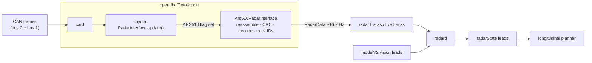

# 08. openpilot integration

The integration turns the object list into openpilot radar tracks without changing openpilot itself: a decoder plus
three small hooks in opendbc's Toyota port. radard, the planner and card run unchanged.

Install instructions for each fork are in [`openpilot/README.md`](../openpilot/README.md).

One installer serves every fork: it copies the decoder and appends a 4-line hook block to the end of
`opendbc/car/toyota/interface.py`, with no in-place edits and no new flag bit.

| fork | status |
|---|---|
| current openpilot (opendbc master) | self-check passes; replayed end to end through card → radard → plannerd |
| sunnypilot v2026.002.002 | self-check passes; native-profile replay through original RadarD / plannerd under two prospective schedules ([07](07_velocity_excursions.md#sunnypilot-profile-comparison)); carries `aRel` / `yvRel`; installed on the owner's device |
| StarPilot | same hook; driven by the owner with the earlier patch-based install |
| any fork | optional `openpilot/radard_vision_fusion.patch` ([07](07_velocity_excursions.md#other-approaches-tested)) |

## How it hooks in

1. **Detection** (hook around Toyota's `CarInterface._get_params`). A `RADAR_ACC` Toyota gets
   `radarUnavailable = False` when its radar firmware is in `ARS510_FW_VERSIONS` (`8821F0R03100`) or 0x80 and 0x85
   were seen on bus 1. The firmware rule matters: the object list starts ~5.9 s after power-up, after fingerprinting.
2. **Hand-over** (hook on `CarInterface.RadarInterface`, which card instantiates). A radar-ACC Toyota with radar
   available is built as `Ars510RadarInterface`; every other car gets the fork's own RadarInterface. card needs no
   change.
3. **Decoding without a CANParser.** The interface reads the raw `(address, data, src)` tuples card already passes,
   reassembles 0x80 records, checks the CRC32 and decodes the 20 slots. Ego speed for vRel comes from 0xB4 on bus 0 in
   the same packets. Cost: about 9 µs per call on a desktop CPU.
4. **Output.** `RadarPoint(trackId, dRel, yRel, vRel)` for tracks aged ≥ 60 cycles, with track IDs re-linked across
   short losses and no point published without a fresh ego speed (vRel is never NaN). Forks whose RadarPoint still
   has the legacy fields (sunnypilot) also get:
   - `yvRel`: the radar's lateral ground velocity minus yaw rate × range, with the yaw rate from Toyota 0x24
     (matches the phone gyro at 1.02×). It follows d(yRel)/dt at r = 0.88 with slope 0.86, since the radar filters
     it.
   - `aRel`: the radar's filtered over-ground acceleration minus ego acceleration (from 0xB4). It is smoothed and
     lags vRel by 0.5-1 s.

   - `measured`: false on records the radar marks as predicted (`107|1`), like the Tesla radar's `Meas`.

   `aRel` and `yvRel` are NaN without fresh yaw rate or ego speed. openpilot's and sunnypilot's radard read none of
   these three fields for lead selection (radard stores `measured` but does not weight it).

| situation | RadarData | effect in openpilot |
|---|---|---|
| record completed (~16.7 Hz) | points | radard fuses them with the vision leads |
| before the first record (boot ~6 s) | empty, no error | vision-only leads, as on a radarless car |
| no record for > 0.5 s after the first | `radarUnavailableTemporary` | radarState invalid → `commIssue` (lateral too); with openpilot long also `radarTempUnavailable` |
| CRC-failed record | dropped | none; the 0.5 s rule covers sustained loss |

## Profiles

`install.py --profile NAME` picks one; with no `--profile` you get `anchor`. Every profile publishes every object-list
track: profiles only change *how* a track's values are filtered, never which cars exist.

| profile | what it is | when to use |
|---|---|---|
| **`anchor`** (default) | `ANCHOR_CONFIG` = `steady` + the radar's own ACC target (0x235) as a velocity anchor for the one track it describes, and its target-range summaries (0x192/0x194) for far tracks up to 80 m | everyday driving: the fewest false brakes at the same response as `steady` |
| `fused` | `FUSED_CONFIG` = `stock` + range fusion + one speed filter that weights the object list, the radar's ACC target and its summaries by their own uncertainty ([07](07_velocity_excursions.md#fused-speed-filter-fused-profile)) | the principled alternative to `anchor`: fewer false brakes, closing speed without `anchor`'s bias; opt-in until road-tested |
| `steady` | `STEADY_CONFIG` = `stock` + range fusion, far smoothing, far-track settling, ramp limiter | when you want to compare without the ACC target, or on a car whose ACC target is not on the radar bus |
| `stock` | `OPENPILOT_CONFIG`: the plain decode plus only what radard needs (tracks from age 60, ego-speed subtraction, invalid-code guard) | research and comparison only. **Velocity excursions reach the planner unfiltered** |

`default`, the older name of `stock`, is still accepted so earlier instructions keep working.

Replay against the driver, unchanged openpilot card → radard → planner
([summary](../data/analysis/summaries/acc_anchor.json), [fused](../data/analysis/summaries/fused_filter.json),
[profile figures](07_velocity_excursions.md#how-the-filtering-works-step-by-step)):

| | `stock` | `steady` | `anchor` | `fused` |
|---|---|---|---|---|
| hard radar-only braking ticks, 20 held-out routes (4.6 h) | 93 | 53 | 48 | **30** |
| radar-only episodes (hard / target), held-out | 15 / 19 | 12 / 11 | 11 / 9 | **10 / 4** |
| hard radar-only braking ticks / target episodes, owner sunnypilot drives | 17 / – | 16 / – | **0** / 5 | **0 / 0** |
| hard radar-only braking ticks, fresh owner drives (1.9 h) | 16 | 7 | **0** | **0** |
| mean braking onset vs the driver, 167 held-out events | −1.170 s | −1.128 s | −1.128 s | −1.038 s |
| driver brakes the planner anticipated (≤ −1 m/s² from 3 s before to 0.5 s after) | 44.3% | 44.3% | 43.7% | 41.9% |

`fused` brakes later before some driver brakes because it drops a bias: in the 4 s before the driver brakes, `anchor`'s
lead closing speed is 0.54 m/s more closing than the vision lead on average, `fused`'s 0.02 m/s (closer to vision in
20 of the 24 events it answers later). `anchor`'s earlier reactions there come from the same over-closing that causes
its false brakes ([07](07_velocity_excursions.md#fused-speed-filter-fused-profile)).

"Hard radar-only" means the planner asks for ≤ −2 m/s² while the same drive without radar asks for no more than
−0.5 m/s²: braking that only the radar wanted. `stock` reacts about 0.04 s earlier on average than the filtered
profiles but asks for hard braking nearly twice as often, almost always because of a velocity excursion.

What each setting does (examples and plots in [07](07_velocity_excursions.md#how-the-filtering-works-step-by-step)):

| setting | profiles | effect |
|---|---|---|
| `min_publish_age=60`, `relink_max_gap_s=3.5` | all | a track is published after ~3.6 s, once range and velocity have converged; a lost and re-found track keeps its ID |
| `vground_scale=0.149/0.15`, `drop_unresolved_vrel` | all | ego-speed alignment against Toyota 0xB4; no point without a fresh ego speed (radard's filter never recovers from NaN) |
| `drop_saturated_codes` | all | withholds the invalid velocity code 1023/0 and restarts the track ID afterwards |
| `range_fusion_gain=0.1` | steady, anchor, fused | predicts dRel with vRel and corrects 10% toward the measurement: halves 1.5 s range walks |
| `vrel_smooth_far_tau_s=1.0` | steady, anchor | vRel EMA, time constant 0 s below 30 m rising to 1 s beyond 60 m, where excursions live |
| `vjump_thresh_mps=8` | option, off | withholds a record more than 8 m/s from the last accepted one; a new level that lasts 1 s is accepted. No scored effect once the ramp limiter and far settling are on |
| `far_min_publish_age=100` above 70 m | steady, anchor | far new tracks wait ~6 s instead of ~3.6 s: young far tracks are where pickups misread speed |
| `ramp_up_mps2=4`, `ramp_down_mps2=6` | steady, anchor | over-ground speed may leave its 3 s average by at most +4 / −6 m/s²; returns pass at once |
| `fused_speed_filter` (σ per reading from `240\|7`, ACC target, summary; lead acceleration 1.5 m/s²; 3σ clamp; first publication at speed std ≤ 0.75 m/s) | fused | one filter in place of far smoothing, far settling, the ramp limiter and the ACC / summary clips ([07](07_velocity_excursions.md#fused-speed-filter-fused-profile)) |
| `acc_target_clip_mps=3`, `acc_target_sticky`, `acc_match_range_m=12`, `acc_match_min_age=20` | anchor (association also in fused) | the track the radar reports as its ACC target stays within ±3 m/s of the target's closing speed; the association survives the target's range sliding |
| `summary_clip_mps=3`, `summary_max_range_m=80` | anchor | a track matched to the radar's target-range summary (0x192/0x194) stays within ±3 m/s of the summary's range-slope speed, up to 80 m; no planner change on 34 drives, closer to the camera reference at 40-80 m |

## What radard does with radar points

radard (openpilot, September 2026) runs at the model's 20 Hz:

- **Kalman filter on vLead only.** One filter per track ID; a NaN vRel would poison it permanently (the interface
  never publishes one). A new track ID resets it, which is why IDs are re-linked.
- **Matching needs a vision lead.** radard matches a radar track to the vision lead while the lead probability is
  above 0.5, with a distance gate of max(5 m, 25%) and a permissive velocity check.
  Matching is evaluated each tick without previous-lead hysteresis; if the camera still selects the departing
  vehicle, both radar fusion and vision-only can remain on it. Delay measured after the camera changes its lead
  is a different quantity from delay after a physical lane departure. A radar/vision source-switch count also
  differs from physical vehicle handover.
- **No lateral gate.** If the true lead is missing from the radar list, an adjacent-lane object at the right distance
  and speed becomes the lead 34-78% of the time, even at 6 m offset. The radar's own lane weights
  ([03](03_slot_fields.md#lane-assignment)) could supply one.

  

- **Low-speed override** (ego < 4 m/s): a radar-only lead within ±1 m laterally and 0.75-25 m ahead is accepted
  without vision.
- **16.7 Hz into 20 Hz.** radard re-uses the latest radar record on every tick, so 17.5% of ticks repeat the previous
  vRel; this adds about 1% to `aLeadK` roughness.
- **Stopped vehicles** first seen stopped come from vision ([02](02_object_list.md#what-the-radar-lists)).

## Radar + vision against vision only (replay)

20 held-out routes, 4.56 h with the driver controlling speed, openpilot `10b9e73` card → radard → plannerd, default
profile, judged against what the driver did:

| measure | vision only | radar + vision |
|---|---|---|
| first braking request (≤ −0.5 m/s²) around a driver brake press | — | **0.15 s earlier** [0.05, 0.26] |
| already asking ≤ −0.5 m/s² within 3 s before a brake press | 80.8% | **84.4%** |
| already asking ≤ −1.0 m/s² | 40.1% | 44.3% |
| hard slowdowns and stops never asked ≤ −1 m/s² (of 47) | 10 | 9 |
| stops behind an already-stopped vehicle missed (of 7) | 0 | 0 |
| moment-to-moment error vs the driver's acceleration 0.5 s later | 0.174 m/s² | 0.186 m/s² |
| radar-only requests ≤ −1 m/s² for ≥ 0.3 s | — | 1.97 / h (driver on the gas for 0.88 / h) |
| forward-collision warnings | 0 | 0 |

Radar reacts earlier and a little more often to real slowdowns and adds some jitter from velocity excursions; the
steady profile keeps most of the first and halves the second.

*Brake event E3: the lead is in a left curve (lateral offset about +6 m). The radar lead reads a closing speed of
−5 to −8 m/s while vision reads about −1; the driver braked about 2 s later.*

*Three driver-brake events through radard and the planner: E3 and E4 are real closings the radar saw seconds before
vision (E4 with a range walk that radard's distance gate correctly rejects); E2 is a velocity excursion.*

## On the road

The owner has driven the integration on two forks:

- **FrogPilot 0.9.7 port** (4 drives, 1.05 h): radar-backed following felt good. Seven moments had openpilot braking
  harder than vision-only would: four radar false closings at 33-115 m (at most 0.8 m/s² extra) and three real
  closings the radar saw first. Stops end about 1 m closer to the lead (median gap 4.4 m): the radar measures the gap
  directly, while vision reads it 0.5-1 m short. When stopped close behind a car, the UI's lead chevron can sit on the
  hood, because the UI places it from dRel in the camera frame.
- **StarPilot with K4** (2 drives, 18 min of openpilot longitudinal): hard brakes were real slowdowns, with radar and
  camera agreeing on closing speed. StarPilot's planner extrapolates lead acceleration unchanged above 35 mph, which
  turns radar's early `aLeadK` into brake-then-accelerate swings; stock openpilot's planner decays it. Radar leads the
  camera by 0.2-0.4 s on decelerating leads. Near a stopping queue, radar held a stopped lead at 3-4 m/s for about
  2 s once (24 of 894 ticks overall with radar > 2 m/s while the camera read stopped).

## Checking a new install on the car

1. **Parked, ignition on:** `carParams.flags` has the ARS510 bit, `radarUnavailable` is false, and `radarTracks`
   (or `liveTracks`) arrive at ~16.7 Hz with points after ~6 s.
2. **Stock ACC, openpilot lateral only:** radar tracks feed radarState and the UI lead; compare leads with the video
   and look for `commIssue` events.
3. **openpilot longitudinal:** on stock openpilot, alpha long sends the radar a UDS "disable transmit" at startup; check
   that 0x80 keeps arriving on bus 1 (on the owner's forks, with a smartDSU-style setup, it does).
