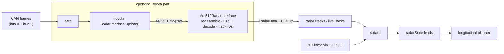

# 08. openpilot integration

The integration turns the object list into openpilot radar tracks without changing openpilot itself: a decoder plus
three small hooks in opendbc's Toyota port. radard, the planner and card run unchanged.

Install instructions for each fork are in [`openpilot/README.md`](../openpilot/README.md).

| fork | installer flavor | what changes | status |
|---|---|---|---|
| current openpilot (opendbc master) | `--flavor openpilot` | 3 Toyota files + decoder; flag 4096 | replayed end to end through card → radard → plannerd |
| StarPilot | `--flavor starpilot` | same 3 files in StarPilot's opendbc; flag 16384; StarPilot's own radard | driven by the owner (K4 profile) |
| sunnypilot v2026.002.002 | `--flavor sunnypilot` | same 3 files; flag 4096; `CP_SP` wrapper | installed on a device; activate with a reboot |
| any fork | `openpilot/radard_vision_fusion.patch` | optional radard change ([07](07_velocity_excursions.md#options)) | replayed |

## How it hooks in

1. **Detection** (`toyota/interface.py`). A `RADAR_ACC` Toyota gets `ToyotaFlags.ARS510_RADAR` and
   `radarUnavailable = False` when its radar firmware is in `ARS510_FW_VERSIONS` (`8821F0R03100`) or 0x80 and 0x85 were
   seen on bus 1. The firmware rule matters: the object list starts ~5.9 s after power-up, after fingerprinting.
2. **Hand-over** (`toyota/radar_interface.py`). Toyota's `RadarInterface.update()` delegates to
   `Ars510RadarInterface` when the flag is set. card needs no change.
3. **Decoding without a CANParser.** The interface reads the raw `(address, data, src)` tuples card already passes,
   reassembles 0x80 records, checks the CRC32 and decodes the 20 slots. Ego speed for vRel comes from 0xB4 on bus 0 in
   the same packets. Cost: about 9 µs per call on a desktop CPU.
4. **Output.** `RadarPoint(trackId, dRel, yRel, vRel)` for tracks aged ≥ 60 cycles, with track IDs re-linked across
   short losses and no point published without a fresh ego speed (vRel is never NaN).

| situation | RadarData | effect in openpilot |
|---|---|---|
| record completed (~16.7 Hz) | points | radard fuses them with the vision leads |
| before the first record (boot ~6 s) | empty, no error | vision-only leads, as on a radarless car |
| no record for > 0.5 s after the first | `radarUnavailableTemporary` | radarState invalid → `commIssue` (lateral too); with openpilot long also `radarTempUnavailable` |
| CRC-failed record | dropped | none; the 0.5 s rule covers sustained loss |

## Profiles

| profile | config | use |
|---|---|---|
| `default` | `OPENPILOT_CONFIG`: `min_publish_age=60`, `relink_max_gap_s=3.5`, `vground_scale=0.149/0.15`, `drop_unresolved_vrel=True` | every fork |
| `steady` (K4) | `STEADY_CONFIG` = default + `range_fusion_gain=0.1`, `vrel_smooth_far_tau_s=1.0` | **recommended**: halves extra roughness for 0.07 s of head start ([07](07_velocity_excursions.md#options)) |

`range_fusion_gain` predicts dRel with vRel and corrects toward the measurement, halving 1.5 s range walks.
`vrel_smooth_far_tau_s` smooths vRel with a time constant that rises from 0 s below 30 m to 1 s beyond 60 m.

## What radard does with radar points

radard (openpilot, September 2026) runs at the model's 20 Hz:

- **Kalman filter on vLead only.** One filter per track ID; a NaN vRel would poison it permanently (the interface
  never publishes one). A new track ID resets it, which is why IDs are re-linked.
- **Matching needs a vision lead.** radard matches a radar track to the vision lead while the lead probability is
  above 0.5, with a distance gate of max(5 m, 25%) and a permissive velocity check.
- **No lateral gate.** If the true lead is missing from the radar list, an adjacent-lane object at the right distance
  and speed becomes the lead 34-78% of the time, even at 6 m offset. The radar's own lane weights
  ([03](03_slot_fields.md#lane-assignment)) could supply one.

  

- **Low-speed override** (ego < 4 m/s): a radar-only lead within ±1 m laterally and 0.75-25 m ahead is accepted
  without vision.
- **16.7 Hz into 20 Hz.** radard re-uses the latest radar record on every tick, so 17.5% of ticks repeat the previous
  vRel; this adds about 1% to `aLeadK` roughness.
- **Stopped vehicles** first seen stopped come from vision ([02](02_object_list.md#what-the-radar-lists)).

## Radar + vision against vision only (replay)

20 held-out routes, 4.56 h with the driver controlling speed, openpilot `10b9e73` card → radard → plannerd, default
profile, judged against what the driver did:

| measure | vision only | radar + vision |
|---|---|---|
| first braking request (≤ −0.5 m/s²) around a driver brake press | — | **0.15 s earlier** [0.05, 0.26] |
| already asking ≤ −0.5 m/s² within 3 s before a brake press | 80.8% | **84.4%** |
| already asking ≤ −1.0 m/s² | 40.1% | 44.3% |
| hard slowdowns and stops never asked ≤ −1 m/s² (of 47) | 10 | 9 |
| stops behind an already-stopped vehicle missed (of 7) | 0 | 0 |
| moment-to-moment error vs the driver's acceleration 0.5 s later | 0.174 m/s² | 0.186 m/s² |
| radar-only requests ≤ −1 m/s² for ≥ 0.3 s | — | 1.97 / h (driver on the gas for 0.88 / h) |
| forward-collision warnings | 0 | 0 |

Radar reacts earlier and a little more often to real slowdowns and adds some jitter from velocity excursions; the
steady profile keeps most of the first and halves the second.

*Brake event E3: the lead is in a left curve (lateral offset about +6 m). The radar lead reads a closing speed of
−5 to −8 m/s while vision reads about −1; the driver braked about 2 s later.*

*Three driver-brake events through radard and the planner: E3 and E4 are real closings the radar saw seconds before
vision (E4 with a range walk that radard's distance gate correctly rejects); E2 is a velocity excursion.*

## On the road

The owner has driven the integration on two forks:

- **FrogPilot 0.9.7 port** (4 drives, 1.05 h): radar-backed following felt good. Seven moments had openpilot braking
  harder than vision-only would: four radar false closings at 33-115 m (at most 0.8 m/s² extra) and three real
  closings the radar saw first. Stops end about 1 m closer to the lead (median gap 4.4 m): the radar measures the gap
  directly, while vision reads it 0.5-1 m short. When stopped close behind a car, the UI's lead chevron can sit on the
  hood, because the UI places it from dRel in the camera frame.
- **StarPilot with K4** (2 drives, 18 min of openpilot longitudinal): hard brakes were real slowdowns, with radar and
  camera agreeing on closing speed. StarPilot's planner extrapolates lead acceleration unchanged above 35 mph, which
  turns radar's early `aLeadK` into brake-then-accelerate swings; stock openpilot's planner decays it. Radar leads the
  camera by 0.2-0.4 s on decelerating leads. Near a stopping queue, radar held a stopped lead at 3-4 m/s for about
  2 s once (24 of 894 ticks overall with radar > 2 m/s while the camera read stopped).

## Checking a new install on the car

1. **Parked, ignition on:** `carParams.flags` has the ARS510 bit, `radarUnavailable` is false, and `radarTracks`
   (or `liveTracks`) arrive at ~16.7 Hz with points after ~6 s.
2. **Stock ACC, openpilot lateral only:** radar tracks feed radarState and the UI lead; compare leads with the video
   and look for `commIssue` events.
3. **openpilot longitudinal:** on stock openpilot, alpha long sends the radar a UDS "disable transmit" at startup; check
   that 0x80 keeps arriving on bus 1 (on the owner's forks, with a smartDSU-style setup, it does).
