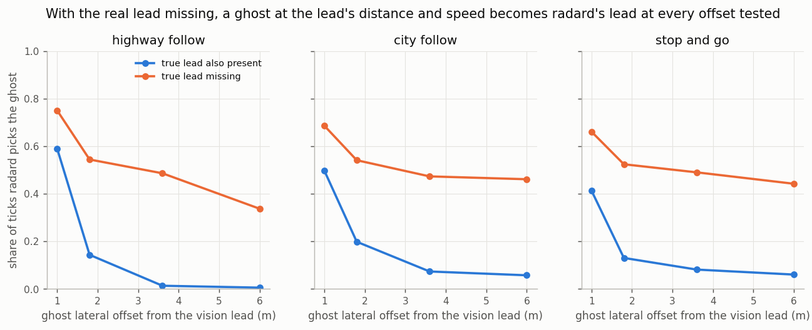
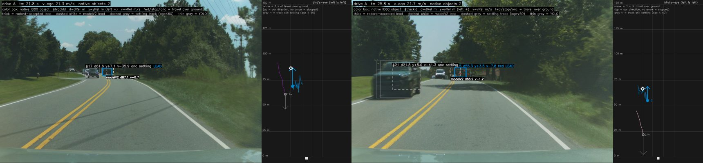
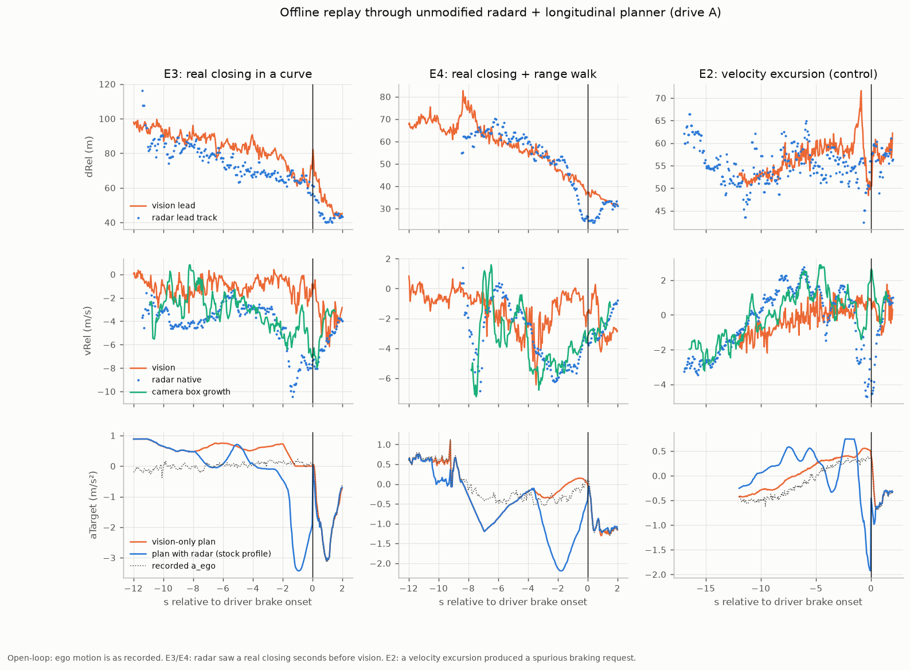

# 08. openpilot integration

The integration turns the object list into openpilot radar tracks without changing openpilot itself: a decoder plus
one appended hook block in opendbc's Toyota port (detection and hand-over). radard, the planner and card run unchanged.

Install instructions for each fork are in [`openpilot/README.md`](../openpilot/README.md).

One installer serves every fork: it copies the decoder and appends a 4-line hook block to the end of
`opendbc/car/toyota/interface.py`, with no in-place edits and no new flag bit.

| fork | status |
|---|---|
| current openpilot (opendbc master) | self-check passes; replayed end to end through card → radard → plannerd |
| sunnypilot v2026.002.002 | self-check passes; native-profile replay through original RadarD / plannerd under two prospective schedules ([07](12_kalman_filter.md#earlier-approach-tuned-layers-removed)); carries `aRel` / `yvRel`; installed on the owner's device |
| StarPilot | same hook; driven by the owner with the earlier patch-based install |
| any fork | optional `openpilot/radard_vision_fusion.patch` ([07](12_kalman_filter.md#other-approaches-tested)) |

## How it hooks in

1. **Detection** (hook around Toyota's `CarInterface._get_params`). A `RADAR_ACC` Toyota gets
   `radarUnavailable = False` when its radar firmware is in `ARS510_FW_VERSIONS` (`8821F0R03100`) or 0x80 and 0x85
   were seen on bus 1. The firmware rule matters: the object list starts ~5.9 s after power-up, after fingerprinting.
2. **Hand-over** (hook on `CarInterface.RadarInterface`, which card instantiates). A radar-ACC Toyota with radar
   available is built as `Ars510RadarInterface`; every other car gets the fork's own RadarInterface. card needs no
   change.
3. **Decoding without a CANParser.** The interface reads the raw `(address, data, src)` tuples card already passes,
   reassembles 0x80 records, checks the CRC32 and decodes the 20 slots. Ego speed for vRel comes from 0xB4 on bus 0 in
   the same packets. Cost: about 9 µs per call on a desktop CPU.
4. **Output.** `RadarPoint(trackId, dRel, yRel, vRel)` for tracks aged ≥ 60 cycles (with `fused`, also once their
   speed is known to ±0.75 m/s), with the radar's own track IDs (`raw` also re-links them across short losses) and no
   point published without a fresh ego speed (vRel is never NaN). Forks whose RadarPoint still
   has the legacy fields (sunnypilot) also get:
   - `yvRel`: the radar's lateral ground velocity minus yaw rate × range, with the yaw rate from Toyota 0x24
     (matches the phone gyro at 1.02×). It follows d(yRel)/dt at r = 0.88 with slope 0.86, since the radar filters
     it.
   - `aRel`: the radar's filtered over-ground acceleration minus ego acceleration (from 0xB4). It is smoothed and
     lags vRel by 0.5-1 s.

   - `measured`: false on records the radar marks as predicted (`107|1`), like the Tesla radar's `Meas`.

   `aRel` and `yvRel` are NaN without fresh yaw rate or ego speed. openpilot's and sunnypilot's radard read none of
   these three fields for lead selection (radard stores `measured` but does not weight it).

| situation | RadarData | effect in openpilot |
|---|---|---|
| record completed (~16.7 Hz) | points | radard fuses them with the vision leads |
| between completed records, last record still fresh | no message (`None`) | radard retains the last scan; a genuinely empty completed scan still clears its tracks |
| before the first record (boot ~6 s) | empty, no error | vision-only leads, as on a radarless car |
| no record for > 0.5 s after the first | `radarUnavailableTemporary` | radarState invalid → `commIssue` (lateral too); with openpilot long also `radarTempUnavailable` |
| CRC-failed record | dropped | none; the 0.5 s rule covers sustained loss |

## Profiles

`install.py --profile NAME` picks one; with no `--profile` you get `fused`. Every profile starts from the native
object list. Validity, age, guard and filter-readiness rules determine when a track is published; value filtering
and ID continuity also depend on the profile.

| profile | what it is | when to use |
|---|---|---|
| **`fused`** (default) | `FUSED_CONFIG` = `raw` + range fusion + one Kalman speed filter that weights the object list, the radar's ACC target and its summaries by their own uncertainty ([12](12_kalman_filter.md#the-model)), with a path gate against next-lane leads ([12](12_kalman_filter.md#path-gate)) | everyday driving: the fewest false brakes, unbiased closing speed, vision's timing ([11](11_profiles_compared.md)) |
| `raw` | `BASE_CONFIG`: the unfiltered radar decode plus only what radard needs (tracks from age 60, ego-speed subtraction, invalid-code guard) | research and comparison only. **Velocity excursions reach the planner unfiltered** |
| `openpilot` | the upstream version ([`upstream/ars510_radar.py`](../upstream/ars510_radar.py)): one file in opendbc style with `fused`'s filter minus the summaries, points with `trackId` / `dRel` / `yRel` / `vRel` only ([10](10_research_directions.md#towards-an-upstream-comma-interface)) | driving exactly what is proposed for openpilot |
| `colored` | experimental: `COLORED_CONFIG`, `fused` with a colored-noise (bias) state for the object list ([12](12_kalman_filter.md#kalman-variants-tested)) | road tests only: fewer false closings offline, slower to let go of a far excursion that recovers |

`--profile openpilot` runs the same `Ars510Radar` core as the standalone file through the fork adapter (fork
constructor arguments, legacy point fields); its `trackId` / `dRel` / `yRel` / `vRel` match `fused` with the summaries
off ([12](12_kalman_filter.md#removing-parts-together)).

`raw` is the unfiltered radar decode, not vision-only and not stock openpilot; its older names `stock` and `default` are still accepted. The earlier tuned profiles `anchor` and `steady` were outperformed by `fused` and removed: `--profile anchor` or `steady` installs `fused` with a notice.

Replay against the driver, unchanged openpilot card → radard → planner
([fused](../data/analysis/summaries/fused_filter.json),
[profile figures](12_kalman_filter.md)):

| | `raw` | `fused` without ACC / summary | `fused` |
|---|---|---|---|
| hard radar-only braking ticks, 20 held-out routes (4.6 h) | 93 | 48 | **30** |
| radar-only episodes (hard / target), held-out | 15 / 19 | 10 / 8 | **10 / 4** |
| hard radar-only braking ticks / target episodes, owner sunnypilot drives | 17 / – | **0** / 4 | **0** / 1 (an early reaction to a real slowdown) |
| hard radar-only braking ticks, fresh owner drives (1.9 h) | 16 | – | **0** |
| mean braking onset vs the driver, 167 held-out events | −1.170 s | −1.090 s | −1.085 s |
| driver brakes the planner anticipated (≤ −1 m/s² from 3 s before to 0.5 s after) | 44.3% | 41.9% | 41.9% |

The middle column is `fused` with the ACC target and summary readings ignored: the Kalman filter on the object list
alone, which is the fallback when neither a matched ACC target nor a summary update is available.

`raw` reacts earlier than `fused` before some driver brakes because of an over-closing bias, the same one that causes
its false brakes ([12](12_kalman_filter.md#the-model)). `fused` still asks for braking slightly before vision on
average (−0.02 s).

"Hard radar-only" means the planner asks for ≤ −2 m/s² while the same drive without radar asks for no more than
−0.5 m/s²: braking that only the radar wanted. `raw` reacts earlier on average but asks for hard braking three times
as often as `fused`, almost always because of a velocity excursion.

What each setting does (examples and plots in [07](12_kalman_filter.md)):

| setting | profiles | effect |
|---|---|---|
| `min_publish_age=60` | all | a track is published after ~3.6 s, once range and velocity have converged |
| `relink_max_gap_s=3.5` | raw | a lost and re-found track keeps its ID; with the speed filter it changes nothing (34 drives), so `fused` leaves it off |
| `vground_scale=0.149/0.15`, `drop_unresolved_vrel` | all | ego-speed alignment against Toyota 0xB4; no point without a fresh ego speed (radard's filter never recovers from NaN) |
| `drop_saturated_codes` | raw | withholds the invalid velocity code 1023/0 and restarts the track ID afterwards (the filter's robust update absorbs it in `fused`) |
| `range_fusion_gain=0.1` | fused | predicts dRel with vRel and corrects 10% toward the measurement: halves 1.5 s range walks |
| `fused_speed_filter` (σ per reading from `240\|7`, ACC target, summary; lead acceleration 1.5 m/s²; 3σ clamp; first publication at speed std ≤ 0.75 m/s) | fused | one Kalman speed filter per track ([07](12_kalman_filter.md#the-model)); the ACC target is associated by position and the association survives the target's range sliding; summaries are used up to 80 m |

## What radard does with radar points

radard (openpilot, September 2026) runs at the model's 20 Hz:

- **Kalman filter on vLead only.** One filter per track ID; a NaN vRel would poison it permanently (the interface
  never publishes one). A new track ID resets it; `raw` therefore re-links IDs across short losses, while
  `fused` hands radard an already filtered speed, so a reset changes nothing measurable there.
- **Matching needs a vision lead.** radard matches a radar track to the vision lead while the lead probability is
  above 0.5, with a distance gate of max(5 m, 25%) and a permissive velocity check.
  Matching is evaluated each tick without previous-lead hysteresis; if the camera still selects the departing
  vehicle, both radar fusion and vision-only can remain on it. Delay measured after the camera changes its lead
  is a different quantity from delay after a physical lane departure. A radar/vision source-switch count also
  differs from physical vehicle handover.
- **No lateral gate.** If the true lead is missing from the radar list, an adjacent-lane object at the right distance
  and speed becomes the lead 34-78% of the time, even at 6 m offset. The radar's own lane weights
  ([03](03_slot_fields.md#lane-assignment)) could supply one.

  

- **Low-speed override** (ego < 4 m/s): a radar-only lead within ±1 m laterally and 0.75-25 m ahead is accepted
  without vision.
- **16.7 Hz into 20 Hz.** radard re-uses the latest radar record on every tick, so 17.5% of ticks repeat the previous
  vRel; this adds about 1% to `aLeadK` roughness.
- **Stopped vehicles** first seen stopped come from vision ([02](02_object_list.md#what-the-radar-lists)).

## Radar + vision against vision only (replay)

Every profile against vision only on 20 held-out routes (4.56 h with the driver controlling speed, 167 brake presses),
unchanged openpilot card → radard → planner; details, driving pros and cons and assumptions in
[11](11_profiles_compared.md#against-vision-only):

| | vision only | `raw` | `fused` without ACC / summary | `fused` |
|---|---|---|---|---|
| first braking request vs vision, mean | — | −0.15 s | −0.03 s | −0.02 s |
| already asking ≤ −1.0 m/s² within 3 s before a brake press | 40.1% | 44.3% | 41.9% | 41.9% |
| hard slowdowns never asked ≤ −1 m/s² (of 47) | 10 | 9 | 10 | 10 |
| braking only the radar asked for, per hour (driver on the gas) | 0 | 1.75 (0.66) | 0.88 (0.22) | 0.22 (0) |
| request jerk, mean \|da/dt\| | 1.029 | 1.009 | 1.007 | 0.999 |
| flips between a radar and a vision lead, per hour | 0 | 939 | 703 | 494 |
| forward-collision warnings | 0 | 0 | 0 | 0 |

`raw`'s earlier reactions come partly from real head starts (closings through curves, far away) and
partly from an over-closing bias that also causes its radar-only braking; `fused` removes the bias, still asks for
braking slightly before vision on average, and keeps nearly all of radar's distance accuracy.

*Brake event E3: the lead is in a left curve (lateral offset about +6 m). The radar lead reads a closing speed of
−5 to −8 m/s while vision reads about −1; the driver braked about 2 s later.*

*Three driver-brake events through radard and the planner: E3 and E4 are real closings the radar saw seconds before
vision (E4 with a range walk that radard's distance gate correctly rejects); E2 is a velocity excursion.*

## On the road

The owner has driven the integration on three forks:

- **FrogPilot 0.9.7 port** (4 drives, 1.05 h): radar-backed following felt good. Seven moments had openpilot braking
  harder than vision-only would: four radar false closings at 33-115 m (at most 0.8 m/s² extra) and three real
  closings the radar saw first. Stops end about 1 m closer to the lead (median gap 4.4 m): the radar measures the gap
  directly, while vision reads it 0.5-1 m short. When stopped close behind a car, the UI's lead chevron can sit on the
  hood, because the UI places it from dRel in the camera frame.
- **StarPilot with an early tuned smoothing profile** (2 drives, 18 min of openpilot longitudinal): hard brakes were real slowdowns, with radar and
  camera agreeing on closing speed. StarPilot's planner extrapolates lead acceleration unchanged above 35 mph, which
  turns radar's early `aLeadK` into brake-then-accelerate swings; stock openpilot's planner decays it. Radar leads the
  camera by 0.2-0.4 s on decelerating leads. Near a stopping queue, radar held a stopped lead at 3-4 m/s for about
  2 s once (24 of 894 ticks overall with radar > 2 m/s while the camera read stopped).
- **sunnypilot with the earlier tuned profile** (2 drives): far fewer hard brakes than before and usable day to day,
  with some brake-then-accelerate oscillation while following that vision-only shows less.
- **sunnypilot with `fused` 2.1.0** (9 drives, 7.4 h, 4.4 h with openpilot longitudinal; the logged radar tracks match
  a re-decode with 2.1.0 exactly). Every engaged brake request of 1.5 m/s² or more (26) had the camera and the radar's
  ACC target closing too. Replayed open loop against vision only: no hard radar-only braking in 5.8 moving hours, and
  braking starts 0.4-1.0 s before vision on every drive. Two mild slowdowns (about 1.5 m/s², both
  overridden with the gas) had a lead beyond 95 m and no ACC target: on a curve radard paired the camera's lead with a
  radar object a lane over, and in a work-zone lane shift the right car's radar speed read 3.5 m/s too much closing. One late, firm brake (2.8 m/s²) came from a car first
  detected at 66 m whose object-list range read 15-20 m short until it settled.
- **A second driver's 2025 RAV4 Hybrid** (sunnypilot, `fused` 2.1.0, [issue #66](https://github.com/ds-sebastian/ars510-radar/issues/66)):
  the same numbers as the owner's car. Radar and camera disagree on closing speed by more than 3 m/s for 1.7% of the
  lead time (owner: 1.8%), 7.0% beyond 70 m (owner: 8.2%), and the ACC target is present 99 / 95 / 66% of the
  radar-lead time at 15-40 / 40-80 / 80-200 m (owner: 99 / 99 / 66%). No unprompted braking in 21 minutes of
  openpilot longitudinal, where an older profile had braked for far leads holding their distance; the one remaining
  case was a lead taken from the next lane, the same radard pairing as above.

Numbers: [`road_v21.json`](../data/analysis/summaries/road_v21.json).

## Checking a new install on the car

1. **Parked, ignition on:** `install.py --check` shows the hook as present; in the log, `carParams.radarUnavailable` is
   false and `radarTracks` (or `liveTracks`) arrive at ~16.7 Hz with points after ~6 s. (The integration adds no
   `carParams.flags` bit.)
2. **Stock ACC, openpilot lateral only:** radar tracks feed radarState and the UI lead; compare leads with the video
   and look for `commIssue` events.
3. **openpilot longitudinal:** alpha long sends the radar a UDS "disable transmit" (`28 01 01`) at startup. That stops
   only the radar's car-bus messages; 0x80 keeps arriving on bus 1 without a CAN filter, so radar tracks continue
   ([01](01_radar_bus.md#openpilots-radar-disable)). Check that the radar answers `68 01` and that `radarTracks` stay at
   ~16.7 Hz after it.
