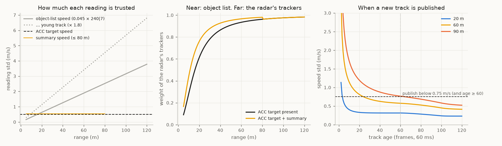
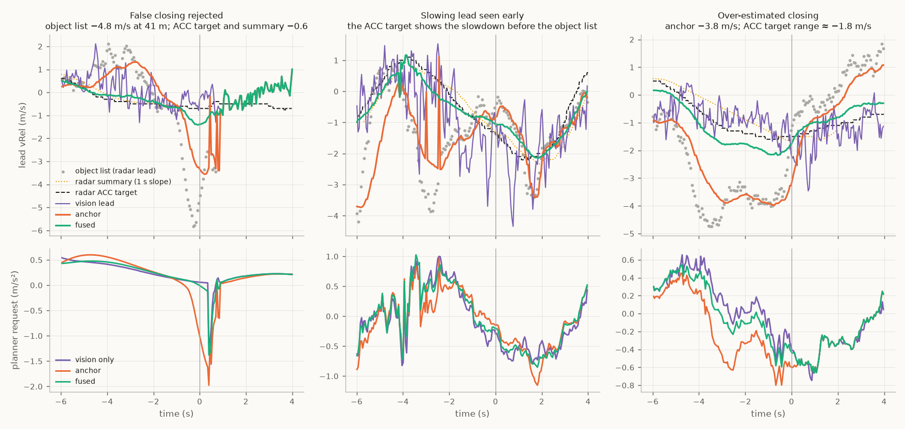
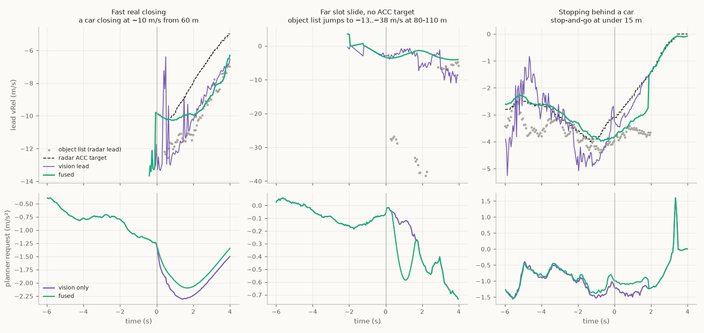
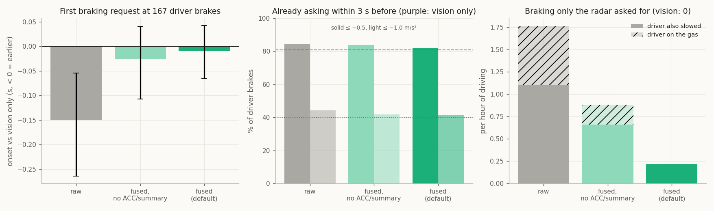

# 11. Profiles compared: what each does, against vision only and other radar parsers

`raw` and `fused` (plus a diagnostic comparison without the radar's own trackers), compared on how
they work, against **vision only** (stock openpilot on this car), on driving feel, and against openpilot's other radar
interfaces.

Numbers: [`profiles_vs_vision.json`](../data/analysis/summaries/profiles_vs_vision.json),
[`fused_filter.json`](../data/analysis/summaries/fused_filter.json). Figures: `tools/make_fused_figures.py`,
`tools/make_profile_figures.py`.

## At a glance

| | `raw` | `fused` without ACC / summary | `fused` (default) |
|---|---|---|---|
| what it adds to the decode | nothing (validity, IDs, ego subtraction) | range fusion + one Kalman speed filter on the object list | the same filter, also fusing the radar's ACC target and summaries |
| filter settings | — | scalar process scale, robust update and readiness threshold | also tracker weights; [definitions and evidence](12_kalman_filter.md#the-model) |
| code beyond the decode (openpilot-file lines) | ~60 (guard, relink; fork only) | +24 | +82 |
| hard radar-only braking ticks, 20 held-out routes | 93 | 48 | **30** |
| braking only the radar asked for, per hour (driver on the gas) | 1.75 (0.66) | 0.88 (0.22) | **0.22 (0)** |
| first braking request vs vision only, 167 driver brakes | **−0.15 s** | −0.03 s | +0.01 s |
| recommended for | research | object-only fallback when neither a matched ACC target nor summary is available | everyday driving |

`raw` is the unfiltered radar decode, not vision only and not stock openpilot. The middle column is not a separate
profile: it is `fused` with the ACC target and summary ignored, which shows the Kalman filter on its own. The earlier
tuned profiles (`anchor`: 48 hard ticks, 1.10 radar-only brakes per hour; `steady`: 53, 1.31) were outperformed by
`fused` and removed; installing them now installs `fused`.

## How each profile works

*Each row is one processing step; coloured cells are the steps a profile runs. Line counts are source lines of the
fork build (`ars510/`).*

- **`raw`** publishes the object list as decoded: tracks from age 60 (≈ 3.6 s, once range and speed have converged),
  the radar's own track IDs re-linked across short gaps, speed relative to the ego car, and the invalid velocity code
  withheld. Velocity excursions (1-10 s false closings beyond 40 m, [07](07_velocity_excursions.md)) reach the planner.
- **`fused`** adds range fusion and **one Kalman filter per track**
  on the lead's over-ground speed ([12](12_kalman_filter.md#the-model)). It uses the scalar Kalman equations
  with a chosen process-noise scale of 1.5 m/s². Each reading updates it in turn, weighted by its model variance:
  object-list speed has σ = 0.045 m/s × max(`240|7`, 1), multiplied by 1.8 through age 60 and tapered to 1 at age 100.
  An available matched ACC target or summary uses σ 0.5 m/s; at most one tracker is applied to each native track. Innovations beyond 3σ count as 3σ (a robust Kalman update), and
  a track is first published once its modeled speed standard deviation is at most 0.75 m/s (and age at least 60).
  This is an operational readiness gate, not a calibrated physical error bound. radard then runs its own Kalman
  filter on the lead; `fused` feeds it one speed per track that already combines what the radar knows.

*Left: how much `fused` trusts each reading by range. Middle: the share of the estimate coming from the radar's own
trackers when they are present. Near, the object list dominates; beyond ~40 m the ACC target and summaries do. Right:
speed standard deviation of a new track against age; the 0.75 m/s line is the publication gate, which holds young far
tracks back without a range threshold.*

*Both profiles on the two bundled excursions (regenerated from `data/sample/`).*

### `fused` in six real moments

*Lead closing speed (top) and planner request (bottom) under vision only and `fused`, through the unchanged
planner; grey dots are the raw object-list speed of the radar lead, dashed is the radar's ACC target, dotted the
summary slope where the parser would associate it. Times are relative to the moment.*

1. **False closing rejected.** The object list dives to −6 m/s; the ACC target and summary stay at −0.6. `fused`
   follows the trackers and asks for what vision asks for.
2. **Slowing lead seen early.** The ACC target shows the lead slowing before the object list does; `fused` follows it
   and asks for braking before the driver presses the brake.
3. **Over-estimated closing.** The object list reports more closing than the ACC target's own range shows
   (≈ −1.8 m/s); `fused` stays near the ACC target and vision, so it does not brake early.
4. **Fast real closing.** All agree it is real. `fused` sits between the object list and the ACC target and brakes
   slightly less than vision (−2.1 vs −2.3 m/s²).
5. **Far slot slide, no ACC target.** The object list jumps to −13 … −38 m/s at 80-110 m (the radar's slot moving
   between reflectors). `fused` dips to −0.6 m/s², vision stays near 0.
6. **Stopping behind a car.** Near range the object list dominates; `fused` hands the lead to the closer vision lead
   like vision does.

## Against vision only

Each profile was replayed on the same 34 drives through the unchanged openpilot card → radard → planner, and
judged against what the driver did, with the pre-registered definitions used for the original radar-vs-vision test.
Held-out set: 20 routes, 4.56 h with the driver controlling speed, 167 driver brake presses, 47 hard slowdowns.

| driver brake presses (167) | vision only | `raw` | `fused` w/o ACC / summary | `fused` |
|---|---|---|---|---|
| first request ≤ −0.5 m/s², mean vs vision (95 % CI) | — | −0.15 s [−0.26, −0.05] | −0.03 s [−0.11, +0.04] | +0.01 s [−0.04, +0.06] |
| median first request vs the brake press | −0.61 s | −0.87 s | −0.74 s | −0.67 s |
| already asking ≤ −0.5 m/s² within 3 s before | 80.8 % | 84.4 % | 83.8 % | 81.4 % |
| already asking ≤ −1.0 m/s² within 3 s before | 40.1 % | 44.3 % | 41.9 % | 41.9 % |
| hard slowdowns never asked ≤ −1 m/s² (of 47) | 10 | 9 | 10 | 10 |

| over 4.56 h of driver-controlled driving | vision only | `raw` | `fused` w/o ACC / summary | `fused` |
|---|---|---|---|---|
| braking (≤ −1 m/s², ≥ 0.3 s) only this system asked for, per hour | 0 | 1.75 | 0.88 | 0.22 |
| … of which the driver was on the gas | — | 0.66 | 0.22 | 0 |
| hard radar-only braking ticks (≤ −2 m/s² while vision ≥ −0.5) | — | 93 | 48 | 30 |
| driver overrides (38): radar request closer / further than vision to what the driver then did | — | 7 / 2 | 6 / 1 | 5 / 0 |
| request error vs the driver's acceleration 0.5 s later (RMS) | 0.409 m/s² | 0.422 | 0.419 | 0.414 |
| request jerk (mean \|da/dt\|) | 1.029 | 1.009 | 1.007 | 1.001 |
| share of lead time on a radar lead | 0 | 86.6 % | 86.8 % | 87.1 % |

What the radar adds, by profile:

- **`raw` brakes earlier than vision** (0.15 s on average) and anticipates a few more driver brakes. Part of that head
  start is real (the radar sees closings through curves and before the camera's distance estimate settles); part comes
  from an over-closing bias of the unfiltered object list (the earlier tuned profile was still 0.54 m/s more closing
  than the vision lead in the 4 s before driver brakes). The same bias causes its radar-only braking.
- **`fused` removes that bias** (0.02 m/s from vision on average) and, with it, almost all radar-only braking: 0.22 per
  hour, every one while the driver also slowed. Its timing is then the same as vision on average: 11 driver brakes are
  answered earlier than vision (by 0.62 s on average, 7 of them hard slowdowns) and 17 later; 14 of those 17 are
  equally late with every radar profile (the radar lead shows less closing than vision there), so they come from using
  radar at all, not from the filter.
- **The Kalman filter alone** (no ACC target or summary) halves `raw`'s false braking (93 → 48 hard ticks, as many as
  the whole earlier tuned stack) with onset between `raw` and `fused`; the radar's own trackers supply the rest of
  `fused`'s gain.
- **Every profile follows a radar lead about 86-87 % of the time a lead exists**, so radard uses radar distance
  (6 cm resolution; frame-to-frame jitter about 3 % of range far out) rather than the camera's distance estimate.

## Driving experience: pros and cons

| profile | pros | cons |
|---|---|---|
| vision only | smooth; no radar-specific false braking | camera distance at range; no radar head start on closings through curves or far away |
| `raw` | earliest reaction to real slowdowns (−0.15 s vs vision) | the most radar-only braking (1.75 / h, a third with the driver on the gas): occasional sharp brakes for nothing beyond 40 m |
| `fused` | closest to vision in feel (lowest jerk, smallest error vs the driver), radar-only braking almost gone, small average pre-brake closing bias against vision in these replays, one speed state | braking onset the same as vision on average (no average head start); one car's road miles so far |

## Assumptions and limits

- **Open-loop replay.** The recorded drives are replayed through the unchanged openpilot (or sunnypilot) radard and
  planner; the car's actual motion stays as recorded, so differences are what the planner would have asked for, not
  what the car would then have done.
- **The driver is the reference, not ground truth.** "Earlier" and "anticipated" are measured against the moment the
  driver pressed the brake; a profile that brakes before the driver is not automatically right.
- **Vision only is stock openpilot's own lead model** on the same recorded camera frames; its lead speed is noisy
  and is a comparison, not truth. The radar's ACC target and summaries are the radar's own estimates (sent by the
  radar, [05](05_acc_target_and_support.md)); they are not independent of the radar.
- **Scope.** One car (RAV4 2022 / 2023, firmware `8821F0R03100`), 34 replay drives (20 held-out routes, 4.56 h of
  driver-controlled time; 4 further drives; 3 owner sunnypilot drives) used during development, plus 8 fresh drives.
  Fewer than 10 events separate several of the rows above.
- **Definitions.** Hard radar-only tick: planner ≤ −2 m/s² while vision only asks ≥ −0.5. Driver-brake metrics use
  [−3, +0.5] s (anticipation), [−3, +2] s (first request) and [−3, +1] s (missed hard slowdown) around the brake press.

## Compared with the other radar interfaces in openpilot

| interface | code lines | what it does |
|---|---|---|
| Toyota (older radars, 0x210-0x22F) | 70 | `VALID` flag plus a score / valid counter; pass-through |
| Tesla (Continental, like the ARS510) | 66 | `Tracked`; publishes `Meas` as `measured`; radar status for faults |
| Honda | 60 | range < 255; pass-through |
| Hyundai | 55 | track `STATE`; pass-through |
| Rivian | 54 | `STATE`; pass-through |
| Chrysler | 56 | pass-through |
| GM | 71 | pass-through of the radar's targets |
| Ford | 194 | clusters raw Delphi detections into tracks |
| **ARS510 openpilot version** ([`upstream/ars510_radar.py`](../upstream/ars510_radar.py)) | 238 | the whole `fused` profile in one file: |
| … record reassembly, CRC, slot decode, track IDs, publication | 93 | a 742-byte record from 106 CAN frames, 20 slots of bit fields |
| … ACC target and summary association | 58 | match the radar's own trackers to one track each |
| … Kalman speed filter and range fusion | 24 | the filter itself |
| … RadarInterface adapter, constants, pruning | 63 | as in other interfaces |

- The listed interfaces generally consume tracked radar outputs, apply validity/lifecycle checks and leave speed
  filtering to radard. That code structure does not establish physical accuracy for every radar or driving condition.
- The ARS510's far-range speed has a wide error that it reports (`240|7`) but does not flag per moment, so some
  estimation is supported by these replay comparisons. `fused` uses one scalar filter with an empirical object-code
  scale and chosen tracker/process weights ([12](12_kalman_filter.md#the-model)).
- Moving that weighting into radard (a per-point speed variance) would make this interface a pass-through like the
  others ([10](10_research_directions.md#towards-an-upstream-comma-interface)).
