# 11. Visual tour: what the radar looks like, what works, and what to review

Every chart is regenerated from the shipped, anonymized dataset by `tools/make_analysis_figures.py`, and the statistics come from `tools/compute_stats.py` ([12](12_statistics.md)). Route shots are camera frames with the decoded radar objects projected onto the road. The projection uses only the log's own calibration and openpilot's camera intrinsics, nothing fitted.

These are historical measurements and exploratory visualizations, not independent ground truth. Read [13](13_evidence_review.md) for corrected structural interpretations and newer, less favourable stationary-target results. The legacy bit-map dataset is retained for provenance; automatic field splits are hypotheses, not a complete verified protocol definition.

Each section ends with **Review** (what a second pair of eyes should check) and, where one exists, **Idea** (an untested direction the data suggests).

Drive names: **A** = development (mixed highway and rural), **B** = held-out city (rain, night), **C** = held-out highway. Segment labels like `C13` are the 14th one-minute file of drive C.

---

## Part 1: Route shots

### How to read an overlay

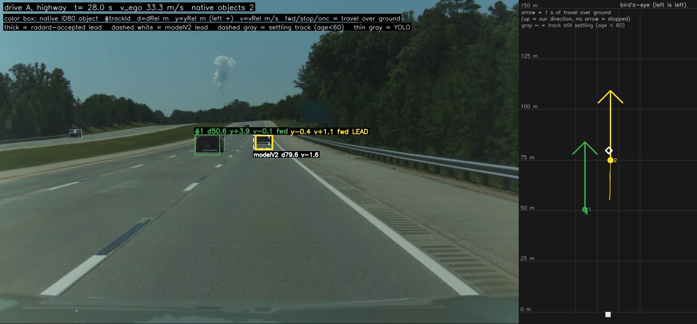

**Left, the road camera:**
- coloured box = one 0x80 object, drawn as a 1.8 × 1.5 m box standing on the road at its decoded dRel/yRel;
- label = `#trackId d=dRel y=yRel v=vRel` plus the direction of travel over ground (`fwd` / `stop` / `onc`);
- **thick** outline = the object radard accepts as the lead;
- dashed white = the vision model's lead;
- dashed gray = a track still settling (age < 60);
- thin gray = YOLO boxes, the camera reference used for validation.

**Right, the bird's-eye view:** each arrow is 1 s of travel over ground, and the tail is the last 2 s of positions. Licence plates and signs with place names are blurred.

### Busy highway (drive C)

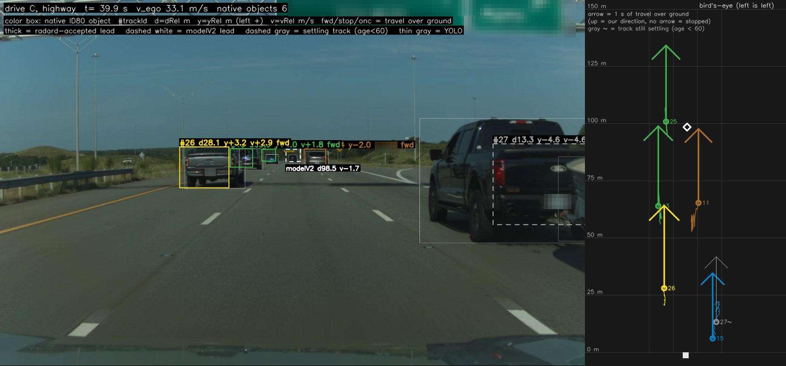

- Six or more settled objects across four lanes, each box landing on a vehicle.
- Lateral sign and scale hold across lanes.
- The close truck on the right (`#27`) is still "settling": it has just entered the radar's field of view.
- The bird's-eye trails show the typical record-to-record range walk (a few metres, zig-zagging) on the far lead.

### The false closing (drive A, highway, 31 m/s)

- The same settled lead (`#1`, age 126) is shown over 4 s.
- Its range stays around 48–50 m and slowly opens, and the camera box does not grow.
- vRel swings from +2.4 to about −6 m/s and back (see the chart in [06](06_known_limitations.md)).
- Replayed through radard and the planner, this produced a forward-collision warning and −3.5 m/s².
- **No validated flag has been found for it.** This is a demonstrated replay failure, not proof that no useful metadata exists.

### Young tracks are wrong (drive A, rural road)

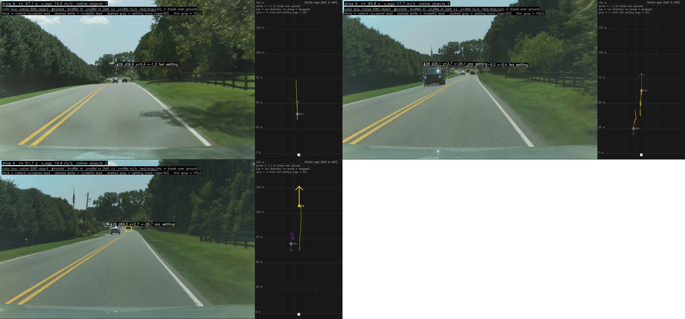

- A newly born track (`#26`, gray and dashed) reads **38 m** for cars that are about 100 m ahead.
- Over about 3 s it walks out to 107 m.
- On the same road, oncoming cars are first reported by young tracks with implausible speeds (for example `v −41` "onc settling").
- This is why `OPENPILOT_CONFIG` holds tracks until age 60.

### Radar sees closing before vision (drive A, curve; brake event E3)

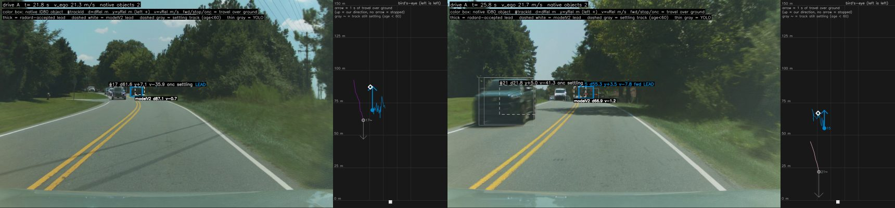

- The lead is in a left curve, so its lateral offset grows to about +6 m.
- The radar lead reads a closing speed of −5 to −8 m/s while vision reads about −1.
- The driver braked about 2 s later.

### Range walk on a real closing (drive A; brake event E4)

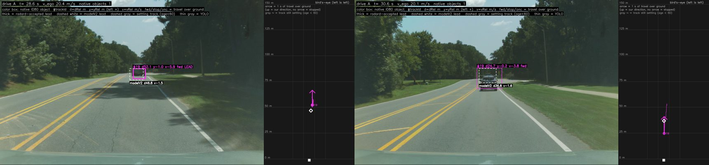

- The radar lead reads 24.7 m against the vision model's 36.8 m.
- The camera box grows only 16% while the radar range halves.
- The radar's velocity was right; its range walked.
- radard's 25% distance gate rejected the radar lead here, which is correct behaviour.

### Rain, stopped queue (drive B)

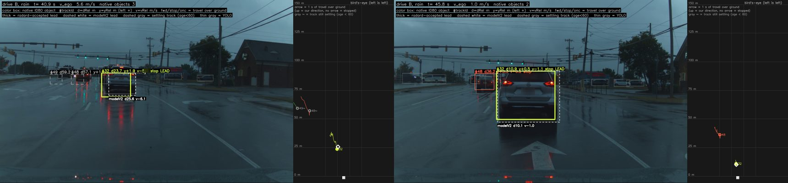

The stopped lead at 10.9 m reads `stop`, with vRel ≈ −v_ego. The old range-selected stationary test gave 0.4–0.6 m/s RMS, but selection depended on radar range. The newer video-selected test is less favourable ([13](13_evidence_review.md)).

### Night: a track "dies" with a +61 m/s reading (drive B)

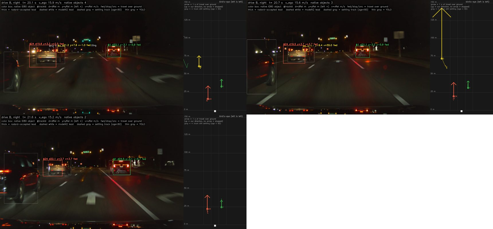

- Track `#2` is a car about 61 m ahead in the left lane.
- In its last ~1 s it jumps to 72 m and **+55 to +61 m/s** (that is 76 m/s over ground), then the radar drops it.
- Implausible for the pictured vehicle. Tracker extrapolation, state/validity interpretation or association errors remain possible explanations.
- That prompted the exploratory "track end" analysis in Part 5.

---

## Part 2: The wire format

### Raw records

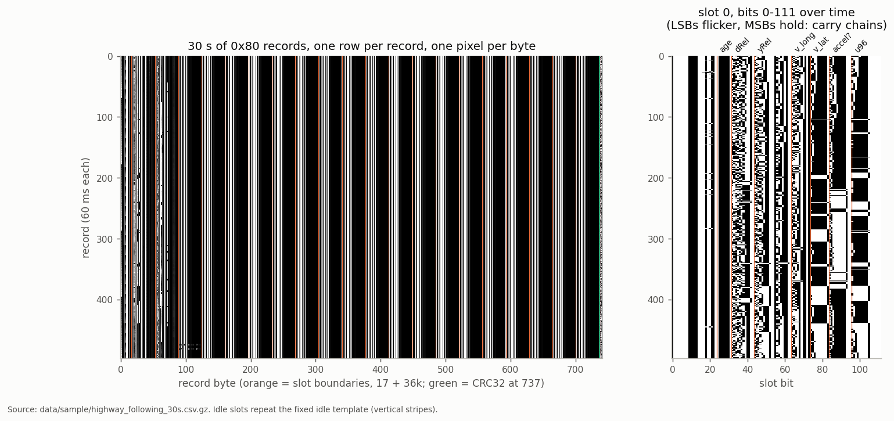

- **Left:** 30 s of 742-byte 0x80 records, one row per record.
  - The 20 slots are visible as 36-byte columns; unused slots show the constant idle template.
  - The CRC at bytes 737–740 is pure noise, as a CRC should be.
- **Right:** one slot's bits over time. Least-significant bits flicker and most-significant bits hold. That pattern, a carry chain, is how the field boundaries were found.

### All 288 slot bits

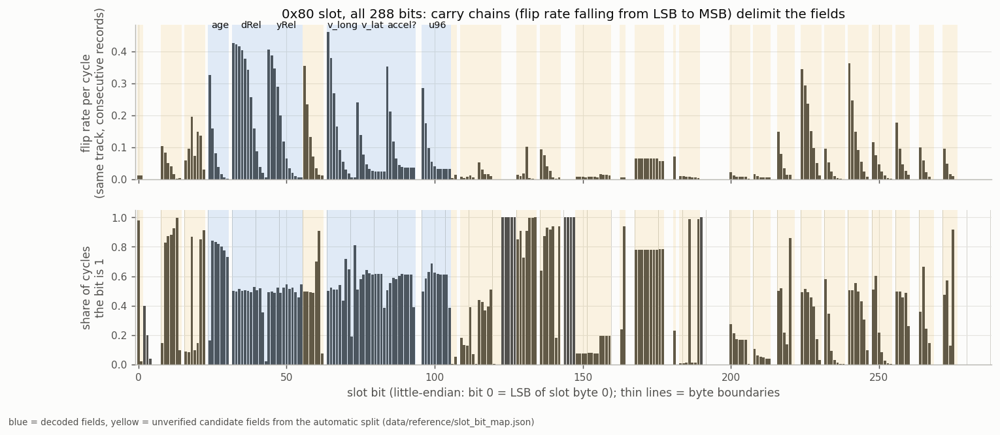

- **Top:** per-bit flip rate between consecutive cycles of the same track. Each decoded field (blue) starts with a high-rate bit that decays toward its most-significant bit.
- **Bottom:** how often each bit is 1.
  - Offset-binary fields sit near 0.5.
  - The physical slot index at `2|6` and reserved bits stand out. The slot index is not an object category.
- The yellow candidate fields past bit 110 are unnamed. Several scale with range, lateral offset or age; see Part 5.

**Review:** the automatic split (`data/reference/slot_bit_map.json`) uses a simple rule: a new field starts where the flip rate jumps by more than 1.25×. Some candidates may be two fields or half of one.

**Idea:** `UNK_168_10` only ever takes three values: 1023 (76% of samples), 0 (23%) and 768 (<1%). It looks like a flag word, not a number.
- Code 0 is somewhat more common on the nearest in-lane object (30% of samples, against 20% out of lane and 13% for the second in-lane object).
- It changes within about 20% of tracks.

An object-class or "relevant for ACC" flag? Unresolved; worth a look against video.

---

## Part 3: Scales and semantics

### Velocity is over ground

- Traffic moving with us sits on the `v_ground = v_ego` diagonal.
- Parked objects sit on 0, and oncoming ones on `−v_ego`.
- A relative-velocity field would put traffic on 0 instead. This one picture settles the semantics.

**Review:** the same-direction band sits slightly above the diagonal at highway speed. A ~1.5% ego-reference discrepancy is a supported explanation ([02](02_object_record_0x80.md#velocity-scale-and-the-0149-question)); it is not proof of the exact OEM scale or compensation input.

### Velocity zero point

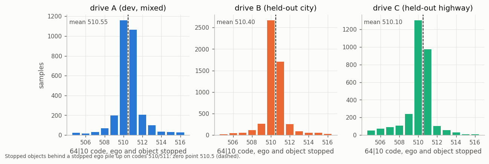

With ego stopped behind stopped cars, the code piles on 510 and 511, so the zero is 510.5.

**Review:** 510 is consistently more common than 511 (ratio 1.1–1.6). If the encoder truncated, the two would be equally common. The ±0.03 m/s this implies doesn't matter, but the encoder rule is unknown.

### Range scale and zero

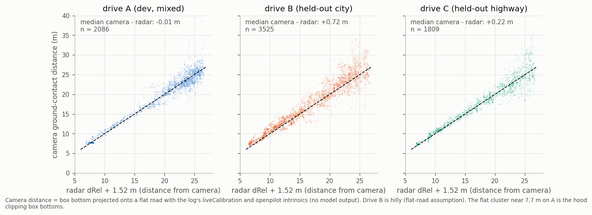

- The camera range comes from where the tire line meets a flat road, with no model involved.
- Slope ≈ 1 on all three drives.
- The zero agrees to 0.2 m on A and C; drive B is hilly (+0.7 m).

**Review:** the flat-road assumption. A tape-measured gap at standstill on level ground would pin the zero outright ([10](10_open_questions.md)).

### Lateral sign and scale

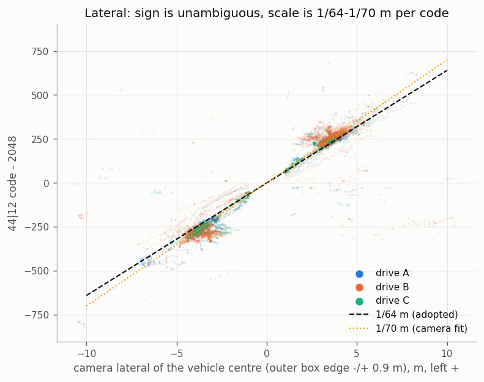
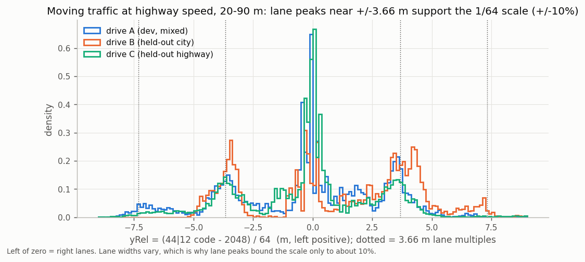

- The sign is unambiguous.
- The scale sits between 1/64 (lane peaks) and about 1/70 (camera box edges), so ±10%.

**Review:** a few long highway tracks dominate these histograms, which makes them lumpy. Weighting each track equally would make the lane peaks, and so the scale estimate, more robust.

### Where objects are reported

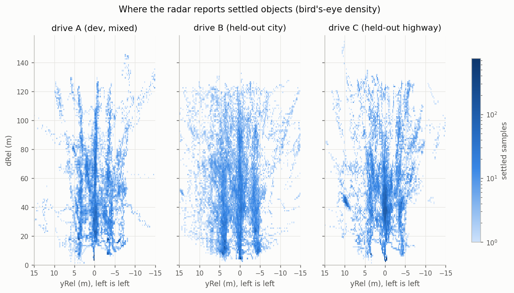

- Density of settled objects: lanes are visible as vertical stripes out to about 130 m.
- In the city (B) the adjacent lanes are closer, and parked or oncoming objects fill the edges.

---

## Part 4: Lifecycle and track IDs

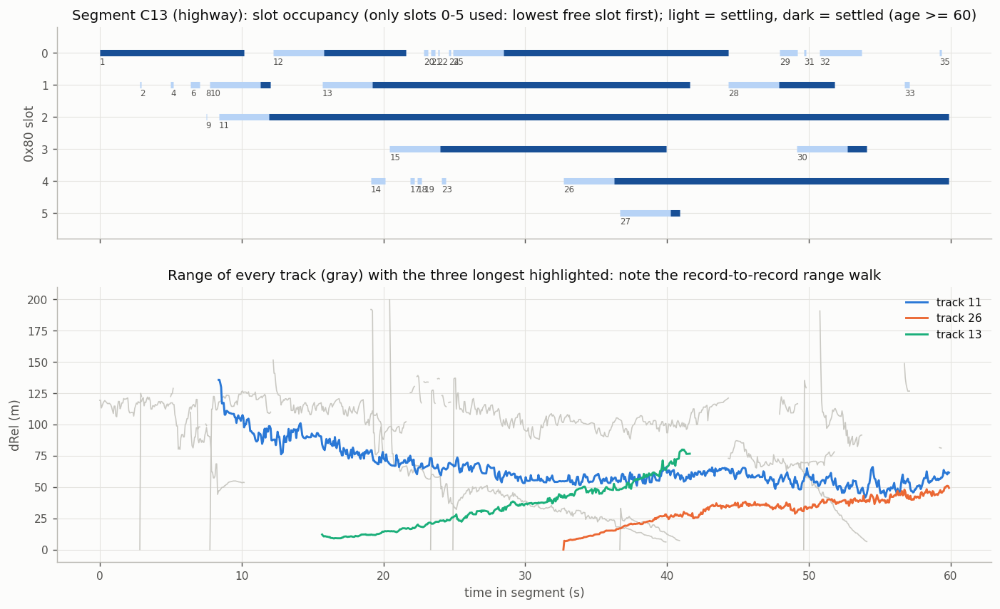

- **Allocation:** the radar fills the **lowest free slot first**. Over 88 minutes it never used more than 10 of its 20 slots, and 94–99% of samples are in slots 0–4 ([12](12_statistics.md)).
- **Survival:** long tracks hold one slot for the whole minute.
- **Churn:** short-lived tracks come and go in the higher slots.
- **Bottom panel:** range of every track. The spikes to 0 m and to 150–200 m at track birth are young-track placeholders.

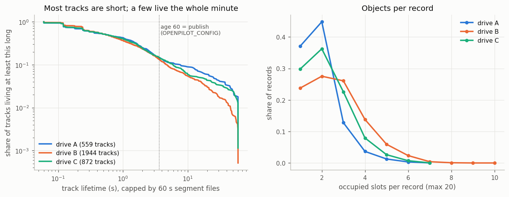

- The median track lives about 0.55 s, and only ~15% reach the publish age of 60 cycles.
- Most records carry 1–3 objects.

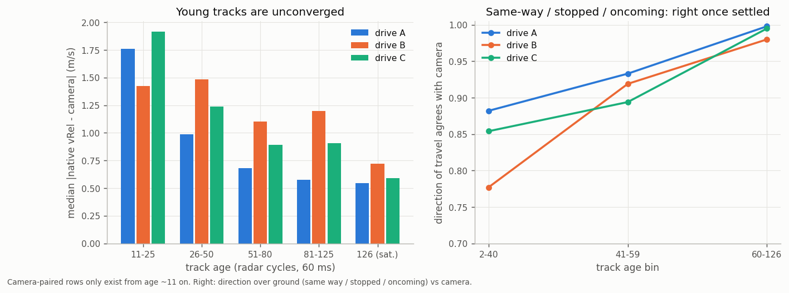

- Median velocity error against the camera falls by 20–70% between age 11–25 and age 60+.
- Direction of travel over ground agrees with the camera 98–99.8% of the time once a track is settled, and only 78–88% while it is young.

**Idea:** the age-60 gate costs about 3.6 s before a new car can become the radar lead. A per-field convergence rule might publish earlier: range settles faster than velocity.

---

## Part 5: vRel, what works and what doesn't

### Against the camera

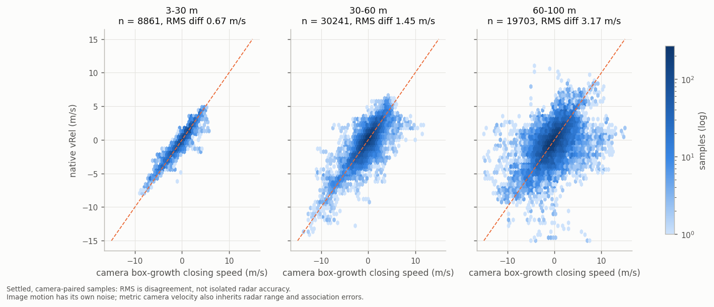
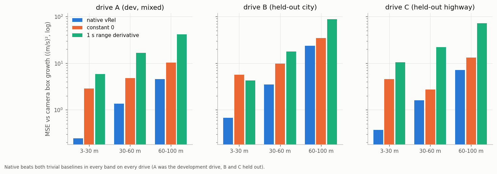

- Native vRel tracks the camera's box-growth rate closely out to 30 m.
- It gets noisier with range, partly because of the camera itself.
- It beats a constant-zero guess and a differentiated range in every band on every drive.

### Conditional error estimates, not reference-free truth

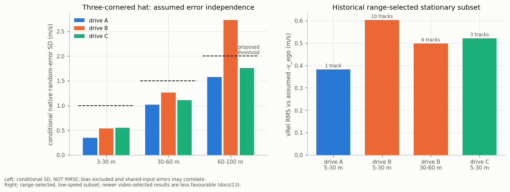

- **Left, three-cornered hat:** centred SD under an assumed independent-error model. It excludes bias, and shared range inputs weaken the assumption; do not interpret it as demonstrated RMSE.
- **Right, stopped targets:** 0.4–0.6 m/s on the old range-selected subset. This is conditional evidence, superseded as the primary stationary check by the video-selected results in [13](13_evidence_review.md).

### The error has heavy tails and memory

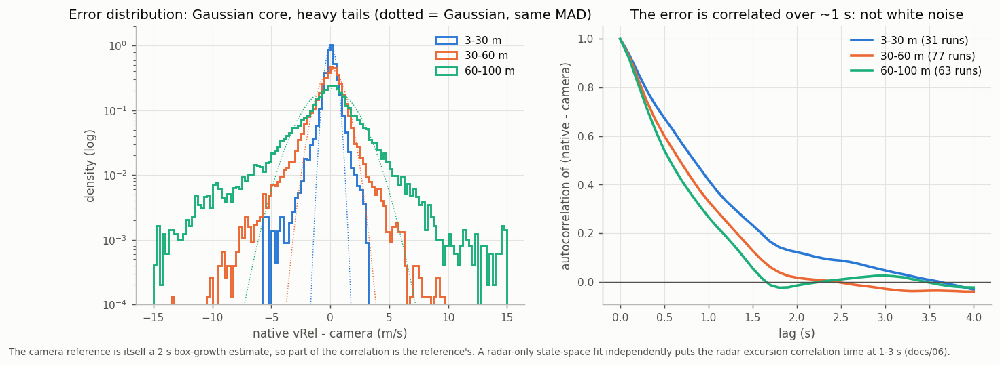

- The core is Gaussian-like, but the tails are orders of magnitude fatter.
- The error stays correlated for about 1 s, so it doesn't average away quickly. This is the "excursion" behaviour.

### Excursion gallery

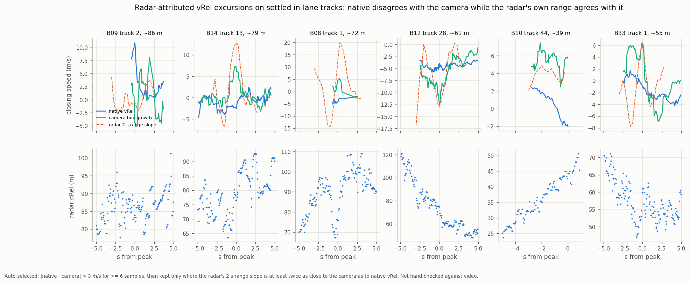

These were auto-selected: native vRel disagrees with the camera, and the radar's **own** range slope sides with the camera. Two kinds show up:
- **false motion:** native reports a change the range doesn't show, e.g. `B10`, where native drifts to closing while range and camera show the car opening;
- **missed motion:** native stays flat while both range and camera see a real change (`B12`, `B33`).

The second kind is new: it suggests that at times the radar's velocity lags reality rather than inventing motion.

**Review:** none of these were checked against video. Far-range range slopes are noisy, so some attributions may be wrong. Please look at them before drawing conclusions.

### Candidate fields don't flag the error

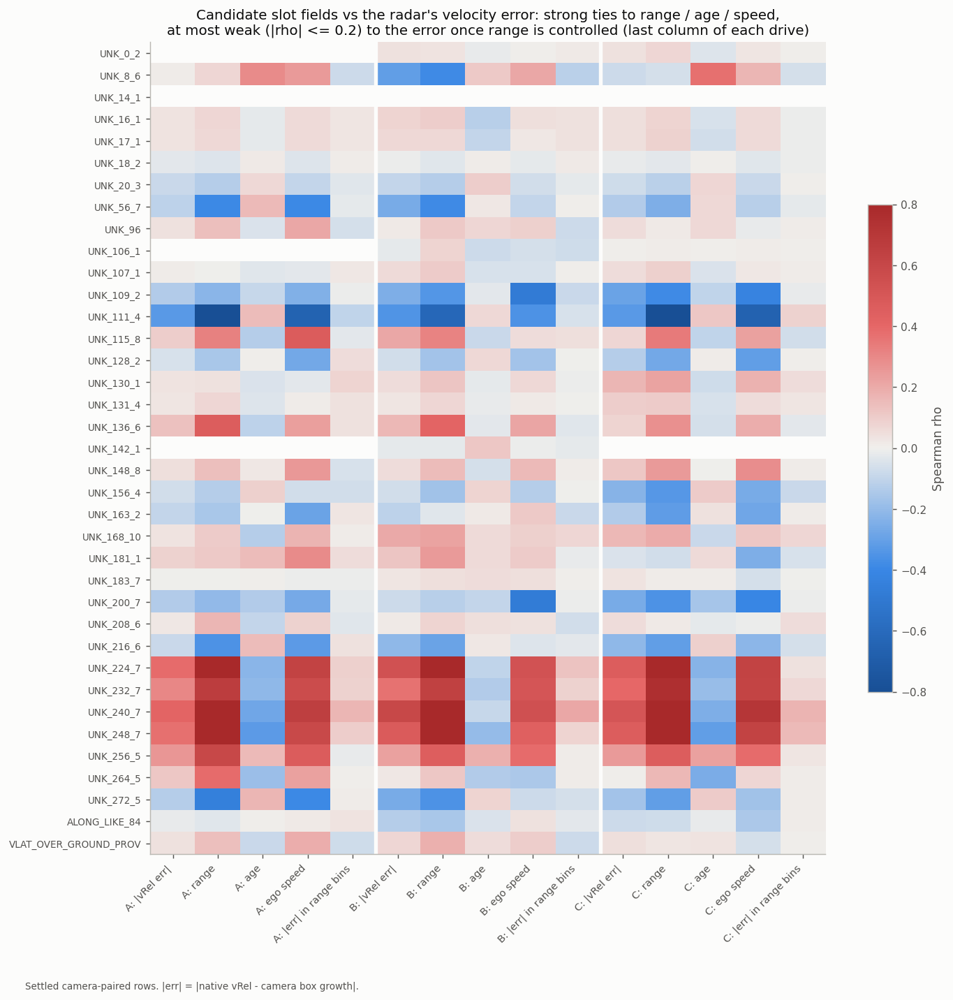

- Many unnamed slot fields are strongly tied to range, age or ego speed (for example `224|7` and `240|7` with range at ρ ≈ 0.8).
- Once range is controlled, none correlates with the velocity error beyond |ρ| ≈ 0.2 (the last column of each drive).
- This bounded correlation test did not yield a useful quality decoder. Conditional state/variance tests and the score-like byte remain distinct questions, with later results in [13](13_evidence_review.md).

### Tracks behave differently just before they die (exploratory)

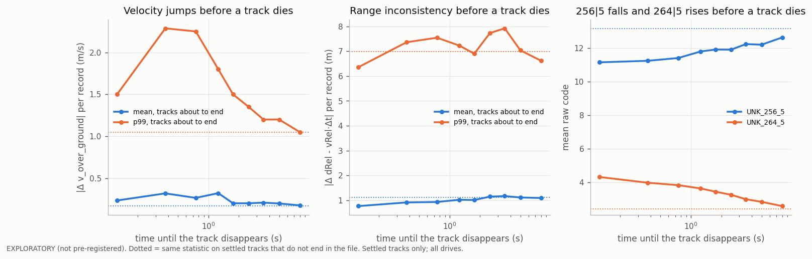

- In the last ~1 s before a settled track disappears, the p99 record-to-record velocity jump roughly doubles (2.3 vs 1.05 m/s).
- Over the last ~5 s, `256|5` (existence-like) drifts down and `264|5` (uncertainty-like) drifts up.

**Review:** this was not pre-registered. Tracks often die far away or when leaving the field of view, and both fields also scale with range, so range is a confounder. Redo it range-matched.

**Idea:** if `256|5` / `264|5` predict imminent track loss, a consumer could lower its trust in a track's velocity *before* the dying-track excursion (the night shot above). That would be the first radar-internal quality signal found. Test it pre-registered on a new drive.

### Range walks

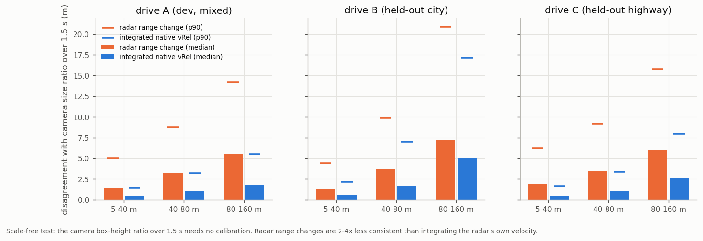

This test needs no calibration: over 1.5 s, the radar's range change disagrees with the camera's size change 2–4× more than its own integrated velocity does. So never derive velocity from range. Fusing the two (velocity-aided range) halves the walk.

---

## Part 6: What openpilot would do with it

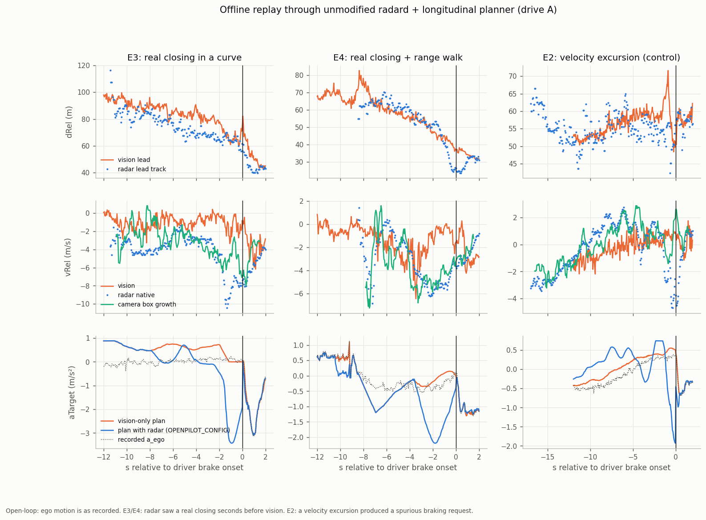

These are offline replays through unmodified radard and the planner, open-loop.
- **E3 and E4:** radar saw a real closing seconds before vision (blue plan brakes early).
- **E2:** a velocity excursion produced a spurious brake request.

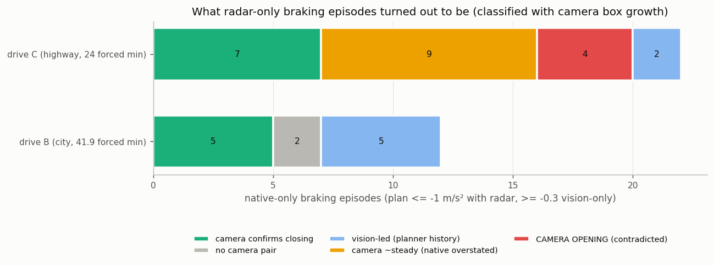

- **City, drive B:** every radar-led braking episode was camera-confirmed or unpaired.
- **Highway, drive C:** 4 of 22 braked while the camera showed the lead opening, and 9 overstated a steady lead.

Every defence tried moves along the same trade-off: fewer false brakes means fewer or later real ones. None reaches the pass region.

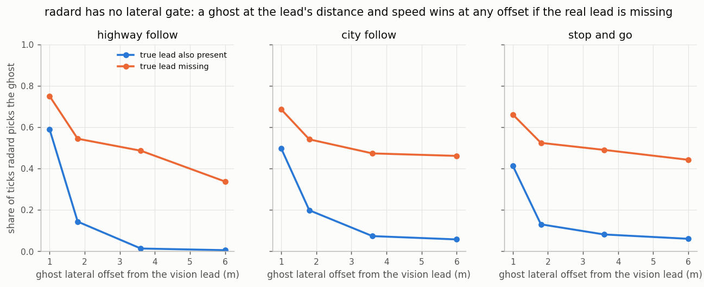

- radard has no lateral gate. With the true lead present, the likelihood prefers it by 3.6 m of offset.
- With the true lead missing, an adjacent-lane object at the right distance and speed is picked 35–75% of the time.

---

## Part 7: Open review list

| item | where | status |
|---|---|---|
| Hand-check the excursion gallery against video | Part 5 | open |
| Range-matched redo of the track-end analysis; pre-register `256\|5`/`264\|5` as a health signal | Part 5 | exploratory result only |
| Track-weighted lane-peak scale estimate | Part 3 | easy improvement |
| Why 510 outnumbers 511 at standstill | Part 3 | unexplained |
| `UNK_168_10` three-valued flag word (0 / 768 / 1023) | Part 2 | new lead |
| Per-field convergence instead of a single age-60 gate | Part 4 | idea |
| "Missed motion" (native velocity lagging real changes): how often, how long? | Part 5 | new, unquantified |

Anything you find, please report back with a pre-registered test ([09](09_testing_a_new_drive.md)).
