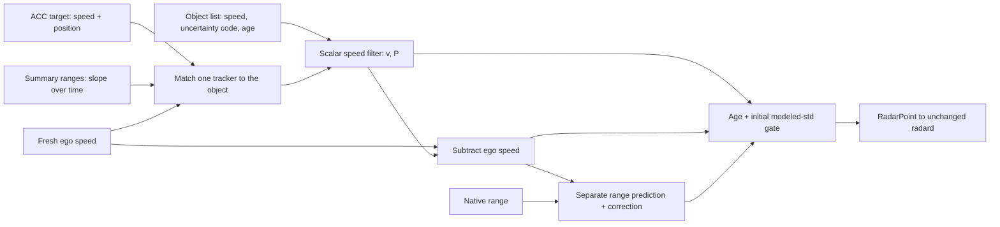

# 12. The Kalman speed filter

The object list's speed has slow, correlated errors at range: false closings of 1-10 s beyond about 40 m
([07](07_velocity_excursions.md)). The code `240|7` provides an empirical error scale against the ACC witness; it
does not flag each excursion. The
default `fused` profile handles them with **one Kalman filter per track** on the lead's over-ground speed. The filter
weights every reading by its own uncertainty: the object list, the radar's ACC target and its target-range summaries.
radard then runs its usual filter on what this one publishes.

Code: `Ars510NativeRadarInterface._fused_speed` in [`ars510/interface.py`](../ars510/interface.py), and the same
filter in the single-file upstream candidate [`upstream/ars510_radar.py`](../upstream/ars510_radar.py). Numbers:
[`fused_filter.json`](../data/analysis/summaries/fused_filter.json).

## The model

One state per track: the lead's speed over ground `v`, with modeled variance `P`. Every radar cycle (`Δt` ≈ 60 ms):

```text
predict      v = v                           P = P + (a · Δt)²             a = 1.5 m/s² (process-noise setting)
for each reading z with model standard deviation σ (object list, then an available matched tracker):
  innovation e = z − v,  S = P + σ²,  e clamped to ±3·√S               (robust update)
  gain       K = P / S
  update     v = v + K·e                     P = (1 − K)·P
publish      vRel = v − v_ego                 first publication once √P ≤ 0.75 m/s (and age ≥ 60)
```

| reading | σ | where the value comes from |
|---|---|---|
| object-list speed `64\|10` | 0.045 m/s × max(`240\|7`, 1), with the young-track factor below | `240\|7` scales with the error against the ACC target ([07](07_velocity_excursions.md#far-range-excursions-match-the-reported-velocity-error-scale)) |
| ACC target speed (0x235, + ego speed) | 0.5 m/s | the radar's own ACC tracker, for the one track it matches by position ([05](05_acc_target_and_support.md)) |
| summary speed (0x192 / 0x194 range slope) | 0.5 m/s, up to 80 m | the radar's selected-target ranges, matched by range and speed |

An ACC-associated track is excluded from summary fusion; at most one summary is used on another track. Each track
therefore receives object-list speed plus at most one tracker estimate. A new filter, or one with invalid `Δt` or a
gap over 0.5 s, initializes from object speed with `P = σ_object²`; tracker updates start on the next valid cycle.



`P` sets the gain and the initial publication gate. Its square root is an operational readiness measure with
physical units, rather than a calibrated bound on true speed error. The inputs are already-filtered estimates
from the same radar, with persistent and potentially shared errors; consecutive summary slopes also reuse range
samples. The clamp changes the mean correction while the code retains the ordinary covariance contraction.
Consequently, a small `P` can coexist with a persistent speed error. Replay and event comparisons support the
chosen filter, while independent physical-error calibration remains a separate requirement.

The summary's one-second range fit also carries time history. Under constant relative acceleration, its slope
represents velocity at `mean(t) + sum((t−mean(t))³) / (2·sum((t−mean(t))²))`, near the window midpoint for evenly
spaced samples. Across 867 applied updates in two bundled samples, that time is a median 0.476 / 0.480 s before
the filter timestamp; most windows contain 17 samples over 0.960 s. Shorter startup windows differ. These are
receipt-clock geometry measurements, not radar acquisition latency or a calibrated time shift; adding current
ego speed further complicates over-ground timing. [Timing measurements and scope](../data/analysis/summaries/summary_window_time.json).

The ordinary Kalman covariance equations assume the specified process/measurement model and its independence
conditions; see [Särkkä, *Bayesian Filtering and Smoothing*, chapter 4](https://users.aalto.fi/~ssarkka/pub/cup_book_online_20131111.pdf).
The current `Q = (a Δt)²` corresponds to an acceleration perturbation redrawn each update interval. A continuous
white-acceleration model would use a spectral intensity and `Q` proportional to `Δt`; its parameter has different
units. Here `a` is a chosen process-noise scale, not a decoded or measured acceleration standard deviation.

**The gain is not fixed.** radard's filter uses one precomputed gain for every track. Here `K` changes every cycle
with the radar's own uncertainty code and with which trackers are present. A near car with a small `240|7` is
followed almost directly. A far car with a large `240|7` moves only a few percent per reading. While the ACC target
is present, it dominates.


*Bundled drive E. Top: the object-list readings (grey) dive to −6 m/s at 18 s while the ACC target stays near
−0.7; the estimate follows the ACC target. Bottom: the gain on each reading. Each object-list reading moves the
estimate by about 5%, each ACC target reading by about 15%. The dotted line is the object-list σ from `240|7`.*


*Left: how much the filter trusts each reading by range. Middle: the share of the estimate from the radar's own
trackers. Right: a new track's speed std against age; the 0.75 m/s line is the publication gate.*


*`raw` and `fused` on the bundled excursions: `fused` (green) follows the radar's ACC target on drive E and keeps drive
A's lead at the speed its range trend shows.*

## How it fits with radard

radard runs its own per-track Kalman filter on `[vLead, aLead]` with a fixed gain and derives the lead acceleration.
This filter cleans only the speed it hands over, so radard's filter and the planner run unchanged. Lead acceleration
stays radard's job; a speed + acceleration state here did worse ([below](#kalman-variants-tested)).

## Constants and their sources

| ingredient | value | where it comes from |
|---|---|---|
| object-list speed σ | 0.045 m/s × `240\|7` (≈ 0.2 m/s at 15 m, 1.4 at 60 m, 2.7 at 100 m) | calibrated against the radar's ACC target ([07](07_velocity_excursions.md#far-range-excursions-match-the-reported-velocity-error-scale)) |
| young-track factor | × 1.8 through age 60, tapering linearly to × 1 at age 100 | measured: young tracks err 1.4-2× more than `240\|7` says |
| ACC target speed σ, summary speed σ | 0.5 m/s each (summary up to 80 m) | the radar's own trackers: the ACC target stays with the range trend in 76% of disagreements and is the same car ([`acc_target_choice.json`](../data/analysis/summaries/acc_target_choice.json)); summaries beat the object list against the camera at 40-80 m, not beyond |
| acceleration scale (process noise) | 1.5 m/s² | chosen model parameter; tuning/replay comparisons below support retaining it |
| robust update | innovations clamped at 3σ | standard; stops one-record spikes |
| first publication | modeled speed std ≤ 0.75 m/s (and age ≥ 60) | operational settling rule supported by ablation, not a physical accuracy guarantee |
| range | not in the filter; range fusion as before | range rate and speed disagree by 10-20% |

## What runs before the filter

### 0. The plain decode (every profile)

- **Rule:** publish from age 60 (~3.6 s); multiply object-list over-ground speed by 0.149/0.15, then subtract
  unscaled 0xB4 ego speed; no point without a fresh ego speed. The configurable fork also attempts to keep a
  track's ID across losses ≤ 3.5 s.
- **Why:** young tracks have unconverged range and speed ([02](02_object_list.md)); one NaN poisons radard's filter.

### 1. Saturation guard (`raw`)

- **Problem:** velocity code 1023 (and 0) is an invalid sentinel that decays over ~6 records.
- **Rule:** withhold the track until the velocity is back within 5 m/s of the last good value (or 1 s); continue under
  a new ID.
- **Evidence:** one sentinel otherwise reaches the planner as −3.5 m/s²; held-out hard ticks 117 → 93.

### 2. Range fusion (`fused`)

- **Problem:** range walks by metres at 60-100 m (3% per frame); radard's distance and vision match jitter.
- **Rule:** integrate the mean of the previous and current filtered vRel, then move 10% toward the native range:

  ```text
  predicted range = previous range + 0.5 × (previous vRel + current vRel) × Δt
  output range    = predicted range + 0.1 × (native range − predicted range)
  ```

  This is a separate fixed-gain predictor/corrector; it maintains no range covariance. The range residual never
  changes speed, so the measured range-rate/speed mismatch cannot feed back into the velocity estimate. A new
  state, invalid speed or gap over 0.5 s starts again at native range. The gain is an empirical setting, justified
  by the ablation below rather than a decoded sensor uncertainty.
- **Evidence:** halves 1.5 s range walks, which radard's distance and the planner otherwise pass on. Retaining it
  chiefly improves lead stability; its removal increases radar/vision lead switches without worsening hard-braking counts.

## What each part contributes


Each part removed from `fused` on its own, 34 replay drives (hard radar-only ticks on 20 held-out routes / 4 further drives / owner drives; [`fused_filter.json`](../data/analysis/summaries/fused_filter.json)):

| `fused` without … | held-out | further | owner | verdict |
|---|---|---|---|---|
| (nothing: `fused`) | **30** | **2** | **0** | |
| the ACC target and summaries (filter on the object list alone) | 48 | 2 | 0 (4 target episodes) | needed |
| the young-track factor | 30 | 11 | 0 | needed |
| the speed-std publication gate | 30 | 8 | 0 | needed |
| the age-60 publication gate (age 6) | 31 | 12 | 0 (radar-only braking ×3) | needed |
| range fusion | 27 | 0 | 0 | braking neutral (milder radar-added episodes 1 → 3 in 4.6 h); kept for lead stability: radar ↔ vision lead switches +39% without it |
| the ego-speed alignment (× 0.149/0.15) | 31 | 2 | 0 | neutral (onset +12 ms); one measured constant |
| the saturation guard | identical | identical | identical | removed: the 3σ update absorbs the sentinel |

Against the earlier tuned profile: held-out hard ticks 48 → 30, target episodes 9 → 4, owner-drive target episodes
5 → 0. Braking onset is 0.09 s later on average, all from events where the tuned profile braked early on an
over-estimated closing speed (0.54 m/s more closing than vision before those driver brakes, `fused` 0.02).
Dropped variants: adapting the process noise follows far slot slides as if they were braking; without the robust
clamp a +10 m/s spike passes.

### Why retain summary updates


The summaries provide useful speed support when the ACC target does not cover a track. In this owner-drive
comparison, retaining summaries keeps the planner request above −0.59 m/s² during a 0.50 s interval; suppressing
their precision produces an extra target-braking episode reaching −1.11 m/s². Captured vision requests stay
between −0.15 and −0.12 m/s². Both variants disable relinking; the retained-summary output matches full `fused`
locally, and both radar variants use the same lead throughout the episode.

This controlled comparison changes summary speed σ from 0.5 to 10,000 m/s, making its update negligible.
The plot shows saved radard lead and planner outputs. A separate native cache identifies one applied summary
2.156 s before onset, at native range 73.44 m and age 95, followed by 36 cycles without a reset. The 80 m limit
gates new summary inputs; it does not erase their influence from the filter state when a track moves farther away.
The update changes both mean and covariance: its immediate correction is toward a lower speed, but later native
updates leave the summary-enabled estimate 0.793 m/s higher just before onset. The fixed recurrence reproduces
all 390 cached enabled means. This is an explanation of the state history, not physical-error calibration or a
planner rerun; the underlying summary range samples and their effective observation time remain unavailable.
The episode counts against the frozen owner-drive requirement of zero additional target-braking episodes. See the
[definitions and measurements](../data/analysis/summaries/summary_owner_case.json) and
[anonymous trace](../data/analysis/summary_owner_case.csv).

### Kalman variants tested

The single speed state of `fused` was compared with richer filters on an offline bench: every cycle of 8 drive groups,
the radar's ACC target hidden as the reference, tuned on 3 groups and scored on the rest. The best candidates were then
replayed through openpilot ([`kalman_variants.json`](../data/analysis/summaries/kalman_variants.json)).


| variant | bench | openpilot replays |
|---|---|---|
| Student-t update instead of the 3σ clamp | same as the clamp | – |
| speed + acceleration state; optional ACC acceleration observation when trackers are enabled | worse on held-out and owner drives with trackers hidden | – |
| noise learned from all slot fields (gradient boosting) | small gain; it relearns `240\|7`, ego speed and `84\|10` | – |
| object-list error as its own state (colored noise, τ 1.2 s), noise scaled by ego speed and `84\|10` | **15% fewer false closings**; ACC-defined response comparison below | 34 drives: held-out 30 → 29 hard ticks, one far false closing held for seconds (2 → 30 on the further drives) |
| retuned `fused` constants (σ per count, ACC σ, lead accel) | – | 8 fresh drives: none better on every check |

The colored-noise filter is the textbook fix for the object list's slow, correlated errors: lag-1 autocorrelation is
0.95 per record, about 1.2 s per independent error. It rejects slow drift, but for the same reason it takes seconds to
let go of a large drift that recovers. Real driving rewards letting go quickly, so `fused` keeps one speed state.
`COLORED_CONFIG` is not in the decoder.

### Response to ACC-defined speed drops


On 252 selected windows from 33 reused routes, the object-list-only scalar filter crosses its half-drop threshold
an average of 0.438 s after the ACC witness; the colored model with wide initialization averages 0.394 s. Its paired
difference is −44 ms, with a 95% route-bootstrap interval of [−101, +13] ms. The interval includes no difference;
there is no established equivalence margin. These measurements do not establish physical braking timing.

Candidate windows require an ACC drop of at least 2 m/s over 2 s, native age at least 60 and range at least 20 m.
Starts are ordered chronologically within each route, with one 4 s exclusion interval across native track IDs.
The ACC tracker is hidden from both filters, but remains a dependent, same-radar witness. Missing crossings receive
a capped 4 s value; six windows have less than 4 s of follow-up, including two with a missing crossing. Individual
events can differ substantially despite similar means. The separate full-replay recovery regression still decides
against promoting the colored model. Model definitions, the earlier colored recurrence, counts and uncertainty are
in [`kalman_response.json`](../data/analysis/summaries/kalman_response.json).

### Other approaches tested

None is in a profile.

| approach | result |
|---|---|
| vision speed fused into the matched track ([radard patch](../openpilot/radard_vision_fusion.patch)) | better driver agreement, small on fresh drives; needs a radard change |
| the ACC target's speed *replacing* the track's vRel | hard ticks 53 → 57, +0.145 s response: the ACC value alone lags real closings |
| smoothing weighted by `240\|7` (no fusion) | responds 62 ms earlier but 153 vs 85 hard ticks |
| camera-looming veto | no planner benefit |
| Kalman filter with maneuver adaptation or a range state | follows far slot slides / biased by the range-speed mismatch ([fused](#the-model)) |

### Earlier approach: tuned layers (removed)

Before the Kalman filter, five tuned layers each targeted one measured failure: far smoothing, a velocity-jump guard,
far-track settling, a ramp limiter (+4 / −6 m/s²) and ±3 m/s clips to the ACC target and summaries (17 tuned
constants). The staircase below shows them added one at a time: together they took held-out hard ticks from 93 to 48,
which the Kalman filter on the object list alone matches with 3 chosen constants, and `fused` beats (30). They were
removed; per-layer numbers stay in [`layer_ablation.json`](../data/analysis/summaries/layer_ablation.json).


*Hard radar-only braking on 20 held-out routes: the tuned layers added one at a time, and `fused` instead of them.*
