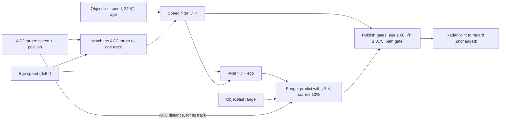
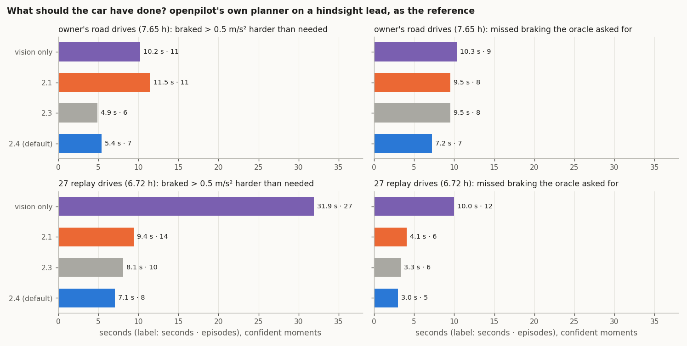

# 12. The Kalman speed filter

The object list's speed has slow, correlated errors at range: false closings of 1-10 s beyond about 40 m
([07](07_velocity_excursions.md)). The radar reports their size in `240|7`, as a width: a per-reading error scale. The default
`fused` profile handles them with **one Kalman filter per track** on the lead's speed over ground. Every reading is
weighted by its own uncertainty: the object list and the radar's ACC target. radard then runs its usual filter on what
this one publishes.

Code: `Ars510NativeRadarInterface._fused_speed` in [`ars510/interface.py`](../ars510/interface.py) (fork build), and
the same filter in [`upstream/ars510_radar.py`](../upstream/ars510_radar.py) (openpilot version). Numbers:
[`fused_filter.json`](../data/analysis/summaries/fused_filter.json).

## The model

One state per track: the lead's speed over ground `v`, with modelled variance `P`. Every radar cycle (`Δt` ≈ 60 ms):

```text
predict      v⁻ = v                          P⁻ = P + (a · Δt)²             a = 1.5 m/s² (process-noise scale)
for each reading z with standard deviation σ (object list first, then the ACC target if matched):
  innovation e = z − v⁻,  S = P⁻ + σ²,  e clamped to ±3·√S                (robust update)
  gain       K = P⁻ / S
  update     v = v⁻ + K·e                    P = (1 − K)·P⁻
publish      vRel = v − v_ego                 first publication once √P ≤ 0.75 m/s (and age ≥ 60)
```

| reading | σ | where the value comes from |
|---|---|---|
| object-list speed `64\|10` | 0.045 m/s × max(`240\|7`, 1); × 1.8 up to age 60, tapering to × 1 at age 100 | `240\|7` scales with the error against the ACC target ([07](07_velocity_excursions.md#far-range-excursions-match-the-reported-velocity-error-scale)); young tracks err 1.4-2× more |
| ACC target speed (0x235 at 0.125 m/s per code, + ego speed) | 0.5 m/s | the radar's own ACC tracker, for the one track it matches by position ([05](05_acc_target_and_support.md)) |
| summary speed (0x192 / 0x194 range, (code − 160) / 16 m; 1 s slope), fork option, off | 0.5 m/s, up to 80 m | the positions of the radar's selected targets, each attached to the track at that position (range within 15 %, lateral within 1 m); not used on the ACC track ([below](#what-the-summaries-do)) |

The ACC target's units are checked against the absolute `0x680` range ([05](05_acc_target_and_support.md#units-of-the-acc-target)).



The object-list σ also tracks the error seen by a second tracker output, which runs 1.1-1.5× the filter's σ: against the 2 Hz object
stream 0x680, a tracker-quality
witness for vehicles (half of its matched frames are the ACC target, the rest other cars), the object-list speed error is 0.8 / 1.3 / 2.4 / 2.9 / 4.4 m/s RMS at
0-40 / 40-60 / 60-80 / 80-110 / 110-170 m, where 0.045 m/s × `240|7` gives 0.6 / 1.1 / 1.6 / 2.6 / 3.4 m/s, and 1-4 % of
frames lie beyond 3 σ. The error leans toward closing (median −0.2 to −0.7 m/s up to 110 m, −1.9 m/s beyond), which the
ACC target corrects where it is present ([`object_stream_0x680.json`](../data/analysis/summaries/object_stream_0x680.json)).

A new track (or one silent for over 0.5 s) starts from its object-list speed with `P = σ²`. Each track gets the
object-list reading plus, for the one track the ACC target describes, the ACC reading.

**The gain changes every cycle.** radard's filter uses one precomputed gain for every track. Here `K` follows the
radar's own uncertainty code and whether the ACC target is present. A near car with a small `240|7` is followed
almost directly. A far car with a large `240|7` moves only a few percent per reading. While the ACC target is
present, it dominates.


*Bundled drive E. Top: the object-list readings (grey) dive to −6 m/s at 18 s while the ACC target stays near
−0.9; the estimate follows the ACC target. Bottom: the gain on each reading. Each object-list reading moves the
estimate by about 5%, each ACC target reading by about 15%. The dotted line is the object-list σ from `240|7`.*


*Left: how much the filter trusts each reading by range. Middle: the share of the estimate from the radar's ACC
target. Right: a new track's speed std against age; the 0.75 m/s line is the publication gate.*


*`raw` and `fused` on the bundled excursions: on drive E `fused` (green) follows the radar's ACC target; on drive A,
which has no ACC target, it dips to about −2.7 m/s where the object list reads −6.4.*

**What `P` means.** The model assumes independent readings, while the ACC target and the object list are both
estimates from the same radar, with persistent errors. So `√P` is a readiness measure in m/s: it sets the gain and the
publication gate, and the replays below are what justify the constants
([Särkkä, *Bayesian Filtering and Smoothing*, ch. 4](https://users.aalto.fi/~ssarkka/pub/cup_book_online_20131111.pdf)).

## How it fits with radard

radard runs its own per-track Kalman filter on `[vLead, aLead]` with a fixed gain; its `aLeadK` is the lead
acceleration the planner uses. This filter cleans only the speed it hands over, so radard and the planner run
unchanged, and lead acceleration stays radard's job; one speed state scores better here than a speed + acceleration
state ([below](#kalman-variants-tested)). 

The two filters run in series, so all replay numbers already include their combined effect. Measured directly on
148,219 radar-lead ticks of the 20 held-out routes (fused 2.0, `radard_cascade` in
[`fused_filter.json`](../data/analysis/summaries/fused_filter.json)):
- **Smoother acceleration:** `aLeadK` changes at 0.46 m/s³ on average with `fused`, against 0.72 for vision only.
- **Same timing:** `fused`'s `aLeadK` peaks in cross-correlation at 0 ticks against the earlier tuned profile's on
  14 of 15 routes, and 1 tick (50 ms) on one.

## What runs before and around the filter

- **Plain decode (every profile):**
  - publish from age 60 (~3.6 s): young tracks have unconverged range and speed ([02](02_object_list.md)). Age 40
    exposes young far false closings (further-drive hard ticks 1 → 9), and so does publishing the ACC target's track
    early; age 80 delays real braking (missed braking against the hindsight-lead oracle 3.3 → 3.7 s on 27 drives, tested on 2.3);
  - read the object list's over-ground speed at 0.149 m/s per code (DBC 0.15; 0.149 matches 0xB4), then subtract 0xB4 ego speed;
  - publish a point only with a fresh ego speed, because a NaN would stay in radard's filter for good.
- **Saturation guard (`raw` only):** velocity code 1023 (and 0) is an invalid sentinel that decays over ~6 records.
  `raw` withholds the track until the speed is back within 5 m/s (or 1 s), then continues under a new ID. Held-out
  hard ticks 117 → 93. In `fused` the robust update absorbs the sentinel, so the guard is off.
- **Track-ID relink (`raw` only):** a track lost and re-found within 3.5 s keeps its ID. With the filter on, the
  driving is identical with or without it, so `fused` leaves it off.
- **Range fusion (`fused`):** range walks by metres at 60-100 m (3% per frame). A fixed-gain predictor, separate from
  the speed filter:

  ```text
  predicted range = previous range + 0.5 × (previous vRel + current vRel) × Δt
  output range    = predicted range + 0.1 × (object-list range − predicted range)
  ```

  It cuts 1.5 s range walks by about a third. The range residual stays out of the speed estimate: range rate and speed disagree by
  10-20%, and a coupled filter ran 2-5 m short. For the track the ACC target describes, the measurement is the radar's
  ACC distance instead of the object-list range ([below](#matching-the-radars-trackers-to-tracks)).

## Matching the radar's trackers to tracks

The ACC target is a position from the radar's function-level tracker; the filter needs to know which object-list track
it describes. The summaries (a fork option) are matched the same way.

| tracker | match | kept while |
|---|---|---|
| ACC target (0x235 / 0x237) | cost = \|dRel − x\| / max(12 m, 0.4 x) + \|yRel − y\| / 0.5 m below 1, at least 1 better than the next track, track age ≥ 20; x is the 0.025 m ACC distance, y its 0.01 m lateral | the track's cost stays below 4 and the ACC position moves at most 8 m / 1 m per update |
| summary (0x192 / 0x194), option | the track within max(5 m, 15 %) in range and 1 m laterally of the summary position, unambiguous (alone or 3 m nearer than the next), track age ≥ 20 | the track stays within max(8 m, 25 %) in range and 2 m laterally |

- **Matched by position.** Both matches use the tracker's own position, so they keep holding while the object-list
  speed is wrong: replayed over the logged frames, a summary matched by position sits on its track on 99.5-100 % of cycles,
  also during object-list speed excursions, where a speed-agreement rule kept only 18-45 %.
- **Room for the object list's short far range.** The object list reads the followed car several metres short of the ACC
  distance beyond 50 m ([06](06_accuracy.md#distance)), so the ACC cost scales its range term with range. Already with
  2.1's 0.25 x scale the ACC target sat on the in-lane lead on 92.7 / 74.0 / 37.6 % of lead records at 60-80 / 80-100 /
  100-130 m (it is present on 94.8 / 76.9 / 39.9 %); 0.4 x widens the match further.
- **The ACC distance is the followed car's range.** The matched track takes the ACC distance as the measurement of the
  range fusion: the radar's own smooth range (0.04 m jitter against 0.9 m,
  [`acc_fields.json`](../data/analysis/summaries/acc_fields.json)), which the vision lead agrees with. radard
  then receives a lead distance within a metre of the vision lead up to 90 m (it read 1-5 m short), half as rough from
  tick to tick, and flips between a radar and a vision lead 30 % less often (1,764 → 1,231 on the 20 held-out drives,
  2.1 replays).
- **New tracks can start far short.** About 10-20 % of new in-lane tracks the ACC target follows read more than 10 m
  short of it, often for seconds; on the road one first read 47 m for a car at 63 m and drew a −2.4 m/s² request in
  replay where the true range needed about −0.7. The match therefore allows 0.4 x in range (25 m at 63 m), so such a track still takes the ACC
  distance; range fusion pulls it there within about a second. The margin to the next track keeps two cars apart.


Each of these matching rules was replayed on the 27 drives against the previous version with limits fixed before the
run; hard radar-only braking stayed at 30 held-out ticks throughout
([`tracker_association.json`](../data/analysis/summaries/tracker_association.json)).

## Path gate

radard pairs the vision lead with the radar track nearest in range, whatever its lateral position, so a car in the next
lane at the lead's range can become the lead. On 2.1 road drives this caused one of the two mild unprompted slowdowns
(about 1.5 m/s², driver on the gas) and a hard brake in a second car's replay. Beyond 15 m, a track other than the ACC
target's that is more than 2.5 m from the ego path predicted from yaw rate and speed (constant curvature,
`y − yaw / v · d² / 2`) is withheld. Closer in it stays, so cars moving into the lane at 8-10 m keep their justified
hard brakes. For radar leads beyond 60 m the gate removes 67 % of the cycles where the
camera places the lead more than 2.5 m to the side, and 2.3 % of those where the camera agrees; the radar's share of
leads beyond 60 m drops from 77 % to 73 % (vision covers the rest).


| 27 drives | held-out hard ticks / episodes / target | further / owner hard ticks | owner target episodes | lead flips (held-out) | onset vs vision | driver brakes anticipated |
|---|---|---|---|---|---|---|
| 2.1 `fused` | 30 / 11 / 4 | 2 / 0 | 1 | 1,231 | −0.022 s | 43.7 % |
| 2.4 `fused` (0.4 x ACC match, path gate; = the openpilot version) | 30 / 11 / 3 | 1 / 0 | 0 | 1,349 | −0.010 s | 41.3 % |

On the owner's 5.8 moving hours of road drives (replayed open loop) the path gate and the 0.4 x match keep hard
radar-only braking at 0 with every hard vision brake still answered. They cut radar-only requests of 1 m/s² or more
from 10 to 7, start braking within 0.015 s of 2.1 on every drive, and raise lead flips by 8 %. They also remove the
second car's hard false brake. In the late-brake case above, the first radar lead is at 63 m instead of 47 m and the
request −1.47 instead of −2.36 m/s² (vision −1.61); 2.4 asks the same as 2.3 in that moment. The cost is a slightly
lower share of driver brakes anticipated at −1 m/s² (41.3 against 43.7 %). Both constants sit in a flat region: an ACC
match scale of 0.33 or 0.5 x and a gate of 2.0 or 3.0 m keep the held-out hard ticks at 30 (target episodes 2-3) and
stay within 0.4 s of the chosen values against the hindsight-lead oracle below. The openpilot file's parts and
their line costs are in [10](10_research_directions.md#parts-of-the-openpilot-file).
Numbers: [`lead_choice_guards.json`](../data/analysis/summaries/lead_choice_guards.json).

## Against what the car should have done

Vision only has its own errors, so a second reference helps. A hindsight lead was built for each moment of the road
drives: identity from the radar's in-path ACC target (else the camera's lead); range from the ACC target, else the raw
object list within 1 m laterally, plus the camera when it is on the same car; smoothed forwards and backwards
(Rauch-Tung-Striebel, constant acceleration) within each stretch of one car, which ends where the ACC target changes
ID or the lead jumps sideways, so a switch between two cars starts a new stretch. openpilot's unchanged radard and
planner then ran on that lead alone,
through an interface that publishes only it. Each version is scored against that oracle's request on the moments
where the reference comes from the radar and radar and camera agree. Camera-only moments are judged with video,
because the model's lead range slides from one car to the next at cut-ins, and so are the 2 s after the ACC target
drops a lead the camera still follows (a lead turning out of the lane).



Over 7.65 h of road drives (the owner's and the second car's), `fused` brakes unnecessarily (> 0.5 m/s² harder than the oracle, ≥ 0.3 s) for
5.4 s against 10.2 s for vision only and 11.5 s for 2.1, and misses less of the braking the oracle asked for (7.2 s,
vision 10.3 s, 2.1 9.5 s). On the 27 replay drives (6.72 h scored), it is the best of all versions on
both: 7.1 s unnecessary (vision 31.9 s, 2.1 9.4 s) and 3.0 s missed (vision 10.0 s, 2.1 4.1 s). Scoring covers moving
moments (above 1 m/s), where the lead signal decides; at standstill the planner's stop-and-go logic does. Numbers:
[`oracle_reference.json`](../data/analysis/summaries/oracle_reference.json).

## What each part is worth

Each part removed from `fused` 2.0 on its own, 27 replay drives. 2.0 also fused the summaries; today's `fused` has nearly
the same hard braking on these drives (30 / 1 / 0, [above](#path-gate)). Counts are hard radar-only braking ticks
(planner ≤ −2 m/s² while vision-only asks ≥ −0.5) on 20 held-out routes / 4 further drives / 3 owner drives:


| `fused` 2.0 without … | held-out | further | owner | verdict |
|---|---|---|---|---|
| (nothing: `fused` 2.0) | **30** | **2** | **0** | |
| the ACC target and summaries (filter on the object list alone) | 48 | 2 | 0 (4 target episodes) | needed |
| the ACC target only (summaries kept) | 48 | 2 | 0 (3 target episodes) | needed: the ACC target carries the trackers' benefit |
| the young-track factor | 30 | 11 | 0 | needed |
| the speed-std publication gate | 30 | 8 | 0 | needed |
| the age-60 publication gate (age 6) | 31 | 12 | 0 (radar-only braking ×3) | needed |
| range fusion | 27 | 0 | 0 | braking neutral; lead switches +39%, target episodes 4 → 6: kept for lead stability |
| the ego-speed alignment (× 0.149/0.15) | 31 | 2 | 0 | neutral (onset +12 ms); one measured constant, folded into the decode factor (no line) |
| the track-ID relink | 30 | 2 | 0 | identical in every measure: off in `fused` |
| the saturation guard | identical | identical | identical | off in `fused`: the robust update absorbs the sentinel |

**Were those hard brakes real?** "Hard radar-only" means the radar planner braked hard where vision-only stayed below
−0.5 m/s²; the radar may simply have seen a real slowdown first. Every hard episode in every run was therefore judged
against references independent of the radar speed:
- **the radar's raw range** of the same object, decoded from the original CAN, else the
  camera's lead distance from the vision-only replay;
- **the braking the real closing needed:** closing² / 2(gap − 4 m);
- **the driver:** did they brake or slow down too?


27 of `fused` 2.0's 32 hard ticks on the 27 drives were real slowdowns the driver also braked for, where the radar
reacted earlier or harder than the camera; 3 were unjustified and 2 unclear. Each braking-related part kept in `fused` earns its place because removing it adds *unjustified*
braking (range fusion stays for lead stability): the ACC target +24 ticks, the young-track factor +9, the std gate and the age gate +6 each
([`hard_braking_review.json`](../data/analysis/summaries/hard_braking_review.json)).

### Removing parts together

One-at-a-time removals can hide parts that only matter together, so the larger parts of `fused` 2.0 were also removed
in combination on the same 27 drives. A version drives the same as `fused` when its unjustified hard braking is within
2 ticks of `fused` and its radar ↔ vision lead switches rise by at most 15%.


- **The track-ID relink is free:** the driving is identical with or without it.
- **The summaries change little:** without them, unjustified braking and lead stability are the same (see below).
- **Range fusion keeps the lead stable:** every version without it flips between radar and vision leads about 39%
  more often, with one real early brake fewer.
- **The young-track factor and the std gate cost about 5 lines.** With range fusion kept they prevent unjustified
  braking on a far lead (+9 and +6 unjustified ticks).

The smallest version with the same driving is 2.0 without the summaries and the relink; with 2.3's path gate and wider
ACC match added, that is today's `fused`. The openpilot version ([`upstream/ars510_radar.py`](../upstream/ars510_radar.py); its parts and line
costs are in [10](10_research_directions.md#parts-of-the-openpilot-file)) is the same filter in one file, and a test
keeps the two equal point for point (`tests/test_upstream_candidate.py`; combinations in
[`fused_filter.json`](../data/analysis/summaries/fused_filter.json)).

The rule fixed before these results also required zero target episodes on the owner drives; the version without
summaries had one. Reviewed afterwards, that episode was an early reaction to a real slowdown (the case below), and it
is counted as such: a judgment made after the results, stated here.

### What the summaries do


*Owner drive, lead at about 100 m with no ACC target, replayed with `fused` 2.0. With summaries the planner asks for at
most −0.58 m/s²; without them, −1.11 m/s² for 0.5 s (vision: about −0.13 at that moment). Over the next 4.5 s the radar's and the camera's range
both fell from about 104 to 80 m and vision-only asked for −1.37 m/s²: the slowdown was real, and the version without
summaries reacted about 4 s earlier ([`summary_owner_case.json`](../data/analysis/summaries/summary_owner_case.json),
[`hard_braking_review.json`](../data/analysis/summaries/hard_braking_review.json)).*

Over the 27 replay drives (`fused` 2.0), the summaries change the planner's request by 0.3 m/s² or more on 198 ticks
(about 10 s). Without them the planner brakes harder on 143 of those ticks: 107 while the gap really was closing, 36
while it held or opened (camera range). The summaries soften the response to far leads without an ACC target, mostly while
the gap was really closing.

Against the hindsight-lead oracle ([above](#against-what-the-car-should-have-done)) the version without them scores
better: 7.1 s of unnecessary braking instead of 8.1 s and 3.0 s missed instead of 3.3 s on the 27 replay drives
(2.4 against 2.3; RMS 0.244 for both). On the owner's road drives the two give the same minimum request on 19 of 23 bookmarks (within 0.03 m/s² on the
other 4),
with 0 hard radar-only braking and 7 mild requests each; against the oracle (owner and second car, 7.65 h) 5.4 against
4.9 s unnecessary and 7.2
against 9.5 s missed. So `fused` leaves them out since 2.4, and the fork default and the openpilot version drive
identically. The code stays as a
fork option (`summary_sigma_mps`), and the experimental `colored` profile, which was tested with them, keeps them.

## Kalman variants tested

The single speed state of `fused` was compared with richer filters on an offline bench: every cycle of 8 drive groups,
the radar's ACC target hidden as the reference, tuned on 3 groups and scored on the rest. The best candidates were then
replayed through openpilot ([`kalman_variants.json`](../data/analysis/summaries/kalman_variants.json)).


| variant | bench | openpilot replays |
|---|---|---|
| Student-t update instead of the 3σ clamp | same as the clamp | – |
| speed + acceleration state, with the ACC target's acceleration as a reading | worse than one speed state on held-out and owner drives, slightly better on fresh | – |
| noise learned from all slot fields (gradient boosting) | small gain; it relearns `240\|7`, ego speed and `84\|10` | – |
| object-list error as its own state (colored noise, τ 1.2 s), noise scaled by ego speed and `84\|10` | **14-16% fewer false closings** on held-out and fresh drives; responds as fast to ACC-defined drops (below) | 27 drives: held-out 30 → 29 hard ticks, one far false closing held for seconds (2 → 30 on the further drives) |
| retuned `fused` constants (σ per count, ACC σ, lead accel) | – | 8 fresh drives: the current constants are as good as any retuned set on every check |
| ACC target trusted more (σ 0.13, its measured error, or 0.02 instead of 0.5) | – | 27 drives: held-out 30 → 26 / 25 hard ticks (the difference is over-braking after the driver released), same unjustified braking; fresh drives: two real slowdowns with openpilot driving got softer braking than both `fused` and vision. Mixed: default stays 0.5 (`acc_target_weight` in [`fused_filter.json`](../data/analysis/summaries/fused_filter.json)) |

The colored-noise filter is the textbook fix for the object list's slow, correlated errors: lag-1 autocorrelation is
0.95 per record, an error time constant of about 1.2 s. It rejects slow drift, but for the same reason it takes seconds to
let go of a large drift that recovers. Real driving rewards letting go quickly, so `fused` keeps one speed state.
The fork build keeps it as the experimental `colored` profile (`COLORED_CONFIG`) for road tests.


*Response on 252 windows (33 routes) where the hidden ACC target drops ≥ 2 m/s within 2 s: time for the estimate to
cover half the drop, relative to the ACC target. One speed state 0.438 s, colored 0.394 s; the paired difference is
−44 ms, 95% route-bootstrap interval [−101, +13] ms. The ACC target is the same radar's tracker, so this compares the
two filters with each other ([`kalman_response.json`](../data/analysis/summaries/kalman_response.json)).*
