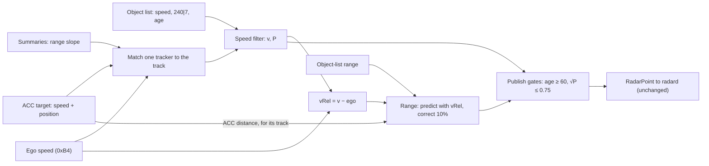
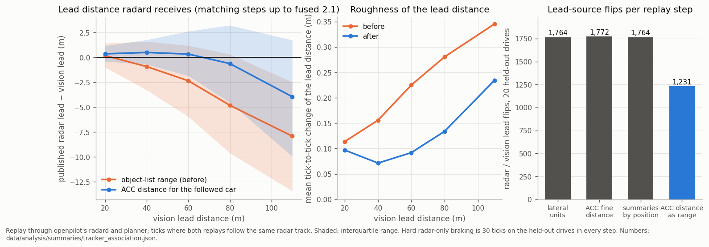
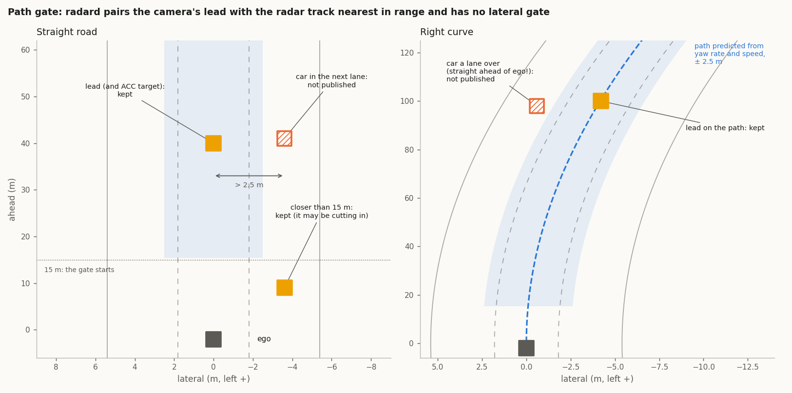
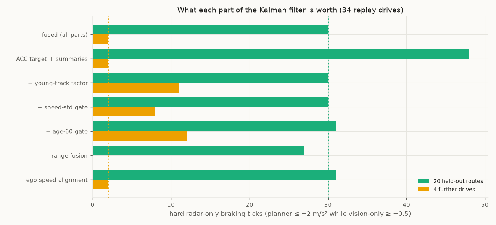
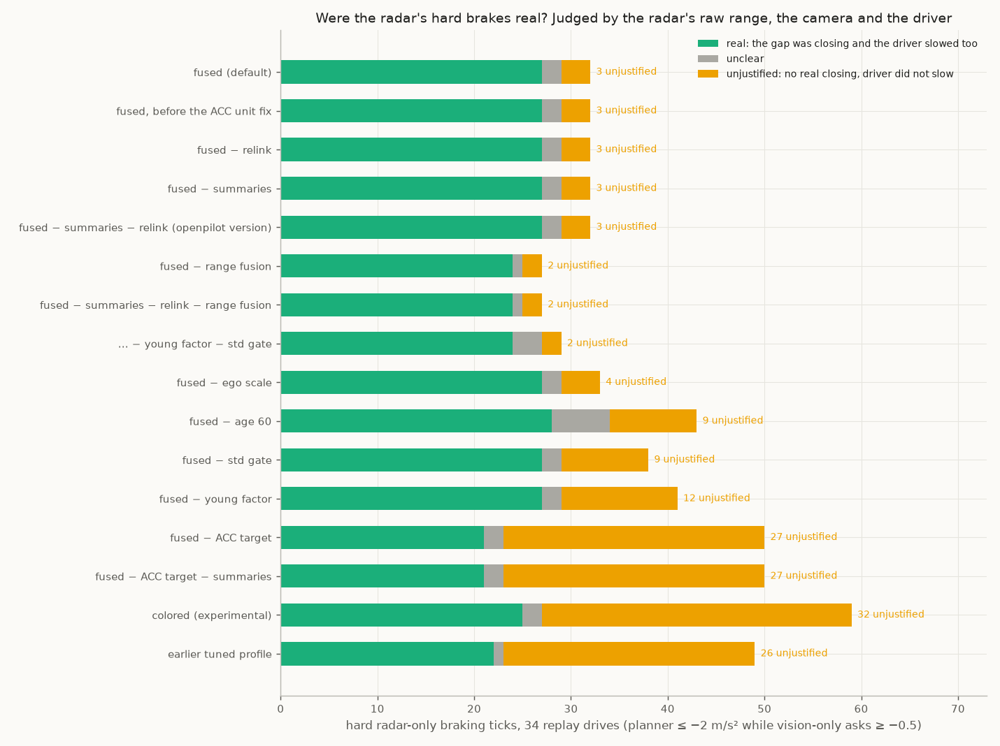
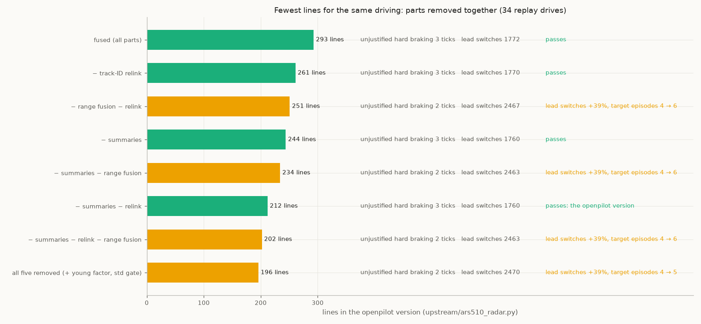
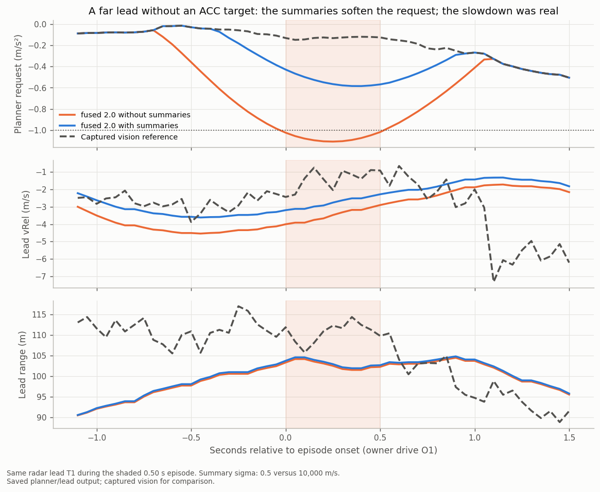
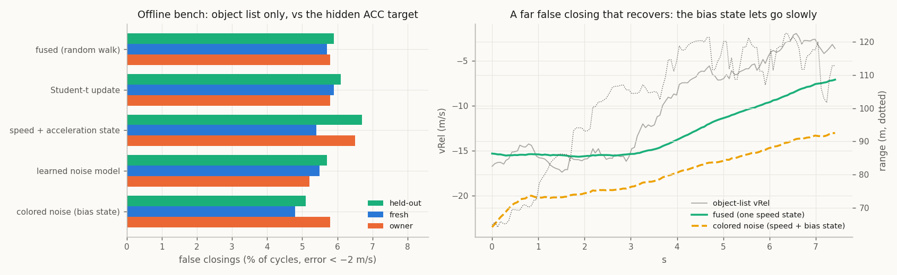
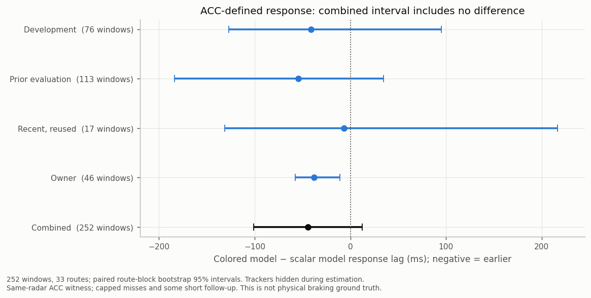

# 12. The Kalman speed filter

The object list's speed has slow, correlated errors at range: false closings of 1-10 s beyond about 40 m
([07](07_velocity_excursions.md)). The radar reports their size in `240|7` but does not flag each one. The default
`fused` profile handles them with **one Kalman filter per track** on the lead's speed over ground. Every reading is
weighted by its own uncertainty: the object list, the radar's ACC target and its target-range summaries. radard then
runs its usual filter on what this one publishes.

Code: `Ars510NativeRadarInterface._fused_speed` in [`ars510/interface.py`](../ars510/interface.py) (fork build), and
the same filter without the summaries in [`upstream/ars510_radar.py`](../upstream/ars510_radar.py) (openpilot version). Numbers:
[`fused_filter.json`](../data/analysis/summaries/fused_filter.json).

## The model

One state per track: the lead's speed over ground `v`, with modelled variance `P`. Every radar cycle (`Δt` ≈ 60 ms):

```text
predict      v⁻ = v                          P⁻ = P + (a · Δt)²             a = 1.5 m/s² (process-noise scale)
for each reading z with standard deviation σ (object list first, then the one matched tracker, if any):
  innovation e = z − v⁻,  S = P⁻ + σ²,  e clamped to ±3·√S                (robust update)
  gain       K = P⁻ / S
  update     v = v⁻ + K·e                    P = (1 − K)·P⁻
publish      vRel = v − v_ego                 first publication once √P ≤ 0.75 m/s (and age ≥ 60)
```

| reading | σ | where the value comes from |
|---|---|---|
| object-list speed `64\|10` | 0.045 m/s × max(`240\|7`, 1); × 1.8 up to age 60, tapering to × 1 at age 100 | `240\|7` scales with the error against the ACC target ([07](07_velocity_excursions.md#far-range-excursions-match-the-reported-velocity-error-scale)); young tracks err 1.4-2× more |
| ACC target speed (0x235 at 0.125 m/s per code, + ego speed) | 0.5 m/s | the radar's own ACC tracker, for the one track it matches by position ([05](05_acc_target_and_support.md)) |
| summary speed (0x192 / 0x194 range, (code − 160) / 16 m; 1 s slope) | 0.5 m/s, up to 80 m | the positions of the radar's selected targets, each attached to the track at that position (range within 15 %, lateral within 1 m); not used on the ACC track |

The ACC target and summary units were corrected against the absolute `0x680` range (they had been read about 20%
small). On the 34 replay drives the correction leaves hard radar-only braking and its unjustified part unchanged
(30 ticks, 3 unjustified), moves braking onset from +0.013 s to −0.024 s against vision and cuts the reactions that
come more than 0.15 s later than the reference from 23 to 16 ([`acc_summary_units.json`](../data/analysis/summaries/acc_summary_units.json)).



The object-list σ holds on cars it was not calibrated on: against the 2 Hz object stream 0x680, a tracker-quality witness
for vehicles outside the ACC target and the summaries, the object-list speed error is 0.8 / 1.3 / 2.4 / 2.9 / 4.4 m/s RMS at
0-40 / 40-60 / 60-80 / 80-110 / 110-170 m, where 0.045 m/s × `240|7` gives 0.6 / 1.1 / 1.6 / 2.6 / 3.4 m/s, and 1-4 % of
frames lie beyond 3 σ. The error is not centred (median −0.2 to −0.7 m/s up to 110 m, −1.9 m/s beyond: too closing), which
the trackers correct where they are present ([`object_stream_0x680.json`](../data/analysis/summaries/object_stream_0x680.json)).

A new track (or one silent for over 0.5 s) starts from its object-list speed with `P = σ²`. Each track gets the
object-list reading plus at most one tracker reading.

**The gain is not fixed.** radard's filter uses one precomputed gain for every track. Here `K` changes every cycle
with the radar's own uncertainty code and with which tracker is present. A near car with a small `240|7` is followed
almost directly. A far car with a large `240|7` moves only a few percent per reading. While the ACC target is
present, it dominates.


*Bundled drive E. Top: the object-list readings (grey) dive to −6 m/s at 18 s while the ACC target stays near
−0.9; the estimate follows the ACC target. Bottom: the gain on each reading. Each object-list reading moves the
estimate by about 5%, each ACC target reading by about 15%. The dotted line is the object-list σ from `240|7`.*


*Left: how much the filter trusts each reading by range. Middle: the share of the estimate from the radar's own
trackers. Right: a new track's speed std against age; the 0.75 m/s line is the publication gate.*


*`raw` and `fused` on the bundled excursions: `fused` (green) follows the radar's ACC target on drive E and keeps drive
A's lead at the speed its range trend shows.*

**What `P` means.** The model assumes independent readings, but the ACC target, the summaries and the object list are
all estimates from the same radar, with persistent errors. So `√P` is a readiness measure in m/s: it sets the gain
and the publication gate. It is not a calibrated bound on the true speed error, and a small `P` can coexist with a
persistent error. The replays below are what justify the constants, not the covariance algebra
([Särkkä, *Bayesian Filtering and Smoothing*, ch. 4](https://users.aalto.fi/~ssarkka/pub/cup_book_online_20131111.pdf)).

## How it fits with radard

radard runs its own per-track Kalman filter on `[vLead, aLead]` with a fixed gain; its `aLeadK` is the lead
acceleration the planner uses. This filter cleans only the speed it hands over, so radard and the planner run
unchanged, and lead acceleration stays radard's job. A speed + acceleration state here did worse
([below](#kalman-variants-tested)). Without it, an excursion reaches `aLeadK` as a −3 to −5 m/s² spike.

The two filters run in series, so all replay numbers already include their combined effect. Measured directly on
148,219 radar-lead ticks of the 20 held-out routes:
- **Smoother acceleration:** `aLeadK` changes at 0.46 m/s³ on average with `fused`, against 0.80 with the earlier
  tuned profile and 0.72 for vision only.
- **No added delay:** `fused`'s `aLeadK` peaks in cross-correlation at 0 ticks against the tuned profile's on 14 of 15
  routes, and 1 tick (50 ms) on one (`radard_cascade` in
  [`fused_filter.json`](../data/analysis/summaries/fused_filter.json)).

## What runs before and around the filter

- **Plain decode (every profile):**
  - publish from age 60 (~3.6 s): young tracks have unconverged range and speed ([02](02_object_list.md)); publishing
    the ACC target's track earlier exposes young far tracks before their speed settles, so it waits too;
  - multiply the object list's over-ground speed by 0.149/0.15, then subtract 0xB4 ego speed;
  - publish no point without a fresh ego speed, because one NaN poisons radard's filter.
- **Saturation guard (`raw` only):** velocity code 1023 (and 0) is an invalid sentinel that decays over ~6 records.
  `raw` withholds the track until the speed is back within 5 m/s (or 1 s), then continues under a new ID. Held-out
  hard ticks 117 → 93. In `fused` the robust update absorbs the sentinel, so the guard is off.
- **Track-ID relink (`raw` only):** a track lost and re-found within 3.5 s keeps its ID. It changes nothing with the
  filter on, so `fused` leaves it off.
- **Range fusion (`fused`):** range walks by metres at 60-100 m (3% per frame). A fixed-gain predictor, separate from
  the speed filter:

  ```text
  predicted range = previous range + 0.5 × (previous vRel + current vRel) × Δt
  output range    = predicted range + 0.1 × (object-list range − predicted range)
  ```

  It halves 1.5 s range walks. The range residual never feeds back into speed: range rate and speed disagree by
  10-20%, and a coupled filter ran 2-5 m short. For the track the ACC target describes, the measurement is the radar's
  ACC distance instead of the object-list range ([below](#matching-the-radars-trackers-to-tracks)).

## Matching the radar's trackers to tracks

The ACC target and the summaries are positions from the radar's function-level tracker; the filter needs to know which
object-list track each one describes.

| tracker | match | kept while |
|---|---|---|
| ACC target (0x235 / 0x237) | cost = \|dRel − x\| / max(12 m, 0.4 x) + \|yRel − y\| / 0.5 m below 1, at least 1 better than the next track, track age ≥ 20; x is the 0.025 m ACC distance, y its 0.01 m lateral | the track's cost stays below 4 and the ACC position moves at most 8 m / 1 m per update |
| summary (0x192 / 0x194) | the track within max(5 m, 15 %) in range and 1 m laterally of the summary position, unambiguous (alone or 3 m nearer than the next), track age ≥ 20 | the track stays within max(8 m, 25 %) in range and 2 m laterally |

- **Position, not speed.** Both matches use the tracker's own position. A summary used to need the object-list speed to
  agree with its range slope, which blocks the match exactly when the object-list speed is wrong: replayed with their
  state over the logged frames, the summary sat on the track at its position on 37-69 % of cycles and on 18-45 % of the
  cycles with an object-list speed excursion; by position it is 99.5-100 % for both.
- **Room for the object list's short far range.** The object list reads the followed car several metres short of the ACC
  distance beyond 50 m ([06](06_accuracy.md#distance)), so the ACC cost scales its range term with range. With that
  scale the ACC target is on the in-lane lead on 92.7 / 74.0 / 37.6 % of lead records at 60-80 / 80-100 / 100-130 m (it
  is present on 94.8 / 76.9 / 39.9 %).
- **The ACC distance is the followed car's range.** The matched track takes the ACC distance as the measurement of the
  range fusion: the radar's own smooth range (0.04 m jitter against 0.9 m,
  [`acc_fields.json`](../data/analysis/summaries/acc_fields.json)), which the vision lead agrees with. radard
  then receives a lead distance within a metre of the vision lead up to 90 m (it read 1-5 m short), half as rough from
  tick to tick, and flips between a radar and a vision lead 30 % less often (1,764 → 1,231 on the 20 held-out drives).
- **New tracks can start far short.** About 10-20 % of new in-lane tracks the ACC target follows read more than 10 m
  short of it, often for seconds; on the road one first read 47 m for a car at 64 m and drew a −2.4 m/s² brake where
  −0.7 would have done. The match therefore allows 0.4 x in range (25 m at 64 m), so such a track still takes the ACC
  distance; range fusion pulls it there within about a second. The margin to the next track keeps two cars apart.



Each step was replayed on the 34 drives against the previous one, with limits fixed before the run. Hard radar-only
braking stays at 30 ticks on the held-out drives, 2 on the further drives and 0 on the owner drives through all four
steps (lateral units, ACC fine distance, summaries by position, ACC distance as range), with 11 hard and 4 target
episodes; braking onset against vision stays at −0.02 s and the share of driver brakes anticipated at −1 m/s² moves from
44.9 % to 43.7 % (vision only 40.1 %). The openpilot version (no summaries) replayed with the same changes has the same
hard braking (30 / 2 / 0 ticks, 11 hard and 4 target episodes), 1,242 lead flips, onset −0.015 s and 43.1 % anticipated.
Numbers: [`tracker_association.json`](../data/analysis/summaries/tracker_association.json).

## Path gate

radard pairs the vision lead with the radar track nearest in range and has no lateral gate, so a car in the next lane
at the lead's range can become the lead. On the road this caused the default profile's only unprompted braking (about
1.5 m/s², driver on the gas) and a hard brake in a second car's replay. Beyond 15 m, a track other than the ACC
target's that is more than 2.5 m from the ego path predicted from yaw rate and speed (constant curvature,
`y − yaw / v · d² / 2`) is not published. Closer in it stays: a gate down to 0 m also removed two justified hard brakes
on cars moving into the lane at 8-10 m. For radar leads beyond 60 m the gate removes 67 % of the cycles where the
camera places the lead more than 2.5 m to the side, and 2.3 % of those where the camera agrees; the radar's share of
leads beyond 60 m drops from 77 % to 73 % (vision covers the rest).



| 34 drives | held-out hard ticks / episodes / target | further / owner hard ticks | owner target episodes | lead flips (held-out) | onset vs vision | driver brakes anticipated |
|---|---|---|---|---|---|---|
| 2.1 `fused` | 30 / 11 / 4 | 2 / 0 | 1 | 1,231 | −0.022 s | 43.7 % |
| 2.3 `fused` (0.4 x ACC match, path gate) | 30 / 11 / 3 | 1 / 0 | 0 | 1,342 | −0.018 s | 41.9 % |

On the owner's 5.8 h of 2.1 road drives (replayed open loop) 2.3 keeps hard radar-only braking at 0 and misses no hard
vision brake. It cuts radar-only requests of 1 m/s² or more from 10 to 7, starts braking within 0.015 s of 2.1 on every
drive, and raises lead flips by 8 %. It also removes the second car's hard false brake. In the late-brake case above,
the first radar lead is at 63 m instead of 47 m and the request −1.47 instead of −2.36 m/s² (vision −1.61). The cost is
a slightly lower share of driver brakes anticipated at −1 m/s² (41.9 against 43.7 %). The openpilot file's parts and
their line costs are in [10](10_research_directions.md#parts-of-the-openpilot-file).
Numbers: [`lead_choice_guards.json`](../data/analysis/summaries/lead_choice_guards.json).

## What each part is worth

Each part removed from `fused` on its own, 34 replay drives (measured before the ACC / summary unit correction, which
leaves hard braking unchanged). Counts are hard radar-only braking ticks (planner
≤ −2 m/s² while vision-only asks ≥ −0.5) on 20 held-out routes / 4 further drives / 3 owner drives:



| `fused` without … | held-out | further | owner | verdict |
|---|---|---|---|---|
| (nothing: `fused`) | **30** | **2** | **0** | |
| the ACC target and summaries (filter on the object list alone) | 48 | 2 | 0 (4 target episodes) | needed |
| the ACC target only (summaries kept) | 48 | 2 | 0 (3 target episodes) | needed: the ACC target carries the trackers' benefit |
| the young-track factor | 30 | 11 | 0 | needed |
| the speed-std publication gate | 30 | 8 | 0 | needed |
| the age-60 publication gate (age 6) | 31 | 12 | 0 (radar-only braking ×3) | needed |
| range fusion | 27 | 0 | 0 | braking neutral; lead switches +39%, target episodes 4 → 6: kept for lead stability |
| the ego-speed alignment (× 0.149/0.15) | 31 | 2 | 0 | neutral (onset +12 ms); one measured constant |
| the track-ID relink | 30 | 2 | 0 | identical in every measure: removed |
| the saturation guard | identical | identical | identical | removed: the robust update absorbs the sentinel |

**Were those hard brakes real?** "Hard radar-only" only means the radar planner braked hard where vision-only did not; the
radar may simply have seen a real slowdown first. Every hard episode in every run was therefore judged without the
radar speed:
- **the radar's raw range** of the same object, decoded from the original CAN (range has no excursions), else the
  camera's lead distance from the vision-only replay;
- **the braking the real closing needed:** closing² / 2(gap − 4 m);
- **the driver:** did they brake or slow down too?



27 of `fused`'s 32 hard ticks were real slowdowns the driver also braked for, where the radar reacted earlier or harder
than the camera; 3 were unjustified. Each part kept in `fused` is needed because removing it adds *unjustified*
braking: the ACC target +24 ticks, the young-track factor +9, the std gate and the age gate +6 each
([`hard_braking_review.json`](../data/analysis/summaries/hard_braking_review.json)).

Against the earlier tuned profile, `fused` takes held-out hard ticks from 48 to 30, target episodes from 9 to 4 and
owner-drive target episodes from 5 to 0. Braking starts 0.09 s later on average. All of that comes from events where
the tuned profile braked early on an over-estimated closing speed: it was 0.54 m/s more closing than vision before
those driver brakes, `fused` 0.02.

### Removing parts together

One-at-a-time removals can hide parts that only matter together, so the larger parts were also removed in
combination on the same 34 drives. A version drives the same as `fused` when its unjustified hard braking is within
2 ticks of `fused` and its radar ↔ vision lead switches rise by at most 15%.



- **The track-ID relink is free:** removing it changes nothing.
- **The summaries change little:** without them, unjustified braking and lead stability are the same (see below).
- **Range fusion keeps the lead stable:** every version without it flips between radar and vision leads about 39%
  more often, with one real early brake fewer.
- **The young-track factor and the std gate cost about 5 lines.** With range fusion kept they prevent unjustified
  braking on a far lead (12 and 9 ticks).

The smallest version with the same driving is `fused` without the summaries and the relink. That is the openpilot
version ([`upstream/ars510_radar.py`](../upstream/ars510_radar.py); its parts and line costs are in [10](10_research_directions.md#parts-of-the-openpilot-file); a test keeps it equal to this
configuration point for point). The fork's default `fused` keeps the summaries for the smoother response described
below (`combinations_34_drives` in [`fused_filter.json`](../data/analysis/summaries/fused_filter.json)).

The rule fixed before these results also required no target episode on the owner drives, which the version without
summaries missed by one. Reviewed afterwards, that episode was an early reaction to a real slowdown, not a false brake,
so it is not counted as a failure: a judgment made after the results, stated here.

### What the summaries do



*Owner drive, lead at about 100 m with no ACC target. With summaries the planner asks for at most −0.58 m/s²; without
them, −1.11 m/s² for 0.5 s (vision: about −0.13 at that moment). Over the next 4.5 s the radar's and the camera's range
both fell from about 104 to 80 m and vision-only asked for −1.37 m/s²: the slowdown was real, and the version without
summaries reacted about 4 s earlier ([`summary_owner_case.json`](../data/analysis/summaries/summary_owner_case.json),
[`hard_braking_review.json`](../data/analysis/summaries/hard_braking_review.json)).*

Over the 34 replay drives (about 5 h), the summaries change the planner's request by 0.3 m/s² or more on 198 ticks
(about 10 s). Without them the planner brakes harder on 143 of those ticks: 107 while the gap really was closing, 36
while it was not. The summaries soften the response to far leads without an ACC target, half usefully and half not.
That is why the fork's `fused` keeps them and the openpilot version leaves them out.

## Kalman variants tested

The single speed state of `fused` was compared with richer filters on an offline bench: every cycle of 8 drive groups,
the radar's ACC target hidden as the reference, tuned on 3 groups and scored on the rest. The best candidates were then
replayed through openpilot ([`kalman_variants.json`](../data/analysis/summaries/kalman_variants.json)).



| variant | bench | openpilot replays |
|---|---|---|
| Student-t update instead of the 3σ clamp | same as the clamp | – |
| speed + acceleration state, with the ACC target's acceleration as a reading | worse than one speed state | – |
| noise learned from all slot fields (gradient boosting) | small gain; it relearns `240\|7`, ego speed and `84\|10` | – |
| object-list error as its own state (colored noise, τ 1.2 s), noise scaled by ego speed and `84\|10` | **15% fewer false closings**; responds as fast to ACC-defined drops (below) | 34 drives: held-out 30 → 29 hard ticks, one far false closing held for seconds (2 → 30 on the further drives) |
| retuned `fused` constants (σ per count, ACC σ, lead accel) | – | 8 fresh drives: none better on every check |
| ACC target trusted more (σ 0.13, its measured error, or 0.02 instead of 0.5) | – | 34 drives: held-out 30 → 26 / 25 hard ticks (the difference is over-braking after the driver released), same unjustified braking; fresh drives: two real slowdowns with openpilot driving got softer braking than both `fused` and vision. Mixed: default stays 0.5 (`acc_target_weight` in [`fused_filter.json`](../data/analysis/summaries/fused_filter.json)) |

The colored-noise filter is the textbook fix for the object list's slow, correlated errors: lag-1 autocorrelation is
0.95 per record, about 1.2 s per independent error. It rejects slow drift, but for the same reason it takes seconds to
let go of a large drift that recovers. Real driving rewards letting go quickly, so `fused` keeps one speed state.
The fork build keeps it as the experimental `colored` profile (`COLORED_CONFIG`) for road tests.



*Response on 252 windows (33 routes) where the hidden ACC target drops ≥ 2 m/s within 2 s: time for the estimate to
cover half the drop, relative to the ACC target. One speed state 0.438 s, colored 0.394 s; the paired difference is
−44 ms, 95% route-bootstrap interval [−101, +13] ms. The ACC target is the same radar's tracker, so this compares the
filters, not physical braking ([`kalman_response.json`](../data/analysis/summaries/kalman_response.json)).*

## Other approaches tested

None is in a profile.

| approach | result |
|---|---|
| vision speed fused into the matched track ([radard patch](../openpilot/radard_vision_fusion.patch)) | better driver agreement, small on fresh drives; needs a radard change |
| the ACC target's speed *replacing* the track's vRel | hard ticks 53 → 57, +0.145 s response: the ACC value alone lags real closings |
| smoothing weighted by `240\|7` (no fusion) | responds 62 ms earlier but 153 vs 85 hard ticks |
| camera-looming veto | no planner benefit |
| maneuver adaptation (process noise raised on large innovations) | follows far slot slides as if they were braking |
| range in the filter state | biased by the range-speed mismatch (2-5 m short) |
| no robust clamp | an opening +10 m/s spike passes |
| clipped covariance, a shared-error cap, coasting through missing readings | no gain on the bench; not replayed |

## Earlier approach: tuned layers (removed)

Before the Kalman filter, five tuned layers each targeted one measured failure: far smoothing, a velocity-jump guard,
far-track settling, a ramp limiter (+4 / −6 m/s²) and ±3 m/s clips to the ACC target and summaries (17 tuned
constants). Together they took held-out hard ticks from 93 to 48. The Kalman filter on the object list alone matches
that with 3 chosen constants, and `fused` beats it (30). Per-layer numbers stay in
[`layer_ablation.json`](../data/analysis/summaries/layer_ablation.json).


*Hard radar-only braking on 20 held-out routes: the tuned layers added one at a time, and `fused` instead of them.*
