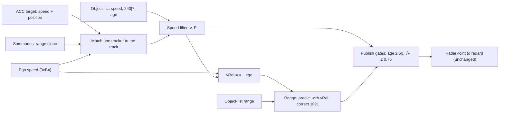

# 12. The Kalman speed filter

The object list's speed has slow, correlated errors at range: false closings of 1-10 s beyond about 40 m
([07](07_velocity_excursions.md)). The radar reports their size in `240|7` but does not flag each one. The default
`fused` profile handles them with **one Kalman filter per track** on the lead's speed over ground. Every reading is
weighted by its own uncertainty: the object list, the radar's ACC target and its target-range summaries. radard then
runs its usual filter on what this one publishes.

Code: `Ars510NativeRadarInterface._fused_speed` in [`ars510/interface.py`](../ars510/interface.py) (fork build), and
the same filter in [`upstream/ars510_radar.py`](../upstream/ars510_radar.py) (openpilot version). Numbers:
[`fused_filter.json`](../data/analysis/summaries/fused_filter.json).

## The model

One state per track: the lead's speed over ground `v`, with modelled variance `P`. Every radar cycle (`Δt` ≈ 60 ms):

```text
predict      v⁻ = v                          P⁻ = P + (a · Δt)²             a = 1.5 m/s² (process-noise scale)
for each reading z with standard deviation σ (object list first, then the one matched tracker, if any):
  innovation e = z − v⁻,  S = P⁻ + σ²,  e clamped to ±3·√S                (robust update)
  gain       K = P⁻ / S
  update     v = v⁻ + K·e                    P = (1 − K)·P⁻
publish      vRel = v − v_ego                 first publication once √P ≤ 0.75 m/s (and age ≥ 60)
```

| reading | σ | where the value comes from |
|---|---|---|
| object-list speed `64\|10` | 0.045 m/s × max(`240\|7`, 1); × 1.8 up to age 60, tapering to × 1 at age 100 | `240\|7` scales with the error against the ACC target ([07](07_velocity_excursions.md#far-range-excursions-match-the-reported-velocity-error-scale)); young tracks err 1.4-2× more |
| ACC target speed (0x235, + ego speed) | 0.5 m/s | the radar's own ACC tracker, for the one track it matches by position ([05](05_acc_target_and_support.md)) |
| summary speed (0x192 / 0x194, 1 s range slope) | 0.5 m/s, up to 80 m | the radar's selected-target ranges, matched by range and speed; not used on the ACC track |



A new track (or one silent for over 0.5 s) starts from its object-list speed with `P = σ²`. Each track gets the
object-list reading plus at most one tracker reading.

**The gain is not fixed.** radard's filter uses one precomputed gain for every track. Here `K` changes every cycle
with the radar's own uncertainty code and with which tracker is present. A near car with a small `240|7` is followed
almost directly. A far car with a large `240|7` moves only a few percent per reading. While the ACC target is
present, it dominates.


*Bundled drive E. Top: the object-list readings (grey) dive to −6 m/s at 18 s while the ACC target stays near
−0.7; the estimate follows the ACC target. Bottom: the gain on each reading. Each object-list reading moves the
estimate by about 5%, each ACC target reading by about 15%. The dotted line is the object-list σ from `240|7`.*


*Left: how much the filter trusts each reading by range. Middle: the share of the estimate from the radar's own
trackers. Right: a new track's speed std against age; the 0.75 m/s line is the publication gate.*


*`raw` and `fused` on the bundled excursions: `fused` (green) follows the radar's ACC target on drive E and keeps drive
A's lead at the speed its range trend shows.*

**What `P` means.** The model assumes independent readings, but the ACC target, the summaries and the object list are
all estimates from the same radar, with persistent errors. So `√P` is a readiness measure in m/s: it sets the gain
and the publication gate. It is not a calibrated bound on the true speed error, and a small `P` can coexist with a
persistent error. The replays below are what justify the constants, not the covariance algebra
([Särkkä, *Bayesian Filtering and Smoothing*, ch. 4](https://users.aalto.fi/~ssarkka/pub/cup_book_online_20131111.pdf)).

## How it fits with radard

radard runs its own per-track Kalman filter on `[vLead, aLead]` with a fixed gain; its `aLeadK` is the lead
acceleration the planner uses. This filter cleans only the speed it hands over, so radard and the planner run
unchanged, and lead acceleration stays radard's job. A speed + acceleration state here did worse
([below](#kalman-variants-tested)). Without it, an excursion reaches `aLeadK` as a −3 to −5 m/s² spike.

The two filters run in series, so all replay numbers already include their combined effect. Measured directly on
148,219 radar-lead ticks of the 20 held-out routes:
- **Smoother acceleration:** `aLeadK` changes at 0.46 m/s³ on average with `fused`, against 0.80 with the earlier
  tuned profile and 0.72 for vision only.
- **No added delay:** `fused`'s `aLeadK` peaks in cross-correlation at 0 ticks against the tuned profile's on 14 of 15
  routes, and 1 tick (50 ms) on one (`radard_cascade` in
  [`fused_filter.json`](../data/analysis/summaries/fused_filter.json)).

## What runs before and around the filter

- **Plain decode (every profile):**
  - publish from age 60 (~3.6 s): young tracks have unconverged range and speed ([02](02_object_list.md));
  - multiply the object list's over-ground speed by 0.149/0.15, then subtract 0xB4 ego speed;
  - publish no point without a fresh ego speed, because one NaN poisons radard's filter.
- **Saturation guard (`raw` only):** velocity code 1023 (and 0) is an invalid sentinel that decays over ~6 records.
  `raw` withholds the track until the speed is back within 5 m/s (or 1 s), then continues under a new ID. Held-out
  hard ticks 117 → 93. In `fused` the robust update absorbs the sentinel, so the guard is off.
- **Track-ID relink (`raw` only):** a track lost and re-found within 3.5 s keeps its ID. It changes nothing with the
  filter on, so `fused` leaves it off.
- **Range fusion (`fused`):** range walks by metres at 60-100 m (3% per frame). A fixed-gain predictor, separate from
  the speed filter:

  ```text
  predicted range = previous range + 0.5 × (previous vRel + current vRel) × Δt
  output range    = predicted range + 0.1 × (object-list range − predicted range)
  ```

  It halves 1.5 s range walks. The range residual never feeds back into speed: range rate and speed disagree by
  10-20%, and a coupled filter ran 2-5 m short.

## What each part is worth

Each part removed from `fused` on its own, 34 replay drives. Counts are hard radar-only braking ticks (planner
≤ −2 m/s² while vision-only asks ≥ −0.5) on 20 held-out routes / 4 further drives / 3 owner drives:


| `fused` without … | held-out | further | owner | verdict |
|---|---|---|---|---|
| (nothing: `fused`) | **30** | **2** | **0** | |
| the ACC target and summaries (filter on the object list alone) | 48 | 2 | 0 (4 target episodes) | needed |
| the young-track factor | 30 | 11 | 0 | needed |
| the speed-std publication gate | 30 | 8 | 0 | needed |
| the age-60 publication gate (age 6) | 31 | 12 | 0 (radar-only braking ×3) | needed |
| range fusion | 27 | 0 | 0 | braking neutral; lead switches +39%, target episodes 4 → 6: kept for lead stability |
| the ego-speed alignment (× 0.149/0.15) | 31 | 2 | 0 | neutral (onset +12 ms); one measured constant |
| the track-ID relink | 30 | 2 | 0 | identical in every measure: removed |
| the saturation guard | identical | identical | identical | removed: the robust update absorbs the sentinel |

Against the earlier tuned profile, `fused` takes held-out hard ticks from 48 to 30, target episodes from 9 to 4 and
owner-drive target episodes from 5 to 0. Braking starts 0.09 s later on average. All of that comes from events where
the tuned profile braked early on an over-estimated closing speed: it was 0.54 m/s more closing than vision before
those driver brakes, `fused` 0.02.

### Removing parts together

One-at-a-time removals can hide parts that only matter together, so the larger parts were also removed in
combination on the same 34 drives. The rule for "same driving as `fused`" was fixed before the results:
- hard ticks: held-out ≤ 33, further ≤ 4, owner drives 0;
- target episodes: at most 5 held-out and none on the owner drives;
- lead-source switches: at most +15%;
- onset within ±0.03 s of `fused`.


- **The track-ID relink is free:** removing it changes nothing.
- **The summaries matter only at the margin:** without them, with or without relink, one mild extra slowdown appears
  on the owner drives (below), which fails the rule.
- **Range fusion keeps the lead stable:** every version without it flips between radar and vision leads about 39%
  more often.
- **The young-track factor and the speed-std gate cost about 5 lines** and still help in the barest version.

The smallest version with the same driving is `fused` without the relink. That is the default profile, and the
openpilot version ([`upstream/ars510_radar.py`](../upstream/ars510_radar.py), about 270 lines) is exactly this
profile in one file (`combinations_34_drives` in [`fused_filter.json`](../data/analysis/summaries/fused_filter.json)).

### Why the summaries stay


*Owner drive, lead at about 100 m with no ACC target. With summary readings the planner asks for at most
−0.58 m/s²; without them, −1.11 m/s² for 0.5 s, an extra radar-only slowdown (vision: about −0.13). One summary
reading 2.2 s earlier, at 73 m, still shapes the estimate: the 80 m limit gates new summary readings, not their
lasting effect on the state ([`summary_owner_case.json`](../data/analysis/summaries/summary_owner_case.json)).*

## Kalman variants tested

The single speed state of `fused` was compared with richer filters on an offline bench: every cycle of 8 drive groups,
the radar's ACC target hidden as the reference, tuned on 3 groups and scored on the rest. The best candidates were then
replayed through openpilot ([`kalman_variants.json`](../data/analysis/summaries/kalman_variants.json)).


| variant | bench | openpilot replays |
|---|---|---|
| Student-t update instead of the 3σ clamp | same as the clamp | – |
| speed + acceleration state, with the ACC target's acceleration as a reading | worse than one speed state | – |
| noise learned from all slot fields (gradient boosting) | small gain; it relearns `240\|7`, ego speed and `84\|10` | – |
| object-list error as its own state (colored noise, τ 1.2 s), noise scaled by ego speed and `84\|10` | **15% fewer false closings**; responds as fast to ACC-defined drops (below) | 34 drives: held-out 30 → 29 hard ticks, one far false closing held for seconds (2 → 30 on the further drives) |
| retuned `fused` constants (σ per count, ACC σ, lead accel) | – | 8 fresh drives: none better on every check |

The colored-noise filter is the textbook fix for the object list's slow, correlated errors: lag-1 autocorrelation is
0.95 per record, about 1.2 s per independent error. It rejects slow drift, but for the same reason it takes seconds to
let go of a large drift that recovers. Real driving rewards letting go quickly, so `fused` keeps one speed state.
The fork build keeps it as the experimental `colored` profile (`COLORED_CONFIG`) for road tests.


*Response on 252 windows (33 routes) where the hidden ACC target drops ≥ 2 m/s within 2 s: time for the estimate to
cover half the drop, relative to the ACC target. One speed state 0.438 s, colored 0.394 s; the paired difference is
−44 ms, 95% route-bootstrap interval [−101, +13] ms. The ACC target is the same radar's tracker, so this compares the
filters, not physical braking ([`kalman_response.json`](../data/analysis/summaries/kalman_response.json)).*

## Other approaches tested

None is in a profile.

| approach | result |
|---|---|
| vision speed fused into the matched track ([radard patch](../openpilot/radard_vision_fusion.patch)) | better driver agreement, small on fresh drives; needs a radard change |
| the ACC target's speed *replacing* the track's vRel | hard ticks 53 → 57, +0.145 s response: the ACC value alone lags real closings |
| smoothing weighted by `240\|7` (no fusion) | responds 62 ms earlier but 153 vs 85 hard ticks |
| camera-looming veto | no planner benefit |
| maneuver adaptation (process noise raised on large innovations) | follows far slot slides as if they were braking |
| range in the filter state | biased by the range-speed mismatch (2-5 m short) |
| no robust clamp | an opening +10 m/s spike passes |
| clipped covariance, a shared-error cap, coasting through missing readings | no gain on the bench; not replayed |

## Earlier approach: tuned layers (removed)

Before the Kalman filter, five tuned layers each targeted one measured failure: far smoothing, a velocity-jump guard,
far-track settling, a ramp limiter (+4 / −6 m/s²) and ±3 m/s clips to the ACC target and summaries (17 tuned
constants). Together they took held-out hard ticks from 93 to 48. The Kalman filter on the object list alone matches
that with 3 chosen constants, and `fused` beats it (30). Per-layer numbers stay in
[`layer_ablation.json`](../data/analysis/summaries/layer_ablation.json).


*Hard radar-only braking on 20 held-out routes: the tuned layers added one at a time, and `fused` instead of them.*
