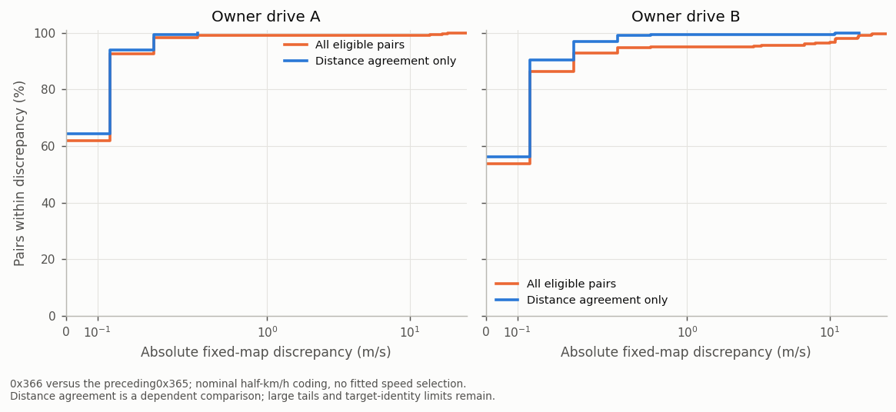

# 13. The radar's car-bus messages

On the RAV4 2022 / 2023 the ARS510 is also Toyota's driving-support ECU (`DS1` / "DSU" in the DBCs). It sends
nine messages on the **car bus (bus 0)**, the same ones a TSS-P DSU sends. They carry the ACC command, the
pre-collision (PCS / AEB) brake request and the PCS status on the dash. openpilot longitudinal either filters or switches off these
messages, which decides whether the car keeps its automatic emergency braking. Numbers:
[`radar_car_bus_messages.json`](../data/analysis/summaries/radar_car_bus_messages.json) and
[`radar_disable_unfiltered.json`](../data/analysis/summaries/radar_disable_unfiltered.json).

## The nine messages

All nine run on the radar's crystal (the same clock fingerprint as its bus-1 messages,
[05](05_acc_target_and_support.md)). They stop when openpilot disables the radar ([01](01_radar_bus.md#openpilots-radar-disable)).

| addr | name (opendbc / Toyota) | rate, DLC | idle payload | content | |
|---|---|---|---|---|---|
| 0x343 | `ACC_CONTROL` / `ACC1S03` | 33 Hz, 8 | `00 00 43 00 00 00 00 91` at power-up | ACC acceleration request and ACC / HUD flags | ● |
| 0x344 | `PRE_COLLISION_2` / `ACC1F01` | 20 Hz, 8 | `00 00 01 00 00 00 00 50` | PCS / AEB deceleration request, pre-fill and alarm triggers; idle with only `PCSOPR` (bit 16) set | ● idle, ◐ fields |
| 0x283 | `PRE_COLLISION` / `DS11F01` | 33 Hz, 7 | `00 00 00 00 00 00 8C` | AEB brake force and state (`STATE` 3 = emergency braking) | ● idle, ◐ fields |
| 0x33E | none | 5 Hz, 7 | `7F FF 00 80 00 xx 00` | target-gated fields, one rising with ego speed | ○ |
| 0x365 | `DSU_CRUISE` / `DS11D70` | 5 Hz, 7 | `00 00 00 00 FC 00 00` | **ACC lead distance (m) and relative speed (km/h)** | ● |
| 0x366 | `DS11D71` | 5 Hz, 7 | `50 00 7F FF 00 7A 00` | **ACC lead relative speed (≈ 0.5 km/h per code)** and a distance-like field | ◐ |
| 0x411 | `PCS_HUD` / `DS12F02` | 1 Hz, 8 | `00 20 00 00 00 00 80 00` | PCS state, sensitivity, FCW and the blocked-radar / temperature / beam-alignment alerts | ● idle, ◐ alerts |
| 0x494 | none | 1 Hz, 8 | `82 00 00 00 00 00 00 00` | constant | ○ |
| 0x4FF | `FRD1N01` (front radar → gateway) | ~0.77 Hz, 8 | `3F 00 00 00 00 00 00 00` | front-radar node frame, `FRDNID` = 0x3F | ○ |

Toyota names come from the leaked `toyota_2017_ref_pt.dbc` in opendbc. 0x343, 0x344 and 0x283 end in the Toyota
checksum: (address high byte + low byte + DLC + data bytes) & 0xFF. In normal driving 0x283, 0x344, 0x411, 0x494 and 0x4FF never change
(4.1 h of owner drives and U1; 0x411 over 773 owner segments, where it reads `40 20 …`, `PCS_INDICATOR` 1, for 0.2-3 s
after each of 27 cold starts).
0x33E, 0x365 and 0x366 change with the lead.

### 0x365: lead distance and relative speed (●)

Byte 4 is the distance to the radar's ACC target in metres, and 0xFC means no target. Byte 5 is the relative speed in km/h,
signed, negative when closing. The other bytes are zero. Both fields match the ACC target (0x235 / 0x237,
[05](05_acc_target_and_support.md#the-radars-acc-target-0x235--0x237)) on two owner drives and on a second car up to 37 m/s:

| drive | distance: scale, r, MAD | speed: scale, r, MAD | frames |
|---|---|---|---|
| O2 (city, ≤ 22 m/s) | 0.992, 0.9995, 0.24 m | 0.999, 0.9997, 0.14 km/h | 830 |
| O3 (city, ≤ 18 m/s) | 0.997, 0.9992, 0.17 m | 1.001, 0.9995, 0.14 km/h | 474 |
| U1 (expressway, ≤ 37 m/s) | 0.997, 0.9992, 0.22 m | 0.995, 0.993, 0.27 km/h | 1,816 |

This is opendbc's `DSU_CRUISE.LEAD_DISTANCE`, plus the Toyota name `D_VRCC` for byte 5.

### 0x366: target relative speed and approximate distance (◐)

[Fixed coding evidence](../data/analysis/summaries/target_366_coding.json) supports MSB-first `16|9` as
half-km/h relative-speed codes centred on 155: `vRel=(code−155)×5/36` m/s, negative when closing.
`25|7` follows target distance at approximately .8 m/code. Bytes 2–3 equal `7FFF` for no target; the parser
returns `None` for that word. `ars510.support.parse_0x366` preserves the raw codes and header/tail bytes
and provides these nominal conversions.

Compared with the preceding 0x365 report within 120 ms, 92.0% / 95.4% of eligible pairs on two owner drives
agree in distance within 1.5 m (790/456 pairs). That distance-only subset contains 727/435 pairs; fixed-speed
median discrepancy is 0 m/s and p95 is .278 m/s on both. All-pair median range discrepancy is .4/.2 m.
The speed RMS in the second drive's distance-matched subset is still 1.072 m/s because a few large outliers
remain. Distance agreement is therefore a comparison gate, not target identity or a physical accuracy bound.

0x366 arrives about 90 ms after 0x365 on the observed publication schedule. Receipt spacing does not determine
sensor latency. The report supplies one selected tracker target; a qualified association is needed before
comparing it with an ACC target or object-list slot. It carries no per-object Doppler identity. The standalone
parser has no profile consumer. Byte 0 is 0x50 or 0x52; header/tail values are preserved as raw context.

### 0x343 from the radar (●)

With stock ACC (U1, 21 min) the radar's own command spans −0.52 to +0.20 m/s². It always sends `ACC_TYPE` 1 and
`ALLOW_LONG_PRESS` 3, `MINI_CAR` 1 while it has a lead, mostly `PERMIT_BRAKING` 1, and `DISTANCE` pulses on button
presses. `RADAR_DIRTY`, `ACC_MALFUNCTION`, `ACC_CUT_IN` and `CANCEL_REQ` stay 0. openpilot's own `ACC_CONTROL` sends
`ALLOW_LONG_PRESS` 1.

## openpilot longitudinal: filter or disable

The radar's car-bus link runs to the gateway, which relays it onto the car bus. The comma harness sits at the camera,
so the radar's 0x343 reaches the powertrain without passing through the panda. Two senders of 0x343 cannot share the
bus, so openpilot longitudinal needs one of two setups:

| | radar CAN filter (smartDSU-style) | openpilot's radar disable (alpha long) |
|---|---|---|
| how | a board in the radar's line drops only the radar's 0x343 while openpilot sends its own; status message 0x2FF (~51 Hz) lets forks detect it | UDS `28 01 01` to 0x750 / 0x0F switches off the radar's car-bus transmit |
| radar's 0x343 | ends as openpilot's begins (3.487 s / 3.501 s after power-up, O4) | silent |
| PCS / AEB (0x283 / 0x344) | **passed to the car**: the radar's AEB stays in place | **silent**: no AEB source |
| 0x411 on the dash | the radar's: PCS on | openpilot's `40 20 00 00 10 01 00 00`: PCS off |
| car's reaction | none | **0x320 bit 13** set (below); drivers report a PCS warning lamp |
| bus 1 (decoder input) | running | running ([01](01_radar_bus.md#openpilots-radar-disable)) |

**0x320 bit 13 (◐).** 0x320 (`VSC1S07`) is the gateway's brake-system status to the driving-support ECU. On U2,
bit 13 (byte 1 bit 5; Toyota name `P2BRXMK`) goes 0 → 1 at 12.69 s. That is 0.17 s after the radar's last car-bus frame
(disable request 12.50 s) and it stays set for all 26 minutes. It stays 0 on U1 at the same moment (the harness relay
switch) and on the owner's filtered car, which sets it only in the first 0.28 s after power-up, before the radar's
messages begin. It is the brake system's flag for a missing driving-support / PCS link.

**The radar keeps assessing threats while disabled.** On U2 the bus-1 event pair 0x195 / 0x196
([05](05_acc_target_and_support.md#0x195--0x196-event-pair)) became active 6 times (0.1-1.3 s, 4-7 m/s, ACC-target
time to collision 3.6-7.5 s). Its decisions have no car-bus output. On U1 (stock ACC) the 5 comparable short states
left 0x283 / 0x344 / 0x411 idle: the event pair is a threat state that precedes PCS action, not the brake request
itself.

## What panda allows openpilot to send

openpilot's Toyota longitudinal TX list (DSU-unplugged TSS-P support) already covers most of these messages:

| message | panda |
|---|---|
| 0x343 | allowed, `ACCEL_CMD` −3.5..+2.0 m/s² |
| 0x344, 0x33E, 0x365, 0x366, 0x411 | allowed |
| 0x283 | allowed only with bytes 0-5 zero (the idle frame) |
| 0x494, 0x4FF | not in the list |

opendbc's `toyotacan.create_pcs_commands` builds 0x283 + 0x344. Ways to keep AEB under openpilot longitudinal
without a filter are listed in [10](10_research_directions.md#keeping-aeb-under-openpilot-longitudinal).
