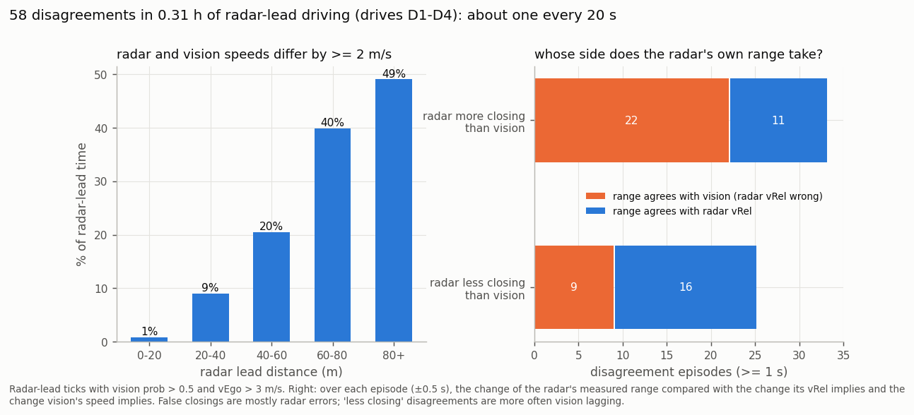
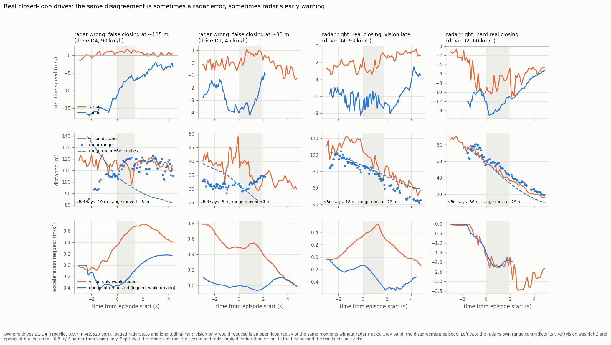
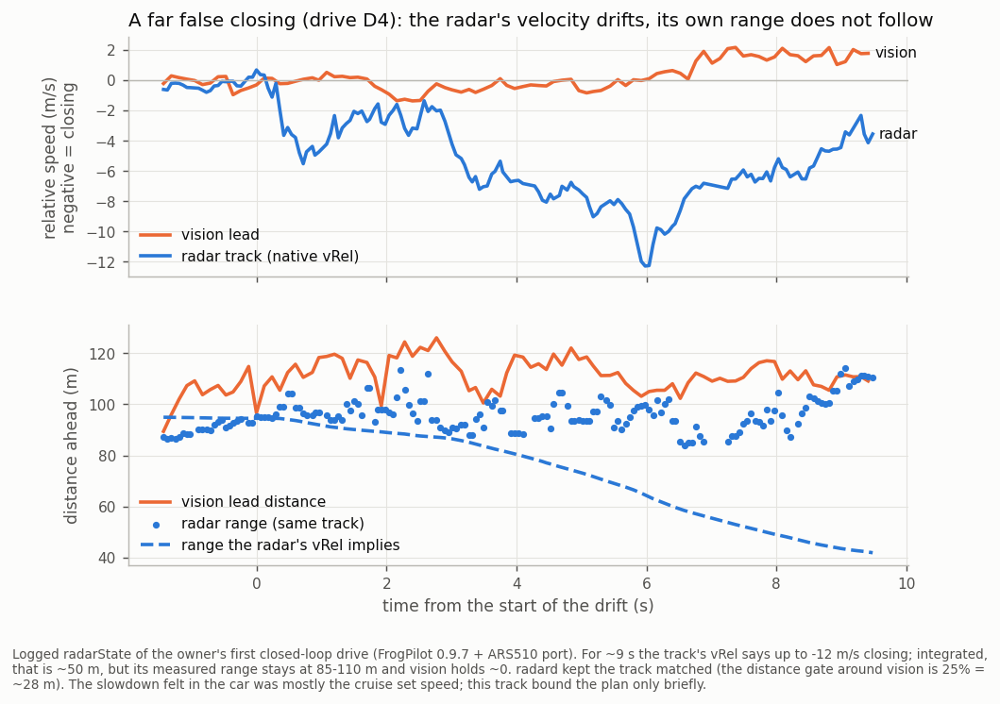
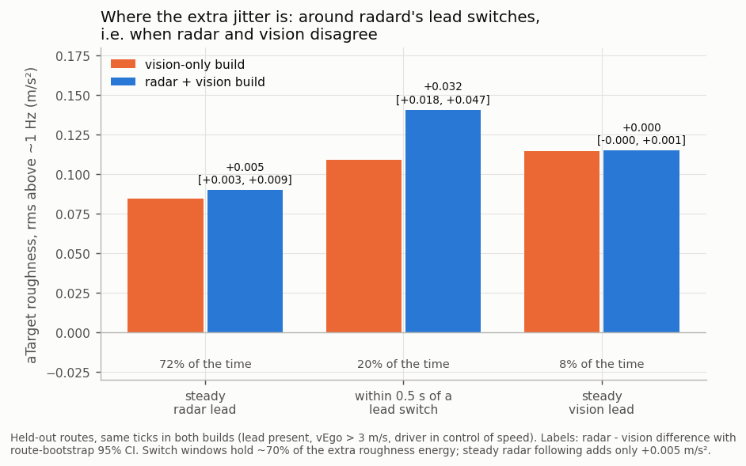
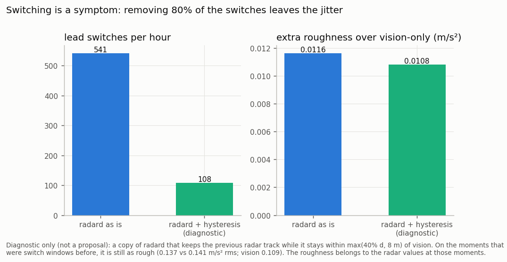
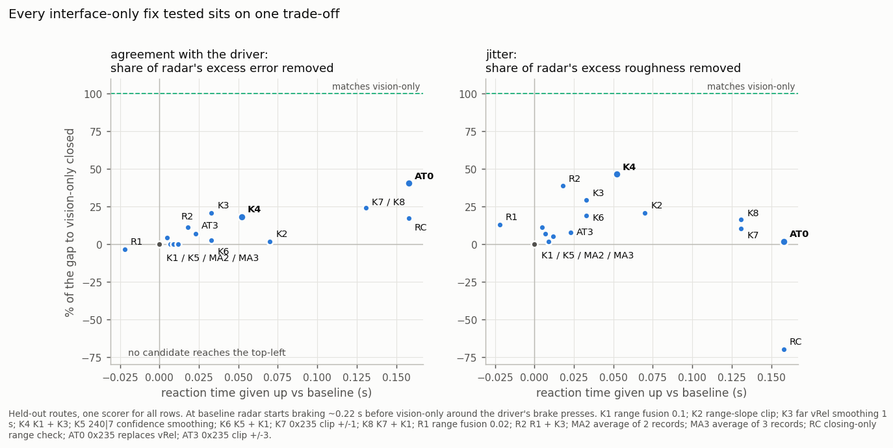
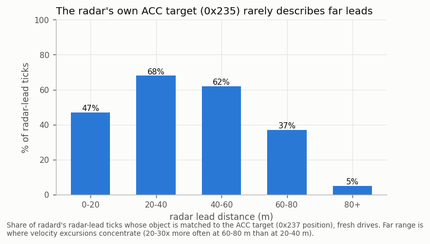

# 16. The jitter problem: what it is, what it looks like, and what might fix it

Written for openpilot developers (2026-09-25). This page puts together the replay studies of [06](06_known_limitations.md) and [15](15_acc_target_stream_and_health_signals.md) with the owner's first closed-loop drives.

**Numbers:** [`jitter_problem_figures.json`](../data/analysis/summaries/jitter_problem_figures.json). They are provenance-labelled research-workspace runs; the rlogs are not bundled.

**Figures:** `python tools/make_jitter_figures.py`.

## Summary

- **The radar works, and it has one real flaw.**
  - radar+vision starts braking about 0.2 s earlier than vision-only when the driver brakes.
  - On the owner's four drives, the driver never overrode a braking episode where radard was following a radar lead.
  - The flaw: the ARS510's own velocity estimate sometimes drifts for 1-10 s while its range does not follow. Most drifts are false closings, mostly beyond 40 m.
- **radard passes those drifts straight to the planner.**
  - radard's per-track Kalman filter only sees vRel.
  - The 25% distance gate keeps a drifting track matched to the vision lead.
  - The planner then projects the drift forward through `aLeadK` with a 1.5 s decay.
- **The flaw is not flicker, update rate, lead switching or range noise.** Each of those was tested and ruled out (below).
- **Inside the car port, every fix trades radar's early reaction for smoothness.**
  - About 20 interface-only candidates have been tested.
  - The best practical option is an opt-in: `range_fusion_gain=0.1` plus `vrel_smooth_far_tau_s=1.0`.
  - It closes about half of the extra roughness (on held-out routes and on fresh drives) for about 0.05 s of timing.
- **Removing the excursions needs a check on the radar's velocity that only radard has:** vision's speed, or the track's own range history. Ideas are at the end.

## 1. What it looks like on real drives

Data: four drives by the owner (D1-D4, 1.05 h) with FrogPilot 0.9.7 and the ARS510 port feeding FrogPilot's own radard. Everything below uses the logged `radarState` and `longitudinalPlan`.

**How often it happens.** radard's radar lead and the vision lead disagree on relative speed by 2 m/s or more, for at least 1 s:
- 58 times in 0.31 h of radar-lead driving, about once every 20 s;
- 1% of radar-lead time at 0-20 m, 20% at 40-60 m, and 49% beyond 80 m.

**Who is right** is judged by the track's own range change over each episode:
- **Radar says the lead is closing faster (33 episodes):** the range sides with vision in 22. These are mostly radar errors.
- **Radar says the lead is closing slower (25):** the range sides with the radar in 16. These are more often vision lagging.

**What the driver feels.** Seven episodes had openpilot driving, following the radar lead, and braking at least 0.3 m/s² harder than vision-only would have (open-loop replay of the same moments):
- **Four were radar false closings** at 33-115 m. openpilot requested up to 0.8 m/s² more deceleration than vision-only; in three of them vision-only would have held speed or accelerated.
- **Three were real closings** that the radar saw first. The radar's range really did shrink 20-30 m while vision's speed estimate lagged.

The gallery shows two of each. In the first second, the two kinds look the same.

A longer false closing, on drive D4 at about 85 km/h:
- the track's vRel drifts to −12 m/s over about 9 s, which implies about 50 m of closing;
- its measured range stays at 85-110 m, and vision holds steady;
- radard kept the track matched throughout, because the gate around vision at about 110 m is about 28 m.

What the driver noticed at that moment was mostly the planner returning to the cruise set speed after a gas override. The logged plan source was `cruise` on 129 of 140 ticks. The radar false closing was real but bound the plan only briefly. At night, the forward camera shows only tail lights at this range, so video cannot settle speed; the radar's own range is the witness.

## 2. What it is not

| suspect | test | result |
|---|---|---|
| quantisation flicker | step-to-step correlation of native velocity codes (328,694 steps, settled tracks) | lag-1 autocorrelation −0.01: steps don't reverse, so deadbands, medians and backlash remove little |
| update rate / averaging | the radar sends a new object list every 60 ms (16.7 Hz), less than one per 20 Hz model frame; 2- and 3-record averages replayed | no change in agreement or roughness, +0.01 s of lag |
| lead switching | a diagnostic radard copy with hysteresis (not a proposal): keep the previous track while it stays within max(40% d, 8 m) of vision | switches −80% (541 → 108 per hour); extra roughness +0.0116 → +0.0108 |
| range noise | velocity-aided range (`range_fusion_gain`) | the lead's dRel jumps 14× less, but the planner barely changes |
| the radar tracker's own confidence | `240\|7` uncertainty and `264\|4` state as gates or smoothing weights | flags excursions (AUC up to 0.85 on clean labels) but too weakly to act on without costing timing |

**Where the planner feels it** (20 held-out routes, 4.56 h, same ticks in both builds):
- In steady radar-lead following, radar+vision is only +0.005 m/s² RMS rougher than vision-only.
- In the 20% of the time around a lead switch it is +0.032 rougher, about 70% of the extra roughness.
- Those are the moments when radar and vision disagree. Suppressing the switches leaves them just as rough, so the roughness comes from the radar's values, not from the switch.

## 3. What an interface-only fix can do

Every option was replayed through openpilot's own card → radard → plannerd and scored the same way against the driver (pre-registrations and verdicts in [06](06_known_limitations.md) and [15](15_acc_target_stream_and_health_signals.md)):

| option | extra error removed | extra roughness removed | timing given up |
|---|---|---|---|
| far-range smoothing | about 20% | about 29% | about 0.03 s |
| range fusion plus far-range smoothing (K4) | about 18% | about 47% | about 0.05 s |
| replacing vRel with the ACC target's speed (0x235) | 40%, the most of anything | none | 0.10-0.16 s |
| range-slope clip | little | little | little |
| closing-only range check | some | none; lead switches +44% | fails the guards |

- **0x235 has two further limits:** it covers only 57% of radar-lead moments, and 5% beyond 80 m, where the drifts concentrate.
- **Nothing reaches vision-only agreement without giving up radar's head start.**

**Recommended opt-in for a steadier ride: K4**, i.e. `range_fusion_gain=0.1, vrel_smooth_far_tau_s=1.0`, on top of `OPENPILOT_CONFIG`.

On the 20 held-out routes:
- agreement with the driver improves (pre-registered, Holm p 0.003);
- roughness −0.0053 [−0.0099, −0.0022] against the default profile;
- radar ↔ vision lead switches −28%;
- radar-only brake requests the driver overrode with gas: 0.88 → 0.44 per hour.

On the owner's fresh drives, checked after the held-out finding and never used for tuning: roughness −0.0081 [−0.0155, −0.0015], lower on all four drives.

It stays opt-in because the pre-registered promotion rule also required matching vision-only's agreement. K4 does not.

## 4. Ideas that need radard, for anyone who wants to try

These are untested proposals, ordered by how directly they address the mechanism above.

1. **Let the track Kalman filter see range.**
   - `Track` filters vLead only, and dRel is passed through raw.
   - A joint [d, v, a] filter, with robust (Huber or gated) range updates, would pull a Doppler drift back within about 1-2 s. At 100 m, 3% range noise over 1.5 s of false closing is already a 3σ contradiction.
   - Range jumps of several metres exist, so the range update must be robust. Our interface-side versions failed on exactly that: range jumps drove the correction.
2. **Fuse vision's velocity instead of switching.**
   - radard already computes a vision/track likelihood.
   - Using vision's `v` (with `vStd`) as a second, low-weight measurement in the matched track's filter would damp drifts vision disagrees with.
   - It would keep radar's earlier reaction when the two agree.
3. **Carry per-point uncertainty.**
   - RadarPoint has no uncertainty field. The ARS510 exposes one (`240|7`), and other radars have similar fields.
   - It could set the filter's measurement noise per point, instead of the fixed gains tuned for 20 Hz.
4. **Distance-aware lead acceleration.**
   - A radar lead's `aLeadK` gets `aLeadTau` 1.5 s whenever |aLeadK| < 0.5.
   - A drift pushes `aLeadK` to −3 to −5 m/s² for several seconds, and the MPC projects it forward.
   - Capping or down-weighting `aLeadK` when the track is far, or disagrees with vision, targets the harmful channel directly.
   - As a diagnostic, zeroing `aLeadK` cost 0.40 s of reaction, so it can't simply be dropped.
5. **A lateral sanity check in `match_vision_to_track`.** At 100 m and more, vision's lateral uncertainty is wide enough to match a track in the next lane ([example on another fork](https://github.com/xiaoxx970/openpilot/issues/7)).

Comma closed its own radard matching change ([openpilot#35079](https://github.com/commaai/openpilot/pull/35079)) with the note "Can be closed with a better model". So these ideas are more likely to land in a fork than upstream.

## Limits

- **Replays are open loop:** the planner's requests do not change the recorded motion.
- **The driver is a behavioural yardstick, not ground truth.**
- **The vision model is FrogPilot 0.9.7's**, not the newest.
- **"Who is right" is judged by the radar's own range,** which is noisy (about 3% of distance) and jumps by metres at times. It is a second witness, not truth.
- **The closed-loop drives total 1.05 h** from one car and one driver, so the rates above are rough.
